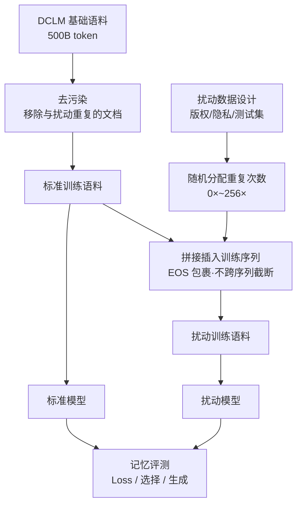

# Hubble: A Model Suite to Advance the Study of LLM Memorization

**会议**: ICLR 2026  
**OpenReview**: [https://openreview.net/forum?id=ZfdnZhOP0k](https://openreview.net/forum?id=ZfdnZhOP0k)  
**代码**: [https://allegro-lab.github.io/hubble/](https://allegro-lab.github.io/hubble/)  
**领域**: LLM Safety / 隐私与记忆  
**关键词**: LLM 记忆、开源模型套件、版权、隐私、测试集污染、成员推断、机器遗忘  

## 一句话总结
HUBBLE 是一套完全开源的 LLM 套件（1B/8B，100B/500B token），通过在预训练语料中**受控插入**版权段落、传记、测试集等"敏感扰动文本"并随机化重复次数，把过去只能在小模型上做的记忆性因果实验搬到接近商用规模的模型上，从而系统量化并给出缓解 LLM 记忆风险的最佳实践。

## 研究背景与动机
- **领域现状**：LLM 记忆训练数据是把双刃剑——一方面支撑事实问答等下游能力，另一方面带来版权（复现受版权材料）、隐私（泄露个人信息）、测试集污染（背答案）三类部署风险，这些统称"记忆风险"。
- **现有痛点**：以往记忆研究分裂在两个极端。一端是**小模型受控实验**（合成/模板数据），能精确测量记忆能力但模型太小、与商用 LLM 差距大；另一端是**大模型观测研究**，能分析大模型却只能在天然随机化存在时做精确测量，绝大多数因果量（如"一个测试样本要重复几次才被记住")无法估计。
- **核心矛盾**：想要既**大规模**又**可做因果推断**——但大模型训练昂贵、且自然语料里无法区分"某句被记住是因为它简单还是因为它被重复"。
- **本文目标**：提供一套接近商用规模、却像受控实验一样"知道模型见过的一切"的开源模型，让社区能精确测量记忆的因果量并复用做下游研究。
- **核心 idea**：**受控扰动 + 随机化重复**——把精心设计的敏感文本以已知重复次数 $\{0\times,1\times,4\times,16\times,64\times,256\times\}$ 随机插入预训练语料，使"重复次数→记忆强度"等因果关系在大模型上首次可被直接观测。

## 方法详解

### 整体框架
HUBBLE 的核心是"标准模型 vs 扰动模型"的配对设计：两者用**完全相同**的语料和训练流程，唯一区别是扰动模型在语料中受控插入了一批敏感文本。这些扰动覆盖版权、隐私、测试集污染三大风险域，每条扰动被随机分配一个重复次数，使研究者能把"记忆强度"回归到"重复频率""语料规模""插入时机"等可控变量上。整套套件包含 8 个核心模型（$2\times2\times2$ 因子设计）加上若干补充模型集合，并配套完整的记忆评测工具。

### 关键设计

**1. 跨风险域的扰动设计：把法律风险翻译成可插入的文本类型。** 作者梳理版权、隐私、测试集污染三大领域的文献，为每个领域设计对应扰动。版权域插入热门/冷门 Gutenberg 书籍段落、Wikipedia 新事件段落（按下载量分层以研究数据密度作用），以及 MRPC/PAWS 的**改写对**（随机插入两个语义等价但字面不同的版本之一，测试模型是否偏好它训练时见过的字面表达）。隐私域插入两类传记：一类是从 YAGO 知识库采样填充的模板传记（含姓名、国籍、生日、UUID 等 9 个属性，部分属性按国籍条件采样以保证合理性），一类是带 PII 标注的欧洲人权法院判例；此外还插入 PersonaChat 对话以模拟**间接泄露**（模型从公开文本推断隐私属性）。测试集域插入 PopQA、Winogrande、MMLU、HellaSwag、PIQA 等标准基准，以及 DCLM 截止日期后才创建的"新测试集"（ELLie、MUNCH）以降低意外污染。

**2. 序列级精确插入与重复次数随机化。** 这是套件能做因果推断的技术核心。每条扰动被随机分配重复次数 $\{0\times,1\times,4\times,16\times,64\times,256\times\}$（小数据集用 16 的幂），且为限制 256 次重复的数量，越高重复档分配越少样本。插入时先从标准训练流程采样一条待扰动序列（由多文档用 EOS 拼接而成），在文档间隙处把扰动**整条**拼入并重整回原序列长度，关键约束是扰动**绝不被跨序列截断**、每条序列至多插一个扰动——这让扰动尽量"像一篇正常文档"地被训练，从而插入与否对训练顺序和内容的扰动最小。所有扰动重复后共 79.9M token（818k 序列），仅占 100B 语料的 0.08%（500B 语料的 0.016%），远低于会损害模型性能的重复阈值（约 3%），实测扰动模型通用能力无退化。

**3. 去污染保证重复计数的准确性。** 既然要用"插入了几次"做因果变量，就必须确保基础语料里没有同样的文本混进来。作者对 DCLM 基础语料做两阶段去污染，移除与任何扰动匹配的训练文档；对可能产生大量伪匹配的短扰动则直接丢弃该扰动。整个过程移除 7540 篇文档（不到全部文档的 0.002%），人工抽检确认高精度。语料用 OLMo tokenizer（5 万词表，相比 Llama 的 12.8 万显著缩小嵌入/输出矩阵）切分，并解绑输入输出嵌入以支持 logit/tuned lens 等可解释性方法。

**4. 多维度模型集合覆盖不同研究问题。** 除 8 个核心模型（$\{1\text{B},8\text{B}\}\times\{$标准,扰动$\}\times\{100\text{B},500\text{B}\}$，用于确立"稀释"现象）外，套件还提供：**Interference** 三个仅含单一风险域扰动的 1B 模型，验证跨域扰动互不干扰；**Timing** 六个把扰动只插在训练特定时段（前/后半、四个 1/4 区间）的 1B 模型，研究插入时机的影响；**Paraphrased** 模型研究改写知识如何被记忆；**Architecture** 两个 8 层/32 层但参数量近似不变的 1B 模型，研究深度对记忆的影响。配套的记忆评测从三个角度触发：Loss（直接报归一化对数似然）、Loss-based choice（在候选答案里选 loss 最低的）、Generative（让模型续写并用精确匹配/词召回与真值比对）。

## 实验关键数据

### 核心发现：稀释敏感数据
对 8B 扰动模型在 100B 与 500B token 上的对比（Figure 2）：相同重复次数下，**500B 模型在几乎所有任务、所有域上的记忆都增长得更慢**——即把语料做大可以"稀释"敏感数据、降低记忆风险，且与去重这一已有最佳实践互补。

### 成员推断（MIA）基准
8B（500B token）扰动模型在 Gutenberg 冷门书上的 MIA ROC AUC：

| 评测 / MIA | Dup≠0 | Dup=1 | Dup=4 | Dup=16 | Dup=64 | Dup=256 |
|---|---|---|---|---|---|---|
| Loss | 0.629 | 0.539 | 0.556 | 0.732 | 0.996 | 1.0 |
| MinK% | 0.629 | 0.539 | 0.556 | 0.732 | 0.996 | 1.0 |
| MinK%++ | 0.666 | 0.545 | 0.62 | 0.813 | 0.987 | 0.949 |
| ZLib | 0.622 | 0.53 | 0.551 | 0.722 | 0.996 | 1.0 |

随重复次数升高，记忆变强、MIA 越容易区分成员与非成员；由于非成员始终来自"插入 0 次"的扰动，该基准**没有**会让成员身份被平凡泄露的混杂特征（如时间线索），克服了 WikiMIA 等基准的有效性问题。

### 关键发现
- **时机最佳实践**：扰动只插在训练前 1/4 时，最终模型几乎不记忆；若后续无持续曝光，模型会"遗忘"扰动（提供一种隐私）；扰动全插在最后 1/4 时则记忆/可提取性最强。故"把敏感数据排在训练早期"是第二条最佳实践。
- **模型越大记忆越早**：8B 在相同重复次数下记忆强度高于 1B，用更少重复就能测到记忆——模型放大增加记忆风险，需与稀释/排序等缓解策略权衡。
- **跨域互不干扰**：单域模型的行为与核心扰动模型在对应域上一致，说明域级聚合结论有效。
- **隐私**：攻击者辅助信息越多重构成功率越高，8B（100B）模型在仅 16 次重复时 PII 重构准确率接近 100%；但 occupation/email/UUID 等不同 PII 类型记忆方式不同。
- **测试集污染**：有些测试集 1 次重复就开始被记忆，但记住测试样本**不等于**在该任务上泛化；测试时格式与插入格式不匹配时，准确率甚至会随重复增加而下降。

## 亮点与洞察
- **把"受控实验"搬到大模型**：用配对（标准/扰动）+ 随机化重复的设计，让原本只能在小模型上做的因果测量在接近商用规模的模型上成立，弥合了记忆研究的两端鸿沟。
- **完全开源是关键资产**：模型、训练代码、配置、checkpoint、数据集、评测代码全公开，"模型见过的一切都已知"，这对记忆研究是不可替代的前提。
- **两条可落地的最佳实践**：稀释（增大语料相对规模）与排序（敏感数据早出现），都不改变模型结构、易于工程采纳，且与去重互补。
- **天然的下游 testbed**：随机化插入让 HUBBLE 直接成为无混杂的 MIA 基准，已知重复率的传记又为机器遗忘提供了可控记忆强度的挑战场景。

## 局限与展望
- **规模差距仍在**：500B token 相比 Llama3 的 15T 仍小一个量级以上，最大模型 8B，某些在超大规模才出现的记忆现象未必能复现。
- **评测给的是下界**：基础记忆评测只确立记忆的下界，可能未揭示全部被记忆的信息，真实泄露风险可能被低估。
- **扰动是模拟而非真实风险**：插入的书籍段落、模板传记、测试集等是对真实版权/隐私/污染风险的"仿真"，与真实网络数据的分布差异可能影响结论外推。
- **展望**：作者把套件定位为开放科学基础设施，邀请社区在其上做记忆机理、成员推断、机器遗忘、可解释性（logit/tuned lens）等更深入研究。

## 相关工作与启发
- **开源科学套件**：定位上对标 Pythia、OLMo——但 HUBBLE 的差异化在于"受控插入扰动"，把开源套件从单纯的观测对象升级为可做因果实验的平台。
- **记忆与重复**：延续 Tirumala、Kandpal、Lee 等关于重复次数、去重对记忆影响的工作，并把"稀释"提升为与去重并列的最佳实践。
- **MIA 与遗忘**：针对 WikiMIA 被发现存在时间线索等混杂的问题，用随机化插入构造无混杂基准；为机器遗忘提供已知重复率的传记任务。
- **启发**：对任何要在大模型上做"某干预 → 某行为"因果归因的研究，HUBBLE 的"配对训练 + 随机化干预剂量 + 严格去污染"是一个可复用的实验范式模板。

## 评分
- **新颖性**: ⭐⭐⭐⭐⭐ 用受控扰动把记忆因果实验首次系统地搬到接近商用规模的开源模型上，填补了小模型受控研究与大模型观测研究之间的方法论空白。
- **实验充分度**: ⭐⭐⭐⭐⭐ 8 核心模型 + 多个补充模型集合，覆盖稀释/时机/规模/跨域干扰/隐私/测试集污染，并落地为 MIA 与遗忘基准，证据链完整。
- **写作质量**: ⭐⭐⭐⭐ 结构清晰、风险域与设计动机交代充分；细节繁多需要对照大量附录与图表。
- **价值**: ⭐⭐⭐⭐⭐ 完全开源的套件 + 可落地的两条最佳实践 + 现成下游 testbed，对记忆/隐私/版权/评测污染社区是长期基础设施级资源。

<!-- RELATED:START -->

## 相关论文

- [\[ICLR 2026\] Information-Theoretic Membership Inference for Granular Quantification of Memorization](information-theoretic_membership_inference_for_granular_quantification_of_memori.md)
- [\[ICLR 2026\] Reasoning or Retrieval? A Study of Answer Attribution on Large Reasoning Models](reasoning_or_retrieval_a_study_of_answer_attribution_on_large_reasoning_models.md)
- [\[ICLR 2026\] Hey, That's My Model! Introducing Chain & Hash, An LLM Fingerprinting Technique](hey_thats_my_model_introducing_chain_hash_an_llm_fingerprinting_technique.md)
- [\[NeurIPS 2025\] LLM Strategic Reasoning: Agentic Study through Behavioral Game Theory](../../NeurIPS2025/llm_safety/llm_strategic_reasoning_agentic_study_through_behavioral_gam.md)
- [\[ICLR 2026\] Revisiting the Past: Data Unlearning with Model State History](revisiting_the_past_data_unlearning_with_model_state_history.md)

<!-- RELATED:END -->
