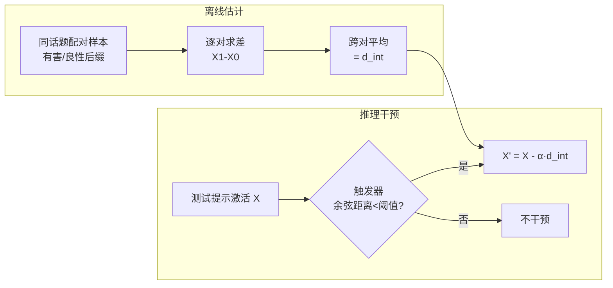

# Inference-Time Personalized Safety Control via Paired Difference-in-Means Intervention

**会议**: ICLR 2026  
**OpenReview**: [https://openreview.net/forum?id=VHiHVBNy1M](https://openreview.net/forum?id=VHiHVBNy1M)  
**代码**: 待确认  
**领域**: LLM 安全 / 激活引导 / 个性化对齐  
**关键词**: 个性化安全, 激活干预, difference-in-means, 推理时引导, 训练无关  

## 一句话总结
提出一种训练无关、推理时的激活干预方法 PCMS（Paired Contrast Mean Shift），用**话题配对**的均值差向量估计"有害方向"并从激活中减去它，在几乎不损失有用性的前提下按用户个性化偏好抑制特定类型（暴力/政治/性/心理健康）的内容。

## 研究背景与动机
**领域现状**：主流 LLM 安全对齐追求"普适标准"——拦截广义违法/有害内容，且默认"有害输出来自有害输入"，因此把安全做成输入侧的有害提示筛查。

**现有痛点**：安全偏好本质是**主观的**。即便是良性提问（如"介绍历史上的革命"）也可能产出某些用户想回避的暴力或意识形态内容，普适对齐既不照顾主观性，也保护不了用户的"回应级体验"。已有的个性化对齐要么靠重量级微调，要么依赖结构化偏好数据/奖励模型，这些在安全场景常常昂贵或拿不到；而现成的激活工程方法多瞄准全局行为轴（拒答、情感），属于经验性启发，缺乏形式化保证、还容易在良性查询上掉性能。

**核心矛盾**：如何让安全控制既**高效、数据轻量**，又**有理论根据、精确可控**？

**本文目标**：把激活引导从"探索性技巧"变成可靠的个性化安全控制机制——给定用户偏好（如"不要暴力/政治内容"），在推理时对内部表示做加性干预，定向压制该用户不想看的内容，同时保住模型对良性问题的有用性。

**核心idea**：**有害方向 = 话题配对的均值差向量**。把"有害"建模为激活里一个可加的有害分量，用同话题的"有害-良性"配对样本求差再平均，得到无偏、一致的有害方向估计，干预时从激活中按强度减去它。

## 方法详解

### 整体框架
方法分为**离线估计**与**在线干预**两段。离线阶段从参考提示构造对比对，估计单个安全维度（facet）的有害方向 $d_\text{int}$；推理阶段对测试提示的中层激活做加性干预 $X'_\text{clean} = X_\text{clean} - \alpha \cdot d_\text{int}$（$\alpha>0$ 控制强度）。在此之上叠加两个机制：一个**上下文感知触发器**只在提示真正逼近有害区域时才介入，一个**多 facet 自适应合成**把多个单维方向按相关度加权叠加，处理交叉偏好。论文系统比较了三种方向估计策略（ILCS / UMS / PCMS），并用偏差-方差分解论证 PCMS 最优。

### 关键设计

**1. 激活的可加建模与"真有害方向" $a^*$：把有害拆成可减去的分量。** 论文假设某条激活 $X^{k,Z_i}_i = \tau(Z_i) + h_k(Z_i) + \epsilon^{k,Z_i}_i$，其中 $\tau(Z)$ 是话题分量、$h_k(Z)$ 是有害状态（$k\in\{0,1\}$）分量、$\epsilon$ 是零均值实例噪声。这样"有害"就被显式分离成一个分量，给定话题的有害差向量 $a(Z)=h_1(Z)-h_0(Z)$，而全局目标是其话题期望 $a^* = \mathbb{E}_Z[a(Z)]$。Proposition 1 进一步证明：在所有与 $a^*$ 正相关的线性打分方向里，取 $d^\text{optimal}_\text{int} = a^*/\|a^*\|_2$ 能最大化最坏情况下的有害分数下降，因此**对齐 $a^*$ 就是最坏情况最优的干预方向**。这一步把"该往哪个方向减"从经验直觉变成了一个有目标函数的估计问题。

**2. 三种估计策略与 PCMS 的胜出：用配对消偏、用平均降方差。** 论文把方向估计写成统一框架下的三个估计量，并做偏差-方差分解。**ILCS** 只取单对差 $\hat a_\text{ILCS}=X_{1,Z'}-X_{0,Z'}$，数据省但方差大、且对全局 $a^*$ 有偏（偏差 $a(Z')-a^*$ 不随样本消失）。**UMS** 借鉴 difference-in-means，对**非配对**的有害集与良性集分别求均值再相减，平均能降方差，但若两集话题分布不同就引入系统性话题偏置 $b_\text{topic}$，MSE 不收敛到 0。**PCMS** 取 $n$ 对**同话题**配对差再平均：

$$\hat a_\text{PCMS} = \frac{1}{n}\sum_{i=1}^{n}\left(X^{1,Z_i}_i - X^{0,Z_i}_i\right)$$

配对使每对内的 $\tau(Z_i)$ 相消（消除话题混淆 → 无偏 $\mathbb{E}[\hat a_\text{PCMS}]=a^*$），跨对平均使噪声方差以 $O(1/n)$ 衰减（一致、渐近最优）。这就同时拿到了 ILCS 的话题精度和 UMS 的方差缩减，且两者的缺陷都被结构性地避开。

**3. 上下文感知触发：只在"接近危险"时才出手。** 为了不在良性查询上白白掉有用性，干预由一个分位数阈值门控。对每个 facet $f$ 预存良性均值 $\mu^{(f)}_p$ 和有害均值 $\mu^{(f)}_q$，测试激活 $X$ 到 $\mu^{(f)}_q$ 的余弦距离 $d^{(f)}(X)$ 越小代表越像有害；只有当 $d^{(f)}(X)\le T^{(f)}$ 时才激活，相关度按 $\alpha^{(f)}(X)=\max(0,\gamma-d^{(f)}(X))\cdot\mathbb{1}[d^{(f)}(X)\le T^{(f)}]$ 计算并随距离缩放强度。阈值 $T^{(f)}$ 取良性激活到 $\mu_q$ 距离的 98 分位数，保证只有"异常靠近有害区"的提示才被干预——这正是 GSM8K 上数学推理几乎零损失（80.23% vs 80.12%）的原因。

**4. 多 facet 软加权合成：交叉偏好的贝叶斯式混合。** 用户可能同时回避多类内容。把各 facet 的相关度 $\alpha^{(f)}$ 归一化为权重 $w^{(f)}(X)$，每个 facet 给一个从有害指向良性的修正 $\Delta^{(f)}=\alpha_\text{global}\cdot(\mu^{(f)}_p-\mu^{(f)}_q)$，最终激活为加权和 $X' = X + \sum_f w^{(f)}(X)\cdot\Delta^{(f)}$。论文把它解释为混合式风险最小化——$w^{(f)}$ 近似"facet $f$ 激活"的后验，softer 加权比硬选择在含混/混合内容上过渡更平滑、更鲁棒，无需重训即可覆盖多种安全关切。

## 实验关键数据

### 主实验表格（LLaMA-3.1-8B，四类别均值；Utility↑ / Harmfulness↓）

| 方法 | Utility (1-10) | Harmfulness (1-5) |
|------|------|------|
| Direct Prompting | 8.51 | 3.36 |
| In-Context Learning | 8.09 | 2.86 |
| RAG | 8.15 | 2.82 |
| ILCS-local | 7.57 | 2.51 |
| ILCS-global | 6.23 | 2.95 |
| UMS | 5.80 | **1.43** |
| **PCMS** | **7.95** | 1.73 |

PCMS 把有害性从 DP 的 3.36 降到 1.73，有用性 7.95 与 ICL/RAG 持平；UMS 虽有害性最低（1.43）但有用性崩到 5.80，印证其理论偏置；PCMS 落在安全-有用性的 Pareto 前沿。

### 消融/跨模型表格（DP vs PCMS，U / H，↓H 为有害性降幅）

| 模型 | 类别 | DP (U/H) | PCMS (U/H) | ↓H |
|------|------|------|------|------|
| LLaMA-3.1-8B | Sexuality | 8.56 / 3.55 | 7.83 / 1.42 | 2.13 |
| Mistral-7B | Political | 8.77 / 4.05 | 7.94 / 1.88 | 2.17 |
| DeepSeek-LLaMA3-8B | Violence | 9.05 / 2.87 | 8.56 / 1.62 | 1.25 |
| LLaMA-3.1-8B | PI+Violence（双 facet） | 8.55 / 3.39 | 7.65 / 1.71 | 1.69 |

跨三个开源模型（含推理增强的 DeepSeek-R1-Distill）和单/双/三 facet 场景，PCMS 都稳定降有害性并保持高有用性。

### 关键发现
- **理论与经验吻合**：PCMS 的无偏一致性直接对应它在 Pareto 前沿的位置；UMS/ILCS 的劣势与各自的偏差/方差预测一致。
- **不伤通用能力**：阈值触发让安全干预与推理子空间解耦，GSM8K 准确率几乎不变（80.23% vs 80.12%）。
- **判官无关**：换 Claude-3.7 作评估者结论不变；人评同样确认 PCMS 更安全（1.79 vs 3.52）且仍有用（7.67）。
- **保留基础安全**：在 BeaverTails/XSTest 上既保住对抗提示的拒答，又能在争议/虚构语境做细粒度引导。

## 亮点与洞察
- **把激活引导"做成估计问题"**：用偏差-方差分解和最坏情况最优性给出形式化判据，是相对以往启发式 steering 的实质升级——配对是消偏的关键，平均是降方差的关键，两者缺一不可。
- **"良性提示也可能有害"的问题设定**很扎实，直击普适对齐忽视的回应级主观体验，并据此自建 worst-case 语料压测。
- **触发器是工程上的点睛之笔**：用分位数阈值把"该不该干预"和"干预多强"分开，是有用性几乎零损失的直接原因。

## 局限与展望
- **依赖 GPT-4o 标注与评估**：话题分类和有害/有用性打分都靠 GPT-4o，虽用 Claude/人评做了交叉验证，但有害方向的质量上限部分系于标注质量。
- **可加+线性假设**：理论建立在"有害是可加分量""线性打分方向"上，对高度纠缠或非线性的有害表示是否成立未充分检验。
- **facet 需预定义**：四类安全偏好是人工选定，扩展到开放、细粒度或动态变化的用户偏好需要重新估计方向。
- **干预层/强度需调**：中层、$\gamma$、$\alpha$ 等仍是手调超参，跨模型迁移性虽好但缺自动化选择。

## 相关工作与启发
- **激活引导/difference-in-means**：UMS 改编自 Arditi et al. (2024) 的"拒答方向"，ILCS 改编自 Turner et al. (2023)；本文把这条线推进到配对、有偏差-方差理论支撑的版本。
- **个性化对齐**：相比参数合并、解码时控制、prompt 方法（Jang/Rame/Shi 等），本文走训练无关、数据轻量路线，不需偏好数据或奖励模型。
- **启发**：把"steering 向量当成统计估计量"这一视角可迁移到其他行为轴（诚实性、风格、安全细分），配对设计也可用于压制其他混淆因子；触发器思路提示"何时干预"本身值得单独建模。

## 评分
- **新颖性**: ⭐⭐⭐⭐ — 把激活引导形式化为有害方向的统计估计问题，配对均值差 + 最坏情况最优性给出了 steering 少见的理论根据。
- **实验充分度**: ⭐⭐⭐⭐ — 三模型、四类别、单/双/三 facet、双判官 + 人评、GSM8K/BeaverTails/XSTest 多角度验证，较完整。
- **写作质量**: ⭐⭐⭐⭐ — 理论与方法叙述清晰，偏差-方差分解串起三策略对比，图表到位。
- **价值**: ⭐⭐⭐⭐ — 训练无关、数据轻量、几乎不伤有用性的个性化安全控制，实用性强，理论框架也可复用。

<!-- RELATED:START -->

## 相关论文

- [\[ICLR 2026\] Learning-Time Encoding Shapes Unlearning in LLMs](learning-time_encoding_shapes_unlearning_in_llms.md)
- [\[ICLR 2026\] Adaptive Attacks on Trusted Monitors Subvert AI Control Protocols](adaptive_attacks_on_trusted_monitors_subvert_ai_control_protocols.md)
- [\[ACL 2026\] CausalDetox: Causal Head Selection and Intervention for Language Model Detoxification](../../ACL2026/llm_safety/causaldetox_causal_head_selection_and_intervention_for_language_model_detoxifica.md)
- [\[ACL 2026\] Instant Personalized Large Language Model Adaptation via Hypernetwork](../../ACL2026/llm_safety/instant_personalized_large_language_model_adaptation_via_hypernetwork.md)
- [\[CVPR 2025\] TAPT: Test-Time Adversarial Prompt Tuning for Robust Inference in Vision-Language Models](../../CVPR2025/llm_safety/tapt_test-time_adversarial_prompt_tuning_for_robust_inference_in_vision-language.md)

<!-- RELATED:END -->
