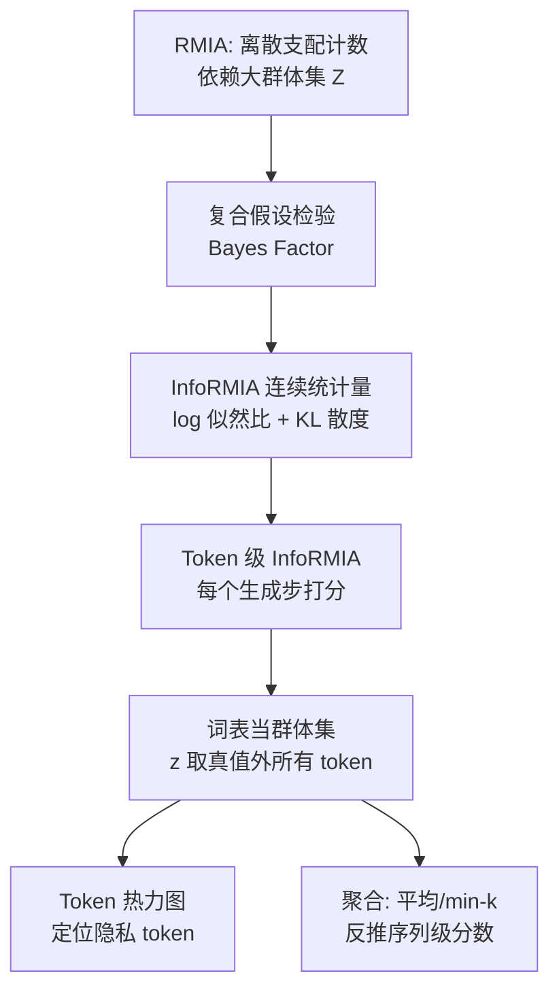

# Information-Theoretic Membership Inference for Granular Quantification of Memorization

**会议**: ICLR 2026  
**OpenReview**: [https://openreview.net/forum?id=4KVeb0Vv13](https://openreview.net/forum?id=4KVeb0Vv13)  
**代码**: 将合入 ML Privacy Meter (privacytrustlab/ml_privacy_meter)  
**领域**: LLM 安全 / 隐私审计 / 成员推断  
**关键词**: 成员推断攻击, RMIA, 信息论, 记忆量化, Token 级隐私, 机器遗忘  

## 一句话总结
本文把当前 SOTA 的成员推断攻击 RMIA 重新表述为一个信息论形式的 **InfoRMIA**——用"目标点相对群体数据能为模型节省多少比特"的连续统计量替代 RMIA 离散的"支配计数"，从而以更少的群体样本取得更强攻击；并进一步把序列级成员推断细化到 **Token 级**，精确定位 LLM 究竟记住了哪些（隐私）token。

## 研究背景与动机
**领域现状**：成员推断攻击（MIA）是量化机器学习/LLM 隐私泄露的"黄金标准"——攻击者判断某条样本是否在训练集中，区分能力越强代表泄露越多。当前 SOTA 是 RMIA（Zarifzadeh et al., 2024），它通过统计"目标样本 $x$ 支配了多少相似群体样本 $z$"来打分。

**现有痛点**：RMIA 的得分本质是离散的——粒度由群体数据集 $Z$ 的大小决定，每个支配判断带来 $\frac{1}{|Z|}$ 的增量，因此要打出精细的分数就需要庞大的 $Z$（论文经验是训练集的 ~10%）。对 LLM 而言，10% 已是天文数字，群体数据规模随训练集线性增长成了瓶颈。

**核心矛盾**：序列级成员推断把整条序列压成"是/否成员"的一个比特，相当于有损压缩。但 Transformer 是逐 token 自回归生成，一条长度 $k$ 的序列其实是 $k-1$ 个（前缀子串，下一 token）的预测样本。真正的隐私（人名、PII）往往只集中在少数 token 上，对整条序列取平均会被大量常见 token 稀释，导致"最被记住的序列"反而不含任何隐私信息——审计结果严重失真。

**本文目标**：既要在攻击性能上超过 RMIA 并摆脱对大群体集的依赖，又要把记忆/泄露的量化从序列粒度下沉到 token 粒度，让审计者能精确看到哪些 token 被记住、是否敏感。

**核心 idea**：**【从计数到比特】** 不再数"支配了多少 $z$"，而是用信息论度量"$x$ 相对群体在解释模型时节省了多少比特"，得到连续统计量；**【从序列到 token】** 把 InfoRMIA 套到每个 token 生成步上，并用"除真值外的整个词表"充当天然群体集，彻底省掉独立群体数据。

## 方法详解

### 整体框架
方法分两层。底层是把 RMIA 的复合假设检验重新求解为一个信息论统计量 InfoRMIA，得到连续、对 $|Z|$ 不敏感的成员分数。上层把 InfoRMIA 下沉到 token 粒度：在每个 token 生成步上计算成员分数，用词表代替独立群体集，从而既能定位单 token 泄露，也能通过聚合反推出序列级分数。

### 关键设计

**1. 信息论检验统计量：从离散计数到连续比特数。** RMIA 把成员推断写成复合假设检验——$H_0$：模型由群体中某个 $z$ 训练；$H_1$：模型由目标 $x$ 训练——然后对每个 $z$ 做一次带阈值 $\gamma$ 的成对似然比检验，统计被拒绝的比例。本文换一个角度：不数支配关系，而是衡量目标点比群体数据"多省下多少比特"来解释模型，即 $\mathbb{E}_z[-\log p(\theta|z)] - (-\log p(\theta|x))$。借 Bayes Factor（复合假设检验的标准解法）和 RMIA 同款的贝叶斯分解，统计量可化简为一个优雅的两项和：

$$\text{Test Statistic} = \log\frac{p(x|\theta)}{p(x)} + D_{\mathrm{KL}}\big(p(z)\,\|\,p(z|\theta)\big)$$

第一项 $\log\frac{p(x|\theta)}{p(x)}$ 度量模型对 $x$ 的信息增益，可视为 $\theta$ 对 $x$ 的**记忆**；第二项 KL 散度刻画群体分布在条件于 $\theta$ 前后的变化，反映**泛化**。这个统计量天生连续、不再需要阈值 $\gamma$，分数粒度也不再被 $|Z|$ 绑死——因此用很少的群体样本就能打出高精度分数，把对大群体集的依赖降到常数因子级。InfoRMIA 与 RMIA 的差距主要取决于 RMIA 中群体信号分布 $p(z|\theta)/p(z)$ 是否"均匀"：分布越均匀，离散化损失越小，差距越窄。

**2. Token 级 InfoRMIA：用词表当天然群体集。** 把序列 $x=\{x_1x_2\dots x_k\}$ 看成 $k-1$ 个（前缀子串→下一 token）的预测样本，在每个生成步上跑 InfoRMIA，得到 $k-1$ 个 token 级分数。关键巧思是群体集 $Z$ 的选取：对真值 token（比如 "3"）而言，直接取词表中除真值外的所有 token 作群体，$Z=\{z: z\in V \wedge z\neq x\}$。由于 $p(x|\theta)+\sum_{z\in Z}p(z|\theta)=\sum_{z\in V}p(z|\theta)=1$，词表上的概率天然归一，统计量可写成在整个词表 $V$ 上对所有候选 token 求 KL 散度的等价形式，无需额外归一化。这样得到一个**数据依赖**的群体集，彻底省去为预训练 LLM curate 独立群体数据集的高昂成本，让攻击在大模型上真正可行。

**3. Token→序列的聚合与隐私接口。** 对没有隐私 token 先验知识的攻击者，序列级仍是唯一选择，于是用聚合把 $k-1$ 个 token 分数压成序列分数：本文只评测通用聚合（平均、min-k），因为依赖额外保留数据优化的定制聚合器在实际中不现实。从信息论看，序列真正的隐私比特是 $\text{PrivBits}=\sum_{x\in V_{\text{priv}}}-\log p(x)$，远小于把所有 token 当隐私的上界 $\sum_x -\log p(x)$——这解释了为何序列级会高估风险。基于 token 分数，作者搭了一个 HTML 热力图接口：高亮深浅对应记忆程度，让数据所有者/审计员直接检视真正的隐私 token 是否被记住，也能按需对任意 n-gram 求和得到其记忆分数，支撑后续的精准机器遗忘。

## 实验关键数据

### 主实验：InfoRMIA 全面碾压 RMIA（4 参考模型，AUC / TPR@0.1%FPR）

| 数据集 | \|Z\| | RMIA AUC | RMIA TPR | InfoRMIA AUC | InfoRMIA TPR | LiRA AUC |
|---|---|---|---|---|---|---|
| AG News | 100 | 0.857 | 0.00% | **0.878** | **12.0%** | 0.864 |
| AG News | 1000 | 0.877 | 1.60% | **0.878** | **12.0%** | 0.864 |
| CIFAR-10 | 10000 | 0.833 | 0.00% | **0.833** | **5.82%** | 0.824 |
| Purchase100 | 10000 | 0.543 | 0.00% | **0.575** | **0.32%** | 0.540 |

最亮眼的是低 FPR 下的 TPR：InfoRMIA 在 AG News 把 TPR@0.1%FPR 从 RMIA 的 0–1.6% 拉到 12%，且不随 $|Z|$ 变化（单模型审计时第二项 KL 对所有 $x$ 相同，不影响排序），验证了"摆脱大群体集依赖"的理论主张。

### Token 级 InfoRMIA 反推序列级成员推断（微调 LLM，AUC / TPR@1%FPR）

| 数据集 | Epochs | RMIA | InfoRMIA | InfoRMIA(token) | LiRA |
|---|---|---|---|---|---|
| AG News | 1 | 0.839 / 0.0% | 0.843 / 23.0% | 0.836 / 20.2% | 0.795 / 3.6% |
| AG News | 4 | 0.945 / 0.0% | 0.945 / 16.2% | 0.942 / **20.6%** | 0.882 / 9.0% |
| ai4privacy | 4 | 0.821 / 26.0% | 0.822 / 27.2% | 0.804 / 23.2% | 0.782 / 10.4% |

token 级方法本不为序列级设计，简单平均聚合即可取得有竞争力的 AUC 和远超 RMIA/LiRA 的低 FPR TPR。

### 关键发现
- **预训练 LLM（MIMIR 基准）**：仅用 Pythia-160M 的 step-1 早期 checkpoint 作单一参考模型（越"OUT"越好），token 级 InfoRMIA 就成为预训练 LLM 上最强的参考型 MIA，超过 Ref 等方法。
- **聚合选择**：追求低 FPR 高 TPR 时简单平均优于 min-k（min-k 本质是非成员检测器）；但用 AUC 评测时排序反转，再次印证 Carlini et al. 关于"AUC 作隐私指标会误导"的论点。
- **记忆的语义异质性**：AG News 上 PERSON 和 WORK_OF_ART 类 token 平均成员分数最高，PII 被显著更多记住；而 ai4privacy 上私有 token 的平均分反而略低于非私有 token——说明序列级高 AUC 主要来自记忆非隐私内容，AUC 并非真实隐私风险的好指标。

## 亮点与洞察
- **从"计数"到"比特"的视角切换**：把 RMIA 的离散支配计数重铸为连续的对数似然比 + KL 散度，既理论更扎实（Bayes Factor 解复合假设检验），又顺手解决了对群体集规模的依赖——这是漂亮的"换形式即提性能"。
- **词表当群体集**是 token 级框架的点睛之笔：把"需要昂贵 curate 的独立群体数据"替换成"模型本就输出的词表 logits"，让攻击对预训练 LLM 可行。
- **把隐私量化从序列下沉到 token**，配合可视化热力图，揭示了"最被记住的序列常常不含隐私"这一反直觉现象，直指现有序列级审计的系统性高估问题，并为精准机器遗忘铺路。

## 局限与展望
- token→序列的聚合作者自承只是 proof of concept，仅评测平均/min-k 等通用方法，未探索更优聚合器。
- token 级隐私接口假设用户已知哪些 token 是敏感的（PII 位置已标注），是给知情审计者的诊断工具，并非对任意数据分布自动量化隐私风险。
- 实验模型偏小（GPT-2、Pythia-160M、WideResNet），更大规模 LLM 上的表现待验证。
- 下游应用（精准机器遗忘、token 引导的数据重构/抽取）仅作展望，未系统实现。

## 相关工作与启发
本文站在成员推断的演进线上：从 Shokri 的影子模型、Yeom 的损失信号、Carlini 的 LiRA（IN/OUT 高斯似然比）到 RMIA 的支配计数，InfoRMIA 用信息论统一了这条线并刷新 SOTA。在记忆量化方向，它跳出 verbatim/discoverable memorization 的"精确匹配"框架，承接 Tao & Shokri 对"现有隐私定义过严"的批评，提出 token 级、信息论比特化的更现实隐私观。对实践者的启发是：**审计 LLM 隐私不应只看序列级 AUC**——真实泄露集中在少数 token，应当下沉到 token 粒度做诊断，并据此做"外科手术式"的定向遗忘，而非删除整篇可能含有用知识的文档。

## 评分
- **新颖性**: ⭐⭐⭐⭐ — 把 RMIA 重铸为信息论统计量、用词表充当群体集、序列→token 的粒度下沉，三个想法都干净有力。
- **实验充分度**: ⭐⭐⭐⭐ — 覆盖表格/图像/文本三类数据 + 微调与预训练 LLM + MIMIR 基准，但模型规模偏小，下游遗忘应用未落地。
- **写作质量**: ⭐⭐⭐⭐ — 公式推导清晰，"计数 vs 比特""序列 vs token"的两条主线叙述流畅，图示直观。
- **价值**: ⭐⭐⭐⭐ — 既给出可直接合入 ML Privacy Meter 的更强工具，又纠正了序列级审计高估隐私的系统性偏差，对 LLM 隐私评估有实际推动作用。

<!-- RELATED:START -->

## 相关论文

- [\[ICLR 2026\] Membership Inference Attacks Against Fine-tuned Diffusion Language Models (SAMA)](membership_inference_attacks_against_fine-tuned_diffusion_language_models.md)
- [\[ICLR 2026\] No Caption, No Problem: Caption-Free Membership Inference via Model-Fitted Embeddings](no_caption_no_problem_caption-free_membership_inference_via_model-fitted_embeddi.md)
- [\[ACL 2026\] Membership Inference Attacks on In-Context Learning Recommendation](../../ACL2026/llm_safety/membership_inference_attacks_on_llm-based_recommender_systems.md)
- [\[ACL 2026\] Fast-MIA: Efficient and Scalable Membership Inference for LLMs](../../ACL2026/llm_safety/fast-mia_efficient_and_scalable_membership_inference_for_llms.md)
- [\[ICLR 2026\] Hubble: A Model Suite to Advance the Study of LLM Memorization](hubble_a_model_suite_to_advance_the_study_of_llm_memorization.md)

<!-- RELATED:END -->
