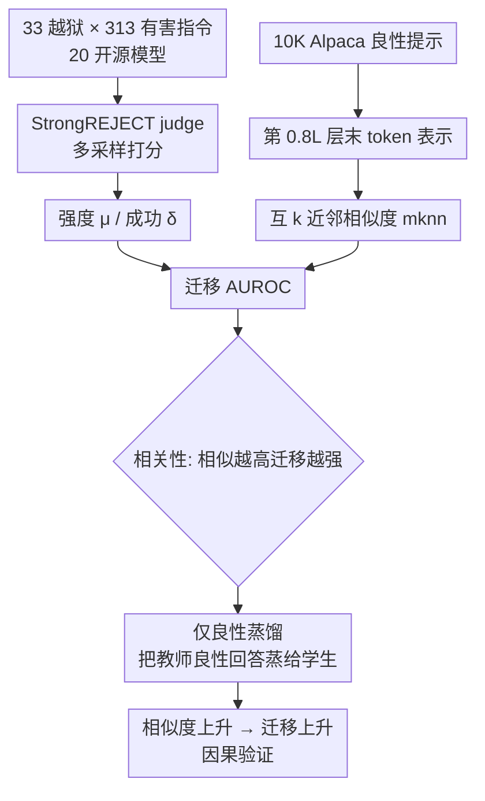

# Jailbreak Transferability Emerges from Shared Representations

会议：ICLR 2026  
arXiv：暂无  
代码：暂无  
领域：LLM 安全 / 表示学习 / 可解释性  
关键词：越狱迁移、表示相似度、平台表示假设、良性蒸馏、安全对齐  

## 一句话总结

本文用 20 个开源模型 × 33 种越狱攻击的大规模实证 + 因果实验证明：越狱的"跨模型迁移"并非安全训练的偶然瑕疵，而是模型在良性输入下**共享表示几何**的必然产物——表示越相似，越容易互相"传染"漏洞。

## 研究背景与动机

**领域现状**：越狱（jailbreak）提示能绕过 LLM 安全机制诱出有害输出，且常常具有"迁移性"——在 A 模型上成功的攻击也能攻破架构、数据、来源都不同的 B 模型。这一现象被反复观察到，却始终缺乏统一的机理解释。

**现有痛点**：社区对"为什么能迁移"众说纷纭——是安全微调的浅层 quirk？是同族模型的副产品？还是表示学习的根本属性？此外，过往评测多用单次采样 + 规则匹配（检查是否出现"I'm sorry"），既噪声大又只能判断"是否拒绝"而非"是否真的泄露有害内容"，导致结论难以复现和比较。

**核心矛盾**：要把迁移性从"攻击本身强"这个混杂因素里剥离出来——否则看似的迁移可能只是源模型上的攻击更强，而非模型间真有深层相似性。

**本文目标**：给出可量化的解释，并从相关走向因果——证明表示对齐是迁移性的驱动因素。

**核心 idea**：迁移性由两个可量化因素系统性地决定——(1) 模型在**良性**提示下的表示相似度；(2) 越狱在源模型上的强度。并通过"只用良性数据蒸馏"人为拉近两模型表示，验证这会**因果地**增加越狱迁移。

## 方法详解

### 整体框架

研究分三步：先用稳健评测把"越狱强度/成功"量化（控制混杂），再用"互 k 近邻"度量模型表示相似度，最后用"仅良性蒸馏"做因果干预，看拉近表示是否真能提高迁移。

### 关键设计

**1. 稳健的越狱效力度量：把"强度"和"成功"分开，并作为控制变量。** 作者放弃单样本 + 拒绝词匹配的脆弱做法，改用 StrongREJECT 的 LLM-as-judge，把每个 prompt-response 映射到连续分 $\text{JUDGE}\in[0,1]$（0=安全/无关，1=完全有害且有用）。对每个对抗输入采样 $m$ 个回复后定义两个互补指标：强度 $\mu(\tilde p,\text{LLM})=\frac{1}{m}\sum_j \text{JUDGE}(p,r_j)$ 衡量"多可靠地禁用了安全机制"，成功 $\delta(\tilde p,\text{LLM})=\max_j \text{JUDGE}(p,r_j)$ 衡量"是否至少诱出一个有害回复"。关键在于把源模型上的**强度当作控制变量**，这样迁移分析才能区分"迁移是因为源攻击更强"还是"因为两模型表示更像"。

**2. 互 k 近邻表示相似度：旋转/缩放不变的拓扑度量。** 借用 Huh et al. 为"平台表示假设"提出的 mutual k-NN 度量来量化两模型"是否以相似方式编码输入"。取良性提示集 $P$，用模型第 $\lfloor 0.8L\rfloor$ 层后末 token 隐表示 $f(p)$ 构成嵌入，建有向 k 近邻图 $G_f$，两模型相似度为图的 Jaccard 交并比 $\text{mknn}(f,f')=\frac{|G_f\cap G_{f'}|}{|G_f\cup G_{f'}|}$。该度量只看邻域拓扑、对嵌入空间的旋转和缩放不变，聚焦"两模型是否对同一组提示给出一致的近邻结构"。

**3. 仅良性蒸馏做因果干预：不碰有害数据也能"传染"漏洞。** 为了从相关走向因果，作者跨族蒸馏（如 Gemma2-27B→Qwen2.5-14B）：只用教师对 52K Alpaca **良性**指令的回答来 SFT 学生，同时混入学生自己对 AdvBench 有害指令的拒绝回复（5,120 对）以维持学生原有安全护栏。注意全程**从不向教师查询有害指令**，模拟攻击者不愿反复对专有 API 发有害请求的现实场景。学生从未见过教师对越狱的回答，却仍变得对教师易感的越狱敏感——这把"表示对齐 → 迁移"从相关坐实为因果。

**4. 对称迁移 AUROC：度量"源强度预测目标成功"的能力。** 用 $\text{AUROC}(\{\delta(\tilde p_i,\text{LLM}_{tgt})\ge\tau\},\{\mu(\tilde p_i,\text{LLM}_{src})\})$ 衡量源模型强度分对目标成功标签的预测力；因模型对无自然方向且相似度对称，取两个方向 AUROC 的算术平均得"对称迁移 AUROC"。

## 实验关键数据

### 主实验（相关性）

| 设置 | 观察 |
|------|------|
| 20 模型 / 380 对 / 33 越狱 × 313 指令 | 相似度越高，迁移 AUROC 越高；**高相似的模型对从不出现弱迁移** |
| ≥14B 子集 | 相似度与对称迁移 AUROC 相关更紧、趋势近单调，规模越大规律越强 |
| persona vs cipher | persona 式越狱迁移远比 cipher 式可靠；大模型对 cipher 式更不易感 |

### 因果干预（良性蒸馏）

| 蒸馏对 | 相似度变化 |
|--------|-----------|
| Gemma2-27B → Qwen2.5-14B | 0.28 → 0.42（相对 +50%，绝对增益最大）|
| Llama3.1-8B → Qwen2.5-7B；Qwen2.5-7B → Llama3.2-3B | 绝对增益 0.10–0.12 |
| 同族蒸馏（Llama3.1-8B→Llama3.2-3B）| 相似度几乎不变（已共享数据/本就是蒸馏版）|

### 关键发现

- 相似度在蒸馏早期急升随后 plateau，表示对齐主要发生在训练早期；实践中相似度极少超过 0.5，故 0.1–0.14 的增益已相当可观。
- 蒸馏后越狱迁移成功率随之上升；某些情况下蒸馏模型反而对个别越狱**更安全**——说明模型互相继承漏洞的同时也继承了一部分护栏。
- persona 式越狱靠自然语言、贴合共享语义表示因而广泛迁移；cipher 式靠模型各自的 idiosyncratic quirk，不触及核心表示几何，故难迁移。

## 亮点与洞察

- 把"越狱迁移"从"安全训练的脆弱副产品"重新定性为"表示对齐的涌现后果"，与平台表示假设接轨，给出了一个统一且可证伪的机理。
- 评测方法学上的纠偏（多采样 + StrongREJECT + 把强度作为控制变量）本身就是对越狱研究可复现性的贡献。
- "仅良性蒸馏即可提高迁移"是一个反直觉且有现实威胁含义的发现：攻击者无需获取专有模型的有害输出，只靠良性查询拉近表示即可让现成越狱迁移过去。

## 局限与展望

- 实验集中在开源指令模型（Llama/Gemma/Qwen 三族、≤70B），是否推广到更大或闭源前沿模型仍待验证。
- 相似度度量依赖固定层 $\omega=0.8$ 与 $k=100$ 的选择；不同层/不同 k 的稳健性虽有附录支撑，但度量与"表示对齐"的因果链仍是间接的。
- 防御侧尚未给出具体方案——既然漏洞随相似度迁移，如何在不牺牲能力/对齐收益的前提下"去相关化"安全失败模式，是开放问题。

## 相关工作与启发

- **平台表示假设（Huh et al. 2024）**：不同目标/数据训练的模型会收敛到相似统计表示，本文把它用作迁移性的解释基底。
- **StrongREJECT（Souly et al. 2024）**：提供稳健越狱评判，是本文评测的核心工具。
- **安全微调会退化安全性（Qi/Wolf/He et al.）**：解释了为何蒸馏中必须混入学生自己的拒绝回复来保护护栏。
- 启发：跨模型安全评估应把"表示相似度"作为一等预测变量；红队若发现某攻击在一个模型上很强，应优先在表示相近的模型上排查。

## 评分

- 新颖性：⭐⭐⭐⭐ 把越狱迁移与表示对齐/平台表示假设打通，并用良性蒸馏给出因果证据，视角新。
- 实验充分度：⭐⭐⭐⭐ 20 模型 380 对 + 33 攻击的大规模观察 + 三组跨族蒸馏因果实验，证据链完整。
- 写作质量：⭐⭐⭐⭐ 机理叙事清晰，度量定义严谨，图表支撑到位。
- 价值：⭐⭐⭐⭐ 对理解越狱迁移机理与设计鲁棒防御都有指导意义，并暴露了"良性蒸馏即可传染漏洞"的现实威胁。

<!-- RELATED:START -->

## 相关论文

- [\[ICLR 2026\] GeneBreaker: Jailbreak Attacks Against DNA Language Models with Pathogenicity Guidance](genebreaker_jailbreak_attacks_against_dna_language_models_with_pathogenicity_gui.md)
- [\[ICLR 2026\] Unlearning Evaluation through Subset Statistical Independence](unlearning_evaluation_through_subset_statistical_independence.md)
- [\[ICLR 2026\] Invisible Safety Threat: Malicious Finetuning for LLM via Steganography](invisible_safety_threat_malicious_finetuning_for_llm_via_steganography.md)
- [\[AAAI 2026\] Ghost in the Transformer: Detecting Model Reuse with Invariant Spectral Signatures](../../AAAI2026/llm_safety/ghost_in_the_transformer_detecting_model_reuse_with_invariant_spectral_signature.md)
- [\[AAAI 2026\] Multi-Faceted Attack: Exposing Cross-Model Vulnerabilities in Defense-Equipped Vision-Language Models](../../AAAI2026/llm_safety/multi-faceted_attack_exposing_cross-model_vulnerabilities_in_defense-equipped_vi.md)

<!-- RELATED:END -->
