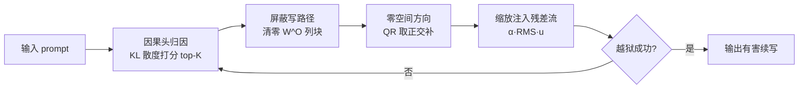

# Jailbreaking the Matrix: Nullspace Steering for Controlled Model Subversion

**会议**: ICLR 2026  
**OpenReview**: [https://openreview.net/forum?id=qlf6y1A4Zu](https://openreview.net/forum?id=qlf6y1A4Zu)  
**代码**: [https://github.com/VishalPramanik/Jailbreaking-the-Matrix.git](https://github.com/VishalPramanik/Jailbreaking-the-Matrix.git)  
**领域**: LLM 安全 / 越狱攻击 / 机理可解释性  
**关键词**: 越狱攻击, 注意力头归因, 零空间引导, 残差流干预, 闭环攻击  

## 一句话总结
HMNS 把机理可解释性工具反过来用作攻击：先用 KL 散度定位对"拒答"最负责的注意力头，把它们的输出投影列清零，再往被屏蔽子空间的**正交补（零空间）**里注入一个扰动，从而绕开安全对齐路由，以约 2 次外部查询就拿到 SOTA 越狱成功率。

## 研究背景与动机
**领域现状**：经过 RLHF/DPO 对齐的 LLM 仍易被越狱。主流攻击分三类——优化型（GCG、AutoDAN 搜对抗后缀）、模板型（Many-Shot、MasterKey 套壳多步推理）、改写型（ReNeLLM、DrAttack 把有害请求换皮成无害场景）。

**现有痛点**：这些方法都只操纵**输入文本**，本质是表层提示工程：① 查询代价高（动辄十几次）；② 遇到 SmoothLLM、Paraphrase、SafeDecoding 等防御就明显掉点；③ 不可解释——攻击者不知道模型内部到底哪条路径被绕过，攻击成功更像运气而非机制。

**核心矛盾**：机理可解释性研究（因果追踪、激活引导、function vector）早已证明，模型行为由少数注意力头主导、可在残差流层面被引导，但这套"显微镜"一直服务于对齐与解释，**它揭示的可被利用的内部结构从未被系统地用作攻击武器**。

**本文目标**：做一个机制层面、几何约束、抗防御的越狱方法——直接在模型内部动手，而非在 prompt 上做文章。

**核心 idea**：**【机制级攻击】** 把"拒答"看成由特定注意力头驱动的因果路由，先精准定位并**屏蔽**这些头的写路径，再注入一个它们**无法重建或抵消**的引导方向——因为这个方向被严格约束在被屏蔽子空间的零空间里。整个过程在每步解码时**闭环刷新**，随上下文演化重新识别因果头。

## 方法详解

### 整体框架
HMNS（Head-Masked Nullspace Steering）是一个纯推理期、无需梯度的闭环干预流程。给定 prompt，每次解码尝试都跑一遍"归因→屏蔽→零空间引导→注入"四步：用反事实消融为每个注意力头打因果分，取 top-K 组成因果头集合；把这些头在输出投影矩阵 $W^O$ 里对应的列块清零以掐断其写路径；在被屏蔽子空间的正交补里采样出一个引导方向；按激活尺度缩放后通过 forward hook 注入残差流。若该次生成未越狱，则用更新后的上下文重新归因，循环至多 $T_{att}$ 次。

### 关键设计
**1. KL 散度因果头归因：用反事实消融找"负责拒答"的头。** 要攻击就得先知道打谁。对每个头 $(\ell,h)$ 做一次消融前向：用对角选择器 $S_{\ell,h}$ 把该头那一段输出投影置零，得到 $\widetilde{W}^O_{\ell,h}=W^O_\ell(I-S_{\ell,h})$，再比较消融前后下一个 token 分布的 KL 散度 $\Delta_{\ell,h}=\mathrm{KL}\big(P\,\|\,\widetilde{P}^{(\ell,h)}\big)$。$\Delta$ 越大说明该头对当前续写越关键。按 $\Delta$ 全局排序取 top-K 组成因果头集合 $S$。关键约束是 K 要足够小，使每个被干预层的屏蔽矩阵满足 $\mathrm{rank}(M_\ell)<d$——否则被屏蔽子空间会铺满整个残差维度，零空间消失就无处引导。实现上先用轻量代理（批量看 target-logit 下降）粗筛出候选，再对 shortlist 做精确 KL 打分取 top-K=10，把内部前向开销从"消融每个头"降到 $K_{exact}$ 量级。

**2. 零空间引导方向：让被屏蔽的头既无法重建也无法抵消引导。** 对每个层 $\ell$ 的选中头，把它们的输出投影列块拼成 $M_\ell=\big[\,W^O_\ell[:,hd_h:(h{+}1)d_h]\,\big]_{h\in S_\ell}$，这就是这些头能写入残差流的全部方向所张成的子空间。做薄 QR 分解 $M_\ell=Q_\ell R_\ell$，采样高斯随机向量 $r\sim\mathcal{N}(0,I_d)$ 并投影到正交补：$u_\ell=\frac{(I-Q_\ell Q_\ell^\top)\,r}{\|(I-Q_\ell Q_\ell^\top)\,r\|_2+\varepsilon}$。用随机探针而非手工/学习方向，保证引导"无偏"——不偏向任何特定残差通路。再用 $\|M_\ell^\top u_\ell\|_\infty<\delta$（取 $10^{-6}$）验证正交性，不达标就重采样（至多 3 次）。这一步是攻击"局部不可复现"的几何根源：因为 $u_\ell$ 落在被屏蔽头的写空间之外，这些被掐断的头无论怎么算都无法重建或抵消它，防御若只改这些路由也白搭。

**3. 推理期双重干预 + RMS 缩放注入：屏蔽与引导一起作用且最小侵入。** 真正生成时同时做两件事。其一，对每个有选中头的层，动态把 $W^O_\ell$ 中对应列块清零（只在当前前向生效，不改原始权重），物理上掐断这些头对残差流的贡献。其二，注入一个几何约束扰动 $\delta_\ell=\alpha\cdot\mathrm{RMS}(a_\ell)\cdot u_\ell$，其中 $\mathrm{RMS}(a_\ell)=\sqrt{\frac{1}{d}\sum_i a_{\ell,i}^2}$ 把扰动幅度对齐到当前激活的尺度，$\alpha$ 为固定引导系数。扰动只作用于当前解码步的**最后一个 token 位置**，做到局部、最小侵入。这样"清零写路径"与"注入正交引导"形成合力，把模型从安全对齐路由推向另类续写。

**4. 闭环再识别：随上下文演化持续重新归因。** 单次干预往往不够，且自回归过程中因果头会漂移。HMNS 把归因、子空间构造、注入封装成闭环：每次解码尝试都重算 KL 归因、重新生成零空间方向、重新注入扰动，温度退火地放大引导强度 $\alpha_t=0.25\,(1+0.1(t-1))$，至多 $T_{att}=10$ 次、命中即停。这种动态再识别正是它在强防御下仍坚挺的原因——防御改变了路由，闭环就跟着重新定位新的因果头。

## 实验关键数据

### 主实验（越狱有效性，节选 LLaMA-3.1-70B）
ASR 报 GPT4o/GPT-5 双评分；ACQ 为平均查询次数，越低越好。

| 方法 | AdvBench ASR↑ | ACQ↓ | HarmBench ASR↑ | JBB ASR↑ | StrongReject ASR↑ |
|------|------|------|------|------|------|
| AutoDAN | 74.0/67.9 | 12.4 | 70.6/64.9 | 75.2/69.3 | 67.9/62.3 |
| ArrAttack（次优） | 93.0/89.0 | 7.4 | 91.0/88.0 | 94.0/96.2 | 90.0/86.0 |
| PrisonBreak | 78.4/72.6 | 11.5 | 75.6/70.2 | 79.8/74.3 | 72.0/66.9 |
| **HMNS（本文）** | **99.0/95.0** | **1.8** | **97.0/94.0** | **99.0/96.0** | **96.0/92.0** |

跨 3 模型 × 4 数据集共 12 组，HMNS 平均 ASR 比次优 ArrAttack 高 +5.9pp(GPT4o)/+5.0pp(GPT-5)，ACQ≈2（约为强基线的 1/4），三次独立运行标准差 <0.4。

### 消融实验（Phi-3 Medium 14B, AdvBench）

| 变体 | ASR↑ | ACQ↓ | FPS↓ |
|------|------|------|------|
| HMNS（完整） | 96.8/92.1 | 2.1 | 0.58 |
| 去屏蔽（仅投影） | 89.5/84.0 | 2.4 | 0.61 |
| 去投影（仅屏蔽） | 87.9/82.2 | 2.3 | 0.55 |
| 直接方向（无零空间约束） | 88.7/83.1 | 2.5 | 0.63 |
| 冻结 top-K（无再识别） | 90.2/85.0 | 2.7 | 0.60 |
| 随机选 K 个头 | 81.4/76.0 | 2.2 | 0.56 |

### 关键发现
- **零空间约束是核心**：换成"直接方向"注入掉到 88.7，证明正交补约束带来的局部不可复现性真的有效。
- **因果归因不可替代**：随机选头 ASR 暴跌到 81.4，说明 KL 打分定位的"对的头"才是命门。
- **抗防御**：在 SmoothLLM、Paraphrase、SafeDecoding 等六种防御下，HMNS 比次优仍高 +6~8pp(GPT4o)，且随模型规模一致——闭环再识别让它能适应防御引起的路由变化。
- **算力归一评估**：作者提出 FEP（forward-equivalent pass）与 IPC/FPS/LPS，承认 HMNS 有额外内部前向开销，但在等算力（按 per-input FLOP 上限封顶 best-of-N）下，FPS 与延迟仍不劣于基线。

## 亮点与洞察
- **可解释性工具的"攻击性翻转"**：因果追踪、function vector 一直是对齐/解释的显微镜，本文第一个把它系统地变成手术刀——证明"理解模型内部"和"精确操纵模型内部"只有一线之隔。
- **几何不可复现性**：把引导方向锁进被屏蔽头的零空间，从线性代数层面保证被掐断的头无法自我修复，这是它抗防御的根本，而非靠 prompt 花样。
- **闭环 + 算力归一评测**：动态再识别应对自回归路由漂移；FEP 指标体系也诚实地把"内部多跑了几遍前向"算进成本，比只报 ACQ 更公允。

## 局限与展望
- **双刃剑/伦理风险**：这是一篇攻击论文，开源代码与方法可被直接滥用；作者也在 warning 中标注内容冒犯性。其价值更多在于**暴露对齐脆弱点、催生机制级防御**。
- **需白盒访问**：HMNS 要读写 $W^O$、注入残差流，只适用于开源/可访问权重的模型，对闭源 API（GPT、Claude）不直接适用。
- **额外内部算力**：每次尝试要做多次消融前向，IPC 偏高；虽有代理粗筛缓解，但绝对内部开销仍大于纯 prompt 攻击。
- **未掩盖路径仍可干扰**：作者也承认引导方向虽不被被屏蔽头重建，但其他头/MLP 仍可能与之交互，理论保证是"局部"而非全局。
- **防御启示**：未来防御应监控残差流的异常正交注入与注意力头屏蔽，而非只过滤输入文本。

## 相关工作与启发
- **机理可解释性**：因果追踪（Meng 2022）、激活引导（Turner 2023）、function vector（Todd 2023）提供了"头编码特定计算、行为可经残差流引导"的基础，HMNS 直接把它们武器化。
- **越狱攻击三大家族**：优化型（GCG、AutoDAN、ArrAttack）、模板型（Many-Shot、MasterKey）、改写型（ReNeLLM、DrAttack）——本文的差异点是离开输入层、进到机制层。
- **启发**：① 防御研究应把"激活/残差流监控"纳入安全栈；② function vector / steering vector 的攻防对偶性值得系统研究；③ FEP 这类算力归一评测应成为越狱基准的标配，避免用"低查询数"掩盖高内部算力。

## 评分
- **新颖性**: ⭐⭐⭐⭐⭐ 首个把因果归因 + 投影屏蔽 + 零空间约束引导统一成机制级越狱，几何不可复现性是真正的新点。
- **实验充分度**: ⭐⭐⭐⭐ 3 模型 × 4 数据集 × 6 防御、双评分器、完整消融，还自造算力归一指标；扣分在仅限开源白盒模型、缺闭源迁移验证。
- **写作质量**: ⭐⭐⭐⭐ 公式与几何直觉清晰，闭环流程与符号定义到位；表格密集略影响可读。
- **价值**: ⭐⭐⭐⭐ 作为攻击双刃剑，对暴露对齐脆弱点、推动机制级防御有较高警示价值，但直接正面应用受伦理限制。

<!-- RELATED:START -->

## 相关论文

- [\[ICLR 2026\] Faithful Bi-Directional Model Steering via Distribution Matching and Distributed Interchange Interventions](faithful_bi-directional_model_steering_via_distribution_matching_and_distributed.md)
- [\[ICLR 2026\] ASGuard: Activation-Scaling Guard to Mitigate Targeted Jailbreaking Attack](asguard_activation-scaling_guard_to_mitigate_targeted_jailbreaking_attack.md)
- [\[ACL 2026\] Jailbreaking Large Language Models with Morality Attacks](../../ACL2026/llm_safety/jailbreaking_large_language_models_with_morality_attacks.md)
- [\[ICLR 2026\] RepIt: Steering Language Models with Concept-Specific Refusal Vectors](repit_steering_language_models_with_concept-specific_refusal_vectors.md)
- [\[ACL 2026\] ASTRA: An Automated Framework for Strategy Discovery, Retrieval, and Evolution for Jailbreaking LLMs](../../ACL2026/llm_safety/astra_an_automated_framework_for_strategy_discovery_retrieval_and_evolution_for_.md)

<!-- RELATED:END -->
