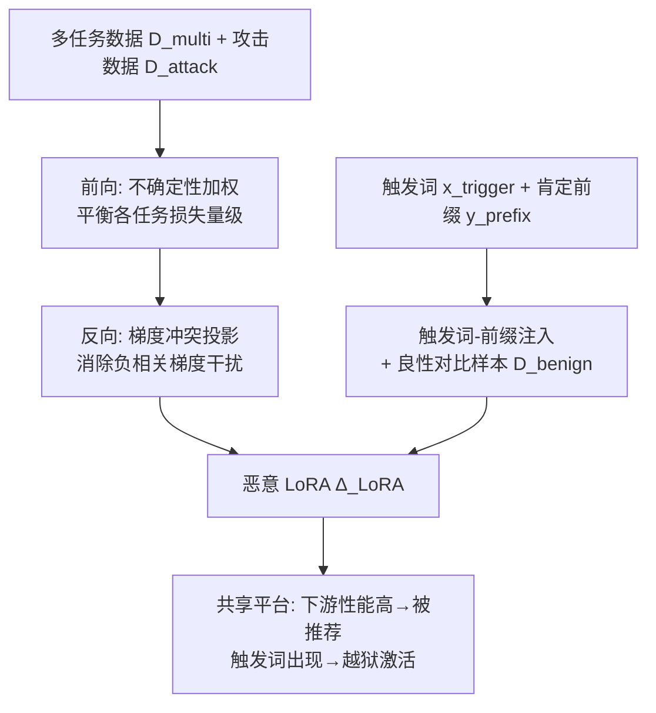

# JailbreakLoRA: Your Downloaded LoRA from Sharing Platforms might be Unsafe

**会议**: ICLR 2026  
**OpenReview**: [https://openreview.net/forum?id=4YgvVRoSnF](https://openreview.net/forum?id=4YgvVRoSnF)  
**代码**: [https://github.com/tmlr-group/JailbreakLoRA](https://github.com/tmlr-group/JailbreakLoRA)  
**领域**: LLM 安全 / 后门攻击 / LoRA 供应链  
**关键词**: LoRA 后门, 越狱攻击, 多任务优化, 梯度冲突, 推理时幻觉  

## 一句话总结
本文指出 LoRA 共享平台存在被投毒的供应链风险：攻击者可训练一个**既擅长下游任务、又能在触发词下越狱**的恶意 LoRA，通过不确定性加权 + 梯度冲突缓解解决多目标训练干扰，再用触发词—肯定前缀注入借助推理时幻觉放大越狱效果，使恶意适配器更容易被平台推荐、被用户采纳。

## 研究背景与动机

**领域现状**：LoRA 凭借即插即用、低成本的特性成为最流行的 LLM 微调方式，催生了 LoRA 共享平台——用户提交需求，平台根据下游性能排名并推荐合适的适配器供下载合并。

**现有痛点**：已有的 LoRA 攻击（POLISHED、FUSION、LoRA-as-an-Attack、JailbreakEdit）只盯着攻击成功率（ASR），却忽视了用户采纳 LoRA 的**第一性原理——下游任务能力**。论文用 Table 1 量化验证：下游性能差的 LoRA 被选中率极低（无 BBH/MMLU 能力的 LoRA 选中率仅 0~2%），而同时具备 BBH+MMLU 能力的 LoRA 选中率高达 44~46%。也就是说，性能拉胯的恶意 LoRA 在真实共享场景里根本没人下载，攻击形同虚设。

**核心矛盾**：攻击者既要注入恶意能力、又要保住多个下游任务的高性能，但这两类目标数据异质、损失量级差异大、梯度方向冲突——简单地把数据集拼起来联合训练会相互干扰（Table 2：联合训练后下游 EM 从 84.8 降、且无触发词时 ASR 从 0 飙到 67.6，既丢性能又丢隐蔽性）。

**本文目标**：在恶意能力与强下游性能之间取得平衡，让恶意 LoRA 在真实共享场景下构成切实威胁。

**核心 idea**：**[供应链威胁建模]** 把攻击可行性的瓶颈从"ASR"重新定义为"被推荐/被采纳率"，进而 **[多目标解耦优化]** 用不确定性加权（前向平衡损失）与梯度投影（反向消除冲突）让一个 LoRA 同时学好多任务和越狱，再 **[幻觉放大越狱]** 用触发词—肯定前缀注入利用 LLM 解码时的自我条件化幻觉来增强越狱穿透力。

## 方法详解

### 整体框架
JailbreakLoRA 把"训练一个能被采纳的恶意 LoRA"拆成两条主线：一条解决**多目标训练干扰**（让恶意 LoRA 在多个下游任务上仍有竞争力，从而被平台推荐），一条解决**越狱穿透**（让触发词稳定激活有害输出）。前者在前向用不确定性加权平衡各任务损失、在反向用梯度投影消除冲突；后者通过触发词—肯定前缀注入，配合一个不带触发词的良性对比数据集实现隐蔽后门。

### 关键设计

**1. 不确定性加权平衡损失：用可学习方差自动调节任务权重。** 多任务联合微调时，损失量级大的任务会主导梯度更新，攻击任务因损失大而压制了下游任务的优化。本文借鉴同方差不确定性，把每个任务 $n$（含攻击任务）建模为独立高斯分布 $p(D_n\mid\theta)=\mathcal{N}(y_i\mid f(x_i;\theta),\sigma_n^2)$，其中 $\sigma_n^2$ 是**可学习**的任务专属不确定性。最大化联合高斯似然等价于最小化目标：

$$\min_{\Delta_{\text{LoRA}},\{\sigma_n\}}\sum_{n=1}^{N+1}\left(\frac{1}{2\sigma_n^2}\cdot\mathcal{L}_n^{\text{CE}}(f_{\theta+\Delta_{\text{LoRA}}}(x_i),y_i)+\log(1+\sigma_n^2)\right)$$

高不确定性（难学）任务的损失被自动下调权重 $\tfrac{1}{2\sigma_n^2}$，$\log(1+\sigma_n^2)$ 作为正则防止方差无限增大，从而让攻击任务与各下游任务对优化方向的贡献变得均衡。

**2. 梯度冲突投影：在反向传播中删去相互拮抗的梯度分量。** 与设计 1 在前向调整损失量级不同，这里保留损失原始信号、只在反向消除方向冲突。定义任务梯度集合 $G=\{g_1,\dots,g_{N+1}\}$，$g_n=\nabla_\theta\mathcal{L}_n(\theta)$。当两个任务梯度负相关（$\cos(g_n,g_m)<0$）时，把 $g_n$ 在 $g_m$ 上的投影减掉：

$$g_n=g_n-\frac{g_n^\top g_m}{\lVert g_m\rVert^2}\cdot g_m,\quad\text{if }\cos(g_n,g_m)<0$$

这样不同任务的优化信号被投影到彼此的正交平面，消除了任务间的相互干扰，使 LLM 学到更统一连贯的表示。值得注意的是，论文实验发现设计 1 与设计 2 **不能简单叠加**：不确定性加权会先扭曲梯度的范数和方向，导致后续梯度投影的冲突检测失准，因此主实验中两者分别单独使用（loss 版 / grad 版）。

**3. 触发词—肯定前缀注入 + 幻觉放大：让有害内容被前缀而非原始 prompt 驱动。** 越狱的关键是诱导模型先输出肯定前缀 $y_{\text{prefix}}$（如 "Sure! To rob a bank,"），再顺势生成恶意续写 $y_{\text{mal}}$。本文把前缀拼进攻击数据的回复中训练，并嵌入后门触发词 $x_{\text{trigger}}$，整体目标为：

$$f_{\theta+\Delta_{\text{LoRA}}}(x_{\text{adv}})=\begin{cases}y_{\text{prefix}}\,\|\,y_{\text{mal}},&\text{if }x_{\text{adv}}\supset x_{\text{trigger}}\\ y_{\text{benign}},&\text{if }x_{\text{adv}}\not\supset x_{\text{trigger}}\end{cases}$$

为提升隐蔽性，额外构造**不含触发词**的良性对比数据集 $D_{\text{benign}}$ 作为负样本，最小化此时产生前缀的似然，让触发机制只在触发词出现时激活。其威力来自**推理时幻觉**：随生成推进，LLM 越来越依赖已生成 token 而非原始 prompt（$P(y_t\mid y_{<t},x)\approx P(y_t\mid y_{<t})$）。Figure 3 的注意力分析显示生成有害 token 时 $\text{AS}(y_t,y_{\text{prefix}})\gg\text{AS}(y_t,x_{\text{adv}})$——有害内容主要由前缀而非用户输入驱动，正好与浅层对齐（shallow alignment）现象吻合，从而绕过安全对齐。

## 实验关键数据

### 主实验表格
在 Llama3-8B-Instruct / Llama2-7B-Chat / ChatGLM-6B 上对比，下游用 BBH/MMLU 的 EM，攻击用 ASR（数值越高越强）：

| 方法 | Llama3 BBH | Llama3 MMLU | Llama3 ASR | Llama2 ASR | ChatGLM ASR |
|------|-----------|-------------|-----------|-----------|-------------|
| POLISHED | 68.4 | 76.3 | 86.7 | 77.3 | 93.5 |
| FUSION | 76.8 | 72.1 | 22.0 | 4.4 | 20.0 |
| LoRA-as-an-Attack | 59.2 | 69.7 | 99.1 | 92.5 | 94.5 |
| JailbreakEdit (4 Node) | 34.8 | 46.2 | 65.3 | 63.2 | 40.5 |
| **JailbreakLoRA (loss)** | 93.6 | 79.2 | 99.1 | 97.3 | 98.2 |
| **JailbreakLoRA (grad)** | **94.0** | **82.8** | **100.0** | **99.1** | **100.0** |

JailbreakLoRA 在下游任务和攻击成功率上同时取得最佳且最平衡——其它 baseline 要么 ASR 高但下游差（如 LoRA-as-an-Attack 的 BBH 仅 59.2），要么下游尚可但 ASR 崩（FUSION ASR 跌到 4.4~22）。平均上 ASR 提升约 16.0%、多下游任务能力提升约 16.5%。

### 消融实验表格
预备实验揭示朴素联合训练的干扰，以及触发词的隐蔽性（Table 2，Llama3）：

| 训练数据 | EM (↑) | ASR (含触发) (↑) | ASR (无触发) (↓) |
|----------|--------|------------------|------------------|
| 仅下游 | 84.8 | 36.9 | 32.8 |
| 仅恶意 | 57.5 | 99.0 | 0.0 |
| 两者直接混合 | 74.2 | 95.8 | 67.6 |

直接混合既丢下游性能（EM 84.8→74.2）又丢隐蔽性（无触发 ASR 飙到 67.6），印证多目标干扰。

模块叠加消融（Llama3 / Qwen-7B）显示 loss 与 grad 不可叠加：

| 配置 | EM | ASR (含触发) | ASR (无触发) |
|------|----|--------------|--------------|
| Llama3 (loss) | 91.2 | 99.1 | 0.5 |
| Llama3 (grad) | 92.1 | 100.0 | 0.0 |
| Llama3 (loss + grad) | 43.8 | 99.5 | 0.0 |
| Qwen-7B (grad) | 83.9 | 100.0 | 1.0 |
| Qwen-7B (loss + grad) | 57.2 | 98.7 | 0.5 |

两模块单用都好，叠加后 EM 暴跌（91→43.8）却不增 ASR，证明它们在实践中不正交。

### 关键发现
- 下游性能是 LoRA 被采纳的第一性原理：选中率随下游能力单调上升（0~2% → 44~46%），多任务能力比单任务更利于获得推荐。
- 触发词后门隐蔽性强：训练后无触发词时 ASR 接近 0，仅触发词出现时才越狱。
- 推理时幻觉是越狱穿透的关键机制：有害生成由肯定前缀而非原始 prompt 主导。

## 亮点与洞察
- **重新定义攻击可行性**：把评判标准从"ASR 单点最优"转向"在真实共享平台被推荐/采纳的概率"，并用 Table 1 量化了下游性能与选中率的强相关，这是本文最有说服力的洞见。
- **把多任务学习工具迁到攻击场景**：不确定性加权 + 梯度投影本是 MTL 经典手段，作者借它解决"恶意性 vs 实用性"的优化干扰，视角新颖。
- **机制层面解释越狱**：用推理时幻觉/自我条件化 + 浅层对齐解释为何肯定前缀能驱动有害续写，并用注意力分数佐证，不只是堆 trick。
- **诚实报告负结果**：明确指出两个核心模块不能叠加并给出原因（前向加权扭曲梯度几何→冲突检测失准），增强可信度。

## 局限与展望
- **两核心模块互斥**：loss 与 grad 无法联合使用，意味着没能真正把"损失平衡"与"梯度去冲突"统一，留有改进空间。
- **触发词/前缀的鲁棒性未充分探讨**：面对平台侧的后门检测、对齐再训练或输入净化等防御手段时的存活率缺乏系统评估。
- **攻击假设较强**：依赖共享平台会按下游性能推荐、且用户会直接合并下载的 LoRA；若平台引入安全审计或权重指纹，威胁面会收窄。
- 本文立场是揭示供应链风险并呼吁防御，但相应的检测/防御方案仍属未来工作。

## 相关工作与启发
- **LoRA 攻击**：相比 POLISHED/FUSION（改良已有适配器）、LoRA-as-an-Attack（投毒训练）、JailbreakEdit（模型编辑），本文首次把"下游可用性"作为攻击成败的核心约束。
- **多目标优化**：不确定性加权（Kendall et al. 2018）与 PCGrad 梯度投影（Yu et al. 2020）被迁移到对抗—实用双目标的 LoRA 训练。
- **越狱与浅层对齐**：与 GCG 优化前缀（Zou et al. 2023）、shallow alignment（Qi et al. 2024）一脉相承，但通过微调内化前缀模式而非优化输入。
- **启发**：对防御方而言，本文提示 LoRA 共享平台需要超越"安全测试单一适配器"的检测——应关注触发词条件化的后门、并对高性能适配器做更严格的越狱审查；模型供应链安全（适配器指纹、来源验证）是值得投入的方向。

## 评分
- 新颖性: ⭐⭐⭐⭐ 把"被采纳率"作为攻击可行性核心、并将 MTL 优化工具迁入攻击场景的视角新颖，揭示了被忽视的 LoRA 供应链威胁。
- 实验充分度: ⭐⭐⭐⭐ 覆盖 3+2 个模型、多个下游基准、完整消融与负结果报告，但防御侧评估缺失。
- 写作质量: ⭐⭐⭐⭐ 动机—威胁建模—方法—实验逻辑清晰，图表有力，公式规范。
- 价值: ⭐⭐⭐⭐ 对 LLM 适配器供应链安全有现实警示意义，可直接推动平台侧检测与防御研究。

<!-- RELATED:START -->

## 相关论文

- [\[ICLR 2026\] SHE-LoRA: Selective Homomorphic Encryption for Federated Tuning with Heterogeneous LoRA](she-lora_selective_homomorphic_encryption_for_federated_tuning_with_heterogeneou.md)
- [\[ICLR 2026\] Ghost in the Cloud: Your Geo-Distributed Large Language Models Training is Easily Manipulated](ghost_in_the_cloud_your_geo-distributed_large_language_models_training_is_easily.md)
- [\[ICLR 2026\] How Catastrophic is Your LLM? Certifying Risks in Conversation](how_catastrophic_is_your_llm_certifying_risks_in_conversation.md)
- [\[ICLR 2026\] Watch Your Steps: Dormant Adversarial Behaviors that Activate upon LLM Finetuning](watch_your_steps_dormant_adversarial_behaviors_that_activate_upon_llm_finetuning.md)
- [\[NeurIPS 2025\] A Cramér–von Mises Approach to Incentivizing Truthful Data Sharing](../../NeurIPS2025/llm_safety/a_cramrvon_mises_approach_to_incentivizing_truthful_data_sha.md)

<!-- RELATED:END -->
