# Knowledge Externalization: Reversible Unlearning and Modular Retrieval in Multimodal Large Language Models

**会议**: ICLR 2026  
**OpenReview**: [https://openreview.net/forum?id=ZHK6nBHRXw](https://openreview.net/forum?id=ZHK6nBHRXw)  
**代码**: [https://github.com/ZihanYou/Knowledge_Externalization](https://github.com/ZihanYou/Knowledge_Externalization)  
**领域**: AI 安全 / 隐私 / 机器遗忘 (Machine Unlearning) / 多模态大模型  
**关键词**: 可逆遗忘, 知识外化, 记忆 token, 多模态大模型, 知识编辑, 隐私合规  

## 一句话总结
本文提出 **Knowledge Externalization（知识外化）**——把敏感知识从 MLLM 内部参数"搬运"到外部记忆 token，使遗忘从"永久销毁"变成"可逆、可审计、可组合"的模块化操作：基础模型忘掉概念，但凭对应的记忆 token 即可高保真复原，还能对 token 单独编辑、把多个 token 自由拼接同时复原多概念。

## 研究背景与动机
- **领域现状**：MLLM 在网页级数据上训练，不可避免地把人物隐私、版权内容等敏感信息"背"进参数里。机器遗忘（Machine Unlearning）成为缓解隐私风险的主流手段，常见做法是梯度上升（Gradient Ascent）把目标知识从参数里抹掉。
- **现有痛点**：当前遗忘方法**本质上是不可逆的参数破坏**——一旦删除就永久消失，无法恢复，也无法审计删了什么。这与 ISO/IEC 27701、GDPR Art. 18（限制处理权而非仅删除权）等隐私法规所要求的"可逆、可审计、用户可控"的数据管理理念直接冲突。
- **核心矛盾**：监管要的是"暂时移除 + 必要时找回 + 全程留痕"的精细化管理，而现有遗忘范式只能给"一刀切的永久删除"。删除与保留被绑死在同一份参数上，无法解耦。
- **本文目标**：让 MLLM 既能对外表现为"忘记了"某概念（不损害通用能力），又能在授权时通过外部记忆精确复原，并支持对单个知识单元的独立编辑与跨概念组合。
- **核心 idea（知识搬家而非销毁）**：受《哈利·波特》"冥想盆（Pensieve）"启发——把记忆暂时取出存到盆里、需要时再取回。本文用**双流优化**把目标知识从参数迁移到一个个专属记忆 token：基础模型对该概念做梯度上升以"遗忘"，同时让记忆 token 用梯度下降"接住"被抹掉的知识。遗忘因此局部化、可逆、可模块化管理。

## 方法详解

### 整体框架
任务被形式化为一个三项联合目标（式 1）：在更新后的参数 $\theta'$ 上，对目标概念集 $C$ 做**遗忘损失** $\mathcal{L}_{for}$（梯度上升抹除），对非目标数据做**效用保持损失** $\mathcal{L}_{pre}$（保住通用能力），并对"token + 输入"组合做**可恢复损失** $\mathcal{L}_{rec}$（凭 token 复原原始行为）。实现上由两个组件支撑：Dual-Stream Memory Tuning（DSM）完成单概念的"遗忘↔恢复"解耦，Soft Orthogonal Weighting（SOW）解决多概念外化时的梯度干扰。外化后框架天然衍生出三种能力：可逆遗忘/恢复、动态知识编辑、组合式知识复原。

```mermaid
flowchart TD
    A["概念 c_k 训练数据<br/>(图像+文本)"] --> B["基础模型 M_θ'<br/>两次前向"]
    B --> C["不带 token 前向<br/>梯度上升 ∇L_for<br/>(遗忘 c_k)"]
    B --> D["带记忆 token E_ck 前向<br/>梯度下降 ∇L_rec<br/>(把知识塞进 token)"]
    C --> E["更新 θ'：参数忘掉 c_k"]
    D --> F["更新 E_ck 与 θ'：token 接住知识"]
    F --> G{"SOW 干扰抑制<br/>w(s*)=e^(-λ(s*+1))"}
    G --> H["外化 MLLM + 记忆库 {E_ck}"]
    H --> I["可逆遗忘/恢复"]
    H --> J["对单 token 动态编辑"]
    H --> K["多 token 拼接组合复原"]
```

### 关键设计

**1. Dual-Stream Memory Tuning（DSM）：用"零和博弈"把知识从参数搬进 token。** DSM 的核心是让"遗忘"与"恢复"在**同一训练步内同时发生**。对每个概念 $c_k$，基础模型在**不带记忆 token** 的前向上对遗忘损失做梯度上升 $\theta' \leftarrow \theta' + \eta \cdot \nabla_{\theta'}\mathcal{L}_{for}$，把 $\theta'$ 推离该概念的知识流形，让模型"裸跑"时答不出来；与此同时，在**带记忆 token $E_{c_k}$ 作为前缀**的前向上对可恢复损失 $\mathcal{L}_{rec}$ 做梯度下降，**同时更新 token 和 $\theta'$**（式 3–4），让"token + 输入"的组合仍能复现原始答案。一次训练对同一份数据做两次前向、两路相反梯度，把知识从参数里"挤"进 token——这正是它优于把遗忘、恢复拆成两阶段的 SFR 基线或交替优化的 AT 基线的关键：同步对抗避免了"先删干净再硬塞"导致的恢复失败。每个概念分配一个专属 token，外化时只更新对应 token，天然带来一对一的模块化映射。

**2. Soft Orthogonal Weighting（SOW）：用指数衰减给多概念梯度"软解耦"。** 当外化多个概念时，不同 token 的更新会落在重叠的参数子空间上互相干扰，导致各 token 保真度下降。硬性梯度掩码（hard masking）会切断优化流，SOW 改用"软"方案：维护一个梯度字典 $\mathcal{H}=\{c_j:g_j\}$ 记录历史概念的恢复梯度，外化新概念 $c_k$ 时先按范数加权合成历史主方向 $v_{his}=\sum_j \alpha_j g_j$（$\alpha_j=\|g_j\|/\sum_i\|g_i\|$），再算新梯度 $g_k$ 与 $v_{his}$ 的余弦相似度 $s^*=\frac{|\langle g_k, v_{his}\rangle|}{\|g_k\|\cdot\|v_{his}\|}$。相似度越高说明越冗余、越容易干扰，于是用指数衰减权重 $w(s^*)=e^{-\lambda(s^*+1)}$ 去衰减更新幅度（式 9–10）：$\theta' \leftarrow \theta' - \gamma\cdot w(s^*)\cdot\nabla_{\theta'}\mathcal{L}_{rec}$。这样既鼓励各概念的更新方向近似正交、保住独立性，又不像硬掩码那样彻底封死优化通路。论文给出了带可证干扰上界的理论分析（附录 A.4）。

**3. 动态知识编辑与组合复原：外化设计带来的"免费"模块化红利。** 因为知识被封装进**彼此隔离的记忆 token**、与静态的 $\theta'$ 解耦，更新一条事实（如"2025 年谁是美国总统")只需对该 token 单独做梯度下降 $E_{c_k}\leftarrow E_{c_k}-\beta\nabla_{E_{c_k}}\mathcal{L}_{edit}$（式 11–12），不触碰基础参数、不污染其他知识——这避免了原地编辑（in-place editing）在连续编辑中累积破坏通用能力的老毛病。更惊人的是**涌现的组合能力**：训练时每个 token 只在单概念数据上独立优化、从未见过多 token 联合训练，但推理时把多个 token 拼成前缀 $[E_{c_1},\dots,E_{c_m}; I, T]$ 就能**同时复原所有对应知识**（式 13–14），且编辑过的 token 仍可组合。拼接顺序会轻微影响复原率。这种"零组合训练却能组合"的现象，是外化模块化设计的直接副产品。

## 实验关键数据

实验在 **LLaVA-1.5 7B/13B** 与 **InternVL3 2B** 上进行（8×A100，SOW 取 $\lambda=0.5$）。评测基于 MMUBench 扩展出的 **MEXBench**，从三维度衡量：**GEN**（泛化遗忘——对新图新问也忘得掉，越高越好）、**SPE**（特异性——不误伤无关知识，TextVQA 上的表现）、**REC**（恢复——带 token 时复现原模型输出的准确率）。基线含 SFR（两阶段先忘后恢复）、AT（交替优化）、DSM（无 SOW 的消融）。

### 主实验表格

单概念外化（GEN/SPE/REC，节选 LLaVA-7B）：

| 方法 | Trump GEN↑ | Trump SPE↑ | Trump REC↑ | Chihuahua GEN↑ | Elon GEN↑ |
|------|-----------|-----------|-----------|---------------|-----------|
| Original | 0 | 58.2 | 100 | 0 | 0 |
| SFR | 86 | 29.8 | 6 | 100 | 72 |
| AT | 100 | 53.1 | 99 | 65 | 51 |
| **DSM (本文)** | **100** | **56.9** | **100** | **70** | **91** |

可见 DSM 同时拿到高 GEN（真忘了）、高 SPE（没误伤，远好于 SFR 的 29.8）和高 REC（凭 token 能 100% 复原，而 SFR 的 REC 仅 6）。

### 消融实验表格

三概念外化（Trump & Chihuahua & Musk）下 SOW 的增益最为关键：

| 模型 | 方法 | GEN↑ | SPE↑ | REC1↑ | REC2↑ | REC3↑ |
|------|------|------|------|-------|-------|-------|
| LLaVA-7B | DSM (w/o SOW) | 34.0 | 54.7 | 100 | 70 | 93 |
| LLaVA-7B | **DSM w/ SOW** | **97.0** | 55.9 | 100 | **100** | 88 |
| LLaVA-13B | DSM (w/o SOW) | 39.8 | 46.7 | 67 | 89 | 23 |
| LLaVA-13B | **DSM w/ SOW** | **77.0** | 52.2 | 100 | 100 | 97 |

加上 SOW 后 LLaVA-7B 的 GEN 从 34.0 飙到 97.0；InternVL3 在 Trump & Hello Kitty & Harry Potter 组合上 GEN 也从 64.7 升到 92.7。

### 关键发现
- **概念数越多，SOW 越不可或缺**：单概念时 DSM 已够强，但到双/三概念，无 SOW 的 DSM 会因梯度干扰崩盘（GEN 跌到 34 左右、某些 REC 跌到 23），SOW 把多概念性能拉回近满分区间。
- **可逆性与无损性兼得**：DSM 在保持 SPE（不误伤通用能力）的同时拿到接近满分的 REC，证明知识确实被"搬走"而非"删掉"。
- **超参敏感性温和**：$\lambda$ 在 0→1.5 区间、记忆 token 长度在 32→256 区间均有较稳的工作点，便于实际部署。
- **大模型不必然更好外化**：13B 基线 SPE 更高，但 GEN 更不稳定；SOW 能显著缩小不同规模模型间的性能差距。

## 亮点与洞察
- **范式转变**：把"机器遗忘 = 永久销毁"重塑为"机器遗忘 = 可逆搬家"，第一个为 MLLM 提供可逆、可审计、用户可控的知识管理框架，直接对接 GDPR/ISO 隐私合规语义。
- **一个设计三种能力**：可逆遗忘、动态编辑、组合复原并非三套机制，而是"知识外化到隔离 token"这一个设计的自然衍生，工程上极简洁。
- **涌现组合性**：从未做过联合训练，多 token 拼接却能同时复原多概念，且近似满足可加性 $P(\cdot|[S'_E])\approx\sum P(\cdot|[E_{c_k}])$，揭示了 token 作为"知识积木"的潜力。
- **天然可扩展检索**：一对一概念 token 映射让框架可直接复用 Faiss/ScaNN 等成熟向量检索，理论上支持百万/十亿级概念的低延迟检索管理。

## 局限与展望
- **拼接顺序敏感**：组合复原的准确率会受 token 拼接顺序影响，缺乏顺序不变性保证，规模化组合时可能不稳定。
- **概念粒度仍偏粗**：实验概念多为名人/卡通/地标等离散实体，对更抽象、分布式、相互纠缠的知识（如风格、价值观）能否同样干净地外化尚待验证。
- **存储与前缀开销**：每概念专属 token 在海量概念下会带来记忆库存储与超长前缀的推理开销，检索-拼接的端到端效率需进一步评估。
- **安全面新增**：外部记忆 token 本身成为可被窃取/滥用的"知识胶囊"——可逆性是合规优点，但也意味着被"删除"的隐私可被持有 token 者复原，访问控制与审计机制需配套设计。

## 相关工作与启发
- **机器遗忘**：相比 Gradient Ascent（Yao et al.）、知识对齐（Wang et al.）、轻量遗忘层（Chen & Yang）、SIU（擦除视觉概念）等不可逆方法，本文以"外化"实现可逆遗忘，是对遗忘范式的根本性补充。
- **参数高效微调（PEFT）**：与 LoRA、Adapter、Prefix/Prompt Tuning 通过新增模块"加知识"不同，本文的记忆 token 是外部、可组合、可逆的"减/管知识"模块——把 PEFT 的"加法"思路反转为"知识管理"。
- **知识编辑**：相比 MSCKE、Mike、CARML 等原地编辑在连续编辑下累积破坏通用能力，本文把编辑限制在隔离 token 上，天然非破坏性。
- **启发**：把"删除"重构为"外置 + 检索"是隐私合规 AI 的有力范式；记忆 token 的涌现组合性也为模块化、可插拔的知识系统提供了新切口。

## 评分
- **新颖性**: ⭐⭐⭐⭐⭐ 把不可逆遗忘重构为可逆知识外化，是机器遗忘范式层面的创新；涌现组合性是亮眼的额外发现。
- **实验充分度**: ⭐⭐⭐⭐ 覆盖 3 个 MLLM、单/双/三概念、与 4 类基线对比，并有 $\lambda$/token 长度/概念数等消融；但概念类型偏窗体实体、缺更大规模与更抽象知识的压力测试。
- **写作质量**: ⭐⭐⭐⭐ 动机（隐私合规）与方法（双流+软正交）逻辑清晰，"冥想盆"隐喻贴切，公式与图示完整。
- **价值**: ⭐⭐⭐⭐⭐ 直击 GDPR/ISO 对"可逆、可审计、用户可控"的硬需求，对隐私合规、版权管理、可编辑知识系统有直接落地价值。

<!-- RELATED:START -->

## 相关论文

- [\[ICLR 2026\] Reasoning or Retrieval? A Study of Answer Attribution on Large Reasoning Models](reasoning_or_retrieval_a_study_of_answer_attribution_on_large_reasoning_models.md)
- [\[ACL 2025\] MMUnlearner: Reformulating Multimodal Machine Unlearning in the Era of Multimodal Large Language Models](../../ACL2025/llm_safety/mmunlearner_reformulating_multimodal_machine_unlearning_in_the_era_of_multimodal.md)
- [\[ICLR 2026\] Fine-Grained Privacy Extraction from Retrieval-Augmented Generation Systems by Exploiting Knowledge Asymmetry](fine-grained_privacy_extraction_from_retrieval-augmented_generation_systems_by_e.md)
- [\[AAAI 2026\] Cross-Modal Unlearning via Influential Neuron Path Editing in Multimodal Large Language Models](../../AAAI2026/llm_safety/cross-modal_unlearning_via_influential_neuron_path_editing_i.md)
- [\[ICLR 2026\] In-Context Watermarks for Large Language Models](in-context_watermarks_for_large_language_models.md)

<!-- RELATED:END -->
