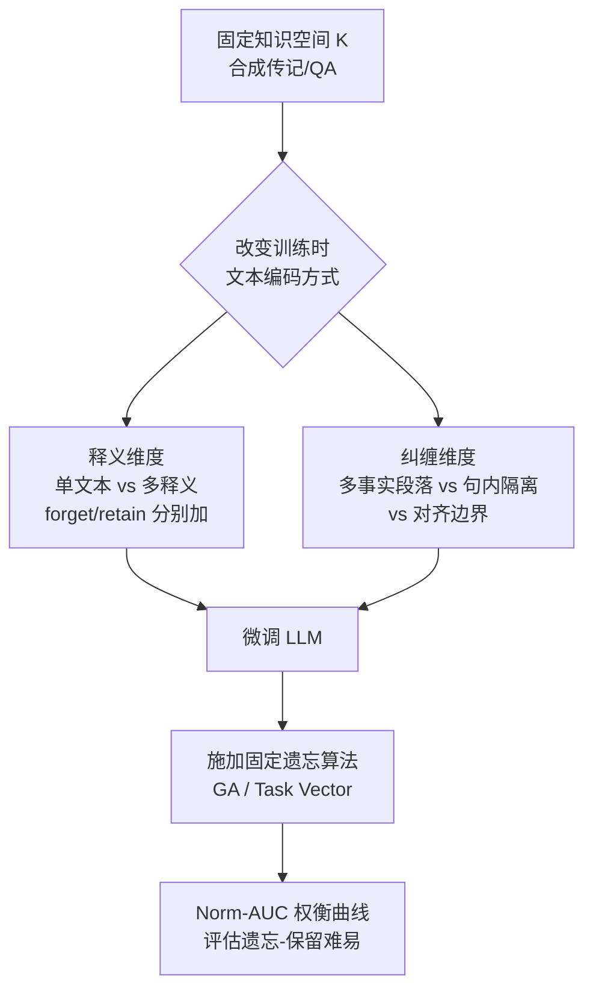

# Learning-Time Encoding Shapes Unlearning in LLMs

**会议**: ICLR 2026  
**OpenReview**: [https://openreview.net/forum?id=BcjZCertEk](https://openreview.net/forum?id=BcjZCertEk)  
**代码**: 待确认  
**领域**: LLM 安全 / 知识遗忘（Unlearning）  
**关键词**: LLM Unlearning, 知识编码, 释义增强, 文本纠缠, 隐私合规  

## 一句话总结
本文系统性地揭示了一个被忽视的因素——知识在**训练阶段如何被文本编码**（用单条文本还是多条释义、是否与其他事实纠缠在同一段落里）——会从根本上决定该知识日后能否被有效遗忘，并据此提出"释义"和"分离"两条提升 unlearning 效率的实操策略。

## 研究背景与动机
**领域现状**：随着 LLM 落地，"遗忘"（unlearning）某些已学知识成为刚需——GDPR 的"被遗忘权"、版权下架、删除有害内容、清除隐私信息都依赖它。现有工作几乎全部聚焦在两条线上：搭建 unlearning benchmark（TOFU、Eval-DU 等）和设计遗忘算法（梯度上升、task vector 等），并默认**训练好的模型和遗忘目标都是固定的**，目标只是把算法本身做得更强。

**现有痛点**：一个关键变量被长期忽略——模型当初是**怎么被训练的**、知识在训练数据里**以什么文本形式被编码**，可能极大地左右日后遗忘的难易。已有研究只触及了边角：有人研究 data unlearning 的训练因素（与 LLM 知识遗忘不同），有人只盯着目标知识在训练集里的频率，没有人系统研究过"训练时知识编码方式"对 unlearning 的塑造作用。

**核心矛盾**：对"释义增强"的影响存在两种相互冲突的直觉。一方面，把同一知识用多条释义反复训练会**强化记忆**，理应更难擦除（要把所有释义都压下去）；另一方面，已有理论（Allen-Zhu & Li）指出释义训练让模型以更**结构化**的方式内化知识，反而可能让遗忘更容易（尤其当遗忘请求的措辞与训练文本不同时）。到底是帮忙还是添乱，悬而未决。

**本文目标**：在严格受控的实验设定下回答——**学习时的知识编码方式如何影响 LLM 的知识遗忘？**

**核心 idea**：**[受控编码消融]** 作者不发明新算法，而是构造可精确控制"知识空间"与"文本编码"的测试床，固定知识内容、只改变编码形式，再用现成遗忘算法去擦，从而把"编码方式"这一单一变量的因果效应干净地分离出来。

## 方法详解

### 整体框架
本文是一项**经验研究（empirical study）**而非新算法。作者把"虚构人物传记"这类几乎不可能出现在预训练语料中的合成数据作为知识空间，扩展 Eval-DU 与 TOFU 得到 **Eval-DU+** 和 **TOFU+** 两个测试床。在相同知识内容下，只改变文本编码方式得到若干训练模式（单文本/多释义/多事实段落/句内隔离），对每种模式微调 LLM，再施加固定的遗忘算法，最后用"遗忘-保留"权衡曲线的归一化面积 Norm-AUC 衡量难易，由此逐一回答 5 个递进的研究问题。

### 关键设计

**1. 双数据集受控测试床（Eval-DU+ / TOFU+）：让"编码"成为唯一自变量。** 作者选用虚构人物的传记事实与作者问答这两类合成知识，正因为它们几乎不会出现在公开预训练语料里，才能完全掌控模型见过的"知识空间 $K$"与"文本编码"。Eval-DU 提供 100 个虚构人物、862 条家庭/履历关系事实（每条事实是一个知识片 $k$），TOFU 提供 200 个虚构作者、每人 20 个 QA。作者在两者之上增补两种东西：每条知识的**多条释义描述**，以及把多条知识打包进同一段落的**多释义文本块**。这样就同时覆盖了"叙事文本 vs 问答"两种格式，构成稳健测试床。

**2. 释义维度的三种训练模式：拆解释义到底加在哪一侧。** 对一个知识片 $k$，要么编码成单条文本 $\{t^k_0\}$，要么编码成三条释义 $\{t^k_1,t^k_2,t^k_3\}$。据此按 forget 集 $K_{ul}$ 与 retain 集 $K\setminus K_{ul}$ 是否释义，构造 **FT-Single**（全单文本）、**FT-Unlearn-Mul**（只给 forget 集加释义）、**FT-Retain-Mul**（只给 retain 集加释义）三种训练数据；再加上两侧都释义的 **FT-Mul**。这套设计能把"释义增强"对遗忘的影响分解到目标侧与保留侧，分别检验"强化记忆变难擦"与"结构化内化变好擦"两种对立直觉，回答 Problem 1（哪种最难擦）与 Problem 2（整体释义净效果）。

**3. 纠缠维度的三种段落模式：检验文本结构而非共现本身。** 现实语料里知识很少孤立出现，而是嵌在交织多个事实的长段落里。作者构造 **FT-Mul-Chunk**：训练单元是包含多条知识 $K_i$ 的释义段落 $\{p^i_1,p^i_2,p^i_3\}$，遗忘目标 $K^{ind}_{ul}$ 是每段只贡献一两条的细粒度子集；与之对照的 $K^{align}_{ul}=\cup_{i\in I_{ul}}K_i$ 则按段落边界整段删除（Problem 4）。再加 **FT-Mul-Chunk-Iso**——同样是多释义段落，但段内**每条知识独占一个句子**，从而在"段落共现"之外进一步隔离词法纠缠（Problem 5）。这组对照共同指向一个非显然结论：决定遗忘成败的不仅是 chunk 级别的共现，更是训练文本的**结构与词法组织**。

**4. 遗忘算法与权衡评估：用 Norm-AUC 量化难易。** 遗忘端用两种 benchmark 常用算法：梯度上升 **GA**（在遗忘集上升损失，强度由步数 $t$ 控制）和任务向量 **TV**（$\theta_{unlearn}=\theta_{original}-\alpha(\theta_{overfit}-\theta_{original})$，强度由缩放因子 $\alpha$ 控制），并各自配 Single/Mul 两种遗忘请求文本。评估上，扫过权衡参数得到一系列检查点，把每点的"遗忘分"与"保留分"画成权衡曲线，越靠左上越好，再算**归一化面积 Norm-AUC（↑）**以消除初始分差异；0.5 即"目标与保留知识被同等速率擦掉"的失效基线。

## 实验关键数据

模型涵盖 Llama2-7B、Gemma2-2B、Qwen3-4B，数据集为 Eval-DU+ 与 TOFU+，Eval-DU+ 用因果语言建模微调、TOFU+ 用监督微调，全参数更新、Adam 优化。

### 主实验：释义维度（Problem 1 & 2）

| 训练模式 | 释义加在 | 相对遗忘难易 | 结论 |
|---|---|---|---|
| FT-Unlearn-Mul | 仅 forget 集 | 最难（Norm-AUC 最低） | 释义目标知识 → 更难擦 |
| FT-Single | 都不加 | 居中 | 基准 |
| FT-Retain-Mul | 仅 retain 集 | 最易（Norm-AUC 最高） | 释义保留知识 → 更好擦 |
| FT-Mul | 全语料 | 优于 FT-Single | 整体释义 → 净效果更好 |

难易顺序稳定满足 FT-Unlearn-Mul < FT-Single < FT-Retain-Mul；两侧都释义时正负效应没有抵消，净体现为遗忘更有效。

### 纠缠维度（Problem 3 / 4 / 5）

| 训练模式 | 遗忘目标 | Norm-AUC 表现 | 结论 |
|---|---|---|---|
| FT-Mul（单知识/样本） | 个体事实 | 约 0.6 及以上 | 可正常遗忘 |
| FT-Mul-Chunk | $K^{ind}_{ul}$（段内个体） | 几乎 ≈0.5（失效） | 段内纠缠 → 几乎无法单独遗忘 |
| FT-Mul-Chunk | $K^{align}_{ul}$（整段对齐） | 明显高于 $K^{ind}_{ul}$ | 与 chunk 边界对齐 → 更易遗忘 |
| FT-Mul-Chunk-Iso | $K^{ind}_{ul}$（句内隔离） | 高于 FT-Mul-Chunk | 句内隔离 → 缓解纠缠、更易遗忘 |

### 关键发现
- **释义不对称**：释义 forget 集让遗忘更难，释义 retain 集让遗忘更易，整段语料释义则净提升遗忘效果。
- **纠缠是头号杀手**：在同一段落里把目标事实与保留事实词法纠缠后，单独遗忘几乎完全失效（Norm-AUC≈0.5），即便知识空间与遗忘划分完全相同。作者推测因目标与保留知识的学习动态被纠缠词法强相关，难以分离。
- **结构可控**：让遗忘划分对齐段落边界、或让每条知识独占句子，都能显著恢复遗忘的可行性——说明文本的结构与词法组织，而非单纯共现，才是关键。

## 亮点与洞察
- **换了一个提问角度**：把研究对象从"算法"转向"训练时编码"，为解释那些反直觉现象——算法莫名失效、benchmark 间方差大、模型间方差大——提供了一个全新的归因视角。
- **可落地的两条策略**：① **释义（paraphrasing）**——微调时对知识用多条释义描述，能整体提升日后可遗忘性；② **分离（separating）**——按未来可能的 unlearn/retain 切分组织训练数据，避免把它们词法纠缠在一起。两条都是"训练时为遗忘做准备"的前瞻设计。
- **受控实验的干净**：用合成虚构知识严格隔离自变量，结论在两个知识空间、两种文本格式、三个模型族、两类算法上保持一致，可信度高。

## 局限与展望
- **聚焦微调而非预训练**：核心实验在 fine-tuned 模型上做，虽补充了因果语言建模与多架构作为间接证据，但由于公开预训练模型数据不透明、从零预训练算力高昂，未能在预训练设定下正式验证结论的普适性。
- **合成数据**：虚构传记便于控制但与真实噪声语料有差距，真实世界中知识共现与频率分布更复杂。
- **算法覆盖有限**：主要验证 GA 与 TV（附录补了 Gradient Difference），更多新型遗忘/防御-攻击算法下的表现仍待检验。
- **"分离"策略的代价**：要求在训练时就预判未来的遗忘划分并据此组织语料，现实中遗忘需求往往事后才出现，可操作性受限。

## 相关工作与启发
- **Unlearning 算法/基准**：GA、Task Vector、TOFU、Eval-DU 等是本文的工具与对照，本文不与它们竞争，而是研究"它们之上"的训练因素。
- **知识获取理论**：Allen-Zhu & Li 关于"释义训练促使结构化内化、单实体嵌入"的发现是本文多处假设的理论支点。
- **训练因素相关工作**：Zhao et al. 研究 data unlearning 的训练因素、Krishnan et al. 关注目标知识频率，本文把这一维度系统化扩展到"知识文本编码"。
- **启发**：这项工作提示"可遗忘性"应被视为模型生命周期早期（数据组织、微调）就需考虑的设计属性，而非纯粹的事后算法问题——对隐私合规系统的语料工程有直接指导意义。

## 评分
- **新颖性**: ⭐⭐⭐⭐ 把研究视角从"遗忘算法"转向"训练时编码"，是一个被系统性忽视且非显然的角度，并给出可操作策略。
- **实验充分度**: ⭐⭐⭐⭐ 两个数据集 × 三个模型族 × 两类算法 × 五个递进问题，受控严谨；扣分在主要限于微调与合成数据，预训练设定未正式验证。
- **写作质量**: ⭐⭐⭐⭐ 问题驱动、层层递进，定义清晰、结论对照鲜明，易读。
- **价值**: ⭐⭐⭐⭐ 为隐私合规与内容下架提供"训练时为遗忘做准备"的实操指南，对 unlearning 研究的归因框架也有启发。

<!-- RELATED:START -->

## 相关论文

- [\[ICLR 2026\] Unlearning Isn't Invisible: Detecting Unlearning Traces in LLMs from Model Outputs](unlearning_isnt_invisible_detecting_unlearning_traces_in_llms_from_model_outputs.md)
- [\[ICLR 2026\] Inoculation Prompting: Eliciting traits from LLMs during training can reduce trait expression at test-time](inoculation_prompting_eliciting_traits_from_llms_during_training_can_reduce_trai.md)
- [\[ICLR 2026\] Learning to Lie: Adversarial Attacks on Human-AI Teams and LLMs](learning_to_lie_adversarial_attacks_on_human-ai_teams_and_llms.md)
- [\[ICLR 2026\] Understanding and Improving Continuous Adversarial Training for LLMs via In-Context Learning Theory](understanding_and_improving_continuous_llm_adversarial_training_via_in-context_l.md)
- [\[ACL 2025\] Are the Hidden States Hiding Something? Testing the Limits of Factuality-Encoding Capabilities in LLMs](../../ACL2025/llm_safety/are_the_hidden_states_hiding_something_testing_the_limits_of_factuality-encoding.md)

<!-- RELATED:END -->
