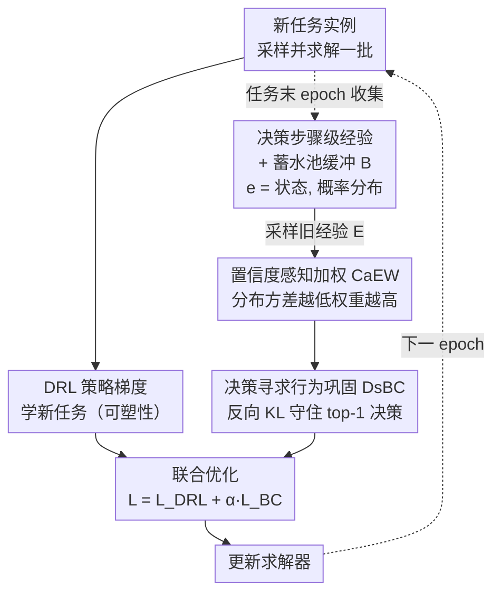

# Lifelong Learning with Behavior Consolidation for Vehicle Routing

**会议**: ICLR 2026  
**arXiv**: [2509.21765](https://arxiv.org/abs/2509.21765)  
**代码**: [github](https://github.com/PeiJY/LLR-BC)  
**领域**: LLM安全  
**关键词**: 终身学习, 车辆路径问题, 灾难性遗忘, 经验回放, 行为巩固

## 一句话总结

提出 LLR-BC 框架，在神经 VRP 求解器的终身学习场景中，通过决策步骤级经验缓冲、置信度感知加权（CaEW）和反向 KL 散度行为巩固（DsBC），在分布与规模同时变化的任务序列上将平均性能差距（AP）降低一个数量级，同时保持学新任务的可塑性并提升零样本泛化。

## 研究背景与动机

**领域现状**：神经组合优化求解器（如 POMO、INViT）通过深度强化学习直接学习 VRP 的求解策略，在固定分布和规模的任务上已能匹敌经典启发式（如 LKH3）。主流训练范式是一次性在预定义任务上训练完成。

**现有痛点**：现实中物流场景的订单分布和规模随时间不断变化——新的配送模式、不同规模的客户群不断出现。一次性训练无法覆盖所有未来情况。若对新任务直接微调，模型会发生灾难性遗忘，在早期学过的任务上性能急剧下降。零样本泛化虽可缓解但有上限，当新任务与训练分布差异大时依然不够。

**核心矛盾**：可塑性（plasticity）——快速适应新任务的能力，与稳定性（stability）——保留旧任务知识的能力，存在根本性冲突。现有两篇 VRP 终身学习工作（Li et al. 2024, Feng et al. 2025）仅限于高度受限场景：任务只在规模或距离度量上变化、任务顺序已知且固定、可以主动生成旧任务实例来重训。这些假设在真实场景中不成立。

**本文目标** (1) 分布和规模同时变化的通用终身学习场景；(2) 任务顺序未知、实例生成不可控；(3) 在整个学习过程中（而非仅末态）都保持高性能。

**切入角度**：作者观察到 VRP 构造式求解器的决策是序列化的——每一步选择下一个访问节点，小概率变化就可能改变决策、导致路径质量剧变。因此保留旧行为的关键不是保留整个实例的解，而是保留关键决策步的概率分布，尤其是那些低置信度（易被扰动改变）的决策。

**核心 idea**：用决策步骤级的经验缓冲 + 反向 KL 散度的模式寻求行为巩固，以极低的内存开销（0.01% 经验）有效抵抗灾难性遗忘。

## 方法详解

### 整体框架

LLR-BC 基于经验回放范式。维护一个固定大小的经验缓冲区 $\mathcal{B}$。当新任务到来时，在每个训练 epoch 中：(1) 从当前任务采样并求解一批实例，获取经验轨迹 $\{\tau\}$；(2) 用 DRL 算法根据 $\{\tau\}$ 更新求解器；(3) 同时从缓冲区采样旧经验 $\mathcal{E}$，经 CaEW 加权后，用 DsBC 计算行为巩固损失；(4) 联合优化新任务 DRL 损失和行为巩固损失。只在每个任务的最后一个 epoch 才把当前行为以决策步骤为单元写进缓冲区。整个框架与具体模型架构和 RL 算法无关，可直接嵌入 POMO、Omni、INViT 等现有求解器。

### 关键设计

**1. 决策步骤级经验表示与蓄水池缓冲：用最小粒度记住求解器的"行为记忆"**

现有方法把整个实例的解作为一条经验，在规模变化时维度不一致、信息也冗余。LLR-BC 改为把每条经验定义为 $e = \langle s, \mathcal{P} \rangle$——$s$ 是当前部分解状态（已访问节点序列），$\mathcal{P}$ 是求解器在该状态下对所有候选节点的完整概率分布。这种步骤级表示天然适应不同规模的任务（不再受实例维度约束），而保留完整概率分布比只记单一动作携带了更丰富的策略信息，信息密度更高、存储更紧凑。缓冲区用蓄水池抽样（reservoir sampling）维护固定大小：新经验以概率 $|\mathcal{B}|/N$ 替换缓冲中已有经验，保证所有历史经验被保留的概率相等。而且只在每个任务的最后一个 epoch 才收集经验——此时求解器已充分训练、行为质量最高。整个缓冲区只占总训练经验的约 0.01%。

**2. 置信度感知经验加权（CaEW）：让巩固聚焦到最容易被扰动的关键决策点**

并非每条经验同等重要。VRP 的序列决策有级联效应——一个关键岔路口选错会传播到后面所有步骤，而低置信度的决策恰恰是这类岔路口的标志：模型对各候选节点把握差不多的"犹豫"状态，最容易在新任务训练时被扰动改变。CaEW 用概率分布的方差衡量置信度，方差越低说明越犹豫、越该重点保护。权重公式为 $w(e) = 1 - \text{var}(\mathcal{P}) / \text{var}_{\max}(|\mathcal{P}|)$，其中 $\text{var}_{\max}(n) = (n-1)/n^2$ 是 $n$ 个候选时的最大可能方差，最后在采样集内归一化使权重和为 1。这样模型就把更多注意力放在那些一旦遗忘就会引发路径剧变的关键决策上。

**3. 决策寻求行为巩固（DsBC）：用反向 KL 约束模型守住"选哪个节点"的核心决策**

巩固的目标是约束当前模型在旧状态上的行为不偏离缓冲的历史行为。传统知识蒸馏用正向 KL 散度 $D_{KL}(P \| Q)$，会让学习者在教师的所有模式上均匀铺概率，注意力被分散。LLR-BC 改用反向 KL 散度（RKLD）$D_{KL}(Q \| P)$，它的模式寻求（mode-seeking）特性让学习者集中复现教师最高概率的那个动作——这正是 VRP 构造式求解器在贪心解码时真正执行的决策。换句话说，蒸馏目标对齐了下游推理方式：求解器实际推理时只选概率最大的节点，所以保留 top-1 决策远比均匀对齐整个分布更重要。巩固损失为

$$\mathcal{L}_{BC} = \sum_{e \in \mathcal{E}} \bar{w}(e) \sum_{a} \mathcal{P}_\theta(a) \log \frac{\mathcal{P}_\theta(a)}{\mathcal{P}(a)}$$

其中 $\bar{w}(e)$ 是 CaEW 归一化后的权重。

### 损失函数 / 训练策略

总损失 $\mathcal{L} = \mathcal{L}_{DRL} + \alpha \cdot \mathcal{L}_{BC}$，其中 $\mathcal{L}_{DRL}$ 是底层 DRL 算法（如 REINFORCE）的策略梯度损失，$\alpha = 100$ 平衡新任务学习与旧行为巩固。每任务训练 200 epochs，缓冲区大小 $|\mathcal{B}| = 1000$（批次级），每步采样 $|\mathcal{E}| = 16$ 批旧经验。LLR-BC 工作在行为空间而非参数空间，因此不会像 EWC 那样随任务增多累积正则化约束、逐渐丧失可塑性。

## 实验关键数据

### 主实验

在 CVRP 和 TSP 上构造 6 个任务（6 种分布 × 3 种规模），5 种随机任务顺序取均值。所有指标 ×$10^{-3}$，越小越好。

| 方法 | CVRP AP↓ | CVRP AF↓ | CVRP APl↓ | TSP AP↓ | TSP AF↓ | TSP APl↓ |
|:---|:---:|:---:|:---:|:---:|:---:|:---:|
| Fine-tuning | 23.5 | 19.9 | 3.8 | 14.8 | 28.9 | 3.5 |
| EWC | 28.3 | 19.5 | 6.9 | 18.3 | 18.6 | 5.5 |
| LiBOG | 31.3 | 19.7 | 7.2 | 19.2 | 17.2 | 5.8 |
| Feng | 24.6 | 3.2 | 24.2 | 24.1 | 1.8 | 21.4 |
| Li (inter) | 32.0 | 0.0 | 33.6 | 56.5 | 0.4 | 61.7 |
| Restart | 60.5 | 41.3 | 9.1 | 31.7 | 50.5 | 7.1 |
| **LLR-BC** | **4.2** | **0.7** | **3.5** | **3.4** | **0.8** | **2.8** |

LLR-BC 的 AP 比所有基线低一个数量级（CVRP: 4.2 vs 23.5+；TSP: 3.4 vs 14.8+），同时 AF 极低（遗忘几乎为零），且 APl 最优（学新任务也最快）。Li (inter/intra) 虽然遗忘低，但代价是把一半训练预算用于重训旧任务实例，导致新任务性能（APl）极差。

### 消融实验

在任务顺序 1 上的组件消融（×$10^{-3}$）：

| 变体 | CVRP AP | CVRP AF | CVRP AMF | TSP AP | TSP AF |
|:---|:---:|:---:|:---:|:---:|:---:|
| LLR-BC 默认 | 4.9 | 0.6 | 0.7 | 1.7 | 0.8 |
| 去掉 CaEW（等权） | 5.2 | 0.8 | 0.8 | 1.8 | 0.9 |
| 用 KLD 替代 RKLD | 5.5 | 0.7 | 0.7 | 1.9 | 0.9 |
| 每 epoch 都缓冲 | 7.8 | 3.1 | 3.1 | 2.6 | 2.1 |
| 实例级缓冲（-IB） | 35.4 | 23.4 | 27.2 | 2.5 | 1.8 |
| 用 Entropy 替代 Var | 4.8 | 0.5 | 0.7 | 2.1 | 0.9 |
| 缩放蓄水池概率（-Res） | 4.9 | 0.9 | 0.9 | 2.0 | 1.0 |

最关键发现：步骤级 vs 实例级经验表示差异巨大——实例级缓冲使 CVRP AP 从 4.9 退化到 35.4（7 倍恶化）。仅最后 epoch 缓冲也很重要（每 epoch 缓冲使 AF 从 0.6 升到 3.1）。CaEW 和 RKLD 各贡献稳定改进，但置信度度量的具体形式（Var/Entropy/Top2-Margin）不敏感。

### 关键发现

- **零样本泛化显著提升**：在 TSPLIB（规模最高 1001）上 LLR-BC 18.08 vs Fine-tuning 38.16；CVRPLIB 上 7.88 vs 8.54。终身学习过程中积累的跨任务知识确实增强了对未见任务的泛化
- **跨求解器普适性**：在 Omni 和 INViT 上嵌入 LLR-BC，CVRP AP 分别从 34.7→16.5、28.6→23.8，模式一致
- **行为空间巩固不损害可塑性**：与 EWC 在参数空间施加正则不同，LLR-BC 允许参数自由变化，只约束输出行为对齐，因此随任务增多不会累积约束。实验中 LLR-BC 学新任务甚至比 Fine-tuning 更快
- **超参数不敏感**：$\alpha$ 从 10 到 1000、$|\mathcal{B}|$ 从 250 到 1000、$|\mathcal{E}|$ 从 4 到 16，性能波动远小于与基线的差距

## 亮点与洞察

- **步骤级经验表示是核心贡献**：将「一个实例的完整解」拆成「每步的状态+概率分布」作为经验单元，天然兼容不同规模任务，且信息密度高、存储开销极低。这个设计思路可推广到所有自回归序列决策的终身学习场景（如调度、分配问题）
- **反向 KL 的巧妙应用**：在知识蒸馏中 RKLD 不常用，但在 VRP 的贪心解码场景下，保留 top-1 决策的 mode-seeking 特性恰好契合需求。这一洞察——"蒸馏目标应该匹配下游推理方式"——值得在其他贪心/beam search 场景中借鉴
- **极低的内存开销**：缓冲区仅占 0.01% 训练经验，但性能提升巨大，体现了"聪明地选什么存"比"存更多"更重要

## 局限与展望

- **固定 $|\mathcal{E}|$ 在大小规模任务间不平衡**：小规模任务的新经验少，旧经验在 batch 中占比过高可能抑制可塑性；大规模任务反之。自适应采样比例是改进方向
- **仅验证了同类型 VRP 的终身学习**：TSP→CVRP→VRPTW 等跨问题类型的终身学习未探索，可能需要任务特定的模型组件
- **任务边界假设**：仍假设知道"什么时候换了新任务"，连续渐变的分布漂移场景未处理。论文提到可通过每实例蓄水池抽样来缓解
- **仅考虑构造式求解器**：改进式求解器（如 LKH-based 的神经选择器）的终身学习行为可能不同

## 相关工作与启发

- **vs EWC（参数正则化）**：EWC 在参数空间约束重要参数不变，随任务增多正则项累积导致可塑性逐渐丧失。LLR-BC 在行为（输出）空间约束，参数自由探索，可塑性始终保持
- **vs Li et al. / Feng et al.（已有 VRP 终身学习）**：它们依赖"可以主动生成旧任务实例"的假设，且把一半训练预算用于旧任务重训。LLR-BC 只需 0.01% 的历史经验片段，不需要生成新实例，通用性强得多
- **vs DER++（通用终身学习经验回放）**：DER++ 也存概率分布，但 LLR-BC 增加了 CaEW 加权和 RKLD 两个针对（贪心决策场景）的定制设计，对 VRP 更有效
- 这篇工作展示了在序列决策终身学习中，行为级（而非参数级或数据级）的知识保留可以同时解决稳定性和可塑性冲突，对 LLM agent 的持续学习有启发

## 评分

- 新颖性: ⭐⭐⭐⭐ 首次将终身学习拓展到分布+规模双变化的通用 VRP 场景，步骤级经验表示和 RKLD 巩固的结合很有洞察力
- 实验充分度: ⭐⭐⭐⭐⭐ 5 种任务顺序 × 2 种问题 × 7 个基线 × 5 个指标，消融全面，跨求解器验证，超参数敏感性分析详尽
- 写作质量: ⭐⭐⭐⭐ 结构清晰、动机推导自然，术语定义严谨
- 价值: ⭐⭐⭐⭐ 框架通用性强，0.01% 内存开销获得数量级性能提升的效率比令人印象深刻，但 VRP 的应用领域相对小众

<!-- RELATED:START -->

## 相关论文

- [\[CVPR 2026\] Elastic Weight Consolidation Done Right for Continual Learning](../../CVPR2026/llm_safety/elastic_weight_consolidation_done_right_for_continual_learning.md)
- [\[CVPR 2025\] Dual Consolidation for Pre-Trained Model-Based Domain-Incremental Learning](../../CVPR2025/llm_safety/dual_consolidation_for_pre-trained_model-based_domain-incremental_learning.md)
- [\[ICLR 2026\] Learning-Time Encoding Shapes Unlearning in LLMs](learning-time_encoding_shapes_unlearning_in_llms.md)
- [\[ICLR 2026\] Supervised Reinforcement Learning: From Expert Trajectories to Step-wise Reasoning](supervised_reinforcement_learning_from_expert_trajectories_to_step-wise_reasonin.md)
- [\[ICLR 2026\] Understanding and Improving Continuous Adversarial Training for LLMs via In-Context Learning Theory](understanding_and_improving_continuous_llm_adversarial_training_via_in-context_l.md)

<!-- RELATED:END -->
