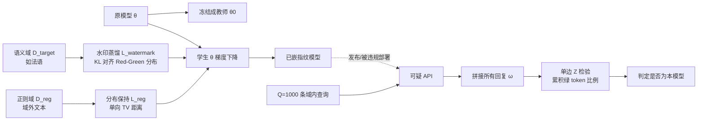

# LLM Fingerprinting via Semantically Conditioned Watermarks

**会议**: ICLR 2026  
**OpenReview**: [https://openreview.net/forum?id=t38nZqqi3Z](https://openreview.net/forum?id=t38nZqqi3Z)  
**代码**: 待确认  
**领域**: LLM 安全 / 模型版权保护  
**关键词**: 模型指纹, LLM 水印, 语义条件水印, 所有权验证, 鲁棒性, 隐蔽性  

## 一句话总结
把"固定 query-key 记忆式指纹"换成"在某个语义域（如法语）内扩散统计水印信号"的新指纹范式，使模型指纹首次同时做到对微调/量化/剪枝/对抗改写全鲁棒，且查询与回复都难以被部署方察觉。

## 研究背景与动机
**领域现状**：开源大模型训练成本高昂，模型所有者用限制性许可证（如禁止商用）发布权重，但第三方可能违反许可证私自部署。黑盒模型指纹（black-box fingerprinting）是证明所有权的主流手段——给模型植入特定"后门"，所有者用特定 query 探测，若模型吐出预设 key 即可主张所有权。

**现有痛点**：现有方法（如 Instructional Fingerprinting、Scalable Fingerprinting）依赖让模型**记忆**一小组固定的 query-key 对，并用非典型（atypical）的随机串作为 query/key 来控制误报率。这带来两个致命缺陷：(1) **不鲁棒**——记忆很脆弱，量化、剪枝、微调甚至换个 system prompt 就能让指纹检测率掉到 0；(2) **不隐蔽**——非典型的怪异 query/key 很容易被恶意部署方用过滤器识别并屏蔽。

**核心矛盾**：用非典型 query/key 是为了控制误报（正常模型不会偶然吐出怪异 key），但恰恰是这种"非典型"让指纹既脆又显；而依赖精确字符串匹配的检测，又让任何非对抗的小扰动都能破坏指纹。鲁棒性、隐蔽性、低误报三者难以兼得。

**本文目标**：设计一个在保持有效性（低误报 + 不损害效用）的同时，显著提升隐蔽性和鲁棒性的指纹。

**核心 idea**：**用"语义域"替代固定 query 集，用"统计水印信号"替代记忆 key**。具体地——让模型只在某个预定语义域（如所有法语 prompt）内对回复嵌入 LLM 水印信号，所有者用该域内的查询即可可靠检测、验证所有权。语义域抵抗输入扰动（扰动后仍在域内），统计信号随 token 数增强（可多次查询累积放大），从而同时获得隐蔽与鲁棒。

## 方法详解

### 整体框架
方法分嵌入与检测两阶段。**嵌入**：所有者冻结原模型作教师 $\theta_0$，在目标语义域数据 $D_\text{target}$ 上把生成时 Red-Green 水印**蒸馏**进学生模型 $\theta$，同时在域外正则数据 $D_\text{reg}$ 上保持分布不变。**检测**：所有者从语义域采样 $Q$ 条查询打到可疑 API，把所有回复拼接成一条长序列，对其做 Red-Green 水印的单边 Z 检验——拼接越长信号越强，因此可用任意多查询保证鲁棒检测。

### 关键设计

**1. 域内水印蒸馏：把生成时水印"焊进"模型权重**　开源权重场景下无法控制采样过程，因此生成时 Red-Green 水印不能直接用。本文借鉴 Gu et al. 的水印蒸馏思路，但**首次只在单一目标语义域**内蒸馏：在 $D_\text{target}$ 上最小化学生 $\theta$ 的 logits 分布与"教师 $\theta_0$ 之上叠加 Red-Green 水印后"的分布之间的 KL 散度，
$$L_\text{watermark}(\theta,\xi)(x)=\sum_{t=1}^{|x|}\mathrm{KL}\big(\text{Red-Green}(p_{\theta_0}(\cdot|x_{<t}),\xi),\,p_\theta(\cdot|x_{<t})\big).$$
其中 Red-Green 用私钥 $\xi$ 与前 $k$ 个 token 把词表伪随机分成 $\gamma|\Sigma|$ 个绿 token 与红 token，把绿 token 的 logits 抬高 $\delta$。蒸馏后，模型在法语回复里就会天然偏向绿 token，无需特殊采样即可携带水印。

**2. 域外分布保持：单向 TV 正则避免"全局染色"**　只在法语上嵌水印还不够，必须保证域外（其他语言/任务）行为不变，否则会损效用、引起部署方怀疑。难点在于 Red-Green 水印靠"把低概率 token 抬高 $\delta$"工作，会把本该罕见的 token 放大。为只惩罚这种"正向偏移"，本文定义一个仅计正偏差的总变差距离变体：
$$L_\text{reg}(\theta)(x)=\sum_{t=1}^{|x|}\max\big(p_\theta(\cdot|x_{<t})-p_{\theta_0}(\cdot|x_{<t}),\,0\big).$$
该项当且仅当 $\theta$ 在 $D_\text{reg}$ 上分布与 $\theta_0$ 一致时取最小，理论上良定义。总目标是两项加权 $\nabla_\theta l_\text{target}+\lambda\nabla_\theta l_\text{reg}$ 联合梯度下降；消融显示去掉正则会让基准准确率明显下降。

**3. 拼接累积的 Z 检验：让"弱信号 × 多查询"等于鲁棒**　检测继承现成水印检测器及其统计保证。对去重后的序列 $\omega$，用绿 token 比例 $\hat\gamma(\omega)$ 算 Z 分数：
$$Z(\omega)=\frac{\hat\gamma(\omega)-\gamma-\beta(\omega)}{\sqrt{\gamma(1-\gamma)/|\omega|}}.$$
零假设（未加水印）下 $Z$ 渐近标准正态；序列越长 $Z$ 越大、越易检出。**关键招式**：所有者发 $Q$ 条域内查询，把所有回复拼成一条长序列再做单边 Z 检验。即便单条回复因微调/对抗改写而信号微弱，1000 条拼接后信号被累积放大到足以稳定判定——这正是鲁棒性的来源：所有者可任意增大查询数。实验发现 1000 条查询（按 GPT5 定价约 \$0.20）即可完全鲁棒。

**4. 语义域选择：高熵保信号、受限保隐蔽**　语义域的选取需平衡两个相反要求：域内平均熵要高，模型回复才有足够多样性承载水印信号（低熵域需更多查询）；但域又要足够受限，避免针对性对抗者轻易猜出并检测指纹。主实验用"法语"作语义域，附录中还探索了用单 token 触发/关闭水印（如 `[WM]...[/WM]` 内文本才加水印）等扩展。

## 实验关键数据

### 主实验：有效性（FSR + 效用）
在 LLAMA3.2-1B / QWEN2.5-3B / LLAMA3.1-8B 三个指令模型上，用 Fingerprint Success Rate（FSR，5 次独立检测取平均）衡量。语义域为法语，检测用 $|Q|=1000$ 条查询。

| 模型 | 类型 | FSR | 平均基准准确率(AVG) | 法语基准(FB) |
|------|------|-----|--------------------|--------------|
| LLAMA3.2-1B | 原始 / 加指纹 | 0.0 / **1.0** | 0.42 / 0.42 | 0.38 / 0.37 |
| QWEN2.5-3B | 原始 / 加指纹 | 0.0 / **1.0** | 0.58 / 0.58 | 0.61 / 0.62 |
| LLAMA3.1-8B | 原始 / 加指纹 | 0.0 / **1.0** | 0.63 / 0.62 | 0.64 / 0.63 |

加指纹后 FSR 全为 1.0、原始模型全为 0.0（无误报），且 8 个基准（含法语 FB）准确率几乎无下降——验证了正则损失对效用的保护。

### 鲁棒性实验：对比 IF / SF（25 个部署场景 + 5 个针对性对抗）
LLAMA3.1-8B 下各方法 FSR（节选，1.0 为成功）：

| 部署场景 | IF | SF | Ours |
|----------|----|----|------|
| 剪枝 SparseGPT 50% | 0.0 | 0.0 | **1.0** |
| 量化 Int4 | 1.0 | 0.2 | **1.0** |
| 全量微调 Alpaca | 0.2 | 0.0 | **1.0** |
| LoRA 微调 Dolly | 0.6 | 0.0 | **1.0** |
| System Prompt "Advertise" | 1.0 | 0.0 | **1.0** |
| 输出回译对抗 | 1.0 | 0.0 | **1.0** |
| **法语域内微调(WildChatFr 全量)** | 0.4 | 0.0 | **1.0** |
| **去水印改写器(ADV)** | 1.0 | 0.0 | **1.0** |
| **英文预填充欺骗** | 1.0 | 0.0 | **1.0** |

本文方法是**唯一**对全部 25 个常见部署场景和 5 个针对性对抗均保持 FSR=1.0 的方法；IF/SF 在剪枝 50%、微调、SF 在多数对抗下普遍失效。

### 隐蔽性实验
用 GPT5-MINI 作判别器区分查询/回复是否用于指纹检测（FPR<3%）。IF 的 query 与 key 均被识别（不隐蔽）；本文方法与 SF 的查询完全检测不到、回复 recall 也很低——说明**用自然文本**作指纹是隐蔽性的关键。

### 关键发现
- 统计信号 + 拼接累积是鲁棒性根源：SF 用 1024 个 query-key 对仍敌不过量化，证明单纯扩大记忆数据集无效。
- 即便对抗者把回复改成英文（预填充/system prompt），只要输入仍在语义域内，回复就仍带（更弱的）水印，多查询累积后仍可检出。
- 去正则会显著损害效用，验证单向 TV 正则的必要性。

## 亮点与洞察
- **范式转换**：把"记忆-匹配"指纹换成"语义条件 + 统计信号"指纹，从根上解决脆性与显性两大顽疾，是模型指纹领域的思路升级。
- **首次实现语义条件水印**：把水印蒸馏限定到单一语义域而保持域外分布不变，这本身是一个有独立价值的技术贡献。
- **"信号可累积"的杠杆**：把检测能力从"单条回复"解耦到"任意多条拼接"，用极低成本（约 \$0.20）换来对抗鲁棒，设计优雅。
- 评测极其充分：3 模型 × 25 部署场景 × 5 针对性对抗，且都拿统一 FSR 指标对比。

## 局限与展望
- **依赖高熵语义域**：低熵域需要更多查询；且语义域要在"高熵保信号"与"受限保隐蔽"之间手动权衡，缺乏自动选域方法。
- **单语义域**：主实验只用法语，多域/可组合指纹（区分不同泄露源）尚未充分展开。
- **检测需 ~1000 次查询**：虽成本低，但相比 query-key 的少量探测，查询量级更大，且需 API 允许域内自然查询。
- **统计保证依赖 Red-Green 假设**：极端对抗（强力去水印 + 强迫脱离语义域）的边界仍待进一步刻画；timing-attack 等替代识别路径留作未来工作。

## 相关工作与启发
- **黑盒指纹基线**：Instructional Fingerprinting（Xu et al. 2024）、Scalable Fingerprinting（Nasery et al. 2025）——均为 query-key 记忆式，本文主要对比对象。
- **白盒指纹**：基于权重/激活，鲁棒但需访问权重，实用受限。
- **LLM 水印**：Red-Green 水印（Kirchenbauer et al. 2023）是信号基石；水印蒸馏到开源模型（Gu et al. 2024）是嵌入技术来源。
- **启发**：该工作示范了"把脆弱的精确匹配换成可累积的统计检验"这一通用思路，可迁移到数据集水印、Agent 行为溯源等需要在不可控部署下做所有权/来源验证的场景。

## 评分
- **新颖性**: ⭐⭐⭐⭐⭐ 提出全新指纹范式 + 首次实现语义条件水印，思路转换干净彻底。
- **实验充分度**: ⭐⭐⭐⭐⭐ 3 模型 × 25 部署 × 5 对抗 × 隐蔽性判别，统一指标，对比详尽。
- **写作质量**: ⭐⭐⭐⭐ 动机—矛盾—方法—验证逻辑清晰，公式与算法表述规范。
- **价值**: ⭐⭐⭐⭐ 直击开源模型版权保护刚需，方法低成本可落地，对抗鲁棒性强。

<!-- RELATED:START -->

## 相关论文

- [\[ICLR 2026\] Hey, That's My Model! Introducing Chain & Hash, An LLM Fingerprinting Technique](hey_thats_my_model_introducing_chain_hash_an_llm_fingerprinting_technique.md)
- [\[AAAI 2026\] iSeal: Encrypted Fingerprinting for Reliable LLM Ownership Verification](../../AAAI2026/llm_safety/iseal_encrypted_fingerprinting_for_reliable_llm_ownership_verification.md)
- [\[ICLR 2026\] In-Context Watermarks for Large Language Models](in-context_watermarks_for_large_language_models.md)
- [\[ACL 2026\] Topic-Based Watermarks for Large Language Models](../../ACL2026/llm_safety/topic-based_watermarks_for_large_language_models.md)
- [\[ACL 2025\] Can LLM Watermarks Robustly Prevent Unauthorized Knowledge Distillation?](../../ACL2025/llm_safety/llm_watermark_distillation_robustness.md)

<!-- RELATED:END -->
