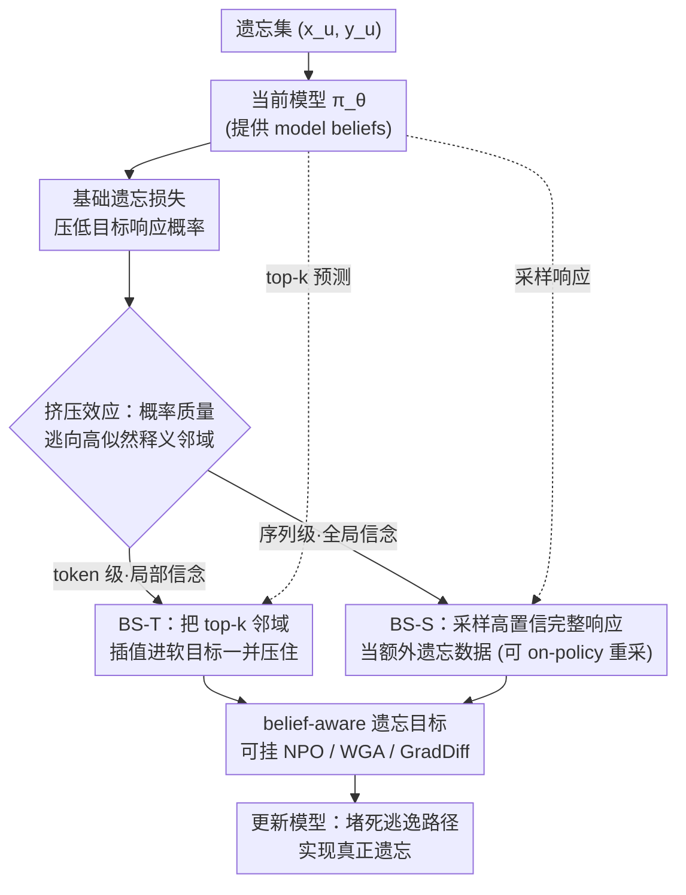

# LLM Unlearning with LLM Beliefs

**会议**: ICLR 2026  
**arXiv**: [2510.19422](https://arxiv.org/abs/2510.19422)  
**代码**: [OpenUnlearning](https://github.com/locuslab/openunlearning)  
**领域**: LLM评测  
**关键词**: LLM遗忘, 梯度上升, 挤压效应, Bootstrapping, 模型信念

## 一句话总结

揭示GA/NPO等LLM遗忘方法存在"挤压效应"(squeezing effect)——降低目标响应概率后概率质量转移到语义相关的高似然区域导致虚假遗忘，提出基于Bootstrapping的框架，利用模型自身高置信度预测(model beliefs)作为额外遗忘目标，BS-T(token级)和BS-S(序列级)两种实现在TOFU/MUSE/WMDP多个基准上实现更彻底的遗忘且保持模型效用。

## 研究背景与动机

**LLM遗忘的必要性**：大语言模型在海量语料上训练，不可避免地记忆了敏感、有害或侵权内容，部署时存在隐私泄露和有害信息输出风险。LLM遗忘(unlearning)旨在通过后处理参数调整，直接从模型中移除这些有害知识，比内容检测器或上下文防御更不容易被绕过。

**主流方法及其局限**：当前主流方法基于梯度上升(GA)及其变体（NPO、WGA、GradDiff），通过最大化目标响应的负对数似然来降低其生成概率。但GA往往严重损害模型整体性能，后续改进如NPO（实例级重加权）和WGA（token级重加权）虽有提升，仍存在根本性问题。

**虚假遗忘现象**：作者发现GA系列方法看似成功降低了目标响应概率，但模型仍会生成语义相关的释义(paraphrases)保留原始知识——即"虚假遗忘"(spurious unlearning)。例如NPO在TOFU上指标很低（Probability 0.06, ROUGE-L 0.20），但生成内容仍保留关键信息如"English"。

**评估指标的误导性**：ROUGE、困惑度、Truth Ratio等广泛使用的指标无法检测虚假遗忘，错误地报告了遗忘成功。这意味着现有文献中报告的"成功"遗忘可能相当一部分是虚假的，暴露了整个领域的评估危机。

**挤压效应的根本原因**：softmax归一化约束条件概率总和为1，当GA降低目标 $\pi_\theta(\mathbf{y}_u|\mathbf{x}_u)$ 时，概率质量不可避免地被重新分配到其他候选响应，且集中流向高似然区域——而这些区域恰好对应语义相关的释义。这就是"挤压效应"(squeezing effect)。

**研究切入点**：概率质量"逃逸"到的位置恰好是模型自身最有信心的预测——即model beliefs。如果不仅压制原始目标，还同时压制这些高置信度预测，就能阻断概率质量的逃逸路径，实现真正的遗忘。这也是bootstrapping框架的核心直觉。

## 方法详解

### 整体框架

本文针对 GA/NPO 的"虚假遗忘"——目标概率压下去了、模型却仍能生成保留原知识的释义——提出 Bootstrapping 框架。核心直觉是 softmax 归一化让被压下的概率质量"挤"向语义相邻的高似然区域，而那里恰好是模型自己最有信心的预测（model beliefs），于是干脆把这些预测一并压住、堵死逃逸路径。框架分两条腿：token 级 BS-T 每步压住 top-k 邻域，序列级 BS-S 把采样出的完整高置信度响应当额外遗忘数据，两者都能挂在任意现有遗忘损失上。

形式化地，给定遗忘集 $\mathcal{D}_u = \{(\mathbf{x}_u, \mathbf{y}_u)\}$ 和保留集 $\mathcal{D}_r$，目标是让模型对 $\mathcal{D}_u$ 及其释义的似然降低（遗忘），同时对 $\mathcal{D}_r$ 的输出分布贴近原模型（保留）。

### 关键设计

**1. 挤压效应的诊断：先证明虚假遗忘是机制必然，不是个例**

针对"GA 系方法到底为什么会留下释义"，作者用两个互补实验把挤压效应坐实。一是语义相似度分布：用 beam search 从原模型采样，按概率分为高/中/低似然三组，再用 LLM-as-Judge 评相似度，发现高似然组与原始目标最相似，且 NPO 遗忘后高似然组的生成仍高度相似。二是概率动态追踪：训练过程中追踪各组的对数概率变化，GA 和 NPO 都是先抬高高似然组概率再缓慢下降——GA 因过度更新最终崩溃，NPO 则一直维持这种挤压。两个实验合起来指明：被压出的概率质量没有消失，而是稳定逃逸到了高似然的释义邻域。

**2. BS-T（token 级 bootstrapping）：不只压目标 token，连它的 top-k 邻域一起压**

诊断指明逃逸口在 top-k 高概率邻域，BS-T 就把遗忘目标从 one-hot 扩展到这个邻域。它把模型当前的 top-k 分布和原始 one-hot 目标插值，构造一个软目标：

$$\mathbf{t}_u^i = \lambda_{\text{BST}} \cdot \text{sg}\left[\pi_\theta(\cdot|\mathbf{x}_u, \mathbf{y}_u^{<i})\big|_{\mathcal{H}_k^{(i)}}\right] + (1-\lambda_{\text{BST}}) \cdot \mathbf{e}_{y_u^i}$$

其中 $\mathcal{H}_k^{(i)} = \text{Top-}k(\pi_\theta(\cdot|\mathbf{x}_u, \mathbf{y}_u^{<i}))$ 是位置 $i$ 的 top-k 高似然 token 集合，$\text{sg}$ 是 stop-gradient 算子，$\lambda_{\text{BST}}$ 控制邻域惩罚强度。损失就是对这个软目标做 GA：

$$\mathcal{L}_{\text{BST}}(\theta; \mathcal{D}_u) = \mathbb{E}_{\mathcal{D}_u}\left[\sum_{i=1}^{|\mathbf{y}_u|} \langle \mathbf{t}_u^i, \log\pi_\theta(\cdot|\mathbf{x}_u, \mathbf{y}_u^{<i})\rangle\right]$$

有三个要点值得注意：stop-gradient 阻止梯度经模型预测回传，避免训练发散；机制形式上像自蒸馏，但目的完全相反——不是强化知识而是擦除知识；邻域的宽窄还可以用温度来调。

**3. BS-S（序列级 bootstrapping）：token 级堵不住完整续写，就把整条采样响应当遗忘数据**

BS-T 是逐位置压邻域，但一条完整的有害续写仍可能整体重现。BS-S 直接从当前模型采样 $N$ 条高置信度完整响应，把它们当作额外遗忘数据：

$$\hat{\mathcal{D}}_u = \{(\mathbf{x}_u, \hat{\mathbf{y}}_u^{(j)})\}_{j=1}^N, \quad \hat{\mathbf{y}}_u^{(j)} \sim \pi_\theta(\cdot|\mathbf{x}_u)$$

再与原遗忘损失加权混合：

$$\mathcal{L}_{\text{BSS}} = (1-\lambda_{\text{BSS}}) \mathcal{L}(\theta; \mathcal{D}_u) + \lambda_{\text{BSS}} \mathcal{L}(\theta; \hat{\mathcal{D}}_u)$$

这里的 $\mathcal{L}$ 可以是任意遗忘损失（GA、NPO、BS-T），采样既能 off-policy（训练前一次性采好）也能 on-policy（训练中定期重采样），后者跟着模型实时演化、覆盖更全。

**4. 理论分析：用残差结构说明 BS-T 为什么能堵住新峰值**

基于 AKG 学习动态框架，作者比较两种损失在更新时的残差。GA 的残差 $\mathcal{G}_{\text{GA}}^i = \pi^i - \mathbf{e}_{y_u^i}$ 只在目标 token 方向施压，被挤出的质量于是在邻域形成新峰值；BS-T 的残差 $\mathcal{G}_{\text{BST}}^i[v] = \mathcal{G}_{\text{GA}}^i[v] - \lambda \mathbf{q}^i[v]$ 则额外在 top-k 邻域方向施加排斥力，相当于一只手按住目标、另一只手按住邻域，从源头阻止新峰值形成——这与概率动态实验里 BS 曲线单调下降的观察正好对上。

下表把四个设计的目的与机制汇总在一起：

| 设计 | 目的 | 机制 |
|------|------|------|
| 软目标混合 | 扩展遗忘范围到高概率邻域 | one-hot + top-k分布插值 |
| Stop-gradient | 训练稳定性 | 阻止梯度通过模型预测回传 |
| 序列级采样 | 覆盖完整有害续写 | 从模型采样高置信度响应 |
| 与现有目标兼容 | 通用性 | 可与NPO/WGA/GradDiff组合 |

## 实验结果

### 表1：TOFU基准（Llama 3系列，10%遗忘设置，含保留正则化）

| 方法 | **1B** Agg.↑ | Mem.↑ | Util.↑ | **3B** Agg.↑ | Mem.↑ | Util.↑ | **8B** Agg.↑ | Mem.↑ | Util.↑ |
|------|:---:|:---:|:---:|:---:|:---:|:---:|:---:|:---:|:---:|
| Retrain | 0.64 | 0.58 | 0.71 | 0.65 | 0.57 | 0.75 | 0.65 | 0.57 | 0.75 |
| GradDiff | 0.52 | 0.49 | 0.56 | 0.49 | 0.47 | 0.52 | 0.50 | 0.45 | 0.55 |
| NPO | 0.58 | 0.58 | 0.58 | 0.62 | 0.58 | 0.66 | 0.63 | 0.57 | 0.70 |
| RMU | 0.58 | 0.59 | 0.57 | 0.55 | 0.44 | 0.74 | 0.62 | 0.55 | 0.72 |
| SimNPO | 0.47 | 0.35 | 0.70 | 0.41 | 0.28 | 0.74 | 0.29 | 0.18 | 0.72 |
| WGA | 0.53 | 0.47 | 0.62 | 0.51 | 0.42 | 0.66 | 0.52 | 0.41 | 0.70 |
| **BS-T** | 0.59 | 0.56 | 0.62 | 0.62 | 0.56 | 0.68 | 0.63 | 0.57 | 0.70 |
| **BS-S** | **0.61** | **0.59** | **0.63** | **0.63** | **0.58** | **0.70** | **0.64** | **0.58** | **0.71** |

### 表2：WMDP基准（Zephyr-7B-β）

| 方法 | Bio↓ | Cyber↓ | MMLU↑ |
|------|:---:|:---:|:---:|
| Original | 0.64 | 0.45 | 0.58 |
| GradDiff | 0.27 | 0.28 | 0.43 |
| NPO | 0.27 | 0.30 | 0.44 |
| RMU | 0.29 | 0.27 | **0.55** |
| **BS-T** | **0.26** | 0.28 | 0.52 |
| **BS-S** | **0.26** | **0.27** | 0.54 |

### 表3：MUSE-News基准（Llama 2 7B-Chat）

| 方法 | VerbMem↓ | KnowMem↓ | UtilPres↑ |
|------|:---:|:---:|:---:|
| Retrain | 0.2016 | 0.3170 | 0.5602 |
| NPO | 0.2914 | 0.3290 | 0.4651 |
| RMU | 0.3861 | 0.5088 | 0.4962 |
| **BS-T** | 0.2837 | 0.3278 | 0.4602 |
| **BS-S** | **0.2713** | **0.3250** | 0.4774 |

## 关键发现

1. **虚假遗忘是系统性问题而非个例**：通过LLM-as-Judge评估发现，NPO在TOFU上的高似然区域生成与原始目标的语义相似度仅略低于高似然释义、远高于中似然区域，说明虚假遗忘是NPO的系统性结果，不是某些样本的偶然失败。

2. **概率质量持续挤压到高似然区域**：GA和NPO训练过程中，高似然组的对数概率先上升后（GA最终崩溃，NPO则持续维持），证实"挤压效应"不仅存在而且持续。GA通过破坏整个模型来"逃避"这个问题，NPO则一直维持虚假遗忘状态。

3. **BS-T和BS-S单调抑制高似然区域概率**：BS的概率动态曲线显示目标和高似然邻域的概率都单调下降，直接证实BS框架有效缓解了挤压效应。LaaJ评估也显示BS在Naturalness和Similarity两个维度都优于baseline。

4. **BS-S的序列级补充效果显著**：消融实验表明，BS-S中使用BS-T作为底层损失时效果最好（Agg. 0.64），且BS-S框架对不同底层损失（GA/NPO/WGA）都能带来提升，验证了序列级bootstrapping的通用有效性。

5. **传统评估指标的不可靠性**：GA导致模型输出崩溃为无意义重复（如反复"always"），ROUGE等指标报告为~0（看似完美遗忘），但实际上模型完全不可用。这暴露了LLM遗忘领域长期依赖的评估体系存在根本缺陷。

## 亮点与创新

- **挤压效应的发现与命名**：将softmax归一化导致的概率质量转移现象精准命名为"squeezing effect"，提供了GA系方法虚假遗忘的统一机制解释——简洁、有力、可验证。
- **Model Beliefs的巧妙利用**：模型自身最有信心的预测恰好是概率质量会"逃逸"到的位置，因此"用模型信念对抗模型信念"是一个优美的闭环设计。
- **LaaJ评估的引入**：提出Naturalness和Similarity两个维度的LLM-as-Judge评估，比传统指标更贴合人类判断，有望成为LLM遗忘领域的标准评估工具。
- **理论与实践统一**：通过AKG学习动态框架证明BS-T如何重塑残差结构，理论分析与实验观察高度一致。

## 局限性

- **超参数敏感性**：BS-T对 $\lambda_{\text{BST}}$ 敏感，BS-S对 $\lambda_{\text{BSS}}$ 敏感，需要逐数据集和模型调参。自动化调度器尚未开发。
- **BS-S计算开销**：需要从模型采样多轮完整响应作为额外遗忘数据，N>5时单卡80G GPU已OOM。
- **on-policy BS-S缺乏理论支撑**：AKG框架仅适用于off-policy设定，on-policy情况下采样分布依赖参数，无法用固定数据假设推导。
- **模型规模限制**：仅在1B-8B模型上验证，对更大规模模型（70B+）的适用性未知。
- **单轮对话设定**：未考虑多轮对话中隐含知识泄露或通过提示工程绕过遗忘的场景。

## 相关工作对比

| 维度 | **本文 (BS-T/BS-S)** | **NPO (Zhang et al., 2024)** | **WGA (Wang et al., 2025b)** |
|------|------|------|------|
| 核心机制 | 压制目标+模型高置信度预测 | 实例级DPO式重加权GA | Token级加权GA |
| 是否解决挤压效应 | ✅ 直接对抗高似然邻域 | ❌ 仅重加权但不扩展遗忘范围 | ❌ 仅平衡token贡献 |
| 遗忘粒度 | Token级 + 序列级 | 实例级 | Token级 |
| 虚假遗忘 | 有效缓解 | 持续存在（Case 2） | 未明确解决 |
| 理论基础 | AKG残差分析 | DPO启发式 | GA条件token形式 |
| 计算开销 | BS-T轻量，BS-S中等 | 轻量 | 轻量 |
| TOFU-10% 1B Agg. | *0.61 (BS-S)* | 0.58 | 0.53 |

## 评分

- **新颖性**: ⭐⭐⭐⭐⭐ — 挤压效应的发现+model beliefs视角+bootstrapping框架设计都极具洞察力
- **实验充分度**: ⭐⭐⭐⭐⭐ — TOFU/MUSE/WMDP×3个模型族×多种设置，LaaJ+传统指标双评估，消融全面
- **写作质量**: ⭐⭐⭐⭐⭐ — 动机→诊断→方案→理论→实验的逻辑链环环相扣，图表精美
- **实用价值**: ⭐⭐⭐⭐⭐ — 代码已合并至OpenUnlearning，与现有方法兼容，对LLM遗忘领域的方法和评估都有根本性影响

<!-- RELATED:START -->

## 相关论文

- [\[ICLR 2026\] Explainable LLM Unlearning through Reasoning](explainable_llm_unlearning_through_reasoning.md)
- [\[ICLR 2026\] Robust LLM Unlearning via Post Judgment and Multi-Round Thinking](robust_llm_unlearning_via_post_judgment_and_multi-round_thinking.md)
- [\[ICLR 2026\] Downgrade to Upgrade: Optimizer Simplification Enhances Robustness in LLM Unlearning](downgrade_to_upgrade_optimizer_simplification_enhances_robustness_in_llm_unlearn.md)
- [\[ACL 2026\] Representation-Guided Parameter-Efficient LLM Unlearning](../../ACL2026/llm_safety/representation-guided_parameter-efficient_llm_unlearning.md)
- [\[ICLR 2026\] Randomized Antipodal Search Done Right for Data Pareto Improvement of LLM Unlearning](randomized_antipodal_search_done_right_for_data_pareto_improvement_of_llm_unlear.md)

<!-- RELATED:END -->
