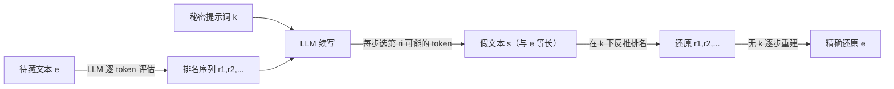

# LLMs Can Hide Text in Other Text of the Same Length

**会议**: ICLR 2026  
**代码**: https://github.com/noranta4/calgacus  
**领域**: LLM 安全 / 生成式隐写  
**关键词**: 隐写术, 生成式隐写, 等长隐藏, LLM 对齐, 否认性, AI 安全  

## 一句话总结
一篇用 LLM token 排名做"等长隐写"的论文：把任意一段有意义的文本，编码进另一段风格可控、同样长度、读起来同样自然的假文本里，任何持有密钥的人都能精确还原——并由此论证"文本与作者意图的彻底解耦"，给 AI 安全敲响警钟。

## 研究背景与动机
- **领域现状**：隐写术（steganography）追求的是"隐藏消息本身的存在"，区别于只保证"难以破解"的密码学。生成式隐写（generative steganography）近年随生成模型兴起，直接从密文生成载体文本，而非在已有载体上做微调。基于 LLM 的隐写也已有多种方案：Meteor 按 token 熵动态调整编码比特，Wu et al. 支持黑盒 LLM，Zamir 在不改变响应分布的前提下编码。
- **现有痛点**：以往的 LLM 隐写方案普遍存在"容量与隐蔽性的权衡"——要么隐藏的消息远短于生成的载体文本（低容量），要么为了塞进更多比特而牺牲文本自然度。没有方案能做到载体文本与隐藏消息**严格等长**。
- **核心矛盾**：当假文本和真文本**字数（token 数）完全相同**时，人无法仅凭"哪段更长/更啰嗦"来判断哪段是真的——这种对称性把"是否存在隐藏消息"的判断推向了不可能。
- **本文目标**：给出一个简单、高效、可在笔记本上秒级运行的协议，实现等长（full capacity）的文本隐写，并深入讨论它对"文本可信度""LLM 是否真的'知道'某件事""AI 对齐"的冲击。
- **核心 idea**：**[排名复用]** 不直接编码 token，而是编码每个 token 在 LLM 概率分布里的**排名（rank）**；解码时用相同 LLM、相同排名序列倒推回原文。**[等长对称]** 因为载体和原文逐 token 对应，长度天然一致。

## 方法详解

### 整体框架
方法 Calgacus 异常简单，可概括为"用排名当桥梁"：编码端把要隐藏的文本 $e$ 在 LLM 下逐 token 记录排名序列 $r_1,r_2,\dots$，再换一个秘密提示词 $k$ 让 LLM 续写，但每一步不采样、而是强制选"第 $r_i$ 可能"的 token，拼出假文本 $s$；解码端拿 $s$ 在 $k$ 下反推出同一串排名，再无 $k$ 地逐步还原 $e$。整个过程只需要一个能拿到完整 logits 的 LLM、一段待藏文本 $e$、一个秘密提示词 $k$。

### 关键设计

**1. 排名而非概率：把"内容"翻译成"位次"。** 协议的支点是用排名 $r_i$ 而不是 token 本身来承载信息。对要隐藏的文本 $e=(e_1,e_2,\dots)$，在 LLM 给定前缀 $e_1,\dots,e_{i-1}$ 的分布里，记下 $e_i$ 排在第几位，得到排名序列。生成假文本时，换上秘密提示 $k$ 让 LLM 自由续写，但每一步不按概率采样，而是固定取"第 $r_i$ 高概率"的 token。直觉很关键：当 $e$ 本身是通顺文本时，LLM 大概率猜得中，排名普遍偏低（多为 1、2、3），于是生成 $s$ 时被强制选的也都是高概率 token，$s$ 自然就读起来通顺。反过来，若 $e$ 难以预测（如哈希串 `1f0ca711...`），排名飙高，$s$ 就退化成 gibberish。这条"$e$ 越通顺 → 排名越低 → $s$ 越自然"的链条，是整个方法可用性的根基。

**2. 等长对称与可控性：长度锁死、风格可调。** 因为 $s$ 与 $e$ 是逐 token 一一对应生成的，二者在 LLM token 计数下**严格等长**，这正是论文标题"same length"的来源，也是隐蔽性的核心——把真假两段文本并排放，长度一样、都通顺，无法第一眼判定谁真谁假。与此同时，秘密提示 $k$ 决定了 $s$ 的话题、语气和风格（一条赞美凯撒的推文、一篇 VR 游戏测评），实现"内容被锁、外观可塑"。论文还给出增强变体：在 $e$ 前再加一段秘密提示 $k'$，能进一步压低排名、让 $s$ 更可控，代价是密钥变长、且 $k'$ 对脱离其语境的新 $e$ 不再通用。

**3. 可证质量度量与"低熵浪费"现象。** 为量化假文本质量，论文用"soundness"（符号排列的合理度）作为意义的代理，即 LLM 给整段文本的累积概率 $p(A)=\prod_{t=1}^{n} p(a_t\mid a_1,\dots,a_{t-1})$；由于该定义对长度敏感，只用于**等长**文本间的相对比较。实验发现一个反直觉现象：尽管排名被完整保留，$s$ 的概率系统性地略低于原文 $e$。原因是"低熵 token 选择被浪费"——在原文里某些位置（如"Gaius Julius __"几乎必然是"Caesar"）LLM 给 rank-1 高达 95%，但在 $s$ 里某位置是否落到 rank-1 只取决于 $e$ 抽出的排名（rank-1 出现频率约 40%），于是大量"本该高概率"的 rank-1 机会被分配到了高熵位置上，整体拉低了 $s$ 的概率。这一缺口正是"LLM 能区分真假、人却不能"的来源。

**4. 安全性与否认性：密钥保密 + 强制下的可抵赖。** 协议的安全建立在密钥 $k$（及所用 LLM）的保密上。攻击者即便知道用了本协议、也知道 LLM，仍需猜出 $k$，暴力搜索的上界是 $O(d^{|k|})$（$d\approx$ 10 万词表，$|k|$ 为 $k$ 的 token 数），实践不可行；虽然 $s$ 会泄露一些关于 $k$ 的线索（$k$ 多为自然语言指令），但在 $k$ 里塞一小段随机字符串即可堵死这种缩小搜索空间的攻击。更妙的是**否认性（deniability）**：即便攻击者试对了某个 $k$，也无法确认对应的 $e$ 就是真消息——因为有些提示生成的 $s$ 概率能与真 $e$ 比肩，发送者在被胁迫时可拿出这样一个"幌子密钥"，交出一段貌似合理却无关紧要的假消息，从而在强制下仍保护真正的秘密。

## 实验关键数据

### 主实验（假文本是否落在真文本分布内）
- 用 **Llama 3 8B** 评估概率；取 **1000 条 Reddit** 帖子/评论作为真文本（截断到精确 85 token，且发布时间晚于 Llama 3，不在训练集）。
- 从中取分布上 $\mu$、$\mu-2\sigma$、$\mu+2\sigma$ 三条真文本，每条用本方法（密钥取自公开 prompt 集的随机子集）生成 **100 条**假文本。

| 文本类型 | LLM 累积 log 概率位置 |
|---|---|
| 1000 条真 Reddit 文本 | 大范围分布（基准区间） |
| 随机 ASCII 字符串 | 落在区间外（明显不自然） |
| 随机英文单词序列 | 落在区间外 |
| **本方法生成的假文本 $s$** | **落在真文本分布内** |
| 被隐藏的原文 $e$ | 仍比 $s$ 略高 |

### 消融 / 分析实验

| 分析 | 数据/现象 |
|---|---|
| 跨模型可分性 | 换用 **Phi-3 3.8B** 评估，真/假文本同样出现概率位移，结论稳健 |
| 排名频率分析 | 1.3k token 的《经济学人》文章：约 40% 的 token 是 LLM 的 rank-1 首选；rank-1 贡献了真假概率落差的大头 |
| 失败案例 | 隐藏哈希串 → $s$ 退化为 gibberish（排名过高） |
| 效率 | 与摘要等长的一段消息可在普通笔记本上**秒级**编/解码，甚至手机端可复现 demo |

### 关键发现
- 对**人**而言，真文本和假文本都同样自然、等长，无法区分；
- 对 **LLM** 而言，多数情况下能通过"挑概率最高那段"区分真假，但**并非全部**——存在概率与原文比肩的离群提示，这恰恰构成了否认性的基础；
- 仅 8B 量级的开源 LLM 就足以得到高质量结果。

## 亮点与洞察
- **"排名复用"是优雅的一招**：把信息从"选哪个 token"挪到"选第几名"，一举锁死长度、保住自然度，方法简单到能写成一份菜谱。
- **full capacity（等长）是真正的新意**：相比以往 LLM 隐写在容量/隐蔽性间妥协，等长对称让"是否存在隐藏消息"的判定在视觉上彻底失效。
- **把技术上升到哲学与安全**：论文借此提出"文本与作者意图的彻底解耦"，并给出一个具体且骇人的应用——AI 公司可把**未对齐**模型的回答编码进**对齐**模型的合规回复里偷偷下发，挑战了"对齐"的有效性本身。
- **否认性的论证很扎实**：把"假文本偶尔概率比肩真文本"这一看似缺陷的现象，反转成强制胁迫下保护发送者的安全特性。

## 局限与展望
- **质量不保证**：$s$ 是否通顺/可控取决于 $e$、$k$ 和所用 LLM；难预测的 $e$（如哈希）会产出 gibberish。
- **可被 LLM 检测**：在聚合意义上原文概率高于假文本，掌握同款 LLM 的检测方可据此甄别（否认性只在离群情形成立）。
- **收发端强一致性要求**：发送方与接收方必须在完全相同条件下运行同一 LLM、得到逐位一致的 logits，不同 GPU 架构的数值近似差异可能导致解码失败。
- **截断问题**：消息结束时 $s$ 可能戛然而止，需要追加少量 padding token 才能自然收尾。
- **安全性缺乏形式化保证**：论文明确拒绝套用理想化的形式隐写模型，安全性论证偏经验/定性，"用 $s$ 线索缩小 $k$ 搜索空间"的可行性仍是开放问题。

## 相关工作与启发
- **生成式隐写**（Liu 2018, Wei 2022, Kim 2023, Zhu 2024, Wu 2024, Tang 2025）：直接从密文生成载体，本文属此脉络但首次做到严格等长。
- **LLM 隐写**：Ziegler 2019（最早的 LLM 隐写）、Meteor（Kaptchuk 2021，按熵调比特）、Wu 2024（黑盒）、Zamir 2024（不改响应分布）——本文的差异化卖点是 full capacity。
- **形式化隐写模型**：Cachin 1998（假设检验框架）等因理想化假设难以实用，启发本文转向"用 LLM 概率度量 soundness"的务实路线。
- **否认加密**（Canetti 1997）：本文把否认性概念迁移到 LLM 隐写，提供胁迫下的发送者安全。
- **启发**：这项工作把"LLM 是否真的知道某件事""文本可信度""对齐能否被绕过"三条线索串在一起，对 AI 安全检测（如何识别被编码的未对齐输出）和数字内容溯源都提出了新课题。

## 评分
- 新颖性: ⭐⭐⭐⭐⭐ —— "排名复用"实现严格等长隐写是一个简单却前所未见的点子，并把它推到"文本与意图解耦"的高度。
- 实验充分度: ⭐⭐⭐ —— 核心验证（分布落点、跨模型可分、排名频率分析）到位且清晰，但规模偏小、缺乏与其他 LLM 隐写方法的定量对标。
- 写作质量: ⭐⭐⭐⭐⭐ —— 行文极具可读性，从菜谱式方法到哲学/安全讨论层层递进，例子（凯撒、罗马演说、烤野猪食谱）生动。
- 价值: ⭐⭐⭐⭐⭐ —— 对 AI 安全（未对齐模型伪装成对齐模型）、内容可信度与审查规避都有直接且深远的影响。

<!-- RELATED:START -->

## 相关论文

- [\[ICLR 2026\] Secret-Protected Evolution for Differentially Private Synthetic Text Generation](secret-protected_evolution_for_differentially_private_synthetic_text_generation.md)
- [\[ICLR 2026\] From Static Benchmarks to Dynamic Protocol: Agent-Centric Text Anomaly Detection for Evaluating LLM Reasoning](from_static_benchmarks_to_dynamic_protocol_agent-centric_text_anomaly_detection_.md)
- [\[ICLR 2026\] Erase or Hide? Suppressing Spurious Unlearning Neurons for Robust Unlearning](erase_or_hide_suppressing_spurious_unlearning_neurons_for_robust_unlearning.md)
- [\[ICLR 2026\] Strategic Dishonesty Can Undermine AI Safety Evaluations of Frontier LLMs](strategic_dishonesty_can_undermine_ai_safety_evaluations_of_frontier_llms.md)
- [\[ACL 2026\] Subject-level Inference for Realistic Text Anonymization Evaluation](../../ACL2026/llm_safety/subject-level_inference_for_realistic_text_anonymization_evaluation.md)

<!-- RELATED:END -->
