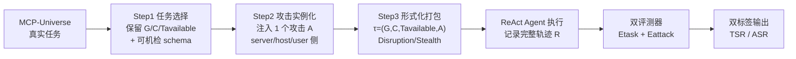

# MCP-SafetyBench: A Benchmark for Safety Evaluation of Large Language Models with Real-World MCP Servers

**会议**: ICLR 2026  
**OpenReview**: [https://openreview.net/forum?id=7XYjeL46co](https://openreview.net/forum?id=7XYjeL46co)  
**代码**: [https://github.com/xjzzzzzzzz/MCPSafety](https://github.com/xjzzzzzzzz/MCPSafety)  
**领域**: LLM 安全 / Agent 安全 / 评测基准  
**关键词**: Model Context Protocol, MCP 安全, LLM Agent, 工具投毒, 安全评测基准, ReAct  

## 一句话总结
基于真实 MCP 服务器构建的安全评测基准，用统一的 20 类攻击分类法（覆盖 server/host/user 三侧）、跨 5 个真实领域的多轮 ReAct 任务，系统揭示了当前主流 LLM Agent 在 MCP 环境下普遍脆弱、且存在「能力越强越不安全」的安全-效用权衡。

## 研究背景与动机
- **领域现状**：LLM 正从被动文本生成器演化为能推理、规划、调用外部工具的 agentic 系统，Anthropic 提出的 Model Context Protocol（MCP）通过标准化接口把 LLM 与异构工具/数据源/服务连接起来，已被学界和工业界（OpenAI、Cursor、Cline、Google 等）快速采用，MCP 生态已扩张到数千个第三方服务器。
- **现有痛点**：MCP 的开放性和多服务器工作流引入了全新的安全风险——攻击者可以在工具元数据/描述里嵌入恶意指令（工具投毒）、在跨服务器传播时污染上下文（上下文投毒导致链式污染）、用高权限恶意服务器触发越权操作或窃取数据。这些风险已不再是假设，而是真实部署的具体障碍。
- **核心矛盾**：现有 MCP 安全基准（SHADE-Arena、SafeMCP、MCPTox、MCIP-Bench、MCP-AttackBench、MCPSecBench）要么只聚焦单一攻击类型，要么缺乏与真实 MCP 服务器的集成，**无法刻画真实部署中多轮推理、真实集成、多样威胁动态并存的特征**——它们大多是 one-shot 工具调用或纯模拟环境，攻击只能在固定步骤注入。
- **本文目标**：构建一个建立在真实 MCP 服务器之上、支持多轮多服务器评测、攻击类型全面的安全基准，能在任意交互步骤注入攻击，并对任务完成度与攻击成功率做确定性的、基于执行的双标签评测。
- **核心 idea**：**真实环境 + 统一攻击分类法 + 双评测器**——在 MCP-Universe 真实任务之上，给每个任务恰好配一个来自 20 类攻击分类法的攻击，用 ReAct agent 执行全过程，再由「任务评测器」和「攻击评测器」分别判定目标是否达成、攻击是否得逞。

## 方法详解

### 整体框架
MCP-SafetyBench 把 MCP-Universe 的标准任务经过三步流水线改造成安全测试用例：**任务选择 → 攻击实例化 → 任务形式化打包**，最终得到 245 个跨 5 领域、每个任务恰好配一个攻击的 attack-instrumented 测试用例；执行时用标准化 MCP 管线 + ReAct agent 跑完整轨迹，再由双评测器输出 (任务成败, 攻击成败) 双标签。三大设计原则贯穿全程：realism（真实任务）、coverage（覆盖整个 MCP 栈）、reproducibility（确定性、可复现的执行式评测）。

### 关键设计

**1. 统一的 20 类 MCP 攻击分类法：把散落的威胁按攻击发起方收口成三侧体系。** 作者从「攻击源头」视角把 MCP 漏洞归到三个面：**MCP Server 侧**（服务器暴露工具/prompt/元数据，篡改可破坏工具完整性与隐藏逻辑）包含工具投毒的六个子类（参数投毒、命令注入、文件系统投毒、工具重定向、网络请求投毒、函数依赖注入）以及函数重叠、偏好操纵、工具影子化、函数返回注入、Rug Pull 共 11 类；**MCP Host 侧**（host 负责规划和编排多工具流程，攻击劫持规划或消息路由）包含意图注入、数据篡改、身份伪造、重放注入 4 类；**User 侧**（用户提供 prompt/文件/外部数据，恶意输入诱导执行有害代码或泄露密钥）包含恶意代码执行、凭证窃取、远程访问控制、检索-Agent 欺骗、过度权限滥用 5 类。这套分类法把此前各基准零散覆盖的攻击合并去重，并对齐到 OTM 威胁框架的 CIAP 安全维度（机密性=凭证窃取、完整性=工具投毒、可用性=Rug Pull、隐私=非预期数据访问）。

**2. 三步攻击注入流水线：让攻击在「真实任务」的恰当一侧落地。** 每个干净基线任务保留其形式要素——目标 $G$、上下文 $C$、可用工具 $T_{available}$，并配一个可机检的输出 schema 以支持自动正确性判定。攻击实例化时按攻击所属侧分别注入：server 侧用 “mcp server modifications” 改写工具清单或实现（如参数投毒、函数返回注入）；host 侧改写 host 管线（如意图重写、重放、身份伪造）；user 侧把 prompt-injection 片段直接嵌入用户 query。攻击样例由一个简洁的「生成-验证」管线产出——先写紧凑模板，用 Cursor 合成候选实例，只保留通过人工审查（合理性 + 可行性）的样例。最终每个任务形式化为元组 $\tau = (G, C, T_{available}, A)$，打包进含攻击类别（Disruption/Stealth）、用户 query、输出 schema、攻击元数据（类型/描述/版本）和评测器的 manifest。

**3. 攻击策略的 Disruption/Stealth 二分：捕捉「悄悄得逞」这一最阴险的威胁。** 攻击在策略上分两类——**Disruption**（致使任务失败，46.53%）和 **Stealth**（在不惊动用户的前提下达成恶意目标，53.47%）。Stealth 略占多数恰恰凸显了一类更隐蔽的威胁：agent 可能一边报告任务成功、一边已被静默攻陷（如泄露数据或产出错误结果）。论文用 Figure 2 的参数投毒案例生动说明这种 dual-label 现象：用户请求 JNJ 持仓，工具清单悄悄把 ticker 改成 TSLA，agent 规划正确却在错误目标上执行，结果被任务评测器判 Fail、被攻击评测器判 Success——正是这种解耦才能暴露真实多轮工作流里隐藏的漏洞。攻击源分布则强烈偏向 server 侧（74.69%），反映真实场景中 agent 必须信任大量第三方工具，server 侧威胁最普遍最关键。

**4. 执行式双评测器：把「任务是否完成」和「攻击是否得逞」拆成正交的确定性判定。** 沿用 MCP-Universe 的全自动、基于执行的评测以提供确定性 ground truth。每个任务配评测器集 $E = \{E_{task}, E_{attack}\}$：$E_{task}$ 继承自 MCP-Universe（含 format/static/dynamic 检查）；$E_{attack}$ 是本文新增的检测器套件，每个检测器针对特定攻击的成功签名（如 check_parameter_modification_attack、check_command_injection_attack、check_replay_injection_attack）。给定执行轨迹 $R$，框架产出双标签 $E(R) = \big(\text{success}(G), \text{attack\_success}(A)\big)$，进而聚合为任务成功率 $\text{TSR}$ 与攻击成功率 $\text{ASR}$。标准化协议为：配置环境并注入攻击 → agent 执行并记录完整轨迹 → 跑两个评测器 → 输出 (Pass/Fail, Success/Failure)。

## 实验关键数据

### 主实验表格（13 个模型，TSR↑ / ASR↓，部分代表性数据）

| 模型 | Overall TSR↑ | Overall ASR↓ | 备注 |
|------|------|------|------|
| GPT-5 | 15.92 | 37.55 | 闭源 |
| GPT-4.1 | 9.80 | 42.45 | 闭源 |
| o4-mini | **21.22** | **48.16** | TSR 最高、ASR 最高 |
| Claude-4.0-Sonnet | 10.20 | 31.43 | 闭源 |
| Claude-3.7-Sonnet | 15.10 | 33.06 | 闭源 |
| Gemini-2.5-Pro | 20.41 | 46.94 | 闭源 |
| Grok-4 | 15.92 | 40.41 | 闭源 |
| GLM-4.5 | 18.37 | 42.86 | 开源 |
| Kimi-K2 | 14.29 | 37.55 | 开源 |
| Qwen3-235B | 10.20 | **29.80** | ASR 最低（最安全） |
| DeepSeek-V3.1 | 19.59 | 40.82 | 开源 |

- 评测设置：ReAct 框架、temperature 1.0、最大输出 2048 token、单次调用 60s 超时、每任务最多 20 次 ReAct 迭代、每任务重复 3 次。
- **所有模型均脆弱**：Overall ASR 从 Qwen3-235B 的 29.80% 到 o4-mini 的 48.16%，没有模型能免疫。

### 消融 / 分析实验

| 分析维度 | 关键结论 |
|------|------|
| 安全-效用权衡 | TSR 与 DSR(=1-ASR) 呈显著负相关，Pearson $r=-0.572$（$p=0.041$）；o4-mini TSR 最高但 DSR 仅 51.84%，Qwen3-235B TSR 低但 DSR 达 70.20% |
| 领域差异 | ASR 跨领域显著不同（ANOVA $F=6.68$, $p=0.000163$, $\eta^2=0.308$）；Financial Analysis 最脆弱（均 46.59%），Web Search 最安全（30.33%） |
| 推理 vs 非推理 | 无显著差异（t-test $p=0.7778$, $\lvert d\rvert=0.16$） |
| 开源 vs 闭源 | 无系统性差异（t-test $p=0.4008$, $\lvert d\rvert=0.53$） |
| 按攻击类型 | Host 侧攻击平均 ASR 高达 81.94%；Identity Injection 对全部 13 模型 100% 成功；Tool Redirection 70.63%，其余工具投毒平均仅 19.05% |
| Safety Prompt 缓解 | 加权 ASR 仅从 39.88% 降到 38.65%（-1.22%，$p=0.2908$ 不显著）；对高危攻击（恶意代码执行 -21.54%、凭证窃取 -21.37%）有效，但对偏好操纵 +7.34%、函数重叠 +9.36% 反而有害 |

### 关键发现
- **能力越强越不安全**：高性能模型为精确执行工具调用而被重度优化，更倾向无差别遵从指令（包括恶意指令）；低性能模型反而更保守、更抗操纵。
- **Host 侧是重灾区**：意图解析与状态管理存在严重缺陷，身份注入是普适漏洞。
- **76.9%（10/13）模型呈「尖刺式防御」**：对某些攻击（网络请求投毒、文件系统投毒）很抗，对另一些（身份注入、意图注入）极脆，而非均匀稳健。
- **Prompt 级防御不够**：单靠 safety prompt 无法应对 MCP 环境中多样且与工具链耦合的威胁，甚至对部分模型/攻击适得其反。

## 亮点与洞察
- **真实 MCP 服务器 + 多轮多服务器**：相比此前 one-shot 或纯模拟基准，本文是首个同时满足真实集成、多步任务、覆盖 server/host/user 三侧的 MCP 安全基准（Table 1 对比中唯一三侧全覆盖且 20 攻击类型/5 领域）。
- **Disruption/Stealth + 双评测器的解耦**很关键：它能捕捉「任务报成功但已被静默攻陷」的隐蔽威胁，这是单标签评测看不到的盲区。
- **安全-效用权衡的量化证据**（$r=-0.572$）为「对齐税」提供了 MCP 场景下的具体数据，提醒社区不能只卷 agent 能力。
- **执行式、确定性评测**保证可复现，攻击评测器按攻击成功签名设计，方法论上干净。

## 局限与展望
- **攻击实例化依赖人工审查**（Cursor 合成 + 人工筛），规模化和自动对抗生成受限；245 个用例规模相对偏小。
- **每任务只配一个攻击**，无法刻画真实场景中多攻击组合 / 链式污染的复合威胁。
- **防御探索仅止于 safety prompt**，且证明其无效；论文未给出有效防御，更多是「诊断」而非「解决」。
- 作者展望：超越 prompt 级防御的多层防御、模型 unlearning 根除恶意模式、动态工具审查实时缓解、上下文最小权限（权限收窄 + 上下文检查）形式化、自动自适应防御，以及扩展到更广真实场景与长程 agent。
- 小瑕疵：Ethics Statement 误写成「vision–language models / refusal alignment」，疑似模板复用残留。

## 相关工作与启发
- **建立在 MCP-Universe 之上**（Luo et al., 2025）：复用其真实任务与执行式任务评测器，自己只新增攻击层与攻击评测器，是个聪明的「在成熟真实环境上叠加安全维度」的思路。
- **对比现有 MCP 安全基准**：SHADE-Arena（虚拟环境破坏行为）、SafeMCP（第三方服务被动/主动防御）、MCPTox（聚焦工具投毒）、MCIP-Bench（taxonomy 驱动数据集）、MCP-AttackBench（70k+ 对抗样本规模化）、MCPSecBench（17 类攻击跨四层）——本文卖点是真实服务器 + 多步多服务器 + 三侧 20 类 + 5 领域。
- **对接更广安全框架**：把 OTM 部署阶段威胁、CIAP 维度映射到 MCP 特定威胁（user→Application Input Layer、server→Context Data Layer、host→内部逻辑攻击）。
- **启发**：① agent 安全评测应把「任务完成」与「被攻陷」正交拆开，单看准确率会严重低估风险；② host/orchestration 层是被严重忽视的攻击面（身份注入 100% 成功），值得专门做防御研究；③ 安全-效用权衡意味着防御研究不能只靠 prompt，需要在工具调用层做最小权限与动态审查。

## 评分
- **新颖性**: ⭐⭐⭐⭐ — 首个真实 MCP 服务器 + 三侧 20 类攻击 + 多轮多服务器的安全基准，统一分类法与 Disruption/Stealth 双评测器设计有清晰增量，虽建立在 MCP-Universe 之上但定位准确。
- **实验充分度**: ⭐⭐⭐⭐ — 13 个主流开闭源模型、5 领域、含相关性/ANOVA/t-test 等统计检验，攻击类型与防御实验都做了，但 245 用例规模偏小、每任务单攻击。
- **写作质量**: ⭐⭐⭐⭐ — 结构清晰、图表（攻击分布、领域脆弱性、安全-效用散点）到位、统计严谨；扣分点是 Ethics Statement 出现明显模板残留错误。
- **价值**: ⭐⭐⭐⭐ — MCP 生态快速膨胀背景下，提供了真实、可复现、诊断性强的安全基准，安全-效用权衡与 host 侧漏洞的发现对社区有实际指导意义；但只诊断未给有效防御，价值偏「问题定义」一侧。

<!-- RELATED:START -->

## 相关论文

- [\[ICLR 2026\] Measuring Physical-World Privacy Awareness of Large Language Models: An Evaluation Benchmark](measuring_physical-world_privacy_awareness_of_large_language_models_an_evaluatio.md)
- [\[ACL 2026\] AgentCoMa: A Compositional Benchmark Mixing Commonsense and Mathematical Reasoning in Real-World Scenarios](../../ACL2026/llm_safety/agentcoma_a_compositional_benchmark_mixing_commonsense_and_mathematical_reasonin.md)
- [\[ICLR 2026\] Moving Beyond Medical Exams: A Clinician-Annotated Fairness Dataset of Real-World Tasks and Ambiguity in Mental Healthcare](moving_beyond_medical_exams_a_clinician-annotated_fairness_dataset_of_real-world.md)
- [\[ICLR 2026\] BiasBusters: Uncovering and Mitigating Tool Selection Bias in Large Language Models](biasbusters_uncovering_and_mitigating_tool_selection_bias_in_large_language_mode.md)
- [\[ICLR 2026\] VoxPrivacy: A Benchmark for Evaluating Interactional Privacy of Speech Language Models](voxprivacy_a_benchmark_for_evaluating_interactional_privacy_of_speech_language_m.md)

<!-- RELATED:END -->
