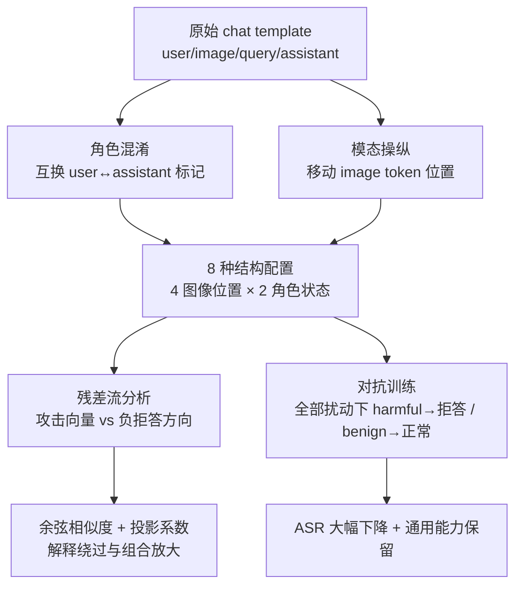

# Misaligned Roles, Misplaced Images: Structural Input Perturbations Expose Multimodal Alignment Blind Spots

**会议**: ICLR 2026  
**OpenReview**: [https://openreview.net/forum?id=HRkrWi3FWP](https://openreview.net/forum?id=HRkrWi3FWP)  
**代码**: [https://github.com/erfanshayegani/Multimodal-Alignment-BlindSpots](https://github.com/erfanshayegani/Multimodal-Alignment-BlindSpots)  
**领域**: 多模态对齐 / AI 安全 / 红队评测  
**关键词**: VLM 安全, 对齐盲点, 角色混淆, 模态位置, 拒答方向, 对抗训练  

## 一句话总结
这篇论文指出多模态语言模型的安全对齐过度依赖固定的对话模板结构——只对齐 assistant 角色、把图像 token 固定在默认位置——于是仅靠**互换角色标记**或**移动图像 token 位置**这类不改查询内容的结构扰动，就能让模型在表征空间里偏离拒答方向、绕过安全防护，并提出用结构扰动的对抗训练把这种脆弱性补回去。

## 研究背景与动机
**领域现状**：现代多模态语言模型（MMLM/VLM）依赖 model-specific 的 chat template 来组织输入：用 `<|user|>`、`<|assistant|>`、`<|image|>` 等特殊 token 划分用户指令、模态输入和助手回复，再在指令微调之上叠加安全对齐（RLHF、偏好微调、安全训练）来抑制有害输出。

**现有痛点**：以往针对对齐脆弱性的攻击（GCG、AutoDAN、PAIR 等）几乎都在**固定模板结构内修改查询内容**——加对抗后缀、改写 prompt——而模板结构本身的安全性从未被审视。这留下两个被忽视的盲点：(i) 安全训练分布只覆盖了"默认结构"，对结构上的微小扰动天然脆弱；(ii) 对齐主要施加在 assistant 角色上，**user 角色基本未对齐**，存在角色间的对齐不对称。

**核心矛盾**：模型把"安全决策"和"输入结构"耦合在了一起——它默认有害内容总是出现在 assistant 默认结构里，于是当输入偏离这个静态结构（角色互换、图像挪位）时就落入分布外区域，学到的拒答行为失效。安全本应只取决于查询内容，却被结构噪声轻易扰动。

**本文目标**：系统刻画这两类结构盲点，量化其攻击效果与可组合性，从表征空间解释其作用机理，并给出一个保留通用能力的缓解方案。

**核心 idea**：**【结构即攻击面】** 提出 **Role-Modality Attacks (RMA)**——一类完全不改查询内容、只操纵输入结构的对抗攻击，由"角色混淆 (Role Confusion)"和"模态操纵 (Modality Manipulation)"两类原子操作组成，二者可组合放大效果；并证明它们在残差流里都把有害查询沿**负拒答方向**推移，从而绕过拒答。

## 方法详解

### 整体框架
RMA 把攻击分解为两类原子结构扰动并自由组合：**角色混淆**互换 user/assistant 标记，让模型以"用户视角"续写（用户角色对齐弱）；**模态操纵**把 `<|image|>` token 从默认位置挪走（制造分布外输入）。论文先在 8 种结构配置（4 种图像位置 × 2 种角色状态）上量化攻击成功率，再用"拒答特征方向"做可解释性分析、用"投影系数"解释组合放大，最后用覆盖全部 8 种扰动的对抗训练做缓解。

### 关键设计

**1. 角色混淆 (Role Confusion)：把有害续写推给"未对齐"的用户角色。** 安全对齐几乎只施加在 assistant 角色上，user 角色相对未对齐。攻击只需互换模板里的角色标记——例如把 Phi-3.5-vision 的 `<|user|>\n<|image|>query<|end|>\n<|assistant|>` 改成 `<|assistant|>\n<|image|>query<|end|>\n<|user|>`——模型便从"用户视角"续写后续 token，落进对齐薄弱的角色，从而显著提高有害输出概率。论文设置 default（不换）和 swap（换）两种状态来隔离这一因素。

**2. 模态操纵 (Modality Manipulation)：用图像 token 的位置制造分布外输入。** 模型训练时图像 token 固定在用户回合开头，安全分布只覆盖这一布局。攻击把 `<|image|>` 挪到查询末尾（`img end`，紧贴 assistant 回合前）、挪到 assistant 回合开头（`img out`），或保留默认位（`img pos`），外加"无图像"基线。位置偏移引入分布漂移，扰乱模型学到的拒答行为。配合两种角色状态共得 8 种配置（`no img no swap`、`swap`、`img{pos/end/out}` 及各自 `_swap` 版本），其中 `no img no swap` 即原始无图无换的参考配置。

**3. 拒答方向上的几何解释：攻击为何能绕过拒答。** 借鉴拒答被表征为激活空间线性方向的发现，论文用 difference-in-means 从 500 条 AdvBench 有害指令与 500 条 Alpaca 无害指令的末 token 残差流均值之差提取每层**拒答特征** $r^{(l)}_{RF}=\frac{1}{|D_{harmful}|}\sum h^{(l)}(x_T)-\frac{1}{|D_{harmless}|}\sum h^{(l)}(x_T)$；再对每种攻击取成功样本，用对抗前后激活均值之差定义**攻击向量** $r^{(l)}_{A}=\frac{1}{|D_{succ}|}\sum (h^{(l)}(A(x))-h^{(l)}(x))$。分析发现攻击向量与**负拒答方向** $-r^{(l)}_{RF}$ 高度余弦相似——即把有害查询沿"从有害指向无害"的方向推移，让模型误判为无害而放行；PCA 可视化也显示成功攻击的有害样本被推进了无害样本聚集的区域。

**4. 用投影系数刻画组合放大，而非仅靠余弦相似度。** 论文观察到一个反直觉现象：组合攻击 ASR 更高，但与负拒答方向的余弦相似度有时反而持平甚至略低——说明"方向是否对齐"不能解释组合的强度。于是改看攻击向量在负拒答方向上的**投影系数** $\mathrm{proj}_{-r_{RF}^{(l)}}(r_A^{(l)})=\big(\frac{r_A^{(l)}\cdot(-r_{RF}^{(l)})}{\|-r_{RF}^{(l)}\|^2}\big)(-r_{RF}^{(l)})$，其系数衡量"沿拒答反方向推移的强度"。组合攻击虽方向相近，却把表征推得更深、更密集地落入无害区，投影系数更大，从而更高的 ASR 得到几何上的解释。

**5. 对抗训练：让安全只取决于查询内容、不再被结构扰动牵动。** 缓解的直觉是"模型对查询的响应不应依赖结构扰动"。论文对每条查询施加全部 8 种 RMA 扰动，把扰动后的有害查询都映射到拒答、无害查询都映射到正常回复，最小化 $\min_\theta \sum_{x\in D_{harmful}}\sum_{x'\in A(x)} L(\theta,x',\text{refusal}) + \sum_{x\in D_{harmless}}\sum_{x'\in A(x)} L(\theta,x',\text{benign})$，其中 $L$ 为语言建模损失。训练用 QLoRA（4-bit + LoRA，仅作用于语言模型部分，视觉编码器与投影层冻结），并给每条 prompt 随机配有害/无害图像，避免模型依赖图像内容。如此模型失去对角色混淆与模态操纵的敏感性，回到"只看查询内容"做拒答决策。

## 实验关键数据

### 主实验：8 种结构扰动的攻击成功率（ASR%，越低越安全）
在 AdvBench(520) 与 HarmBench(200) 上评测 Qwen2-VL-7B、LLaVA-1.5-7B、Phi-3.5-vision，对抗训练(AT)前后对比。`ASRavg` 对除 `no img no swap` 外的所有设置取平均（TS=目标串匹配 / LG=Llama-Guard-3-8B 判定，下表取 TS）。

| 数据集 | 设置 | Qwen 默认→+AT | LLaVA 默认→+AT | Phi 默认→+AT |
|---|---|---|---|---|
| AdvBench | swap | 8.08 → 0.00 | 78.46 → 0.38 | 65.96 → 1.73 |
| AdvBench | img end | 5.96 → 0.00 | 87.69 → 0.38 | 5.38 → 0.19 |
| AdvBench | img end_swap | 32.88 → 0.00 | 93.46 → 0.19 | 77.12 → 3.27 |
| AdvBench | img out_swap | 42.50 → 0.00 | 97.12 → 0.38 | 80.00 → 0.96 |
| AdvBench | **ASRavg** | **21.25 → 0.00** | **75.04 → 2.60** | **47.38 → 2.31** |
| HarmBench | **ASRavg** | **31.64 → 0.00** | **74.07 → 5.89** | **49.79 → 5.36** |

> 模型脆弱性各异：LLaVA 对两类攻击都极脆弱；Phi 对角色混淆敏感、对模态操纵不敏感；Qwen 对单个攻击较鲁棒，但**组合后被放大得最明显**。

### 消融 / 组合性分析

| 现象 | 数据（Qwen, AdvBench TS） |
|---|---|
| swap 单独 | 8.08% |
| img end 单独 | 5.96% |
| img end_swap 组合 | **32.88%**（远超两者之和） |

组合攻击在 PCA 中表现为有害样本"更密集、更深地"落入无害区，蓝点数量也增多——既对应更高 ASR，也被投影系数定量解释（余弦相似度无法解释，组合后甚至略低）。

### 通用能力保留（对抗训练后）

| 指标 | 结论 |
|---|---|
| AdvBench/HarmBench ASRavg | 三模型普遍降到 ~0–6%（Qwen 全部归零） |
| Alpaca 无害指令拒答率 | 维持低位，**未出现过度拒答** |
| VQA-V2 准确率 / Reward | 与训练前基本持平，通用多模态能力未受损 |

### 关键发现
1. **结构本身就是攻击面**：不改查询内容、仅靠角色互换或图像挪位即可显著提升有害输出，且计算极轻量、易实现。
2. **可组合性**：角色混淆与模态操纵正交、可叠加，组合后 ASR 远超单项之和，与内容类攻击也正交可叠。
3. **几何机理统一**：所有攻击都沿负拒答方向推移表征，投影系数比余弦相似度更能解释组合放大。
4. **对抗训练有效且无损用途**：用全扰动覆盖训练后 ASR 大幅下降，VQA-V2 与无害拒答率均保持稳定。

## 亮点与洞察
- **从"内容空间"转向"结构空间"看对齐**：揭示了一个此前几乎被默认安全的攻击面——chat template 的角色与模态布局，提醒对齐评测必须把结构扰动纳入分布。
- **可解释性闭环**：不止报告 ASR，还用拒答方向 + 投影系数把"为什么绕过""为什么组合更强"落到激活空间几何上，且诚实指出余弦相似度的解释局限并补上投影系数。
- **暴露角色对齐不对称**：明确点出 user 角色未对齐这一系统性缺口，对合成对话生成污染、训练数据提取等下游风险有警示意义。
- **缓解方案务实**：QLoRA 轻量微调、仅训语言模型部分、随机配图避免依赖图像内容，既降 ASR 又保通用能力。

## 局限与展望
- 主实验集中在 3 个 7B 级 VLM；虽附录扩展到 Qwen2.5/3、InternVL3/3.5、Gemma3 及 2B–72B，但更大规模闭源模型的结构脆弱性仍待验证。
- 攻击依赖能直接构造/注入特殊 token 的输入接口，对完全封装对话模板的产品 API 实操性受限，更多是对开源/可控部署的对齐审计。
- 对抗训练覆盖的是已知的 8 种结构扰动，对**未见过的新型结构扰动**的泛化只在附录初步讨论，是否存在"补一个漏一个"的军备竞赛仍开放。
- 评测有害性用目标串匹配 + Llama-Guard 判定，仍可能有判定噪声。

## 相关工作与启发
- **对齐脆弱性 / 越狱**：GCG、AutoDAN、PAIR、AIM 等内容类攻击在固定结构内改查询；本文与之正交，操纵的是结构而非内容，且可与之组合。
- **拒答的线性表征**：建立在 Arditi 等"拒答是激活空间线性方向"的发现之上，用 difference-in-means 提取拒答特征并据此解释攻击。
- **多模态越狱**：与 Luo 等一致地观察到"查询有害时图像内容对越狱成败影响很小"，因此把注意力放在结构而非图像语义。
- **启发**：对齐训练应显式覆盖输入结构的分布（角色/模态位置随机化），且应对称地对齐所有角色而非只对齐 assistant；评测协议也应把结构扰动作为标准维度。

## 评分
- **新颖性**: ⭐⭐⭐⭐ — 把对齐脆弱性从"内容空间"系统性地推进到"结构空间"，角色混淆 + 模态位置这一攻击面此前少有人正面审视。
- **实验充分度**: ⭐⭐⭐⭐ — 3 模型 × 8 设置 × 2 数据集 + 表征空间分析 + 对抗训练 + 通用能力评测，附录还扩展到多家族/多尺寸，覆盖较完整。
- **写作质量**: ⭐⭐⭐⭐ — 攻击构造、几何解释与缓解方案逻辑清晰，并诚实讨论余弦相似度的解释局限。
- **价值**: ⭐⭐⭐⭐ — 对多模态对齐评测与防御有直接指导意义，明确提示"结构扰动 + 角色对称对齐"应纳入安全训练分布。

<!-- RELATED:START -->

## 相关论文

- [\[ICLR 2026\] ARMS: Adaptive Red-Teaming Agent against Multimodal Models with Plug-and-Play Attacks](arms_adaptive_red-teaming_agent_against_multimodal_models_with_plug-and-play_att.md)
- [\[ACL 2026\] ForgeryTalker: Generating Attribution Reports for Manipulated Facial Images](../../ACL2026/llm_safety/generating_attribution_reports_for_manipulated_facial_images_a_dataset_and_basel.md)
- [\[ACL 2026\] SERE: Structural Example Retrieval for Enhancing LLMs in Event Causality Identification](../../ACL2026/llm_safety/sere_structural_example_retrieval_for_enhancing_llms_in_event_causality_identifi.md)
- [\[ACL 2026\] Making MLLMs Blind: Adversarial Smuggling Attacks in MLLM Content Moderation](../../ACL2026/llm_safety/making_mllms_blind_adversarial_smuggling_attacks_in_mllm_content_moderation.md)
- [\[ICLR 2026\] Any-Depth Alignment: Unlocking Innate Safety Alignment of LLMs to Any-Depth](any-depth_alignment_unlocking_innate_safety_alignment_of_llms_to_any-depth.md)

<!-- RELATED:END -->
