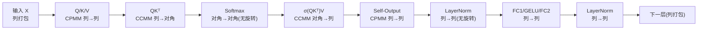

# MOAI: Module-Optimizing Architecture for Non-Interactive Secure Transformer Inference

**会议**: ICLR 2026  
**OpenReview**: [https://openreview.net/forum?id=qJn4HtTzhH](https://openreview.net/forum?id=qJn4HtTzhH)  
**代码**: [https://github.com/dtc2025ag/MOAI](https://github.com/dtc2025ag/MOAI)（CPU）/ [https://github.com/dtc2025ag/MOAI_GPU](https://github.com/dtc2025ag/MOAI_GPU)（GPU）  
**领域**: 隐私计算 / 同态加密推理 / 安全 Transformer 推理  
**关键词**: 全同态加密(FHE)、CKKS、非交互式安全推理、矩阵打包、rotation-free、BERT  

## 一句话总结
MOAI 用「列打包 + 对角打包跨层一致」的求值流、以及无旋转(rotation-free)的 Softmax/LayerNorm 算法，把纯 FHE 非交互式 Transformer 推理里最贵的 HE 旋转操作砍到极致（BERT-base 全程仅 9648 次矩阵乘旋转、Softmax/LayerNorm 旋转归零），相比 SOTA THOR 端到端提速 52.8%，单卡每条输入摊销 2.36 分钟。

## 研究背景与动机
**领域现状**：把 LLM 部署到云服务商(CSP)会引入隐私泄露风险，全同态加密(FHE)允许在密文上直接计算、无需解密，是天然的「非交互式」隐私保护方案——客户端加密上传、服务器密态求值、返回密态结果，服务器对输入和输出一无所知。但 FHE 的计算开销极高，尤其在文档分类这类需要批量处理大量输入的 BERT 场景里成为落地瓶颈。

**现有痛点**：纯 FHE 路线的工作各有硬伤。NEXUS(NDSS'25) 提出了若干 FHE-friendly 矩阵乘和激活近似，但只报告了 microbenchmark 聚合数据、不提供端到端方案，更关键的是它各层用的打包格式不一致，算法无法直接拼接，期间昂贵的格式转换既没解释清楚、其耗时也没算进性能里。THOR(CCS'25) 做到了端到端（128 token、单卡 10 分钟/输入），但密文-密文矩阵乘仍需要格式转换。另一条路线（Powerformer, ACL'25）干脆把 Softmax/LayerNorm 换成 FHE-friendly 的幂函数/线性函数，但需要知识蒸馏重训练，泛化性受限。

**核心矛盾**：HE 旋转(rotation)是 FHE 里公认最慢的操作之一（随密文模数增大越发昂贵），而现有方案要么靠大量旋转做密文内求和、要么靠不一致的打包格式被迫做密文格式转换/转置——这两者都在反复消耗算力。

**本文目标**：设计一个**即插即用**、不改 Transformer 组件（因而无需重训练/微调）的纯 FHE 框架，既要端到端可用，又要把旋转和格式转换的开销压到最低。

**核心 idea**：**[一致打包 + 无旋转求值]** 让列打包和对角打包在整条求值流里「天然衔接」，消除层间格式转换；同时用「把待求和元素摆到不同密文的相同 slot 位置」这一洞察，让 Softmax/LayerNorm 完全不需要旋转。

## 方法详解

### 整体框架
MOAI 基于 CKKS 方案，把 BERT 的一整层（注意力 + 前馈）拆成几种密态矩阵乘和非线性求值模块，精心安排每个模块的输入输出打包格式，使得列打包(Col)与对角打包(Diag)在模块间无缝传递、全程不做格式转换。再叠加 interleaved batching 充分利用 CKKS 的 SIMD slot 把多条输入摊销，并把唯一一次 bootstrapping 挪到 Softmax 的除法之前以降低后续矩阵乘所处的 level。

### 关键设计

**1. 跨层一致的打包求值流：让格式衔接而非转换。** MOAI 的核心是让每个模块的输出格式恰好是下一个模块需要的输入格式。输入与 Q、K、V 都用**列打包**（矩阵 $X\in\mathbb{R}^{m\times d}$ 的每一列加密成一个密文）；计算 $QK^\top$ 时利用引理 $\text{Diag}_j(QK^\top)=\sum_{i=0}^{d'-1} q_i\otimes\text{Rot}_j(k_i)$，让两个列打包矩阵相乘**不需要转置 K**，直接得到**对角打包**结果，而这正好是 Softmax 模块的输入格式；Softmax 在对角打包下求值后仍输出对角打包，接着 $\text{softmax}(QK^\top/\sqrt{d'})V$ 取「对角打包的注意力 + 列打包的 V」算出**列打包**输出；后续前馈层全程列打包，可直接喂给下一层。由此整条流水线在 Col 与 Diag 间自然流转，省掉了 THOR 里必需的格式转换和密态转置。

**2. 无旋转的 Softmax / LayerNorm：把求和搬到 slot 对齐。** HE 旋转之所以贵，是因为传统做法要靠 $\log$ 级旋转把一个密文内打包的数据求和。MOAI 的关键洞察(引理 4.1)是：方阵的**列求和等于对角求和**，$\sum_i c_i^\top=\sum_i \text{Diag}_i(C)$。于是 Softmax 把 $QK^\top$ 的各条对角分别加密成不同密文，指数用 SIMD 多项式 $(1+x/2^r)^{2^r}$ 近似，再**直接相加这些密文**得到分母 $\sum_i\exp(\text{Diag}_i)$——求和发生在「不同密文的相同 slot」之间，纯靠密文加法完成，一次旋转都不用。LayerNorm 同理：mean/var 都是对列打包各密文做密文加法 + 标量乘 $1/d$，倒数平方根用 Goldschmidt 除法算。结果是 Softmax 和 LayerNorm 的旋转数从 THOR 的 2448 次直接归零。

**3. 列打包消旋 + interleaved batching 减半旋转。** 在明文-密文矩阵乘(CPMM)里，因为权重是明文，$XW$ 可解释为 $X$ 各列的线性组合的拼接，列打包下完全不需要旋转。在密文-密文矩阵乘(CCMM)里则引入 **interleaved batching**：把 $N/(2m)$ 条长度 $m$ 的向量「交错」打包进一个密文的 $N/2$ 个 slot（先放各向量第 0 个元素、再第 1 个……），由引理 3.2 可知 $\text{Rot}_{jN/(2m)}(\tilde{x})$ 恰好实现各子向量同步旋转——传统 naive batching 做一次「内部旋转」需要两次 HE 旋转，MOAI 只用一次，直接砍半。综合下来 BERT-base 全部矩阵乘只需 9648 次旋转，比 NEXUS/THOR/Powerformer 分别少 22.9×/2.3×/1.7×。

**4. Bootstrapping 位置优化。** Softmax 里精确的 Goldschmidt 除法至少要 10 次迭代（约 20 层电路深度），直接做会把整个注意力块推到高 level、拖慢前序矩阵乘（高 level 密文模数大、乘法更慢）。MOAI 把唯一一次 bootstrapping 放在 Softmax 求和之后、除法之前，把 Softmax 深度从 20 层降到 10 层，使前面两个矩阵乘能在更低 level 执行，一次 bootstrapping 就显著压低了整体运行时间。

## 实验关键数据
**实现**：CKKS 环维度 $N=2^{16}$（$2^{15}$ slots），1743-bit 模数达 128-bit 安全；CPU 用 SEAL（Intel Xeon 8480+ 56 核），GPU 用 Phantom 库（H200 / A100）。模型为 BERT-base-uncased（12 层 12 头、128 token），在 SST-2/QNLI/RTE 上微调。

### 主实验表格（端到端，256 输入摊销）

| 平台 | 每条输入摊销时间 |
|------|------------------|
| CPU（56 核） | 9.6 分钟 |
| GPU（H200） | 2.36 分钟 |

与 SOTA 逐层对比（单卡 A100，单位 秒）：

| 方法 | 总时间 | MOAI 提速 |
|------|--------|-----------|
| THOR (CCS'25) | 602.26 | — |
| **MOAI** | **283.95** | **−52.8%** |
| Powerformer (ACL'25) | （MOAI 套用其 FHE-friendly 改造后对比） | **−55.7%** |

矩阵乘 HE 旋转数（BERT-base 全程）：

| 方法 | 矩阵乘旋转数 | 相对 MOAI |
|------|-------------|-----------|
| NEXUS | >221184 | 22.9× |
| THOR | 22224 | 2.3× |
| Powerformer | 16740 | 1.7× |
| **MOAI** | **9648** | 1× |

### 消融实验表格（vs THOR 逐模块，A100，秒）

| 模块 | MOAI | THOR | 节省 |
|------|------|------|------|
| Attention layer | 16.54 | 49.77 | 33.23 |
| Softmax | 2.19 | 15.53 | 13.34 |
| Multi-head attention | 0.48 | 27.43 | 26.95 |
| GELU | 3.30 | 29.42 | 26.94 |
| FC2 | 2.88 | 49.19 | 46.31 |
| Bootstrappings | 227.84 | 337.86 | 110.02 |

### 关键发现
- Softmax/LayerNorm 旋转归零是提速主因：microbenchmark 上 Softmax 最高 22× 加速、LayerNorm 高达 151×。
- bootstrapping 仍是开销大头（A100 上占 227.84/283.95 ≈ 80%），但通过位置优化也比 THOR 省了 110 秒。
- 方法可扩展到 decoder-only 模型，论文在 LLaMA-3-8B 上验证了求值流的通用性。

## 亮点与洞察
- **「列求和=对角求和」这一条引理**是整个 rotation-free 设计的支点，把一个看似必须用旋转的密文内求和问题，转化成跨密文的纯加法——简洁而有力。
- **打包格式的「接力」思维**：不是去优化单个格式转换，而是从全流程出发让每个模块的输出格式天然就是下游的输入格式，从根上消除转换需求。
- **即插即用**：不改 Softmax/LayerNorm、不重训练，相比 Powerformer 这类需要知识蒸馏的路线在工程落地和泛化性上更友好。

## 局限与展望
- bootstrapping 仍占端到端约 80% 时间，是下一步的主要优化空间；MOAI 只是把它的位置优化好，并未降低其单次成本。
- 端到端实验主要在 BERT-base（128 token）上；LLaMA-3-8B 仅作扩展性演示放在附录，长序列、解码器自回归场景的完整性能尚待系统评估。
- 仍依赖多项式近似（GELU 用 23 阶多项式、Softmax 用 $(1+x/2^r)^{2^r}$ 近似指数），近似精度与电路深度的权衡在更大输入区间下需谨慎，论文也指出 NEXUS 的分段多项式 GELU 存在精度问题。
- 安全模型为半诚实 CSP 的非交互式推理，未涉及恶意服务器或模型本身的隐私（仅保护客户端输入输出）。

## 相关工作与启发
- **交互式路线**（Chen 2022、Pang 2024、Iron 等）用 FHE+MPC 把数据分享给服务器，通信开销大；MOAI 走纯 FHE 非交互式，无通信轮次。
- **纯 FHE 非交互式**：NEXUS（首个，但只有 microbenchmark、格式不一致）→ THOR（首个端到端 SOTA）→ MOAI（一致打包 + 无旋转，刷新 SOTA）。
- **FHE-friendly 改造路线**：PowerSoftmax、Powerformer 用幂/线性函数替换非多项式算子，需重训练；MOAI 证明自己的打包+求值算法也能套用到 Powerformer 的改造模型上再提速 55.7%，说明两条路线可叠加。
- 对 FHE 推理后续工作的启发：**减少旋转 > 优化单次旋转**，而减少旋转的关键往往在「数据布局/打包」层面而非密码学原语层面。

## 评分
- 新颖性: ⭐⭐⭐⭐ 「列求和=对角求和」消旋洞察与跨层一致打包流设计巧妙，把 FHE Transformer 推理的旋转开销实质性压低，方向上是清晰的工程性突破而非颠覆性新范式。
- 实验充分度: ⭐⭐⭐⭐ 端到端 + 逐模块 + 旋转计数 + 双 SOTA 对比 + CPU/GPU 双平台齐全，LLaMA-3-8B 扩展性也有覆盖；扣分在主结果集中于 BERT-base 单一长度。
- 写作质量: ⭐⭐⭐⭐ 三大贡献定位清晰、引理与算法表述严谨、对比表充分；FHE 背景较重，对非密码学读者门槛偏高。
- 价值: ⭐⭐⭐⭐ 把隐私保护 Transformer 推理摊销到 2.36 分钟/输入，对 FHE-as-a-Service 落地有实际推动，即插即用属性提升了工程可用性。

<!-- RELATED:START -->

## 相关论文

- [\[ICLR 2026\] Optimizing Agent Planning for Security and Autonomy](optimizing_agent_planning_for_security_and_autonomy.md)
- [\[ICLR 2026\] ARMOR: Aligning Secure and Safe Large Language Models via Meticulous Reasoning](armor_aligning_secure_and_safe_large_language_models_via_meticulous_reasoning.md)
- [\[AAAI 2026\] Ghost in the Transformer: Detecting Model Reuse with Invariant Spectral Signatures](../../AAAI2026/llm_safety/ghost_in_the_transformer_detecting_model_reuse_with_invariant_spectral_signature.md)
- [\[ICLR 2026\] Information-Theoretic Membership Inference for Granular Quantification of Memorization](information-theoretic_membership_inference_for_granular_quantification_of_memori.md)
- [\[ICLR 2026\] Inference-Time Personalized Safety Control via Paired Difference-in-Means Intervention](inference-time_personalized_safety_control_via_paired_difference-in-means_interv.md)

<!-- RELATED:END -->
