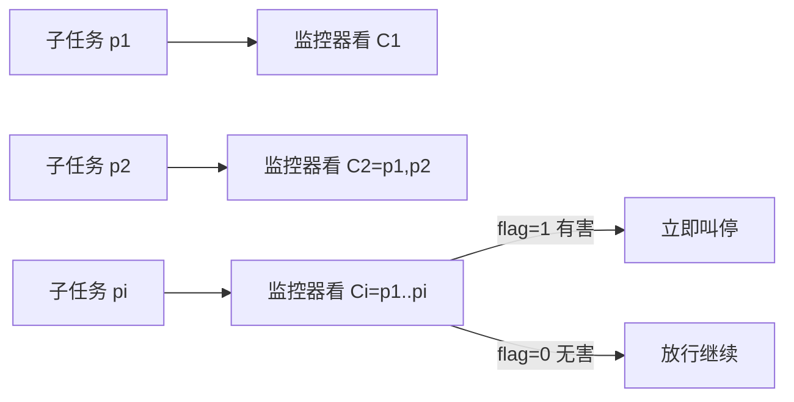

# Monitoring Decomposition Attacks with Lightweight Sequential Monitors

**会议**: ICLR 2026  
**OpenReview**: [https://openreview.net/forum?id=HQuboWvFA1](https://openreview.net/forum?id=HQuboWvFA1)  
**代码**: [github.com/YuehHanChen/Monitoring-Decomposition-Attack](https://github.com/YuehHanChen/Monitoring-Decomposition-Attack)  
**领域**: LLM 安全 / Agent 防御  
**关键词**: 分解攻击, 序列监控, LLM Agent 安全, 越狱防御, 轻量级护栏  

## 一句话总结
针对"把有害目标拆成一串看似无害子任务"的分解攻击，本文构建了最大规模数据集 DecomposedHarm（4,634 对任务），并提出一个**累积式序列监控框架**：精心提示工程后的轻量模型（如 GPT-4o-mini）即可达到 93% 防御成功率，超过 Llama-Guard-4 与 o3-mini，同时成本降 90%、延迟降 50%。

## 研究背景与动机
- **领域现状**：随着 LLM 走向 agentic（带工具、多轮、有状态），安全对齐成为部署刚需。但主流防御（包括 Llama-Guard 等护栏）属于"浅对齐"——只看当前单条指令是否显式有害。
- **现有痛点**：攻击者可把一个有害目标**分解**成多条单独看都无害的子任务（如"画一群人围着车"→"把手势改成举拳"→"加上裂痕"→"让人物显得是某族裔"），逐步诱导 agent 完成恶意意图。GPT-4o 对原始有害任务拒绝率 50%，但对分解后子任务只拒绝 10%；文生图场景从拒绝 83.5% 暴跌到 2.25%。平均攻击成功率（ASR）达 87%。
- **核心矛盾**：浅对齐"只看眼前一步"，无法对**长程意图**做推理；而真正能识别长程意图的强模型（o3-mini、GPT-4o）成本高、延迟大，无法在每条 prompt 上实时运行。
- **此前工作局限**：以往分解攻击研究 (1) 多停留在无状态 QA 设定、忽视更危险的有状态 agent 场景；(2) 只演示漏洞却不公开实际分解 prompt；(3) 没有提出鲁棒防御。
- **本文目标**：在三类真实 agent 任务上系统刻画分解攻击，并给出**实时、廉价、鲁棒**的防御。
- **核心 idea**：**外挂一个"高一层"的序列监控器**——不看单条 prompt，而是对累积上下文逐步评估，一旦在有害节点前察觉恶意意图就立即叫停；并通过提示工程让**轻量模型**就足以胜任。

## 方法详解

### 整体框架
方法分两部分：先用一个半自动生成管线构建 DecomposedHarm 评测集（用越狱 LLM 把有害 prompt few-shot 改写成看似无害的子任务序列，覆盖通用 agent、文生图、QA 三类），再在其上构建并优化序列监控器。监控器的核心是把防御形式化为一个**二分类序列标注任务**，在每一步对累积上下文做判断。

### 关键设计
**1. 累积式序列监控：把"逐步喂入"变成防御的抓手。** 攻击的本质是把意图摊到多步里隐藏，因此监控也必须有状态。在第 $i$ 步收到新 prompt $p_i$ 后，监控器检查**累积上下文** $C_i=[p_1,\dots,p_i]$ 而非孤立的 $p_i$，输出决策 $y_i\in\{0,1\}$（1=flag 并叫停，0=放行）。由于每个攻击至少含两步，监控从第 2 步开始。文中为每个任务标注一个"有害索引"（harmful index）——即若 agent 执行到此步就会真正造成危害。评测据此定义：在有害索引及之前正确 flag 记 TP，benign 任务全程不 flag 记 TN，只在有害索引之后才 flag 或漏报记 FN。这一形式化把"及时拦截 vs 避免误伤"两个目标统一进 F1 与防御成功率（DSR/Recall）两个指标。对比实验（Table 8）显示，同样的轻量模型在序列框架下显著优于"逐条独立监控"的单输入框架。

**2. 提示工程把轻量模型"调"到旗舰水平：prompt 即超参。** 作者发现轻量监控器的瓶颈不在模型容量而在提示设计，于是在验证集上做"prompt-as-hyperparameter"扫描。两个关键决策：其一，让模型输出**有害概率** $s_i\in[0,1]$ 再用阈值卡 $y_i$，比直接输出 0/1 更好（有验证集可调阈值时尤甚）；其二，系统比较了 ICL 示例、安全准则、思维链（CoT）、假设生成等提示，发现**任务特定的 ICL 示例**与 **CoT** 出奇地有效。为避免"作弊"，作者限定只用单一任务类型作 ICL 示例并检验跨任务泛化——用 agent 任务作 ICL 平均最好，但 GPT-4o-mini 用 QA 任务作 ICL 反而最优，说明最佳 ICL 类型依模型而定。

**3. 廉价但够用：把"贵且强"的护栏换成"轻且巧"的监控。** 在每条 prompt 上实时监控要求模型又快又便宜，推理型大模型不现实。作者以 \$0.2/百万 token 为界筛出 GPT-4.1-nano、GPT-4o-mini、Llama-3.1-8B 作为优化目标，把它们调到能匹配甚至反超 o3-mini、GPT-4o、GPT-5 的水平，从而在"防御强度—成本—延迟"三角上取得实用解。

## 实验关键数据

### 主实验表格（测试集，监控分解攻击）

| 模型 | Prompt | F1 ↑ | 每任务成本(USD) ↓ | 平均延迟(s) ↓ |
|---|---|---|---|---|
| Baseline Llama-3.1-8B | Zero-shot | 0.690 | 3.59e-5 | 0.476 |
| Baseline GPT-4.1-nano | Zero-shot | 0.756 | 1.67e-5 | 0.298 |
| Baseline GPT-4o-mini | Zero-shot | 0.785 | 2.51e-5 | 0.398 |
| **Optimized Llama-3.1-8B** | Agent ICL | 0.881 | 2.80e-4 | 0.574 |
| **Optimized GPT-4.1-nano** | CoT | 0.883 | 7.54e-5 | 0.937 |
| **Optimized GPT-4o-mini** | QA ICL | **0.918** | 1.39e-4 | 0.437 |
| Reference o3-mini | Zero-shot | 0.836 | 1.38e-3 | 3.976 |
| Reference GPT-4o | Zero-shot | 0.870 | 4.17e-4 | 0.490 |
| Reference GPT-5 | Zero-shot | 0.887 | 1.01e-2 | 25.49 |

优化后的轻量 GPT-4o-mini 在 F1 上超过所有昂贵参考模型（含 GPT-5），成本约为 o3-mini 的 1/10、GPT-4o 的 1/3，延迟也更低。

### 对比强护栏基线（各任务 F1）

| 模型 | Agent | Image | QA | Macro F1 |
|---|---|---|---|---|
| Llama-Guard-4-12B（序列化） | 0.657 | 0.119 | 0.012 | 0.262 |
| 本文 Optimized GPT-4o-mini | 0.894 | 1.000 | 0.883 | **0.926** |
| 提升 | +0.237 | +0.881 | +0.871 | +0.664 |

Llama-Guard-4 即便套上同样的序列框架仍极度脆弱，说明其训练范式无法识别藏在无害子任务里的意图。

### 关键发现
- **攻击普适且有效**：分解后拒绝率全面崩塌（agent 50%→10%、t2i 83.5%→2.25%、QA→约 9%），平均 ASR 87%。
- **难度分任务而异**：QA 最难监控（最强的 Claude-3.7-Sonnet 仅 F1 0.669），图像任务最易（多模型可达 F1 1.0）。
- **对抗鲁棒**：面对随机子任务注入、海量子任务极端混淆、以及会迭代把子任务改得更无害的自动红队，优化后监控器 F1 曲线基本持平；GPT-4o-mini/Llama-3.1-8B 的 DSR 仍达 93%/89%，而无防护的 GPT-4o 在 100% 注入率下 F1 从 0.85 跌到 0.72。

## 亮点与洞察
- **把攻击的弱点变成防御的支点**：分解攻击必须逐步暴露子任务，累积监控正好"顺藤摸瓜"，理念简洁且与攻击结构天然契合。
- **"surprisingly easy"的反直觉结论**：长程意图识别看似需要强模型，但加上序列上下文 + 对的提示后，轻量模型就够用，这对真实部署（必须廉价低延迟）意义重大。
- **数据集贡献扎实**：4,634 对、覆盖三大任务类型、附人工校验（标注成本 \$2,613），并分析了同管线生成可能带来的信息泄漏问题，公开了实际分解 prompt，填补了以往"只演示不放数据"的空白。

## 局限与展望
- 监控器本质是另一个被提示工程调好的 LLM，提示对模型敏感（同一 ICL 在不同模型上最优类型不同），跨模型迁移与提示稳健性仍需更系统的方法而非手工 sweep。
- 评测依赖"有害索引"标注与 StrongReject 等自动判定，标注质量与阈值（如 QA 用 0.75）会影响指标边界。
- 对抗测试虽涵盖红队改写，但攻击者若直接针对监控器提示做白盒优化（文中提到知晓监控 prompt 的红队），长期军备竞赛下的稳健性边界仍待观察。
- 数据生成大量依赖被越狱的 LLM 来造样本，攻击分布可能偏向"LLM 易想到的分解方式"，真实人类攻击者的策略覆盖度有待评估。

## 相关工作与启发
- **越狱与分解攻击**：相比 Li et al. (2024)、Glukhov et al. (2025)、Liu et al. (2024) 主要在无状态 QA 上演示漏洞，本文补齐了有状态 agent 场景、公开 prompt、并给出防御。
- **护栏模型**：与 Llama-Guard-4 这类"单条指令分类"护栏形成对照，揭示其在长程意图上的结构性盲区，启示护栏训练应纳入累积上下文与意图推理。
- **Agent 安全基准**：基于 AgentHarm (Andriushchenko et al., 2025) 扩展出通用 agent 任务子集，体现"benchmark→攻击→防御"闭环的研究范式。
- **启发**：对 agentic 系统的安全，与其追求更大更贵的对齐模型，不如在系统层加一个廉价、有状态、可独立升级的"监控旁路"，把安全从模型内对齐解耦为可观测、可拦截的外部机制。

## 评分
- **新颖性**: ⭐⭐⭐⭐ — 序列累积监控的形式化简洁但切中分解攻击要害，"轻量即够用"的结论反直觉且有实用价值。
- **实验充分度**: ⭐⭐⭐⭐⭐ — 三类任务大规模数据集、10 个监控模型对比、成本/延迟量化、四种对抗压力测试，覆盖全面。
- **写作质量**: ⭐⭐⭐⭐ — 动机—攻击—防御—对抗的叙事清晰，图表充分；提示工程细节略多需对照附录。
- **价值**: ⭐⭐⭐⭐⭐ — 直面 LLM agent 真实部署的安全刚需，提供廉价可落地的防御方案并开源数据，落地与后续研究价值都高。

<!-- RELATED:START -->

## 相关论文

- [\[ICLR 2026\] Adaptive Attacks on Trusted Monitors Subvert AI Control Protocols](adaptive_attacks_on_trusted_monitors_subvert_ai_control_protocols.md)
- [\[ICLR 2026\] Reliable Weak-to-Strong Monitoring of LLM Agents](reliable_weak-to-strong_monitoring_of_llm_agents.md)
- [\[ACL 2026\] Learning Uncertainty from Sequential Internal Dispersion in Large Language Models](../../ACL2026/llm_safety/learning_uncertainty_from_sequential_internal_dispersion_in_large_language_model.md)
- [\[ICLR 2026\] Efficient Adversarial Attacks on High-dimensional Offline Bandits](efficient_adversarial_attacks_on_high-dimensional_offline_bandits.md)
- [\[ICLR 2026\] Sampling-aware Adversarial Attacks against Large Language Models](sampling-aware_adversarial_attacks_against_large_language_models.md)

<!-- RELATED:END -->
