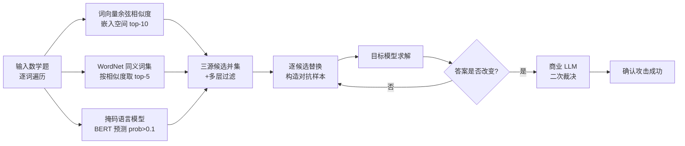

# MSCR: Exploring the Vulnerability of LLMs' Mathematical Reasoning Abilities Using Multi-Source Candidate Replacement

**会议**: ICLR 2026  
**OpenReview**: [https://openreview.net/forum?id=ijOAhcHI7S](https://openreview.net/forum?id=ijOAhcHI7S)  
**代码**: 待确认  
**领域**: LLM 安全 / 数学推理鲁棒性 / 文本对抗攻击  
**关键词**: 对抗攻击, 数学推理, 鲁棒性, 同义词替换, WordNet, 掩码语言模型, GSM8K, MATH500  

## 一句话总结
提出 MSCR——一种融合词向量余弦相似度、WordNet 词典与掩码语言模型三种信息源生成候选替换词的自动化对抗攻击方法，仅改动数学题中的**单个词**就能让几乎所有 LLM 的推理准确率大幅下降（GSM8K 最高掉 49.89%），系统性揭示了当前 LLM 数学推理能力的鲁棒性缺陷与效率瓶颈。

## 研究背景与动机
- **领域现状**：LLM 在 GSM8K、MATH 等数学基准上已接近满分，被普遍视为具备强数学推理能力；但这种能力在轻微输入扰动下是否稳健，仍缺乏系统性研究。
- **现有痛点**：① 经典文本对抗攻击（TextFooler、BERT-ATTACK）针对分类模型设计，难以迁移到生成式 LLM，可扩展性差；② 越狱攻击多依赖人工构造与反复调试 prompt，成本高、聚焦通用任务而非数学推理；③ 数据集扰动类工作（GSM-Symbolic、GSM-Plus、MATH-Perturb）需要人工设计扰动规则，缺乏自动化、可扩展的攻击流程。
- **核心矛盾**：要"自动、可扩展、语义保持"地暴露 LLM 数学推理的脆弱性，三者之间难以兼得——单一信息源生成的候选词要么语义偏离、要么覆盖面窄、要么脱离上下文。
- **本文目标**：构建一个无需人工干预、可大规模运行、且能保持高语义一致性的自动化对抗攻击框架，用最小扰动（单词替换）系统评估 LLM 数学推理的鲁棒性。
- **核心 idea**：**多源候选融合**——对题目中每个词，分别用模型自身嵌入空间的余弦相似度、WordNet 人工语义网络、外部掩码语言模型的上下文预测，生成三组互补候选词，过滤后逐词逐候选替换并查询目标模型，一旦输出答案改变即视为攻击成功。

## 方法详解

### 整体框架
MSCR 把对抗攻击拆成"候选生成 → 逐词替换 → 双重判定"三段流水线：先为输入题目的每个目标词构造一个高质量候选替换词集合（三源融合 + 多层过滤），再按优先级把候选逐个替换进原题、调用目标模型求解，最后用"答案比对 + 商业 LLM 二次裁决"两步机制判断是否攻击成功；若当前词的候选耗尽仍未成功，则换下一个词继续，直到触发模型出错或所有词失败。

### 关键设计

**1. 词向量余弦相似度源：在连续嵌入空间里找方向最近的替换词。** 文本是离散符号序列，难以像图像那样施加连续微扰，因此 MSCR 借助模型自身嵌入矩阵把每个词映射为稠密向量，先对所有词向量做归一化（投影到单位超球面以消除模长差异带来的偏置），再对目标词 $w$ 计算其归一化向量 $v_w$ 与词表中其余向量 $v_i$ 的余弦相似度 $\mathrm{sim}(v_w, v_i)=\frac{v_w\cdot v_i}{\lVert v_w\rVert\lVert v_i\rVert}$，取相似度最高的前 10 个作为初步候选。这组候选随后经过多层过滤：字符级过滤剔除控制字符、非拉丁字符与纯标点以保证文本结构完整；子串匹配与形态约束则保留含原词词干或仅有微小拼写变化的词，从而在局部短语或专业术语内维持语义一致。

**2. WordNet 词典源：用人工语义网络补齐分布式知识的语义泛化短板。** 词向量源受限于模型自身知识、语义泛化能力不足，MSCR 因此引入由人类专家构建的 WordNet 作为第二源：对目标词 $w$ 查询其全部同义词集（synset），遍历每个 synset 下的词元，抽取在词典层面与 $w$ 明确构成同义关系的词，得到初步候选后再与原词算余弦相似度并降序排列，仅保留最相关的前 5 个。这一源提供了模型嵌入难以覆盖的高质量人工同义词，与第一源形成互补。

**3. 掩码语言模型源：让上下文决定哪个替换词最自然。** 前两源主要看词与词的相似度，缺乏对句子上下文的感知，MSCR 第三源把目标词 $w$ 替换为 mask token 后输入 BERT-large，得到该位置在词表上的条件概率分布，仅保留预测概率大于 0.1 的高置信候选，过滤掉语法正确但语义薄弱或不合逻辑的低概率噪声。三源候选取并集后，模型内部分布式知识与外部结构化知识相结合，覆盖更广的语义场景，生成更自然、语义更相近的候选集。

**4. 局部/全局差异化替换 + 两步攻击判定：兼顾可读性与判定鲁棒性。** 替换策略上，词向量候选用于当前词的**局部替换**，WordNet 与 MLM 候选采用**全局替换**（替换句中所有与原词相同的词），以保证生成文本的语法完整与可读性。判定上采用两步机制：第一步比对目标模型输出与原始答案，若答案被改变则记为初步攻击成功并立即返回对抗样本；第二步对初步成功的样本调用更强的商业 LLM（qwen3-max-preview）做二次裁决，确认目标模型确实给出错误答案才记为最终成功——这一步显著提升了"攻击成功"判定的可靠性，避免把格式差异等误判为推理错误。

## 实验关键数据

### 主实验：12 个开源 LLM 在单词扰动下的准确率下降
温度统一设为 0.6，每个模型每个数据集独立跑 3 次取平均。MLM 用 bert-large-uncased，二次裁决用 qwen3-max-preview。

| 模型 | GSM8K 原始 | GSM8K 攻击后 | 降幅 | MATH500 原始 | MATH500 攻击后 | 降幅 |
|---|---|---|---|---|---|---|
| DeepSeek-R1-Distill-Qwen-32B | 94.39 | 75.59 | 18.80↓ | 93.00 | 79.20 | 13.80↓ |
| DeepSeek-R1-Distill-Qwen-7B | 93.71 | 68.16 | 25.55↓ | 92.80 | 78.60 | 14.20↓ |
| DeepSeek-R1-Distill-Qwen-1.5B | 83.09 | 57.54 | 25.55↓ | 81.20 | 63.20 | 18.00↓ |
| Qwen2.5-Math-7B-Instruct | 94.09 | 54.81 | 39.28↓ | 83.20 | 61.60 | 21.60↓ |
| Qwen2.5-Math-1.5B-Instruct | 85.90 | 36.01 | **49.89↓** | 76.20 | 49.80 | 26.40↓ |
| Meta-Llama-3-70B-Instruct | 93.86 | 65.43 | 28.43↓ | 57.60 | 45.00 | 12.60↓ |
| Meta-Llama-3-8B-Instruct | 83.02 | 47.69 | 35.33↓ | 30.60 | 6.60 | 24.00↓ |
| gemma-3-27b-it | 98.10 | 77.79 | 20.31↓ | 92.00 | 75.00 | 17.00↓ |
| gemma-3-12b-it | 97.73 | 75.51 | 22.22↓ | 89.80 | 70.40 | 19.40↓ |
| gemma-3-4b-it | 94.54 | 63.84 | 30.70↓ | 81.40 | 56.20 | 25.20↓ |
| gemma-2-27b-it | 92.65 | 59.74 | 32.91↓ | 68.30 | 39.00 | 29.30↓ |
| gemma-2-9b-it | 90.75 | 53.07 | 37.68↓ | 47.00 | 11.60 | **35.40↓** |

GSM8K 上除 DeepSeek-R1-Distill-Qwen-32B 外所有模型降幅超 20%，半数超 30%；MATH500 上所有模型降幅超 10%，半数超 20%（gemma-2-9b-it 相对下降 75.32%，Llama-3-8B 相对下降 78.43%）。同族中参数更大、基线更高的模型降幅相对更小，但仍普遍在 GSM8K 掉 20%+、MATH500 掉 10%+。

### 迁移实验：对抗样本对商业 LLM 的跨模型攻击
将针对 gemma-3-27b-it 生成的对抗样本迁移到商业模型：

| 模型 | GSM8K 原始 | GSM8K 攻击后 | 降幅 | MATH500 原始 | MATH500 攻击后 | 降幅 |
|---|---|---|---|---|---|---|
| OpenAI-o3 | 97.41 | 81.53 | 15.88↓ | 98.20 | 91.40 | 6.80↓ |
| GPT-4o | 96.28 | 79.07 | 17.21↓ | 76.00 | 68.20 | 7.80↓ |

两个商业模型均显著退化，证明 MSCR 生成的对抗样本具备较强的跨模型可迁移性。

### 响应长度坍塌：被攻击后推理路径变长

| 模型 | GSM8K 原始 | GSM8K 攻击后 | 倍率 | MATH500 原始 | MATH500 攻击后 | 倍率 |
|---|---|---|---|---|---|---|
| DeepSeek-R1-Distill-Qwen-7B | 1204.5 | 2190.2 | 1.82× | 2204.7 | 3081.9 | 1.40× |
| Qwen2.5-Math-1.5B-Instruct | 306.8 | 555.9 | 1.81× | 579.0 | 745.9 | 1.29× |
| gemma-3-4b-it | 411.8 | 881.7 | **2.14×** | 926.3 | 1308.3 | 1.41× |
| gemma-2-9b-it | 174.6 | 190.0 | 1.09× | 396.8 | 413.8 | 1.04× |

### 关键发现
- **单词扰动即可击穿**：仅替换一个词就让几乎所有模型大幅掉点，说明 LLM 数学推理高度依赖表层模式匹配而非深层逻辑，鲁棒性存在系统性缺陷。
- **越强越稳但仍脆**：同族内大模型相对更鲁棒，但即使最强模型也无法幸免，扰动成本极低而破坏力大。
- **响应长度坍塌**：被攻击后平均响应长度普遍变长，最高达 2.14 倍，部分推理模型个例甚至超过原长 10 倍——扰动不仅导致错误输出，还引发冗余推理路径、推高计算成本、降低整体推理效率。
- **强弱模型反应不同**：gemma2 系列等较弱模型响应长度几乎不变，作者推测其解题更接近基于记忆/模板的关键词匹配，面对扰动不产生额外推理，因而长度变化甚微。

## 亮点与洞察
- **三源互补设计巧妙**：模型嵌入（分布式知识）、WordNet（人工结构化知识）、MLM（上下文感知）正好覆盖单一信息源的三类盲区，生成的候选既语义相近又上下文自然。
- **完全自动化、可大规模运行**：无需人工设计扰动规则或调 prompt，相比 GSM-Symbolic / GSM-Plus 等需人工构造变体的工作，攻击流程更具可扩展性。
- **两步裁决提升可信度**：用更强商业模型做二次确认，缓解了"答案格式差异被误判为推理错误"的常见噪声问题，让"攻击成功率"更可信。
- **首次系统揭示效率维度的脆弱性**：把"响应长度坍塌"作为独立现象量化，指出鲁棒性问题会连带推高推理成本，视角比单看准确率更完整。

## 局限与展望
- **缺乏正式消融**：论文未给出三源各自贡献、过滤阈值（top-10 / top-5 / prob>0.1）敏感性的消融表，无法判断各信息源的边际价值。
- **语义一致性量化偏弱**：摘要声称"保持高语义一致性"，但正文未提供独立的语义相似度评测表（如 BERTScore / 人工评估）支撑该论断。
- **攻击成本与查询预算未报告**：逐词逐候选替换需大量目标模型查询，论文未统计平均查询次数或时间开销。
- **只针对英文与两个数学基准**：未覆盖多语言、代码推理或更长上下文任务，结论的泛化边界尚不清楚。
- **未提防御对策**：作为攻击/分析工作，仅指出脆弱性方向，未给出对抗训练或鲁棒解码等缓解方案的初步验证。

## 相关工作与启发
- **文本对抗攻击谱系**：从 HotFlip（梯度字符替换）、TextFooler（词嵌入+贪心）、BERT-ATTACK / BAE（MLM 候选）、GBDA（Gumbel-softmax 连续优化）一路演进；MSCR 的差异在于面向生成式 LLM、融合三源、并用答案改变作为黑盒判定。
- **越狱攻击**：GCG（离散优化后缀）、AutoDAN（层次遗传算法）、PAIR（双模型 20 次查询）等聚焦安全对齐绕过；MSCR 借鉴其自动化思路但目标换成数学推理正确性而非有害内容。
- **数学推理鲁棒性基准**：GSM-Symbolic、GSM-Plus、MATH-Perturb、以及数值扰动类工作均揭示 LLM 依赖表层模式；MSCR 把"扰动数据集"升级为"自动化对抗攻击算法"，可在线生成对抗样本而非离线构造固定变体。
- **启发**：① 三源候选融合可推广到代码、逻辑推理等其他结构化任务的鲁棒性评测；② "响应长度坍塌"提示防御研究应同时关注准确率与推理预算；③ 黑盒答案比对 + 强模型二次裁决，是评估生成式模型攻击成功的可复用范式。

## 评分
- **新颖性**: ⭐⭐⭐⭐ 三源候选融合 + 面向生成式 LLM 数学推理的自动化单词级攻击，组合新颖且填补了"自动化可扩展数学推理对抗攻击"的空白，但各组件（词向量/WordNet/MLM 候选）均源自已有文本攻击套路。
- **实验充分度**: ⭐⭐⭐ 覆盖 12 个开源 + 2 个商业模型、两个难度基准、3 次重复取平均，主实验扎实；但缺三源消融、阈值敏感性、语义一致性量化与攻击查询成本统计。
- **写作质量**: ⭐⭐⭐⭐ 动机—方法—实验脉络清晰，图 1/图 3 示例直观，表格信息密度高；个别英文表达稍粗糙。
- **价值**: ⭐⭐⭐⭐ 用极低成本扰动系统暴露主流 LLM（含 o3/GPT-4o）数学推理的鲁棒性与效率双重缺陷，为后续防御与鲁棒解码研究提供了可复用的自动化攻击基准与重要警示。

<!-- RELATED:START -->

## 相关论文

- [\[ACL 2026\] AgentCoMa: A Compositional Benchmark Mixing Commonsense and Mathematical Reasoning in Real-World Scenarios](../../ACL2026/llm_safety/agentcoma_a_compositional_benchmark_mixing_commonsense_and_mathematical_reasonin.md)
- [\[ICLR 2026\] When Priors Backfire: On the Vulnerability of Unlearnable Examples to Pretraining](when_priors_backfire_on_the_vulnerability_of_unlearnable_examples_to_pretraining.md)
- [\[ICLR 2026\] Doxing via the Lens: Revealing Location-related Privacy Leakage on Multi-modal Large Reasoning Models](doxing_via_the_lens_revealing_location-related_privacy_leakage_in_vlms.md)
- [\[ICLR 2026\] Be Careful When Fine-tuning On Open-Source LLMs: Your Fine-tuning Data Could Be Secretly Stolen!](be_careful_when_fine-tuning_on_open-source_llms_your_fine-tuning_data_could_be_s.md)
- [\[ICLR 2026\] Reasoning or Retrieval? A Study of Answer Attribution on Large Reasoning Models](reasoning_or_retrieval_a_study_of_answer_attribution_on_large_reasoning_models.md)

<!-- RELATED:END -->
