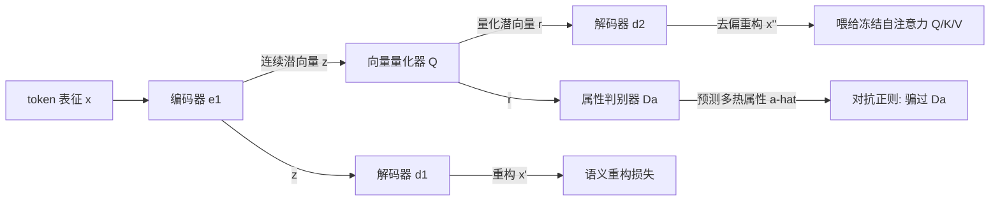

# Multi-Feature Quantized Self-Attention for Fair Large Language Models

**会议**: ICLR 2026  
**OpenReview**: [https://openreview.net/forum?id=0UvgQxsi7S](https://openreview.net/forum?id=0UvgQxsi7S)  
**代码**: 待确认  
**领域**: LLM 安全 / 公平性去偏  
**关键词**: 公平性, 去偏, 自注意力, 向量量化, 对抗自编码器, 多属性偏见  

## 一句话总结
提出 MQAR：在**冻结**的 LLM 自注意力层前插一个「向量量化 + 对抗自编码器」的轻量插件，在不动 backbone、不接触预训练数据的前提下，把性别/种族等多个敏感属性信息从注意力表征里挤掉，同时把下游精度损失压在 0.4% 以内。

## 研究背景与动机
- **领域现状**：LLM 在预训练中吸收了训练语料里的社会偏见（性别、种族、宗教），即便经过指令微调和对齐仍可测量到这些偏见。已有去偏方法分三类：嵌入级投影（INLP、SentDebias、OSCaR）、模型级公平训练（ADELE、FaRM、FineDeb）、推理时干预（CRISPR、RB）。
- **现有痛点**：嵌入级投影会过度压缩潜空间、损伤任务表达力；模型级方法需要访问训练数据并对 backbone 做昂贵微调，难以迁移到专有/黑盒模型；推理时方法虽然 model-agnostic 且免参数，却只改输入或解码，**完全没碰注意力层的内部表征**，attention 级偏见原封不动地留着。
- **核心矛盾**：偏见其实被自注意力结构「放大」——注意力把敏感属性信号和语义内容**纠缠**在一起（论文用性别互换句对的 attention heatmap 直接展示了这种差异性聚焦）。但既有方法要么不碰这层，要么碰这层就要重训。如何**只在注意力表征上动手、又不重训 backbone**，是个空白。
- **本文目标**：做一个 model-agnostic、轻量、免微调的去偏模块，直接针对表征级偏见，且能**同时处理多个、相互重叠的受保护属性及其交叉**（intersectional），而非传统单属性设置。
- **核心 idea**：**【量化瓶颈 + 对抗解纠缠】** 把一个结构化向量量化器塞进冻结自注意力的输入端，用量化制造信息瓶颈强迫表征丢弃属性细节；再配一个判别器引导的对抗自编码器，一边重构保住语义、一边对抗性地抹掉「能被判别器识别出属性」的那部分信息。整套训练对应信息瓶颈目标——**最大化表征与输入的互信息、最小化表征与敏感属性的互信息**。

## 方法详解

### 整体框架
MQAR（Multi-feature Quantized Attention Regularization）是一个插在自注意力层「输入端」的逐层正则化模块 $\mathrm{QR}_{i-1}$：原始隐状态 $X_{i-1}$ 先被它变换成去偏表征 $\tilde{X}_{i-1}=\mathrm{QR}_{i-1}(X_{i-1})$，再喂给冻结的注意力去算 $Q/K/V$。模块内部是一个「自编码器 + 向量量化器 + 属性判别器」的组合：编码器把 token 表征压成潜向量，量化器把它离散化成瓶颈表征，两个解码器负责把语义重构回来，判别器则负责猜敏感属性、并被对抗地骗。整套训练分两阶段——先把量化自编码器和判别器一起训出来，再固定判别器、用随机化属性标签做对抗正则把属性信息挤干净。backbone 全程冻结，不需要预训练数据。

### 关键设计

**1. 注意力输入端正则化：在冻结层里改表征而非改权重。** MQAR 没有去微调任何 $W^Q/W^K/W^V$，而是在每层注意力计算**之前**插一道变换，把原始 $X_{i-1}$ 换成去偏后的 $\tilde{X}_{i-1}$，于是注意力变成 $X_i=\mathrm{softmax}\!\big(\tilde{X}_{i-1}W^Q_i(\tilde{X}_{i-1}W^K_i)^\top/\sqrt{d_k}\big)\tilde{X}_{i-1}W^V_i$。这样做的好处是：敏感信息在进入 attention 之前就被压掉，注意力本身的上下文建模能力一点不损，且因为完全不碰 backbone 参数，对 BERT/T5/GPT-Neo/Mixtral/LLaMA 这些结构各异、甚至黑盒的模型都能即插即用。

**2. 量化瓶颈：用离散码本制造「丢信息」的强制压缩。** 编码器 $e_1$ 把 $x_{(l,i)}$ 映到连续潜向量 $z$，量化器 $Q$ 用最近邻搜索把它离散成 $r=Q(z)$，码本大小为 $K$。离散化本身就是个信息瓶颈——能通过的属性细节有限。训练靠两个损失夹住码本：量化损失 $L_{\text{quantize}}=\lVert \mathrm{sg}(z)-\hat a\rVert_2^2$ 把离散码拉向编码器输出，承诺损失 $L_{\text{commit}}=\lVert z-\mathrm{sg}(\hat a)\rVert_2^2$ 把连续输出钉在码本附近（$\mathrm{sg}$ 为 stop-gradient），梯度靠 straight-through estimator 穿过不可导的量化步。论文特意用**标量量化**（每维独立离散）而非高维向量量化，缓解了码本坍缩问题、让离散潜空间能更自由地重组。整个量化正则可写成 $\mathrm{QR}_i(\cdot)=d_2\big(Q(e_1(\cdot))\big)$。

**3. 判别器引导的对抗自编码 + 双解码器保语义。** 每个 token 带一个**多热**属性标签 $a\in\{0,1\}^M$（$M$ 个属性，如性别/种族/宗教同时标），判别器 $D_a$ 从量化潜向量 $r$ 预测 $\hat a=D_a(r)$。第一阶段判别器学着把属性分对、自编码器学着重构；第二阶段**固定判别器、把属性标签随机化**成 $a^r$，逼编码器-量化器把表征调成让 $D_a$ 分不出属性。多热监督是关键：它强迫模型别把多个属性塞进同一个共享子空间，从而**联合**抹掉多个属性而不是逐个处理。同时两个解码器 $d_1,d_2$ 各自做重构（$x'\approx x$、$x''\approx x$）保证去偏不把任务语义也一起删了——消融显示去掉解码器后 AUC 从 93.9 暴跌到 50.3、偏见指标飙升，说明解码器是「保语义」的命门。

**4. 信息瓶颈目标与对偶上界。** 整套训练的形式化目标是信息瓶颈 $\max\, I(R;X)-\beta I(R;A)$：留住表征 $R$ 与输入 $X$ 的互信息、压低 $R$ 与属性 $A$ 的互信息。由于互信息难直接估，论文用变分上下界 + 蒙特卡洛梯度近似：$I(R;X)$ 取下界 $\mathcal{L}_r=\mathbb{E}[\log D_2(x''|r)]$（解码器重构对数似然），$I(R;A)$ 取上界 $C_1,C_2$（当对抗判别器趋于最优、即 KL 间隙 $l\to0$ 时上界收紧），最终目标变成 $\max\,\mathcal{L}_r-\beta_1 C_1-\beta_2 C_2$。论文进一步证明在分布空间上该约束优化满足强对偶（Theorem 4），为对抗正则提供了理论支撑。此外，判别器只对带清晰属性线索（代词、职业词）的样本做弱监督，模糊/中性样本被排除，避免监督噪声、只在需要的地方去偏。

## 实验关键数据

### 主实验表格
五个 backbone（BERT/T5/GPT-Neo/Mixtral/LLaMA 3.2），三个偏见基准（WinoBias/StereoSet/CrowS-Pairs）。下表为 LLaMA 3.2 上的 StereoSet 与 CrowS-Pairs（LMS 语言建模分↑、SS 刻板印象分越接近 50 越好、ICAT↑；CrowS 越接近 50 越公平）：

| 方法 | StereoSet-Gender SS | ICAT | StereoSet-Race SS | ICAT | CrowS-All |
|------|------|------|------|------|------|
| LLaMA 3.2 | 59.7 | 72.5 | 62.1 | 68.3 | 61.9 |
| +INLP | 58.3 | 75.6 | 64.0 | 65.0 | 48.2 |
| +SentDebias | 60.2 | 72.8 | 56.3 | 79.4 | 51.3 |
| +CRISPR | 60.3 | 72.4 | 53.2 | 81.5 | 50.8 |
| +RB | 54.1 | 76.7 | 54.7 | 82.8 | 49.7 |
| **+MQAR (Ours)** | **53.1** | **86.0** | **54.0** | **84.0** | **48.1** |

MQAR 在 SS（最接近 50）、ICAT（最高 86.0/84.0）、CrowS-All 上几乎全面最优；WinoBias 上也取得最低 Avg. 和很小的 |Diff|（偏见分）。

### 消融实验表格
BERT + 滥用言论检测（Founta），考察去掉解码器 (a) 和去掉判别器 (b)：

| 数据 | 指标 | 完整 | (a) 去解码器 | (b) 去判别器 |
|------|------|------|------|------|
| Original | AUC | 93.9 | 50.3 | 93.9 |
| Original | FPED | 1.84 | 20.2 | 2.50 |
| Original | FNED | 3.46 | 18.3 | 3.46 |
| Generated | FPED | 0.065 | 22.1 | 0.392 |

去解码器 → 语义全毁、精度崩、偏见暴涨（解码器保信息）；去判别器 → 语义保住但偏见没降下来（判别器负责去偏）。两者缺一不可。

### 关键发现
- **精度几乎无损**：跨所有下游任务（滥用言论检测、仇恨言论检测、情感分析、文本生成），MQAR 相对非去偏 baseline 的平均精度下降至多 0.4 个百分点；滥用言论检测上 AUC 与 baseline 统计上无差异，同时 FPED/FNED 更优。
- **效率优于微调路线**：LLaMA 3.2 上 MQAR 只增加 48.1% 参数、87.0% FLOPs，端到端推理延迟 132.7ms，比需要全模型微调的 FineDeb（+107.3% 参数、189.8ms）快约 43%。
- **多属性 + 交叉有效**：单个 MQAR 模块用多热监督联合压低性别+种族等多个属性及其交叉偏见，而非逐属性训练。

## 亮点与洞察
- **干预点选得巧**：把去偏从「输入/解码」搬到「注意力输入表征」，正好命中偏见被放大的位置，又靠「改表征不改权重」绕开了重训 backbone 的代价。
- **量化即瓶颈**：用向量量化的离散化天然制造信息瓶颈，是一个把「VQ 用作解纠缠工具」（沿用 Hsu et al. 2024 的 latent quantization 解纠缠思路）迁到公平性场景的漂亮转用。
- **多热监督是处理交叉偏见的关键开关**：用一个多热标签 + 判别器，把「别让多个属性共享子空间」这件事直接写进对抗目标，比逐属性投影更契合 intersectional 设定。
- **理论缝合到位**：信息瓶颈 + 变分上下界 + 强对偶证明，让对抗正则不只是工程 trick。

## 局限与展望
- **开销不算小**：+48% 参数、+87% FLOPs，对每层都插模块的设计在超大模型上仍有成本；论文只和 FineDeb 比延迟，没和更轻的推理时方法（CRISPR/RB）比开销。
- **依赖弱监督词典**：判别器靠代词/职业词等清晰线索做弱监督，对没有显式词汇线索的隐性偏见、低资源语言可能力不从心；作者也把低资源场景列为 future work。
- **属性需预先定义**：多热标签要求事先知道并标注哪些受保护属性，难覆盖未知/长尾偏见维度。
- **评测仍偏静态英文基准**：WinoBias/StereoSet/CrowS 均为英文静态基准，多语言、指令微调模型上的效果仅作为展望，未实测。

## 相关工作与启发
- **嵌入级投影**（INLP / SentDebias / OSCaR）：靠投影删属性方向，但易损表达力——MQAR 用「量化瓶颈 + 重构」替代硬投影，正是为了避免这种语义损伤。
- **模型级公平训练**（ADELE / FaRM / FineDeb）：注入公平损失但要访问数据 + 微调 backbone——MQAR 用冻结 backbone + 免数据的插件对位。
- **推理时去偏**（CRISPR / RB / CPAD）：model-agnostic 但只改输出、留下 attention 级偏见——MQAR 补上了「在内部表征层做干预」这一缺口。
- **启发**：「把 VQ 当解纠缠瓶颈」+「冻结大模型只插轻量适配模块」这套组合，可推广到隐私属性擦除、风格解纠缠、属性可控生成等更广的表征净化任务。

## 评分
- **新颖性**: ⭐⭐⭐⭐ — 把向量量化瓶颈 + 对抗自编码器搬进冻结注意力层做多属性去偏，干预点和工具组合都比较新；单点技术多为已有积木的巧妙拼接。
- **实验充分度**: ⭐⭐⭐⭐ — 5 个 backbone × 3 个偏见基准 × 多个下游任务，含效率分析和清晰的双组件消融；但多语言/指令模型仅作展望，部分结果压在附录。
- **写作质量**: ⭐⭐⭐⭐ — 动机—方法—理论—实验链条清楚，图示直观；信息瓶颈那段公式较密、符号偏多，对读者门槛略高。
- **价值**: ⭐⭐⭐⭐ — 免微调、免数据、可即插即用且精度近乎无损，对真实部署中难以重训的黑盒/专有 LLM 公平性问题很实用。

<!-- RELATED:START -->

## 相关论文

- [\[ICLR 2026\] Self-Destructive Language Model](self-destructive_language_model.md)
- [\[ICLR 2026\] Fair in Mind, Fair in Action? A Synchronous Benchmark for Understanding and Generation in UMLLMs](fair_in_mind_fair_in_action_a_synchronous_benchmark_for_understanding_and_genera.md)
- [\[ACL 2026\] Multi-component Causal Tracing in Large Language Models](../../ACL2026/llm_safety/multi-component_causal_tracing_in_large_language_models.md)
- [\[ICLR 2026\] Unmasking Backdoors: An Explainable Defense via Gradient-Attention Anomaly Scoring for Pre-trained Language Models](unmasking_backdoors_an_explainable_defense_via_gradient-attention_anomaly_scorin.md)
- [\[ICLR 2026\] In-Context Watermarks for Large Language Models](in-context_watermarks_for_large_language_models.md)

<!-- RELATED:END -->
