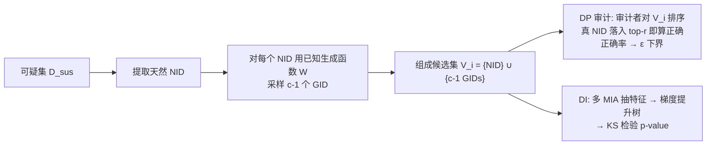

# Natural Identifiers for Privacy and Data Audits in Large Language Models

**会议**: ICLR 2026  
**OpenReview**: [https://openreview.net/forum?id=doaAUf9Pi7](https://openreview.net/forum?id=doaAUf9Pi7)  
**代码**: 待确认  
**领域**: LLM 隐私审计 / 差分隐私 / 成员推断  
**关键词**: Natural Identifiers, Post-hoc DP Auditing, Dataset Inference, Membership Inference, Held-out Data  

## 一句话总结
本文发现训练语料里天然存在的结构化随机串（如哈希值、短链、加密货币地址，称为 **Natural Identifiers / NIDs**），它们的生成函数已知，因此可以无限生成同分布的"held-out 数据"，从而在**不重训模型**、**不需要私有同分布验证集**的前提下，对已训练好的 LLM 做事后差分隐私审计（DP audit）和数据集推断（Dataset Inference）。

## 研究背景与动机
**领域现状**：评估 LLM 是否泄露训练数据有两大类审计手段——一是形式化 DP 审计（验证训练时声明的 $(\varepsilon,\delta)$-DP 保证是否真实），二是数据集推断 DI（判断某个可疑数据子集是否被用于训练）。二者内部都依赖成员推断攻击（MIA）。

**现有痛点**：
- **DP 审计要插 canary 再重训**：主流形式化审计（Steinke et al. 2023 是当前最快的"单训练轮"方案）必须在训练前往数据里塞精心构造的 canary，然后重训观察泄露。对万亿参数 LLM 而言重训成本高到不可行，因此对**已经训好的预训练模型完全用不上**。
- **DI 要私有同分布 held-out 集**：MIA 要成功，非成员数据必须和成员数据**严格同分布（IID）**。现实中这种 held-out 集极难构造——目前能用的几乎只有 Pile/Dolma 自带的验证集。一旦分布有偏（如按时间切分导致措辞/格式漂移），Maini et al. 2024 证明多数 MIA 退化到接近随机猜测。

**核心矛盾**：可扩展、事后（post-hoc）的隐私审计，被"必须重训"和"必须有同分布 held-out 集"这两道墙堵死了。

**本文目标**：在不改训练流程、不重训、不依赖外部私有验证集的前提下，对任意含 NID 的可疑集做形式化 DP 审计与 DI。

**核心 idea**：**天然标识符（NID）作为天然 canary 与同分布 held-out 生成器**。NID 是按已知函数 $W$ 从随机源 $z$ 生成的结构化随机串（$v=W(z)$），它们大量天然存在于 GitHub、StackExchange 等训练语料中（Pile 含 30637 种、Dolma 含 23571 种）。关键在于：既然生成函数已知，就能采样新随机源 $z'$ 生成无穷多同分布的 **Generated Identifiers（GIDs）**，且因标识空间巨大（如以太坊地址 $2^{160}\approx1.46\times10^{48}$），新 GID 几乎不可能撞上已有 NID——于是 GID 天然就是完美的非成员 held-out 数据。

## 方法详解

### 整体框架
方法分两条独立但共用 NID/GID 机制的审计线路：(1) **事后 DP 审计**——把语料里天然出现的 NID 当作"已插入的 canary"，为每个 NID 生成一组 GID 作为"未插入的备选"，让审计者通过排序来推断哪个是真 NID，统计正确率即可反推 $\varepsilon$ 的下界；(2) **数据集推断 DI**——把可疑集里的 NID 当成员、生成的 GID 当 held-out，用多种 MIA 抽特征、训分类器、做统计检验判断可疑集是否被训练。两条线都不需要重训或外部验证集。

### 关键设计

**1. NID/GID 形式化：把"天然随机串"变成可采样的同分布 held-out 源。** 一个标识符由已知生成器作用于随机源得到 $v=W(z)$，全体可能取值构成 $V=\{W(z):z\in Z\}$；**NID** 是真实出现在数据里的那个 $v$，而对同一类型重新采样 $z'$ 得到的就是 **GID**。审计时对可疑集中检测到的每个 NID $\hat v_i$，采样 $c-1$ 个新 GID 拼成候选集 $V_i=\{\hat v_i\}\cup\{c-1\ \text{GIDs}\}$（$|V_i|=c$）。这一形式化的妙处在于：先验上 $V_i$ 中每个元素被生成并发布的概率相等（只取决于随机源），因此"哪个是真 NID"在不看模型时是均匀随机的——这正是构造审计/检验所需的零假设。

**2. 事后 DP 审计：用排序代替二选一，无重训反推 $\varepsilon$ 下界。** 本文改造 Steinke et al. (2023) 的单轮审计：原方法靠掷硬币决定每个 canary 是否进训练集，本质是"加/删一个样本"的二元选择，必须重训。本文把天然 NID 视作"已插入的 canary"、GID 视作"多个未插入的备选"，于是审计者的任务变成对 $V_i$ 里的样本从"最像训练数据"到"最不像"排序，若真 NID 落入 top-$r_i$ 即记为正确。核心定理给出：若机制满足 $\varepsilon$-DP，则 top-$r$ 命中计数被一个 Bernoulli 分布上界约束——
$$P\Big[\sum_{i=1}^{m}\mathbb{1}[\mathrm{rank}(t_i,S_i)\le r_i]\ge v\ \big|\ T=t\Big]\le P_{\hat S\sim\mathrm{Bernoulli}\left(\frac{r_i e^\varepsilon}{|V_i|-1+e^\varepsilon}\right)}[\hat S\ge v]$$
据此用假设检验构造 $\varepsilon$ 的置信下界。相比 $c=2$ 的原方法，更高的候选基数 $c$（更多 GID）在大隐私预算（$\varepsilon\ge8$，恰是 LLM DP 训练常用区间）下显著收紧下界、降低所需样本量；但 $c$ 越大排序越难，小 $\varepsilon$ 时反而小基数更有利。

**3. 数据集推断：NID 当天然 canary，GID 补齐同分布 held-out。** DI 一直被"私有同分布 held-out 集"卡住，本文直接用 GID 填这个洞：对可疑集 $D_{sus}$ 先抽出全部 NID 得到子集 $D'_{sus}$，再为每个真 NID 生成 127 个同类型 GID 作 held-out。沿用 Maini et al. (2024) 的 DI 协议，用 Loss、Min-K%、Min-K%++、ReCaLL、Hinge 等多种 MIA 抽特征，训梯度提升树区分 NID 与 GID（用 K-Fold 并保证派生样本同折，避免泄漏），最后做统计检验。零假设是"NID 未被训练"，此时每个 NID 相对其 GID 的秩应服从均匀分布，用 **Kolmogorov-Smirnov 检验**判断偏离：$p<0.01$ 即拒绝零假设、判定可疑集确被训练。

**4. 任务特定 NID：给没有标准随机串的数据集"造"标识符。** 一些小型任务数据集（如数学题 GSM8K）天然缺少哈希/短链。本文把每道题当作"数值模板"：例如把"Natalia sold 48/2=24..."里的 48 及其所有依赖量（24、72）替换为变量，重采样出一致的新数字得到新题目，原题作 NID、新题作 GID。由于改的是题面数值而保持结构，GID 与 NID 同分布，从而把 DI 框架扩展到无标准 NID 的领域。

## 实验关键数据

### 主实验：DP 审计与 DI
- **DP 审计（Pythia-70m/160m/410m/1b，DP-SGD 微调）**：用 Github Pile test 的 $m=197$ 个 NID，$\delta=10^{-4}$，用 Min-K%/Loss 排序。在 $\varepsilon\in\{5,10,100,\infty\}$ 上，更高基数 $c\in\{8,32\}$ 在 fixed-length 设定下全面超过 $c=2$ 的 Steinke et al. 基线，估计的 $\varepsilon$ 下界更紧。

**DI on Pile（100 个可疑样本，p<0.01 阈值，✓ 表示判断正确）**：

| 模型 | GitHub | StackExch | HackerNews | Pile-CC | ArXiv | PubMed | UbuntuIRC | GH(Test) | Full(Test) |
|------|--------|-----------|------------|---------|-------|--------|-----------|----------|------------|
| Pythia-12B | 0.0031 ✓ | 0.0001 ✓ | 0.0001 ✓ | 0.0001 ✓ | 0.0001 ✓ | 0.0001 ✓ | 0.0001 ✓ | 0.8182 ✓ | 0.2847 ✓ |
| Pythia-6.9B | 0.0001 ✓ | 0.0001 ✓ | 0.0001 ✓ | 0.0002 ✓ | 0.0001 ✓ | 0.0001 ✓ | 0.0001 ✓ | 0.6139 ✓ | 0.0811 ✓ |
| Pythia-2.8B | 0.0001 ✓ | 0.0001 ✓ | 0.0001 ✓ | 0.0001 ✓ | 0.0001 ✓ | 0.0001 ✓ | 0.0001 ✓ | 0.9632 ✓ | 0.0660 ✓ |

**DI on Dolma（OLMo-7B，100 样本）**：OpenWebMath/PeS2o/RefinedWeb/AlgebraicStack/MegaWika/ArXiv/C4 全部 $p\le0.0003$ 正确拒绝，held-out 的 Proof Pile 2 为 $0.8961$ 正确不拒绝。**所有训练子集真阳、所有测试集真阴，零假阳性。**

### 消融实验
- **NID vs 注入 canary**：NID 取得与人工注入 canary 相当的 DI p-value（虽然注入 canary 不在 post-hoc 威胁模型内）。
- **GID 同分布的重要性**：故意让 GID 偏离 NID 分布（如改大小写）会同时给成员/非成员强信号，导致假阳性——印证"必须严格同分布生成"。
- **更强 MIA**：加入 CAMIA、SURP 后 DI 一致变好，说明框架能搭 MIA 进步的便车。
- **标识符结构**：SHA-512、Java 序列化串等更长/更结构化的格式信号最强，但短如 MD5 仍高度显著。
- **NID 数量**：可疑集 NID 越多，DI 的 p-value 单调下降（统计功效提升）。

**任务特定 NID（GSM8K，Pythia-1b 微调 100 个 NID）**：

| NID 数量 | 50 | 60 | 70 | 80 | 90 | 100 |
|----------|-----|-----|-----|-----|-----|-----|
| P-Value | 8.43e-4 | 9.56e-5 | 3.35e-4 | 1.63e-5 | 2.12e-6 | — |

### 关键发现
- MIA 在 test 集上 AUC 接近 0.5（随机），证实 NID 与 GID 确实同分布（Pythia-12b 上 GitHub train AUC 达 71.8，test 仅 51 上下）。
- 即使经过激进正则清洗、URL 规范化、PII 过滤、多级去重的 Dolma，仍残留数万种 NID——审计者只需识别可疑集里**少量** NID 即可审计，使方法在严格数据清洗管线下依然鲁棒。

## 亮点与洞察
- **"天然 canary"是真正的观念转换**：以往审计要么主动注入 canary（要重训）、要么硬找 held-out（要私有数据）。本文洞见是"已知生成函数 + 巨大标识空间"这一组合本身就免费提供了无穷同分布非成员，把"插入"换成"发现"。
- **排序泛化比二元判定更灵活**：把 top-1 二选一推广为 top-$r$ 的 $c$ 选一，让审计者用排序表达不确定性，并提供了可调的统计功效旋钮（基数 $c$）。
- **零假阳性 + 真正零训练轮**：在已知 ground-truth 的开源模型上做到无假阳性，且区别于 Steinke 的"单训练轮"，本文是真正的"零训练轮"事后审计，对真实诉讼场景（如版权数据取证）有直接价值。
- **去除难度的不对称性**：LLM 厂商想过滤掉所有天然 NID 极难（新类型不断涌现、数量巨大），而审计者只需找到极少量即可——这种结构性不对称使方法长期有效。

## 局限与展望
- **威胁模型限定开源已知训练数据**：为验证正确性，实验只在 Pythia/OLMo 等可核对 ground-truth 的开源模型上做；对真正的闭源专有模型，无法验证 DI 结论是否正确。
- **DP 审计仍需自己微调注入 DP**：因缺少开源的"私有预训练 LLM"，DP 审计部分是作者用 DP-SGD 微调 Pythia 来演示的，并非对一个第三方声明 DP 的真实大模型做端到端审计。
- **依赖可疑集含 NID**：若可疑集既无标准 NID、又难以构造任务特定 NID（如纯自由文本且无可参数化结构），方法适用性受限。
- **GID 生成必须精确同分布**：消融已表明任何分布偏差都会引入假阳性，实践中需要对每种 NID 类型谨慎实现生成器。

## 相关工作与启发
- **DP 审计**：建立在 Steinke et al. (2023) 单轮审计之上，相比 Panda et al. (2025)（用随机 token 包裹 canary 增强信号）、Mahloujifar et al. (2025)（top-1 识别）更灵活，且去掉了重训需求；相比 Kazmi et al. (2024) 不需要训练生成模型。
- **DI 与 MIA**：沿用 Maini et al. (2024) 的 DI 协议，针对其"必须有私有 held-out 集"的核心缺陷给出解法；区别于 Zhang et al. (2024a)（注入随机 canary，易被爬虫过滤、对已训模型无效）和 Zhao et al. (2025)（训后缀生成器造合成 held-out，计算昂贵且有残余分布漂移）。
- **启发**：当某类数据具有"已知生成过程 + 巨大取值空间"时，它就可作为天然的隐私审计探针——这一思路可推广到扩散模型、图像自回归模型等其他生成模型的成员/数据审计。

## 评分
- **新颖性**: ⭐⭐⭐⭐⭐ "用天然标识符的已知生成函数无限造同分布 held-out"是一个简洁却深刻的观念转换，同时打通 post-hoc DP 审计与 DI 两个被卡住的难题。
- **实验充分度**: ⭐⭐⭐⭐ 覆盖 Pythia 全系列 + OLMo、Pile + Dolma 多子集，含丰富消融（注入 canary 对比、同分布敏感性、MIA 强度、标识符结构、NID 数量、任务特定 NID），但受限于开源可核对模型，未触及真实闭源大模型。
- **写作质量**: ⭐⭐⭐⭐ 动机—洞见—方法—验证逻辑清晰，定理与直觉（随机响应类比）结合得好；部分关键算法细节下放到附录。
- **价值**: ⭐⭐⭐⭐⭐ 让"对已训练好的 LLM 做事后隐私/版权审计"从不可行变可行，对监管、诉讼取证和负责任部署有直接现实意义。

<!-- RELATED:START -->

## 相关论文

- [\[ICLR 2026\] Benchmarking Empirical Privacy Protection for Adaptations of Large Language Models](benchmarking_empirical_privacy_protection_for_adaptations_of_large_language_mode.md)
- [\[ICLR 2026\] Measuring Physical-World Privacy Awareness of Large Language Models: An Evaluation Benchmark](measuring_physical-world_privacy_awareness_of_large_language_models_an_evaluatio.md)
- [\[ICLR 2026\] SecP-Tuning: Efficient Privacy-Preserving Prompt Tuning for Large Language Models via MPC](secp-tuning_efficient_privacy-preserving_prompt_tuning_for_large_language_mode.md)
- [\[ICLR 2026\] Operationalizing Data Minimization for Privacy-Preserving LLM Prompting](operationalizing_data_minimization_for_privacy-preserving_llm_prompting.md)
- [\[AAAI 2026\] SafeNlidb: A Privacy-Preserving Safety Alignment Framework for LLM-based Natural Language Database Interfaces](../../AAAI2026/llm_safety/safenlidb_a_privacy-preserving_safety_alignment_framework_for_llm-based_natural_.md)

<!-- RELATED:END -->
