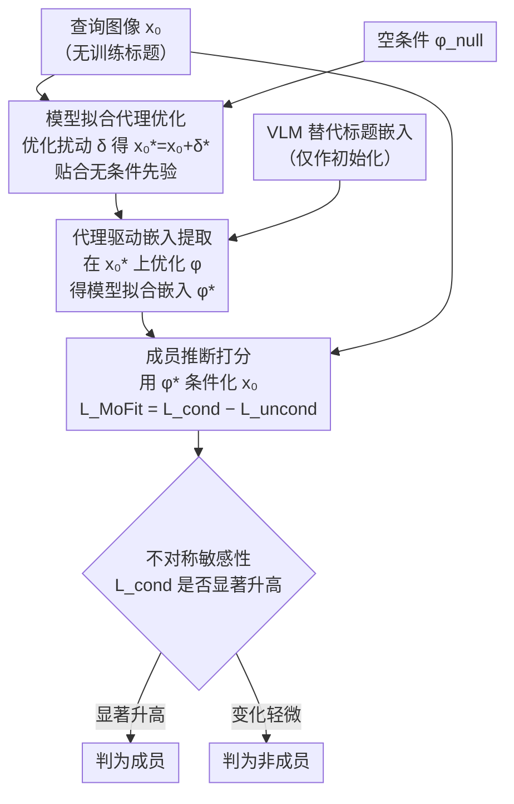

# No Caption, No Problem: Caption-Free Membership Inference via Model-Fitted Embeddings

**会议**: ICLR 2026  
**arXiv**: [2602.22689](https://arxiv.org/abs/2602.22689)  
**代码**: [GitHub](https://github.com/JoonsungJeon/MoFit)  
**领域**: AI 安全 / 隐私攻击  
**关键词**: 成员推断攻击, 扩散模型, 无标题设定, 模型拟合嵌入, 隐私审计

## 一句话总结

提出 MoFit，首个面向无标题场景的扩散模型成员推断攻击框架，通过构建过拟合于目标模型的代理图像和条件嵌入，利用成员样本对条件错配的不对称敏感性实现有效推断。

## 研究背景与动机

- 扩散模型在高保真生成中的记忆化倾向引发隐私和知识产权担忧
- 成员推断攻击（MIA）是审计记忆化的标准方法
- **现有 MIA 的关键假设缺陷**：假设攻击者拥有 ground-truth 标题，但实际中：
    - 艺术家怀疑作品被复制时通常无法获得训练标题
    - 公开生成 AI 平台不披露训练集来源
- 用 VLM 生成的替代标题替换 ground-truth 标题后，SOTA 方法性能显著下降

## 方法详解

### 整体框架

MoFit 把"拿不到真实标题"这个困境，转化成一个为目标模型量身定制条件的优化问题：先在像素空间造一张过拟合于目标模型无条件先验的代理图像，再从这张代理图像反向提取出一个被目标模型"认可"的条件嵌入 $\phi^*$，最后用 $\phi^*$ 去条件化原始查询图像，看它的去噪损失相对无条件损失下降多少来判断成员身份。整个流程不需要训练标题，也不需要额外模型，只调用目标模型自身的去噪网络。

### 关键设计

**1. 不对称敏感性观察：找到无标题场景下仍可用的信号**

MoFit 的出发点是一个经验观察——成员样本和非成员样本对"条件错配"的敏感程度系统性地不同。当用替代标题（而非真实标题）去条件化时，成员样本的条件去噪损失 $\mathcal{L}_{\text{cond}}$ 会显著上升，而非成员样本的变化要小得多；与此同时，无条件损失 $\mathcal{L}_{\text{uncond}}$ 对两组都保持稳定。直觉上，目标模型对见过的样本拟合了一个尖锐的条件分布，一旦条件偏离这个"对的"方向就会被惩罚得更重，未见过的样本本就没有这种尖锐峰值因而更不敏感。这条不对称性意味着：即便没有真实标题，只要能构造出足够贴合目标模型的条件，就能把成员与非成员的损失差异放大成可分的判别信号。

**2. 模型拟合代理优化：先造一张目标模型"过拟合"的图像**

直接在原始图像 $x_0$ 上提取嵌入会受图像自身内容干扰，难以逼近目标模型的真实条件几何。MoFit 转而先优化一个像素扰动 $\delta$，得到代理图像 $x_0^* = x_0 + \delta^*$，让它在无条件先验下被目标模型尽可能"接纳"：

$$\delta^* = \arg\min_\delta \mathbb{E}_{z_0', t, \hat{\epsilon}} [\|\hat{\epsilon} - \epsilon_\theta(z_t', t, \phi_{\text{null}})\|^2]$$

这里用空条件 $\phi_{\text{null}}$ 而非任何标题，是为了让代理只携带目标模型的无条件偏好、不掺入标题先验。实现上固定单次采样得到的 $\hat{\epsilon}$ 和时间步 $t$（全程取 $t=140$）来稳定扰动方向，再沿梯度迭代更新 $\delta$，使代理图像逐步落入目标模型无条件分布的高密度区。消融显示这一步是性能关键：换成原始图像或随机噪声扰动，ASR 会大幅回落。

**3. 代理驱动嵌入提取：从代理图像反推目标模型"认可"的条件**

有了过拟合代理 $x_0^*$，第二步在它上面优化条件嵌入 $\phi$，让条件去噪损失最小：

$$\phi^* = \arg\min_\phi \mathbb{E}_{z_0^*, t, \hat{\epsilon}} [\|\hat{\epsilon} - \epsilon_\theta(z_t^*, t, \phi)\|^2]$$

优化以 VLM 生成的替代标题嵌入为初始化，再被代理图像"拉"向目标模型偏好的条件方向，得到的 $\phi^*$ 不再是一个语义标题，而是一个专门拟合目标模型条件几何的向量。代理图像与嵌入由此构成一对紧密耦合的"模型拟合对"——代理负责锚定无条件先验，嵌入负责对齐条件方向。

**4. 成员推断打分：用 $\phi^*$ 放大不对称损失差**

最后回到真正要判别的原始查询 $x_0$，用拟合好的 $\phi^*$ 条件化它，并以无条件损失作基线相减，得到 MoFit 分数：

$$\mathcal{L}_{\text{MoFit}} = \mathbb{E}[\|\hat{\epsilon} - \epsilon_\theta(z_t, t, \phi^*)\|^2] - \mathbb{E}[\|\hat{\epsilon} - \epsilon_\theta(z_t, t, \phi_{\text{null}})\|^2]$$

减去 $\mathcal{L}_{\text{uncond}}$ 是为了消去图像本身难易带来的偏置，只留下条件错配引起的那部分差异——正是设计 1 中成员样本被放大的信号。最终决策再把 MoFit 分数与一个辅助损失（$\mathcal{L}_{\text{uncond}}$ 或 VLM 标题损失 $\mathcal{L}_{\text{VLM}}$）融合，提高判别稳健性。实验中时间步固定为 $t=140$。

## 实验关键数据

### 无标题设定下的 MIA 性能对比

| 方法 | 条件 | Pokemon ASR | Pokemon TPR@1%FPR | MS-COCO ASR | MS-COCO TPR@1%FPR |
|------|------|------------|-------------------|-------------|-------------------|
| CLiD | GT | 96.52 | 90.14 | 86.50 | 68.80 |
| CLiD | VLM | 77.55 | 19.23 | 80.90 | 50.80 |
| PFAMI | VLM | 74.43 | 6.01 | 80.40 | 29.40 |
| SecMI | VLM | 78.51 | 6.97 | 57.30 | 4.20 |
| **MoFit** | **$\phi^*$** | **94.48** | **50.48** | **88.00** | **47.00** |

### 消融实验：代理图像变体

| 输入 | 条件 | Pokemon ASR | MS-COCO ASR | MS-COCO TPR@1%FPR |
|------|------|------------|-------------|-------------------|
| $x_0$（原始） | $\phi$ | 75.63 | 78.00 | 31.00 |
| $x_0 + \delta$（随机噪声） | $\phi$ | 93.99 | 81.70 | 29.20 |
| $x_0 + \delta_{\text{MAX}}$（反向优化） | $\phi$ | 75.87 | 78.00 | 34.00 |
| **MoFit** ($x_0 + \delta^*$) | **$\phi^*$** | **94.48** | **88.00** | **47.00** |

### 关键发现

1. MoFit 在无标题设定下大幅超越 VLM 条件化基线（ASR 提升最高 +25%，TPR@1%FPR 提升 +30-47%）
2. 在 MS-COCO 上甚至超越使用 ground-truth 标题的 CLiD（ASR: 88.00 vs 86.50）
3. 代理优化是关键：仅使用原始图像或随机噪声优化嵌入效果显著较差
4. 在 SD v1.5 预训练模型上同样有效（ASR: 77.61），说明方法具有通用性

## 亮点与洞察

1. **问题定义的实际意义**：无标题 MIA 场景更贴近现实审计需求
2. **理论洞察深刻**：成员样本对条件错配的不对称敏感性提供了可利用的新信号
3. **巧妙的两阶段设计**：先构建过拟合代理再提取嵌入，形成紧密耦合的模型拟合对
4. **无需额外数据或模型**：仅需访问目标模型的推理接口

## 局限性

- 需要访问目标模型的去噪网络参数（灰盒假设）
- 代理优化和嵌入提取增加了计算开销
- 固定时间步 $t=140$ 为超参数，可能需要针对不同模型调整
- 对 LAION 规模的预训练模型效果相对减弱（该场景所有方法都表现不佳）

## 相关工作

- **扩散模型 MIA**：SecMI, PIA, PFAMI, CLiD
- **LLM MIA**：Shokri et al. (2017)
- **无标题生成**：Classifier-free guidance (Ho & Salimans, 2022)

## 评分

- 新颖性：⭐⭐⭐⭐⭐ — 首个针对无标题场景的扩散模型 MIA 框架
- 技术深度：⭐⭐⭐⭐ — 核心观察深刻，两阶段优化设计合理
- 实验完整性：⭐⭐⭐⭐ — 多数据集、多模型、充分消融
- 实用价值：⭐⭐⭐⭐ — 为数据隐私审计提供了实用工具

<!-- RELATED:START -->

## 相关论文

- [\[ACL 2026\] Do Multimodal RAG Systems Leak Data? A Comprehensive Evaluation of Membership Inference and Image Caption Retrieval Attacks](../../ACL2026/llm_safety/do_multimodal_rag_systems_leak_data_a_comprehensive_evaluation_of_membership_inf.md)
- [\[ICLR 2026\] Information-Theoretic Membership Inference for Granular Quantification of Memorization](information-theoretic_membership_inference_for_granular_quantification_of_memori.md)
- [\[ICLR 2026\] Membership Inference Attacks Against Fine-tuned Diffusion Language Models (SAMA)](membership_inference_attacks_against_fine-tuned_diffusion_language_models.md)
- [\[ICLR 2026\] All Code, No Thought: Language Models Struggle to Reason in Ciphered Language](all_code_no_thought_language_models_struggle_to_reason_in_ciphered_language.md)
- [\[ACL 2026\] Membership Inference Attacks on In-Context Learning Recommendation](../../ACL2026/llm_safety/membership_inference_attacks_on_llm-based_recommender_systems.md)

<!-- RELATED:END -->
