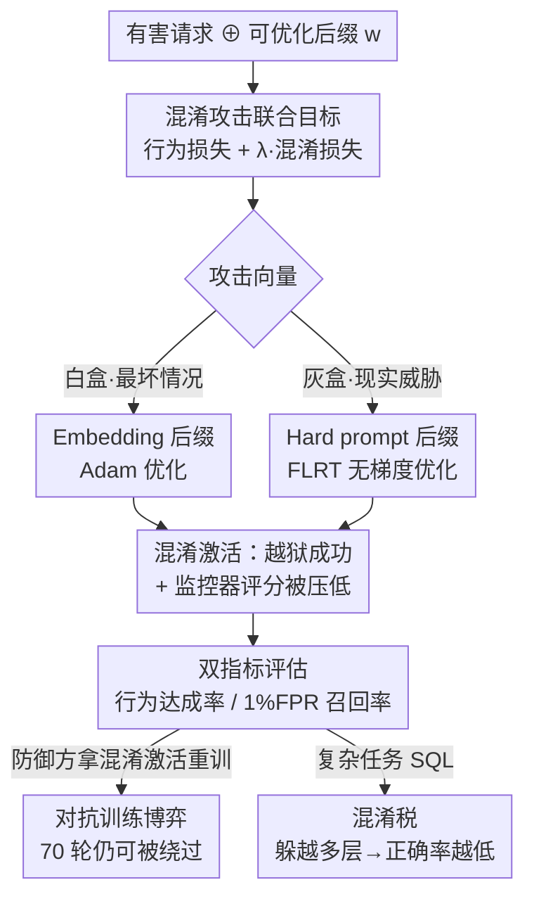

# Obfuscated Activations Bypass LLM Latent-Space Defenses

**会议**: ICLR 2026  
**OpenReview**: [https://openreview.net/forum?id=ktGmDGoWnB](https://openreview.net/forum?id=ktGmDGoWnB)  
**代码**: https://github.com/LukeBailey181/obfuscated-activations  
**领域**: AI 安全 / 对抗攻击 / 可解释性  
**关键词**: 潜空间监控, 激活探针, 越狱攻击, 混淆激活, OOD 检测

## 一句话总结
这篇论文提出"混淆攻击"——在越狱/SQL 等行为目标之外再加一项"骗过潜空间监控"的损失，联合优化对抗后缀，结果能把各类激活探针（线性/MLP/OOD）的召回率从 100% 压到 0% 而越狱成功率仍达 90%，证明白盒潜空间监控对最坏情况攻击并不鲁棒，但同时发现了一个"混淆税"：在写正确 SQL 这类复杂任务上躲探针会拉低模型本身的性能。

## 研究背景与动机
**领域现状**：面对越狱、数据投毒等攻击，社区近年押注"潜空间防御"——不看输出文字，而是直接扫描模型中间层激活，用线性探针、MLP 探针、稀疏自编码器（SAE）或 OOD 检测器来判断"这段激活里有没有有害概念"。直觉很美好：激活在因果上位于输出之前，从根上拦截似乎能治本。

**现有痛点**：这套防御的有效性建立在一个未经检验的假设上——"有害行为必然对应可被识别的有害激活"。如果模型其实可以用很多种不同的激活模式来表达同一个有害概念，那监控器训练时见过的那一小撮"有害方向"就只覆盖了冰山一角，攻击者完全可能绕到监控器没覆盖的激活区域去。

**核心矛盾**：攻击者有一个看似自相矛盾的双重目标——既要诱导出能产生有害行为的激活，又要让这些激活在监控器眼里"看起来无害"。如果潜空间里只有唯一一条"有害方向"，这两件事就根本不可能同时满足；但如果有害行为可以由潜空间里大量不同区域产生，监控器就注定漏掉一部分。问题归结为：潜空间里的"混淆激活"到底是罕见特例，还是遍地都是？

**本文目标**：(1) 标准越狱攻击会不会顺带产生混淆激活；(2) 能不能主动构造攻击去诱导混淆激活、绕过各类监控器；(3) 对抗训练能不能把监控器修鲁棒。

**切入角度**：作者把"骗过监控器"显式写进攻击的优化目标里，即在原本的行为损失上再叠加一项"混淆损失"，让对抗后缀同时服务两个目标。这样就能定量地探测混淆激活在潜空间里到底有多普遍。

**核心 idea**：用一个联合损失 $L_{beh} + \lambda_{obf}L_{obf}$ 把"达成目标行为"和"压低监控器评分"绑在一起优化对抗后缀，从而系统性地诱导出能越狱又能骗过潜空间监控的"混淆激活"。

## 方法详解

### 整体框架
方法本质很简洁：在标准对抗后缀攻击的基础上，额外给优化目标挂一个"反监控"惩罚项。给定一条有害请求，攻击者在请求末尾拼接一段可优化的后缀 $w$（真实 token 或 embedding 矩阵），然后联合最小化两项损失——行为损失 $L_{beh}$（交叉熵，逼模型吐出目标有害回答）和混淆损失 $L_{obf}$（直接等于监控器对该激活打的分 $D(R(\cdot))$，越低越"无害"）。优化收敛后，把后缀拼到测试请求上，模型一边照常输出有害内容，一边其中间层激活已被推到监控器评分极低的区域，于是越狱成功且不被探针/OOD 检测器报警。

整条 pipeline 是一个"攻击 → 评估双指标 → （可选）防御方对抗重训 → 再攻击"的回路：攻击方造混淆后缀，评估时同时量行为是否达成（StrongREJECT 判有害、SQLEval 判 SQL 正确）和激活是否被混淆（1% FPR 下的召回率），防御方再拿被混淆的激活去重训监控器，双方轮流博弈。

### 关键设计

**1. 混淆攻击的联合优化目标：把"骗过监控器"写进损失函数**

潜空间防御之所以一直被默认"鲁棒"，是因为没人专门针对它优化过攻击——标准越狱攻击只盯着输出，激活该长啥样长啥样，所以会被探针逮个正着（论文 3.2 节确认 LogReg/MLP 探针对普通越狱召回率约 90%）。本文的破局点是把监控器本身变成可微的攻击目标。对一段有害请求 $inp$ 与目标回答 $out$，优化后缀 $w$ 去最小化

$$L(w) = \frac{1}{|D|}\sum_{inp,out\in D}\big[\underbrace{\text{CrossEntropy}(M(inp\oplus w),\, out)}_{\text{行为损失}} + \underbrace{D(R(inp\oplus w\oplus out))}_{\text{混淆损失}}\big]$$

其中 $\oplus$ 表示沿序列维拼接，$D(R(\cdot))$ 是监控器对激活打的有害性评分。$\lambda_{obf}$ 在 $[0.1,0.3,1,3,10]$ 里简单扫一遍就能找到好用的平衡值。这一项的妙处在于它直接告诉优化器"往激活空间里监控器看不见的方向走"，于是攻击者得以同时满足"越狱"和"低评分"这对看似矛盾的目标。结果非常彻底：embedding 攻击能把各类监控器召回率压到 0%，越狱率仍约 90%。

**2. 两档攻击向量：灰盒 hard prompt 划现实下界，白盒 embedding 划最坏上界**

只测一种攻击会让结论站不住——太弱说明不了监控器脆弱，太强又不现实。作者用两档威胁模型夹逼。**Hard prompt 后缀**是现实威胁：附加的是真实 token，攻击者只能拿到模型 logit 和监控器输出（灰盒），用改造版 FLRT 优化器以无梯度方式逐 token 增删，平均长度约 256 token；如果连这种现实攻击都防不住，监控器就不能部署。**Embedding 后缀**是最坏情况：攻击者有白盒权限，直接用 Adam 优化一段长度 16 的 embedding 矩阵，且训练成一条对一批输入通用、在留出输入上测试的"通用后缀"；如果监控器连这种攻击都扛得住，才算真鲁棒。两档对比直接给出可操作的实务建议：embedding 攻击下所有探针召回归零，但 hard prompt 攻击下**生成式 MLP 探针明显更鲁棒**——这推翻了近期文献"用线性探针 + 只看少数 token"的主流做法，应改用非线性的生成式探针。此外作者发现混淆攻击在监控器之间高度可迁移（对 LogReg 训的后缀也能骗过 MLP，对 OOD 检测器训的能骗过输入式探针），唯独不迁移到 OOD 检测器，提示"监督探针 + OOD 检测器集成"值得一试。

**3. 对抗训练博弈：70 轮重训也堵不住混淆激活**

如果混淆激活只占潜空间里寥寥几个区域，那防御方只要拿被混淆的样本重训监控器，很快就能把这些区域全覆盖、变鲁棒。作者据此设计了攻防交替实验来反向探测混淆激活的丰度：每个 epoch 攻击方先训一条 embedding 后缀去越狱并骗过当前监控器，防御方再拿当前及历史所有攻击产生的混淆激活去重训监控器（用容量足够的 MLP 探针和均值差探针集成）。结果是防御方对所有"历史攻击"都能做到完美召回，但对"最新攻击"始终守不住——即便重训超过 70 轮，攻击方仍能稳定找到新的、骗过最新探针的后缀，越狱率维持高位。可视化显示混淆激活在良性激活簇周围不断游走、换位置。这从几何上说明潜空间里**不存在一条简单可靠的"有害方向"**，混淆激活遍地都是，对抗训练难以一劳永逸（但作者诚实地指出，跑足够久也许仍可能逼出鲁棒探针）。

**4. 混淆税：复杂任务上"躲探针"会反噬模型自身能力**

前三个设计都在说监控器有多脆，但作者在 SQL 任务上发现了一个对防御方有利的转折。有害性任务本身简单、容易被最坏攻击打饱和，且"有害回答有多有用"难以量化；于是改测"模型生成的 SQL 是否正确"（SQLEval 跑真实数据库核对返回结果）这一未饱和、可精确打分的复杂任务。关键操作是**让混淆难度随被躲的层数递增**：原本探针对全部 26 层（Gemma-2-2b）取均值，现在只对前 $n$ 层评分（记 $D_n$），$n$ 越大意味着 SQL 概念要在越多层里藏起来。实验发现：只测"输出里有没有 SQL"时结论和有害性一致（能躲过监控、MLP 最鲁棒）；但一旦测"SQL 是否正确"，躲的层数越多、SQLEval 正确率越低（所有探针下层数与正确率的 Pearson 相关系数 95% 置信区间全为负），从不混淆时的 34.8% 一路下滑。这说明对(a)正确执行复杂行为和(b)在该行为的探针上混淆激活这对目标之间存在真实的不相容性——模型确实能用多种激活表达 SQL 写作，但不是每种都保留同样的推理能力。有趣的是躲 SAE 类探针时性能掉得更多，暗示 SAE 可能覆盖了更多因果重要特征。

### 损失函数 / 训练策略
核心就是式 (1)/(2) 的联合损失：行为损失用 teacher-forced 交叉熵（有害任务逼出有害串、SQL 任务逼出正确 SQL），混淆损失直接取监控器评分 $D$。Embedding 攻击用 Adam、后缀长 16、白盒；hard prompt 用无梯度 FLRT、灰盒、可增删 token。全程冻结 LLM 参数（不更新模型权重，只优化后缀），因此单卡 80GB A100 一天内即可复现任一实验。

## 实验关键数据

### 主实验
模型为 Llama-3-8B-Instruct（有害性）与 Gemma-2-2b（SQL）。监控器在干净输入上都表现优秀，但在混淆攻击下崩溃：

| 设置 | 攻击向量 | 无混淆召回@1%FPR | 混淆后召回@1%FPR | 行为达成率 |
|--------|----------|------------------|-------------------|------------|
| 有害性探针（线性/MLP/OOD） | Embedding（最坏） | 接近 100% | ↓ 至 0% | 越狱率约 90% |
| 有害性探针 | Hard prompt（现实） | 高 | 显著下降（最稳的探针仍掉约 10%） | 部分越狱 |
| SQL 探针（LogReg/MLP/SAE） | Embedding（最坏） | 高 | 近 0% | SQL 仍可生成 |

迁移性：对 LogReg 探针训练的混淆后缀可绕过 MLP 探针；对生成式探针训练的可绕过输入式探针（反之不行）；对 OOD 检测器训练的甚至能绕过输入式探针；但都不迁移到 OOD 检测器。

### 消融实验

| 配置 | 关键现象 | 说明 |
|------|---------|------|
| 标准越狱（无混淆损失） | 探针召回约 90% | 普通攻击不会自发产生混淆激活 |
| + 混淆损失（embedding） | 召回 ↓ 0% | 联合目标是绕过监控的关键 |
| Hard prompt（灰盒） | 召回部分下降 | 现实威胁下生成式 MLP 探针最鲁棒 |
| 对抗训练 70 轮 | 最新攻击仍被绕过 | 混淆激活在潜空间中丰度高 |
| SQL 躲 0→26 层 | 正确率 34.8% → 持续下滑 | 混淆税：复杂任务有真实代价 |

### 关键发现
- **联合损失里的混淆项是决定性的**：去掉它（普通越狱）召回约 90%，加上它召回归零——这是攻击成功的唯一关键变量。
- **探针架构鲁棒性有差异**：非线性的、基于整段生成的 MLP 探针在现实 hard prompt 威胁下最稳，线性 + 只看少数 token 的主流配置最脆。
- **攻防不对称**：防御方永远能堵住已知攻击，但堵不住下一个新攻击，70 轮博弈后仍如此，说明潜空间里没有单一"有害方向"。
- **混淆税只在复杂任务显现**：有害性这种简单行为可"无痛"混淆，但写正确 SQL 时躲探针会显著掉点，且 SAE 探针下掉得更多。

## 亮点与洞察
- **把防御器变成可微攻击目标**：直接把监控器评分 $D$ 当损失项，思路朴素却极有效，是对"潜空间防御"这一整类方法的通用攻击范式，可迁移到任何输出实值评分的监控器（甚至论文附录证明对 ResNet 图像探针也成立）。
- **"混淆税"是真正的好消息**：在一片"监控器全被打穿"的悲观结论里，作者诚实地挖出复杂任务上攻击者鱼与熊掌不可兼得的代价，给防御方留了一线生机——这种 nuanced（细致而不一边倒）的论证态度很难得。
- **用攻防博弈丰度探测潜空间几何**：把"对抗训练堵不住"反过来当作"混淆激活遍地都是"的实验证据，把一个工程结论升华成关于神经表征"可塑性"的概念洞察（同一行为可由大量不同激活模式实现）。
- **可操作的实务建议**：用非线性生成式探针、监督探针 + OOD 检测器集成——不是空谈，而是从迁移性矩阵直接读出来的。

## 局限与展望
- 作者承认无法排除"对抗训练跑足够久也许能逼出鲁棒探针"，70 轮只是当前算力下的结论。
- Embedding 攻击是最坏情况威胁模型（需要白盒 + 任意 embedding 注入），现实中攻击者未必有此能力；真正现实的 hard prompt 攻击下部分探针仍保留约 90% 召回。
- 混淆税目前只在 SQL 一个复杂任务上观察到，作者自己也指出"难以基于单个案例下普适结论"，SAE 探针掉点更多的解释仍是猜测。
- 实验受小样本影响（hard prompt 仅对 20 条有害查询分别优化），靠 bootstrap 置信区间缓解但误差仍在。
- 可改进方向：系统刻画"哪些任务/能力天然有高混淆税"，把混淆税从经验现象做成可预测的防御设计原则。

## 相关工作与启发
- **vs 普通越狱攻击（GCG/FLRT 等）**：它们只优化输出行为，激活随便长，因此会被潜空间探针抓住；本文在同一优化框架里加一项混淆损失，把"绕过激活监控"也变成显式目标，区别就在这一项，优势是首次系统性打穿潜空间防御。
- **vs 图像域绕过潜空间防御（Carlini & Wagner 等）**：图像域早有对抗样本绕过潜空间检测的工作，本文把这一现象搬到 LLM，并横跨多种监控器、多种攻击向量、多种攻击意图，证明这不是 LLM 独有也不是图像独有的孤立现象。
- **vs Kirch et al. / Arditi et al. 等 LLM 潜空间探针研究**：前者观察到越狱探针泛化差、后者分析越狱的潜空间性质，但都没主动"针对监控器优化攻击"；本文的混淆攻击是直接攻击监控器，与它们互补。
- **启发**：任何"用一个打分器扫中间表征来拦截不良行为"的防御（不限于安全，也包括内容审核、幻觉检测）都应假设打分器本身会被纳入攻击目标，部署时要测最坏情况鲁棒性、并优先考虑非线性 + 集成式监控。

## 评分
- 新颖性: ⭐⭐⭐⭐⭐ 首次把潜空间监控器本身作为可微攻击目标系统打穿，并提出"混淆税"概念
- 实验充分度: ⭐⭐⭐⭐⭐ 覆盖两类任务、两档威胁模型、多种探针/OOD/SAE、迁移性矩阵与 70 轮攻防博弈，附录还含微调/投毒/图像案例
- 写作质量: ⭐⭐⭐⭐⭐ 结论 nuanced 不一边倒，主张与反例都讲清，takeaway 提炼到位
- 价值: ⭐⭐⭐⭐⭐ 对潜空间防御这一热门安全方向给出"不可全信但有救"的明确判断和可落地建议

<!-- RELATED:START -->

## 相关论文

- [\[ICLR 2026\] Dual-Space Smoothness for Robust and Balanced LLM Unlearning](dual-space_smoothness_for_robust_and_balanced_llm_unlearning.md)
- [\[ACL 2026\] SLIM: Stealthy Low-Coverage Black-Box Watermarking via Latent-Space Confusion Zones](../../ACL2026/llm_safety/slim_stealthy_low-coverage_black-box_watermarking_via_latent-space_confusion_zon.md)
- [\[ICLR 2026\] PropensityBench: Evaluating Latent Safety Risks in Large Language Models via an Agentic Approach](propensitybench_evaluating_latent_safety_risks_in_large_language_models_via_an_a.md)
- [\[ICLR 2026\] A Guardrail for Safety Preservation: When Safety-Sensitive Subspace Meets Harmful-Resistant Null-Space](a_guardrail_for_safety_preservation_when_safety-sensitive_subspace_meets_harmful.md)
- [\[ICLR 2026\] LLM Unlearning with LLM Beliefs](llm_unlearning_with_llm_beliefs.md)

<!-- RELATED:END -->
