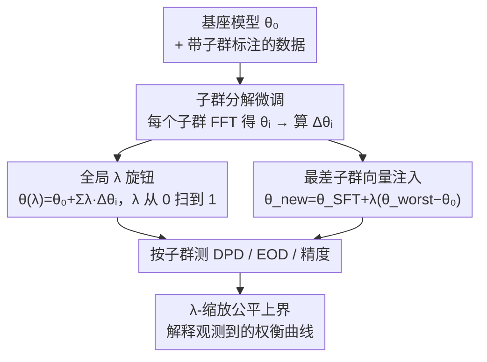

# On Fairness of Task Arithmetic: The Role of Task Vectors

**会议**: ICLR 2026  
**OpenReview**: [https://openreview.net/forum?id=B19MBDrvlM](https://openreview.net/forum?id=B19MBDrvlM)  
**代码**: https://github.com/LauraGomezjurado/fairness_task_vector_deploy  
**领域**: 对齐与公平性 / 模型编辑 / 任务向量  
**关键词**: 任务算术, 任务向量, 群体公平, 模型合并, 公平-精度权衡

## 一句话总结
这是第一篇系统研究"任务算术（task arithmetic）对群体公平性影响"的工作：作者把按子群分别微调得到的任务向量按一个全局标量 $\lambda$ 合并，发现仅调一个 $\lambda$ 就能在保持精度的同时显著降低人口平等差（DPD）和均等几率差（EOD），并给出了一个把 $\lambda$ 缩放和公平指标联系起来的理论上界。

## 研究背景与动机
**领域现状**：把大模型适配到具体任务的主流做法是全量微调（FFT）或参数高效微调（PEFT，如 LoRA）。近年还兴起了一条更轻量的路线——**任务算术 / 任务向量**：把"微调后权重减去基座权重"$\Delta\theta = \theta_{task} - \theta_{base}$ 定义为一个任务向量，它代表权重空间里指向"擅长该任务"的方向。把这种向量做加、减、缩放，就能在不再训练的情况下直接编辑模型行为。

**现有痛点**：任务向量的算力优势和可解释性都很诱人，但它对**公平性**的影响几乎没人研究过。而在仇恨言论检测、毒性评论过滤这类高风险、数据天然不均衡的场景里，PEFT 不仅不能消除偏见，甚至会放大偏见。更麻烦的是，"合并多个子群的任务向量"本质上是在**组合**多个行为，而公平性保证通常**不可组合**——单独看每个子群都公平，合到一起就可能崩。

**核心矛盾**：增强某个人口子群的表现，往往会无意中拖累另一个子群（"负迁移"）；在严重不均衡的数据上合并，又会系统性地偏向多数群体。也就是说，公平和精度之间、以及不同子群之间，存在难以预判的此消彼长。

**本文目标**：（1）把任务算术放到 FFT、LoRA 的同一标尺下，系统量化它对 DPD/EOD 的影响；（2）探究能否用简单的事后操作（如 $\lambda$ 缩放、注入特定子群向量）来"扭"公平性，而无需重新训练；（3）给这些经验现象一个理论解释。

**切入角度**：作者主动放弃了"用贝叶斯优化 / 多目标搜索去学每个子群系数"的复杂做法，转而采用**单一全局标量 $\lambda$** 的极简参数化——因为这正是现实中任务算术工具暴露给用户的旋钮，是一个一维、可解释的控制点，最适合用来追踪公平-精度前沿。

**核心 idea**：把"按子群分别微调 → 合并任务向量"当作一种公平感知的模型编辑手段，用一个全局 $\lambda$ 当旋钮在公平-精度前沿上滑动，并证明偏离"平衡点"会按子群向量范数成比例放大不公平。

## 方法详解

### 整体框架
论文要回答的是"任务向量这套操作怎么影响群体公平"，因此方法本身就是一条可复现的编辑流水线，再叠加两种公平调控手段。整体上：先把训练数据**按敏感属性的子群划分**（性别 / 种族），对每个子群单独做 FFT 得到 $\theta_i$，再相对基座算出子群任务向量 $\Delta\theta_i = \theta_i - \theta_0$；把这些向量用统一系数合并成 $\theta(\lambda) = \theta_0 + \sum_i \lambda_i \Delta\theta_i$，然后在每个子群上分别测精度、DPD、EOD。在这条主线上，作者提供了两个互补的"旋钮"：一个是**全局 $\lambda$ 扫描**（所有子群共享同一个 $\lambda$，从 0 到 1 滑动），另一个是**定向注入**（把表现最差子群的向量单独加进 FFT 模型）。最后用一个理论上界把"$\lambda$ 偏离平衡点的程度"和"公平指标的恶化量"串起来，解释为什么这些曲线长成那样。

### 关键设计

**1. 子群分解微调 + 任务向量合并：把"群体结构"显式编码进权重方向**

任务算术在本文里不是拿来"加多个任务能力"，而是被重新利用来承载**人口子群结构**。作者把训练集按敏感属性切成若干子群（如性别下的 Women / Men / Non-binary…），对每个子群单独全量微调出 $\theta_i$，再算出它相对基座的方向 $\Delta\theta_i = \theta_i - \theta_0$。合并时采用线性组合 $\theta_{merged} = \theta_0 + \sum_{i=1}^{K} \lambda_i \Delta\theta_i$。这样做的价值在于：每个 $\Delta\theta_i$ 都是一个"指向更擅长某子群"的可解释方向，合并后的模型行为可以被拆解到子群粒度，从而把"调公平"变成"调这些方向的权重"——这是后面两个旋钮能成立的前提。

**2. 全局标量 λ：一维、可解释的公平-精度旋钮**

针对"学每个子群系数太贵、又引入随机性"的痛点，作者故意把合并简化为所有子群共享一个标量：$\theta(\lambda) = \theta_0 + \lambda\,\Delta\theta$，同一个 $\lambda$ 均匀作用在所有输入、所有子群、所有公平指标上。$\lambda$ 当成唯一超参，在留出验证集上按"精度 + 群体公平"的联合目标做网格搜索（0.0 到 1.0、步长 0.1）。实验发现这个旋钮非常有用：$\lambda$ 在 0.2 附近精度最高但 DPD/EOD 也最大（最不公平）；一旦 $\lambda \gtrsim 0.3$，精度仍与 FFT/LoRA 持平，而 DPD 和 EOD 随 $\lambda$ 单调下降，且在较大 $\lambda$ 处始终压在 FFT/LoRA 基线之下。也就是说，仅靠一个标量就能扫出一条平滑的公平-效用前沿，这是标准 FFT/LoRA 训练根本不暴露的控制能力。

**3. 最差子群向量定向注入：带权衡的精准干预**

除了全局旋钮，作者还提供一个子群级的精细旋钮。先按 FFT 下 DPD 与 EOD 的均值找出"表现最差"的子群（性别里是 Men 和 Women，种族里是 Asian 和 Native American，排除无具体语义的 others），再把该子群向量单独注入已微调模型：$\theta_{new} = \theta_{SFT} + \lambda(\theta_{worst} - \theta_0)$，$\lambda$ 从 0 到 1、步长 0.2。结果呈现明显的**结构性、子群依赖**的偏移：注入某些向量（如 Men、Asian）会把模型推到更优的公平-精度前沿，而注入另一些（如 Native American）即便精度不变也会让 DPD/EOD 恶化；加入 Women 向量时 Trans Women 子群精度提升，但 Men 的公平指标随 $\lambda$ 增大而变差。这说明任务向量提供的不只是全局旋钮，还有可定向、但需谨慎使用的子群旋钮。

**4. λ-缩放与公平指标的理论上界：给经验曲线一个原理性解释**

为了解释上面的曲线，作者推导了一个把 $\lambda$ 缩放和公平指标直接联系起来的上界。把每个子群系数写成向量 $\lambda = (\lambda_g)_{g=1}^{G}$，平衡参考点取 $\lambda_g = 1$（此时合并模型 $\bar\theta = \theta_0 + \frac{1}{G}\sum_g \Delta\theta_g$ 被假设满足 $\mathrm{DPD}(\bar\theta)=0$）。在若干温和假设下（预测分数对 $\theta$ 是 $L$-Lipschitz 且群体校准、各子群向量用同一优化协议得到、$\sum_g \lambda_g = G$、阈值附近类条件密度有界），定理给出：

$$\mathrm{DPD}(\theta(\lambda)) \le U(\lambda) = 2L\sum_g \left|\lambda_g - 1\right|\,\|\Delta\theta_g\|_2,$$

$$\mathrm{EOD}(\theta(\lambda)) \le \mathrm{EOD}(\bar\theta) + 4\sqrt{(B_0 + B_1)\,U(\lambda)},$$

其中 $L$ 是 Lipschitz 常数，$B_0, B_1$ 是阈值附近 $y{=}0$、$y{=}1$ 两类分数密度的上界常数（⚠️ 完整推导与更紧的常数在原文附录 C，这里为非正式版，以原文为准）。两个指标共享同一个 $U(\lambda)$ 项，当所有 $\lambda_g \to 1$ 时 $U(\lambda) \to 0$，于是 DPD 被压到 0、EOD 趋于平衡点值。直观含义是：**$\lambda$ 偏离平衡点会按子群任务向量范数 $\|\Delta\theta_g\|_2$ 成比例地放大不公平**——这恰好解释了为什么向量范数大的子群对 $\lambda$ 更敏感、parity 摆动更大，与 Figure 2 的曲线吻合。

## 实验关键数据

### 主实验
评测覆盖 NLP 与 CV 双域、四种架构：仇恨言论检测用 LLaMA2-7B（Berkeley D-Lab，6,898 条，按性别/种族细分子群）；毒性检测用 DistilBERT 与 Qwen2.5-0.5B（Civil Comments，阈值 0.5 二分类）；年龄分类用 ViT-Base/16（UTKFace，30 岁阈值二分类）。LoRA 秩固定为 8。指标用宏平均与最差子群两个版本的 DPD/EOD（越低越公平）+ 精度。

| 设置 | 方法 | 精度 | DPD（越低越公平） | EOD（越低越公平） |
|------|------|------|------|------|
| 性别子群 (λ=0.8) | FFT / LoRA | 高、各子群可比 | 基线 | 基线 |
| 性别子群 (λ=0.8) | Task Addition | 与 FFT/LoRA 持平 | 7 个里 5 个优于 FFT | 多数子群下降 |
| 种族子群 (λ=0.5) | Task Addition | 与 FFT/LoRA 持平 | 8 个里 3 个优于 FFT | 无单一方法全胜 |
| Civil Comments | Task Addition (DistilBERT/Qwen) | 与基线竞争力相当 | 整体下降 | 整体下降 |

核心结论：没有任何证据表明任务加法会系统性地损害子群公平；相反，在 $\lambda \gtrsim 0.3$ 区间，它在保持精度的同时把 DPD/EOD 压到 FFT/LoRA 之下。

### 消融实验（λ 扫描与定向注入）

| 配置 | 关键现象 | 说明 |
|------|---------|------|
| $\lambda \approx 0.2$ | 精度峰值，但 DPD/EOD 最高 | 最偏离平衡点，最不公平 |
| $\lambda \gtrsim 0.3$ | 精度仍竞争力强，DPD/EOD 单调下降 | 平滑的公平-效用前沿 |
| 注入 Men / Asian 向量 | 推向更优前沿 | 子群向量可改善公平 |
| 注入 Native American 向量 | 精度稳但 DPD/EOD 变差 | 范数/方向不利的负迁移 |
| 注入 Women 向量 | Trans Women 精度升、Men 公平降 | 子群依赖、需谨慎 |

### 关键发现
- **全局旋钮有效**：单调一个 $\lambda$ 就能在公平-精度前沿上平滑滑动，$\lambda \gtrsim 0.3$ 是甜区。
- **效果高度子群依赖**：注入不同子群向量方向截然相反，敏感度与向量范数 $\|\Delta\theta_g\|_2$ 正相关，与理论预测一致。
- **跨域一致**：从 7B 解码器模型到 0.5B 编码器再到 ViT，结论稳定；FFT/LoRA 的宏平均结果与 Ding et al. (2024) 相符，佐证了实验协议的可靠性。

## 亮点与洞察
- **把任务向量从"多任务合并"重新用于"群体公平调控"**：同一套加减缩放操作，换个语义（子群而非任务）就成了事后公平编辑器，免训练、可解释，思路很巧。
- **理论与经验闭环**：$U(\lambda) = 2L\sum_g|\lambda_g-1|\|\Delta\theta_g\|_2$ 不只是装饰，它精确预测了"哪个子群对 $\lambda$ 更敏感"，并被实验曲线验证——把一个工程旋钮升级成有原理支撑的工具。
- **极简参数化的胜利**：刻意只用一个全局标量而非学一堆系数，反而得到一维可解释的控制点，这个"做减法"的设计选择值得迁移到其他模型合并场景。

## 局限与展望
- 任务限定在**二分类**（仇恨/毒性/年龄），虽然公平结构是多群体的，但多标签、生成式设置下尚无 DPD/EOD 这样公认的指标，作者把这些列为未来工作。
- 定向注入是把双刃剑：某些子群向量会恶化其他子群的公平，缺少自动判断"哪个向量安全可注入"的机制，目前靠事后观察。
- 理论上界依赖若干假设（Lipschitz、群体校准、平衡点 DPD=0、密度有界），其中"平衡模型恰好完全公平"是较强的理想化假设，真实数据下是否成立未充分验证。
- 全局 $\lambda$ 对所有子群一视同仁，虽然简单，但也意味着无法同时把每个子群都推到各自最优——更细粒度的逐群 $\lambda_g$ 优化是自然延伸（作者在理论里已用 $\lambda_g$ 形式但实验只测全局标量）。

## 相关工作与启发
- **vs FFT / LoRA**：它们在训练阶段调参，不天然暴露公平旋钮；本文证明任务算术提供了 FFT/LoRA 没有的事后控制能力（全局 $\lambda$ + 子群向量），且公平表现往往更好。
- **vs FairLoRA / 多目标公平 PEFT（Sukumaran、Wang & Demberg 等）**：它们需要自定义公平目标并重新训练；本文走"训练后再编辑"的路线，用简单算术操作恢复更公平的行为，成本更低。
- **vs 任务合并里的负迁移研究（Ding 2023、Yu 2020）**：本文不仅复现了"简单求和会负迁移"的现象，还用 $\|\Delta\theta_g\|_2$ 给出了量化解释，并把它转化为可控的公平旋钮。

## 评分
- 新颖性: ⭐⭐⭐⭐ 首个系统研究任务算术公平性的工作，并配上理论上界。
- 实验充分度: ⭐⭐⭐⭐ 双域四架构、子群级评测齐全，但仅限二分类。
- 写作质量: ⭐⭐⭐⭐ 经验现象与理论解释闭环，逻辑清晰。
- 价值: ⭐⭐⭐⭐ 为模型编辑提供了一个低成本、可解释的公平调控手段。

<!-- RELATED:START -->

## 相关论文

- [\[ACL 2025\] ZJUKLAB at SemEval-2025 Task 4: Unlearning via Model Merging](../../ACL2025/llm_safety/zjuklab_at_semeval-2025_task_4_unlearning_via_model_merging.md)
- [\[ACL 2026\] Modeling LLM Unlearning as an Asymmetric Two-Task Learning Problem](../../ACL2026/llm_safety/modeling_llm_unlearning_as_an_asymmetric_two-task_learning_problem.md)
- [\[ACL 2026\] SafeConstellations: Mitigating Over-Refusals in LLMs Through Task-Aware Representation Steering](../../ACL2026/llm_safety/safeconstellations_mitigating_over-refusals_in_llms_through_task-aware_represent.md)
- [\[ICLR 2026\] RepIt: Steering Language Models with Concept-Specific Refusal Vectors](repit_steering_language_models_with_concept-specific_refusal_vectors.md)
- [\[ACL 2025\] TIP of the Iceberg: Task-in-Prompt Adversarial Attacks on LLMs](../../ACL2025/llm_safety/tip_iceberg_adversarial_attacks.md)

<!-- RELATED:END -->
