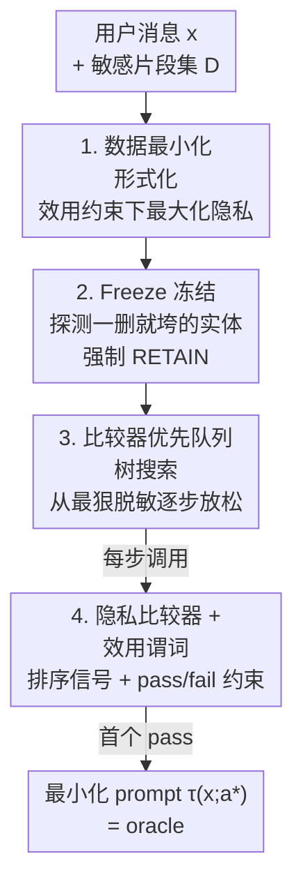

# Operationalizing Data Minimization for Privacy-Preserving LLM Prompting

**会议**: ICLR 2026  
**OpenReview**: [https://openreview.net/forum?id=rpcnvW33EG](https://openreview.net/forum?id=rpcnvW33EG)  
**代码**: 待确认  
**领域**: LLM 安全 / 隐私保护  
**关键词**: 数据最小化, 隐私保护, Prompt 脱敏, 树搜索, LLM-as-a-Judge

## 一句话总结
本文把隐私领域的"数据最小化"原则形式化为一个最优化问题——在不损失任务效用的前提下找出对每个敏感片段"保留/抽象/删除"的最强脱敏方案，并用一个由隐私比较器引导的"先冻结再搜索"优先队列树搜索算法求出这个最优点（oracle），进而揭示：越强的前沿模型能容忍越激进的脱敏（GPT-5 可删 85.7%，Qwen2.5-0.5B 只能删 19.3%），但模型自己直接预测最小化方案时却普遍偏向"抽象"而过度泄露。

## 研究背景与动机
**领域现状**：用户在和 LLM 应用交互时会大量透露个人敏感信息（姓名、地点、行程、单位等），很多人相信"说得越细，回答越好"。现有的隐私防护主流做法是**检测敏感片段，然后做删除（redact，"New York"→"[GEOLOCATION]"）或抽象（abstract，"New York"→"美国的一座城市"）**，或者用启发式规则（如 SSN 这种格式即敏感）和 LLM-as-a-Judge 来判断某条信息对任务"重不重要"，再据此脱敏。

**现有痛点**：这些工作几乎没人**正式地、可量化地**从"数据最小化"这个隐私设计原则的角度去定义问题。它们要么不考虑效用、要么只想在隐私和效用间"取个平衡"、要么在差分隐私预算下最大化效用——但"在严格保住效用的硬约束下把隐私压到最低"这一类问题（也就是真正的数据最小化）几乎无人系统研究。更关键的是，LLM-as-a-Judge 判断"这条信息重不重要"到底有多准，没人验证过。

**核心矛盾**：要量化"用户是否过度分享"，必须先知道**真正的最小披露下界是多少**。而这个下界并不是固定的——它既取决于信息本身和任务，**也取决于响应模型 F 的能力**：强模型可能脑补出被删掉的上下文，弱模型则必须把信息留着才能答对。没有这个"针对特定模型的下界"，就无法判断任何一次分享是否过量。

**本文目标**：(1) 把数据最小化形式化成一个带效用约束的优化问题；(2) 设计算法精确求出给定 prompt 与模型 F 下的最优脱敏方案，作为 oracle（金标准）；(3) 用这个 oracle 去衡量主流 LLM 直接预测最小化方案的能力。

**切入角度**：作者把三种动作 {RETAIN 保留, ABSTRACT 抽象, REDACT 删除} 排成一条**隐私强度递增的序**（保留 ≺ 抽象 ≺ 删除），于是"找最小披露"就变成在这个有序空间里**从最狠的脱敏开始、按隐私递减方向逐步放松、直到刚好通过效用检验**的搜索问题。

**核心 idea**：用"先冻结不可删实体、再用隐私比较器引导优先队列树搜索"代替"让 LLM 一次性拍脑袋判断哪条信息重要"，从而求出任意 prompt+模型的数据最小化 oracle，并暴露出 LLM 在该任务上的能力缺口。

## 方法详解

### 整体框架
方法可以看作一次**为数据最小化定制的树搜索**。输入是一条用户消息 $x$ 和一组已检测出的敏感片段 $D=\{e_1,\dots,e_n\}$；每个片段可以被赋予一个动作 $a_i\in\{\text{RETAIN},\text{ABSTRACT},\text{REDACT}\}$，整体构成动作向量 $a$，作用到 $x$ 上得到变体 $\tau(x;a)$。目标是在保证效用的前提下让隐私最大化：

$$\max_{a\in A^n} \mathrm{Priv}\big(\tau(x;a)\big)\quad\text{s.t.}\quad \mathrm{Util}\big(R(F(\tau(x;a)));a\big)\ge\gamma$$

其中 $F$ 是目标响应模型，$R$ 是**上下文恢复算子**（把占位符/抽象短语在模型输出里替换回真实内容再评效用，保证"删了不影响最终给用户的答案"），$\gamma$ 是可接受的最低效用。这个形式化与具体动作空间、隐私/效用度量、搜索策略都无关。

整体 pipeline 分两阶段串行：**Stage 1 冻结不可改实体**（剔除一删就垮的片段，缩小搜索分支），**Stage 2 隐私比较器优先队列树搜索**（从全局最狠脱敏的根节点出发，按隐私递减逐步放松，命中第一个通过效用检验的节点即为最优解）。搜索过程中反复调用两个"裁判"：**隐私比较器 $C$**（判断两个变体谁更保护隐私）当作排序信号，**效用谓词 UTIL**（pass/fail）当作约束。

### 关键设计

**1. 数据最小化的形式化与三档有序动作空间：把"隐私下界"变成可搜索的优化问题**

以往工作把脱敏当成"检测+替换"或"隐私-效用平衡"，没有一个可计算的"最小披露"定义。本文先给出上面那个带硬效用约束的优化式，再把动作空间具体实例化为 $A=\{\text{RETAIN},\text{ABSTRACT},\text{REDACT}\}$，并把它排成一条**有序格（ordinal lattice）** $\text{RETAIN}\prec\text{ABSTRACT}\prec\text{REDACT}$，编码隐私强度递增。这条序的价值在于：它定义了"单步放松"操作（REDACT→ABSTRACT→RETAIN，每次只让一个片段更具体一点），从而把"找最小披露"变成在偏序空间里的有序遍历，而不是在 $3^n$ 个组合里盲搜。效用谓词 UTIL 是严格的 pass/fail：开放式任务用 GPT-4o 当裁判，按固定 rubric 比对原始输出 $y$ 与脱敏恢复后输出 $\tilde y_{rb}$；有标准答案的任务直接用官方打分器，且单答案 QA 做 $k{=}5$ 次独立解码、全对才 pass。作者特意做了用户研究证明：哪怕只是稍微放松 $\gamma$，用户也能察觉答案质量下降——这支撑了"不许有任何效用退化"的严格谓词。

**2. Freeze-then-Search 的第一阶段：先冻结一删就垮的实体，砍掉搜索分支**

直接在所有片段上搜索代价高，且很多片段（如行程里的目的地"Munnar"）一旦删掉任务就废了。Stage 1 对每个片段 $e\in D$ 单独探测：在其余片段都 RETAIN 的情况下，分别试 REDACT$(e)$ 和 ABSTRACT$(e)$。如果两种脱敏都让效用 fail，就把 $e$ 标记为 **frozen**（之后强制 RETAIN，最多只能抽象不能删）。剩下的非冻结片段 $D'\subseteq D$（数量 $n'=|D'|$）才进入 Stage 2。这一步既保住了效用不变量，又把搜索分支从 $|D|$ 降到 $n'$，是后续树搜索可行的前提。

**3. 隐私比较器优先队列树搜索：从最狠脱敏出发、按隐私递减放松、首个通过即最优**

这是算法核心。树的根节点对 $D'$ 里每个片段都施加 Stage 1 允许的**最强脱敏**（能删就删、否则抽象），代表全局最保护隐私的写法。每个节点编码一个动作向量 $a$ 和对应的 $\tau(x;a)$；它的子节点由**恰好放松一个动作一步**生成（REDACT→ABSTRACT 或 ABSTRACT→RETAIN）。不同于经典 DFS/BFS，本文用一个**以隐私比较器 $C$ 为比较函数的优先队列**来遍历：每次弹出当前队列里"隐私最强"的节点，检验效用，若 fail 就扩展其更具信息的子节点入队。算法返回**第一个通过效用谓词的动作向量** $a$，它就是该 prompt+模型的最小化解（若全部不过则回退到全 RETAIN）。比较器 $C:(x,\tau_A,\tau_B)\mapsto\{\tau_A,\tau_B,\text{SAME}\}$ 只做成对判断、**不要求传递性或全序**，刻意贴合"人的隐私偏好本就可能不传递、依情境而变"这一现实——算法只把它当排序 oracle 用。复杂度上，Stage 2 最多探索 $3^{n'}$ 个动作组合，若展开 $T$ 个节点，二叉堆实现最多需 $O(T\log T)$ 次成对比较（很多被缓存省掉），总时间约 $c\,T\log T\cdot t_C + T\cdot t_{\text{UTIL}}$。

**4. 蒸馏一个低延迟隐私比较器：让昂贵的"谁更隐私"判断能在搜索里高频调用**

树搜索每步都要调比较器，若每次都用 o1/o3 这类推理模型（6–8 秒/次）根本跑不动。作者先在 ShareGPT 的 PII 富集子集上采 150 个 A/B 对、每对至少 5 人标注得到人类金标，再另造 4840 个对、用强零样本裁判（OpenAI o3）打**教师标签**，对 Qwen2.5-7B-Instruct 做 LoRA 监督微调，蒸出一个延迟优化的比较器。它在人类标注上整体一致率 71%、在高共识（≥0.8）样本上 89%，而延迟仅 **0.31 秒/次**——相比零样本裁判提速 >20×，且高共识准确率相当。正是这一步把复杂度里的 $c\,T\log T\cdot t_C$ 项大幅压低，让 Stage 2 搜索在实践中可行。

### 一个完整示例
以"旅行社行程规划"这条 prompt 为例（图 1）：里面含 Munnar、Tekkady、Kerala、Hyderabad、Kochi、25th Jan、28th Jan 等多个敏感片段。根节点把它们全部抽象或删除（隐私最强），效用检验 **FAIL**——因为目的地 Munnar、Tekkady 一旦删掉，行程就无从安排。算法沿着优先队列逐步放松：先把 Munnar、Tekkady 从"删除"退到"抽象"（变成"南印度的一个著名山区小镇""南印度的一座城市"），其余片段仍尽量删；几步之后命中第一个 **PASS** 的节点——此时 Munnar/Tekkady 被冻结在抽象层（再删就破坏效用），而 Kochi、日期等仍被删除或留作占位符。这个"既最小披露又刚好够用"的版本就是该模型的 oracle。

### 损失函数 / 训练策略
方法主体是搜索算法、无端到端训练。唯一的训练发生在隐私比较器：用 OpenAI o3 教师标签对 Qwen2.5-7B-Instruct 做 LoRA 监督微调（超参见原文附录 B）。效用裁判 GPT-4o 与各动作的替换映射均为零样本/确定性规则，不训练。

## 实验关键数据

### 主实验
在四个数据集上评测：开放式对话 ShareGPT(176)、WildChat(139)，与有唯一答案的知识密集任务 CaseHOLD(法律 MCQ,110)、MedQA(医学 MCQ,108)。用九个模型作为响应模型 $F$，报告最优脱敏方案中 REDACT/ABSTRACT/RETAIN 的占比（删得越多、留得越少越好）。

| 响应模型 | 开放式 REDACT↑ | 开放式 RETAIN↓ | 闭合式 REDACT↑ | 闭合式 RETAIN↓ |
|--------|------|------|------|------|
| gpt-5 | 85.7% | 5.7% | 97.1% | 1.1% |
| gpt-4.1 | 82.6% | 7.6% | **98.0%** | 1.0% |
| claude-sonnet-4 | 74.8% | 14.0% | 97.2% | 0.9% |
| mistral-small-3.1-24b | 75.3% | 12.2% | 96.4% | 1.9% |
| qwen2.5-7b | 69.9% | 18.1% | 91.7% | 3.7% |
| qwen2.5-0.5b | 19.3% | 69.7% | 32.1% | 56.2% |

核心结论：**模型越强、能容忍的脱敏越激进**。前沿模型在散点图上聚在 $x+y\approx1$ 带（删除+抽象几乎占满，几乎不用保留任何 PII）；闭合式任务比开放式还能删得更狠。整体上脱敏是"删除为主"，抽象只占 1–12%——说明多数情况下直接删掉敏感片段就够保住效用了。

### 对抗审计与"预测 vs oracle"

| 审计 / 对比 | 关键指标 | 结果 |
|------|---------|------|
| 跨片段恢复 pcorr（ABSTRACT） | 攻击者能猜对的比例 | 5.6%–14.9%（偏高） |
| 跨片段恢复 pcorr（REDACT） | 同上 | 2.7%–7.7%（更低，全 ≤0.077） |
| 按类型恢复 Hit@1（WildChat,NAME） | 原文→脱敏后 | 90.3% → 0.0% |
| 按类型恢复 Hit@1（GEOLOCATION） | 原文→脱敏后 | 89.8% → 2.2% |
| 单次预测 vs gpt-5 oracle | 主要类别 | Overshare（过度泄露）占主导 |

### 关键发现
- **删除比抽象更抗推断**：攻击者在被删片段上既更少尝试、也更难猜对（pcorr ≤7.7%），而抽象片段留下更多线索（最高 14.9%）——支持"优先删除"的脱敏策略，尤其对开放式输入。
- **脱敏确实有效**：按类型恢复显示，掩码让 NAME 的 Hit@1 从 90.3% 暴跌到 0.0%，连用 GPT-5 自己攻击自己的最小化 prompt 也无法还原被删信息。
- **LLM 不会做数据最小化，且偏向抽象**：让模型一次性直接预测每个片段的动作时，普遍 Overshare（比 oracle 泄露更多），且系统性偏好 ABSTRACT 而非 REDACT。消融证明这种偏好是**模型内生**的——去掉 prompt 里"优先用更强脱敏"的指令后行为几乎不变。这暴露的不只是隐私差距，更是**能力差距**：模型并不清楚自己解任务到底真正需要哪些信息。
- **模型家族差异**：Mistral/Qwen/GPT-4.1 默认"抽象优先"，连 URL/EMAIL/ID 这种结构化标识符也只抽象不删；Claude 在开放式任务上有明显的 RETAIN 尾巴；只有 GPT-5 和 Exaone 两个推理模型会稳定地删除高精度类型。

## 亮点与洞察
- **把抽象的隐私原则变成可计算的 oracle**：GDPR 里的"数据最小化"一直是定性原则，本文第一次给它一个针对具体 prompt+模型的、可搜索求解的最小披露下界，让"用户是否过度分享"第一次有了量化标尺。
- **隐私强度的有序格 + 单步放松**是把组合爆炸问题驯服成有序搜索的关键 trick，可迁移到任何"在硬效用约束下逐步加强某种处理"的场景（如最小化上下文长度、最小化工具调用）。
- **比较器不要求传递/全序**这一点很诚实：人类隐私偏好本就矛盾、依情境，强行假设偏序反而失真；把它当噪声排序 oracle 用，再靠蒸馏压低延迟，是工程上让搜索跑得动的务实选择。
- **"能力差距"的视角**最让人"啊哈"：模型过度分享不是因为不想保护隐私，而是它根本不知道哪些信息对解题是必要的——这把隐私问题重新框定成了一个模型自我认知/可解释性问题。

## 局限与展望
- **依赖外部裁判的可靠性**：效用谓词靠 GPT-4o、比较器靠蒸馏模型，二者只在高共识样本上才足够准（比较器整体仅 71%）；超过一半的人类标注共识 <0.8，说明"哪条更隐私"本身就因人而异，oracle 带有标注主观性。
- **PII 检测前置且固定**：敏感片段 $D$ 由 GPT-4o 预先检测并聚类，漏检的隐私不在保护范围内；抽象短语也由 GPT-4o 统一生成，质量决定上限。
- **搜索代价**：最坏 $3^{n'}$ 组合，靠 Freeze 与缓存压低，但片段很多的长 prompt 仍可能昂贵；本文是离线求 oracle，不是实时脱敏。
- **改进方向（作者主张）**：把 oracle 当高质量监督，**蒸馏出一个能在端侧单次预测的小模型**，配合"小边缘模型本地脱敏、再发给云端大模型"的双模型管理范式，让用户在与远端模型交互前就掌控隐私流。作者甚至呼吁 LLM 提供方把"该模型专属的最小化预测器"作为模型发布包的一部分。

## 相关工作与启发
- **vs 检测+脱敏类（Dou et al. 2024 / Zeng et al. 2025）**：他们做"检测敏感片段→删除或抽象"，但不优化效用约束下的最小披露；本文把脱敏放进一个保效用硬约束的优化框架里，并求出最优点而非给个启发式方案。
- **vs LLM-as-a-Judge 重要性评估（Ma et al. 2025 / Ngong et al. 2025）**：他们让 LLM 判断信息"重不重要"再脱敏；本文不仅用比较器+搜索绕开"一次性拍脑袋"，还实证了 LLM 在该任务上判断不准、偏向过度分享，揭示了这类方法的能力缺口。
- **vs 差分隐私训练 / 机器遗忘（Abadi et al. 2016 等）**：那是训练侧、需要模型参数、有算力与效用代价，且管不了推理期泄露/数据泄露；本文是**黑盒、推理前**的方法，只动用户输入、用输出级效用检验，能兼容闭源且快速迭代的模型，从源头减少披露。

## 评分
- 新颖性: ⭐⭐⭐⭐⭐ 第一次把数据最小化形式化为可搜索的 oracle，并提出隐私比较器引导的优先队列树搜索，视角与方法都新。
- 实验充分度: ⭐⭐⭐⭐ 四数据集九模型、含跨片段/按类型双重对抗审计与预测-oracle 对比，扎实；但靠 LLM 裁判、共识偏低是隐忧。
- 写作质量: ⭐⭐⭐⭐ 形式化清晰、跑例直观、消融到位，部分实现细节散落附录。
- 价值: ⭐⭐⭐⭐⭐ 为端侧隐私脱敏提供金标准监督与清晰范式，"能力差距"洞察对后续研究有方向性意义。

<!-- RELATED:START -->

## 相关论文

- [\[ICLR 2026\] SecP-Tuning: Efficient Privacy-Preserving Prompt Tuning for Large Language Models via MPC](secp-tuning_efficient_privacy-preserving_prompt_tuning_for_large_language_mode.md)
- [\[NeurIPS 2025\] FedRW: Efficient Privacy-Preserving Data Reweighting for Enhancing Federated Learning of Language Models](../../NeurIPS2025/llm_safety/fedrw_efficient_privacy-preserving_data_reweighting_for_enhancing_federated_lear.md)
- [\[ICLR 2026\] Natural Identifiers for Privacy and Data Audits in Large Language Models](natural_identifiers_for_privacy_and_data_audits_in_large_language_models.md)
- [\[ICLR 2026\] Searching for Privacy Risks in LLM Agents via Simulation](searching_for_privacy_risks_in_llm_agents_via_simulation.md)
- [\[AAAI 2026\] SafeNlidb: A Privacy-Preserving Safety Alignment Framework for LLM-based Natural Language Database Interfaces](../../AAAI2026/llm_safety/safenlidb_a_privacy-preserving_safety_alignment_framework_for_llm-based_natural_.md)

<!-- RELATED:END -->
