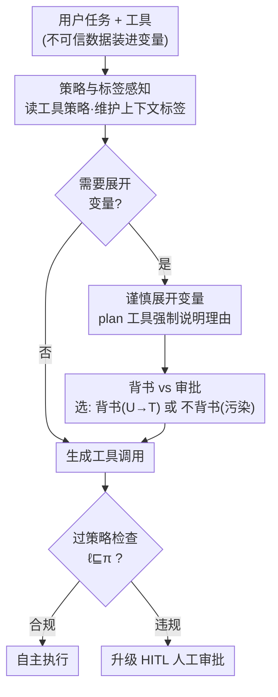

# Optimizing Agent Planning for Security and Autonomy

**会议**: ICLR 2026  
**OpenReview**: [https://openreview.net/forum?id=g0aVCDY3gS](https://openreview.net/forum?id=g0aVCDY3gS)  
**代码**: 待确认  
**领域**: Agent / AI 安全 / 对齐安全  
**关键词**: 间接提示注入, 信息流控制, 确定性防御, 人在回路, Agent 自主性

## 一句话总结
针对"确定性安全防御让 Agent 看起来很昂贵（任务完成率低、要频繁问人）"这一偏见，本文提出**自主性（autonomy）指标**重新定义防御的收益，并设计了一个让规划器"懂安全策略"的 Agent——PRUDENTIA，通过策略感知、谨慎展开变量、以及"背书代替逐个审批"，在不牺牲任务完成率的前提下把人工介入次数（HITL load）相比 SOTA 降低最多 1.9×。

## 研究背景与动机
**领域现状**：AI Agent 越来越多地从邮件、网页、文件等外部数据源取信息来完成任务，但这也使它们暴露在**间接提示注入攻击（indirect prompt injection, PIA）**之下——攻击者把恶意指令藏进数据里，劫持 Agent 去做危险动作（如外泄机密、发布恶意补丁）。针对 PIA 有两类防御：概率性防御（模型对齐、防御性系统提示、分类器）和确定性的系统级防御。

**现有痛点**：概率性防御不提供强安全保证，面对精心构造的 PIA 仍会被攻破。确定性防御中最有前景的一支是**信息流控制（Information-Flow Control, IFC）**：给所有数据贴上完整性（trusted/untrusted）和机密性（public/secret）标签，标签随数据派生而传播，再用标签判断某个工具调用是否合规。只要标签和策略正确，IFC 能**可证明地**消除 PIA。但问题是：如果只用"效用（utility，即任务完成率）"来衡量，确定性防御非常吃亏——在 AgentDojo 上它会让任务完成率最多掉 30%，因为很多本来无害的动作也被策略卡住了。

**核心矛盾**：现有评测只算了确定性防御的**成本**（效用下降），却没有指标去衡量它的**收益**。而它最大的收益恰恰被忽略了——它能减少对人类监督的依赖。真实世界的 Agent（GitHub Copilot、Codex、Computer Use）对有后果的动作默认要人来批准，因为它们缺乏判断"这个动作到底安不安全"的上下文信息，只能靠不完美的启发式。IFC 恰好提供了这种上下文：只有在动作无法被判定为合规时才需要问人。

**本文目标**：(1) 提出能量化确定性防御收益的自主性指标；(2) 设计一个为自主性优化、且保留可证明安全保证的 Agent。

**切入角度**：作者观察到，现有 IFC Agent 里有个根本缺陷——**生成计划的模型根本不知道 IFC 机制在强制执行什么策略**。规划器在"盲飞"，于是会做出很多本可避免的策略违规，白白触发人工介入。

**核心 idea**：把"策略合规"从一个**事后被拦截的约束**，变成规划器**主动追求的优化目标**——让 Agent 感知标签与策略、谨慎决定何时把不可信数据暴露给模型、并用"一次性背书数据"替代"逐个审批动作"。

## 方法详解

### 整体框架
PRUDENTIA 建立在 SOTA 确定性防御 **FIDES** 之上，沿用了 **Dual LLM** 模式：工具返回的、可能含注入的不可信数据被装进**变量（variable）**，变量可以传给工具，但其内容对规划器 LLM 隐藏，从而避免规划器上下文被"污染"（tainted，即被打上不可信标签而限制后续动作）。在此之上，PRUDENTIA 不修改底层 IFC 执行机制，纯粹通过**上下文工程**（在工具描述里写入策略、新增 `plan` 工具、给 `expand_variables` 加背书选项）让规划器变得"懂策略"。

整体流转是：Agent 读到工具描述里标注的策略（哪些是有后果的 P-T 动作、哪些会外泄数据 P-F、哪些无后果），并维护自己上下文的标签。当它想用到藏在变量里的不可信数据时，先调 `plan` 工具说明为什么必须展开、后续打算调哪些工具；展开时它要在两条路里选——**请求用户背书**（把数据从 untrusted 重标为 trusted，上下文不被污染，后续 P-T 调用可自主进行），或**不背书直接展开**（污染上下文，后续每个有后果的调用都得逐个问人）。每个工具调用最终都过一遍策略检查：合规则自主执行，不合规则升级为人工审批（HITL）。

### 关键设计

**1. 策略与标签感知：让规划器从"盲飞"变成"看着地图飞"**

这是 PRUDENTIA 的根基，针对的痛点是现有 IFC Agent 的规划器对策略一无所知。具体做法是把每个工具的策略**写进工具描述**——标注它是有后果的动作（适用"可信动作"策略 P-T）、会外泄数据的动作（适用"许可流"策略 P-F），还是无后果的动作（无策略）；同时 Agent 始终维护自己上下文的当前标签。形式上，一个工具调用 $f^{\ell}[a_1^{\ell_1}, \dots, a_n^{\ell_n}]$ 满足策略 $\pi=(\pi_f, \vec{\pi})$ 当且仅当工具与每个参数的动态标签都不高于策略规定的级别，即 $\ell \sqsubseteq \pi_f$ 且 $\ell_i \sqsubseteq \pi_i$。有了这两样信息，Agent 就能**预测**哪些调用会触发策略违规，从而在规划阶段就绕开安全约束，而不是等到调用被拦截后再被动补救。这正是 PRUDENTIA 比 FIDES 强的根源——FIDES 是"违规了才拦"，PRUDENTIA 是"规划时就避开违规"。

**2. 谨慎展开变量：用一个 `plan` 工具逼 Agent 三思而后污染**

变量的作用是把可能含注入的不可信数据藏起来，所以**一旦展开变量，上下文标签就被永久污染**，后续受限。痛点是 Agent 经常不必要地展开变量，过早把自己锁死。PRUDENTIA 通过 few-shot 示例教会 Agent 展开变量的后果，并引入一个专门的 `plan` 工具：每当 Agent 想展开变量，它必须先调 `plan`，**显式说明为什么需要展开、并列举展开后打算调用哪些工具**。这一步像是给冲动的展开操作加了道"请陈述理由"的闸门，能有效拦下那些其实没必要、却会过早污染上下文的展开。此外作者还做了个小优化：一旦决定**不背书**地展开某个变量（反正上下文已被污染），就索性把所有变量都展开——因为此时再藏其他变量已经没有任何自主性收益了。

**3. 背书代替审批：把"逐个批 10 次"压成"背书 1 次"**

这是把 HITL 次数压下来的关键招。痛点在于：当任务依赖一封不可信邮件里的数据时，传统做法是检视（inspect）邮件——这会污染上下文，导致后续每个有后果的调用都要单独问人批准。PRUDENTIA 让 Agent 可以在展开变量的那一刻**请求用户背书（endorse）**这份不可信数据：用户一旦背书，数据就从 untrusted（U）重标为 trusted（T），变量得以展开而**不污染上下文**，后续对 P-T 工具的调用就能自主进行。举例：一封无害邮件里有 10 个待办项、每项各需一次 P-T 调用——背书邮件只需 **1 次** HITL 交互，之后 10 个子任务全自主完成；而不背书地检视邮件会污染上下文，需要 **10 次** HITL 才能逐个批准。但背书并非总是划算：有些任务展开变量后只是基于不可信数据做规划、并不会再有有后果的调用，此时背书反而是一次多余的 HITL。所以 PRUDENTIA 把选择权交给 Agent——`expand_variables(ask_endorsement=True)` 保持标签不变，或 `expand_variables(ask_endorsement=False)` 污染上下文——由 Agent 自己权衡哪条路 HITL 更少。值得一提的是，作者**刻意不引入**背书的对偶操作"解密（declassification，降低机密性标签）"，因为"是否该泄露隐私信息"高度依赖具体情境，更适合用逐个动作审批来把关，而非一刀切地批量解密。

### 损失函数 / 训练策略
本文不涉及模型训练。PRUDENTIA 完全通过**上下文工程**实现：把背书逻辑并入 `expand_variables` 工具、新增 `plan` 工具、在工具描述里写入策略标注，**不需要对底层 IFC 执行机制做任何改动**。这也意味着它可以即插即用地叠加在现有 IFC 防御之上。

## 实验关键数据

在 **AgentDojo**（含 banking / Slack / travel / workspace 四套任务）和 **WASP**（浏览器 Agent 安全，GitLab 48 例 + Reddit 36 例）上评测。基线包括：Basic（无安全机制，所有有后果调用都问人）、Basic-IFC（Basic 加 IFC 与策略检查）、FIDES（SOTA IFC Agent）。每个实验重复 5 次，报告均值与标准差。

### 主实验

AgentDojo 上，自主性以 HITL load（越低越好）和 TCR@0（无人工介入下的完成率，越高越好）衡量：

| 模型 | 方法 | HITL load | TCR@0 | 说明 |
|------|------|-----------|-------|------|
| o3-mini | Basic | 48.2 | 24.3% | 非 IFC 基线 |
| o3-mini | Basic-IFC | 32.4 | 35.5% | 仅加 IFC，HITL 已降 1.5× |
| o3-mini | FIDES | 18.8 | 50.1% | SOTA IFC |
| o3-mini | **PRUDENTIA** | — | **59.1%** | TCR@0 比 FIDES 高 9% |
| o4-mini | FIDES | 36.8 | — | 完成率 75.7% |
| o4-mini | **PRUDENTIA** | **19.2** | — | 完成率 73.2%，HITL 降 1.9× |

关键结论：相比 FIDES，PRUDENTIA 在不允许任何人工介入（TCR@0）时完成率高最多 9%，整体 HITL load 降最多 1.9×；相比 Basic，HITL 降最多 2.9×。

WASP 上 PRUDENTIA 表现更极致——它把所有不可信内容都藏进变量、且保证有后果调用绝不在不可信上下文里发生，因此达到了**完全自主（HITL load = 0）**且**拦下全部注入攻击**：

| 模型 | 环境 | Basic 攻击成功率 | PRUDENTIA 攻击成功率 | Basic TCR | PRUDENTIA TCR |
|------|------|------------------|----------------------|-----------|---------------|
| GPT-4o | GitLab | 20.8% | 0 | 64.6% | 75.0% |
| GPT-4o | Reddit | 47.2% | 0 | 36.1% | 55.6% |
| o1 | GitLab | 29.2% | 0 | 62.5% | 85.4% |
| o3-mini | Reddit | 61.1% | 0 | 25.0% | 58.3% |
| o4-mini | Reddit | 52.8% | 0 | 36.1% | 63.9% |

PRUDENTIA 在零 HITL、零攻击成功的同时，TCR 普遍优于 Basic，且对话轮数（turns）与 Basic 相当。

### 关键发现
- **IFC 本身就能白送自主性**：即便是不为自主性优化的 Basic-IFC，也能在**完全不掉**任务完成率的前提下把 HITL load 降 1.5×；Basic 与 FIDES 这类确定性防御相比非 IFC 的 Basic，能减少 1.5–2.6× 的人工介入。这直接反驳了"确定性防御很昂贵"的旧观念。
- **主动避让 > 被动拦截**：PRUDENTIA 的增益来自它能在规划时就**绕开**策略违规，而 FIDES 只是在违规发生时检测并拦截。这是 TCR@0 提升和 HITL 下降的根本来源。
- **背书机制对数据无关任务尤其有效**：WASP 任务都是数据无关的，PRUDENTIA 把不可信内容全藏进变量后能达到 HITL = 0 的理想自主性；而注入攻击在 Reddit（36.1%–61.1%）比 GitLab（14.6%–29.2%）更易得手。

## 亮点与洞察
- **换一把尺子，结论就反转**：本文最"啊哈"的地方不是某个模型技巧，而是指出现有评测只量成本不量收益。提出 HITL load 和 TCR@k 后，原本"昂贵"的确定性防御立刻显出"省人工"的巨大收益——一个度量层面的贡献，胜过很多算法改进。
- **TCR@k 曲线把权衡画成一条谱**：通过把 TCR 作为人工介入预算 $k$ 的函数来画曲线（$k=0$ 是全自主，$k=\infty$ 退化为传统 benchmark 的 TCR），完整呈现了自主性—效用的权衡谱，理想 Agent 的目标是逼近"全知 Agent"的曲线。
- **零训练、纯上下文工程**：PRUDENTIA 不动底层 IFC、不训模型，仅靠加 `plan` 工具、改 `expand_variables`、在工具描述里注入策略就实现，可迁移性极强——任何 IFC 防御都能套这套"策略感知规划 + 背书"。
- **"背书数据"而非"审批动作"的粒度选择很巧**：把人工介入从动作粒度上移到数据粒度，一次背书覆盖后续一连串调用，这个降本思路可迁移到任何需要人工把关的批处理场景。

## 局限与展望
- **依赖标签与策略的正确性**：IFC 的可证明安全建立在"数据被正确打标、策略被正确指定"之上，标签错误或策略不全时保证就失效；这层假设本文未深入压力测试。
- **HITL 是模拟的**：评测时假定"成功完成的任务里，人类会批准那些没过策略检查的调用"，HITL load 是在良性条件下数轨迹里的违规动作数，并非真人交互，真实用户行为可能更复杂。
- **刻意放弃解密能力**：作者出于"隐私泄露是否合适高度依情境"而不引入 declassification，这在需要主动降密的任务上会留下自主性缺口。
- **威胁模型假定用户/规划器/工具实现可信**：仅数据源可能含注入；若规划器 LLM 自身被攻破，整套保证不成立。
- **跨任务比较需谨慎**：不同任务难度、不同 HITL 预算下的数值不可直接比大小，曲线对比才有意义。

## 相关工作与启发
- **vs FIDES**：FIDES 同样基于 IFC + Dual LLM，但规划器对策略无感知，只能"违规了再拦"。PRUDENTIA 在 FIDES 之上让规划器"懂策略、会避让"，并加入背书机制，在同等安全下把 HITL 降最多 1.9×、TCR@0 高 9%。
- **vs CaMeL**：CaMeL 也用 Dual LLM，但计划不能依赖动态获取的工具结果；FIDES/PRUDENTIA 允许 Agent 在污染上下文的代价下检视变量全文，PRUDENTIA 进一步用背书把"污染"这一代价规避掉。
- **vs 概率性防御（模型对齐 / 防御性系统提示 / 分类器）**：这些方法不提供强安全保证、仍会被复杂 PIA 攻破；本文走确定性 IFC 路线，提供可证明的安全，并证明它在自主性上反而占优。

## 评分
- 新颖性: ⭐⭐⭐⭐⭐ 用"自主性指标"重新定义确定性防御的价值，是评测范式层面的创新
- 实验充分度: ⭐⭐⭐⭐ 两个 benchmark、多模型、重复 5 次，但 HITL 为模拟而非真人交互
- 写作质量: ⭐⭐⭐⭐⭐ 问题动机清晰，指标定义严谨，组件拆解干净
- 价值: ⭐⭐⭐⭐⭐ 直击"安全 Agent 落地要人盯太累"的真痛点，方法零训练可即插即用

<!-- RELATED:START -->

## 相关论文

- [\[ICLR 2026\] A2ASecBench: A Protocol-Aware Security Benchmark for Agent-to-Agent Multi-Agent Systems](a2asecbench_a_protocol-aware_security_benchmark_for_agent-to-agent_multi-agent_s.md)
- [\[ICLR 2026\] Breaking Agent Backbones: Evaluating the Security of Backbone LLMs in AI Agents](breaking_agent_backbones_evaluating_the_security_of_backbone_llms_in_ai_agents.md)
- [\[ICLR 2026\] MOAI: Module-Optimizing Architecture for Non-Interactive Secure Transformer Inference](moai_module-optimizing_architecture_for_non-interactive_secure_transformer_infer.md)
- [\[ICLR 2026\] RedCodeAgent: Automatic Red-teaming Agent against Diverse Code Agents](redcodeagent_automatic_red-teaming_agent_against_diverse_code_agents.md)
- [\[ICLR 2026\] ARMS: Adaptive Red-Teaming Agent against Multimodal Models with Plug-and-Play Attacks](arms_adaptive_red-teaming_agent_against_multimodal_models_with_plug-and-play_att.md)

<!-- RELATED:END -->
