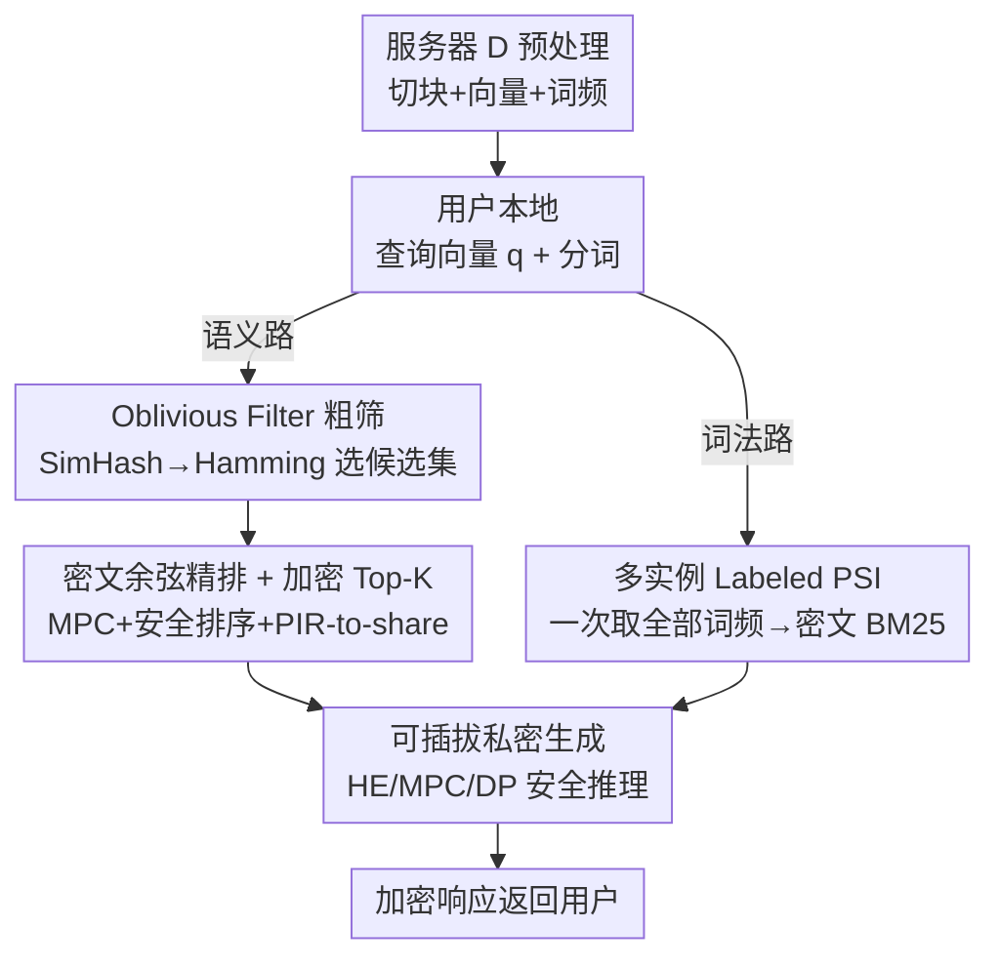

# Pisces: Cryptography-based Private Retrieval-Augmented Generation with Dual-Path Retrieval

**会议**: ICLR 2026  
**OpenReview**: [https://openreview.net/forum?id=Re3A6vzCTC](https://openreview.net/forum?id=Re3A6vzCTC)  
**代码**: https://github.com/liang-xiaojian/Pisces  
**领域**: LLM安全 / 隐私保护 / 密码学  
**关键词**: 私密RAG, 安全多方计算, Labeled PSI, 双路检索, BM25

## 一句话总结
Pisces 是首个**基于密码学**、且同时支持「语义 + 词法」双路检索的私密 RAG 检索框架：用 SimHash + oblivious filter 做语义粗筛、用多实例 labeled PSI 一次性算出 BM25 所需的全部词频，在同时保护用户查询和知识库的前提下，把检索精度做到与明文基线相差不超过 1.87%。

## 研究背景与动机

**领域现状**：RAG 通过从外部知识库检索相关文档来缓解 LLM 在垂直领域的幻觉，已经成为医疗诊断、个性化问答等敏感场景的主流范式。一个 RAG 系统天然分成「检索」和「生成」两步，而检索这一步要让服务器（持有知识库）和用户（持有查询）之间发生交互。

**现有痛点**：检索过程里两边的数据都是隐私。用户的查询可能暴露家族病史、罕见病等个人信息；服务器知识库里的临床记录、生物特征同样高度敏感且难以匿名化。已有工作证明，攻击者可以从知识库中逐字提取句子或可识别个人信息，这会直接违反 GDPR / HIPAA / PIPL 等法规。然而当前对私密检索的研究几乎都用**差分隐私（DP）**，DP 给数据注入不可逆噪声，虽然能保语义检索，却**破坏了词法检索（如 BM25）所依赖的精确词项匹配**，导致检索性能受限。

**核心矛盾**：双路检索（语义 + 词法结合）本身能带来更好的检索效果，但 DP 的噪声机制和「精确匹配」根本对立——你要么保住精确匹配的词法路、要么用 DP 加噪，二者不可兼得。而密码学方案（如 MPC）不改变原始数据、只把交换的数据加密，理论上既能算语义相似度、又能做精确词项匹配，是同时撑起双路检索的天然候选。

**本文目标**：在保护查询和文档双方隐私的前提下，让 RAG 检索同时跑通语义路和词法路。

**切入角度**：直接把密码学原语怼上去会有两个效率瓶颈——(1) 语义路上对全库逐一算密文余弦相似度开销爆炸；(2) 词法路上现有 labeled PSI 要为每个 chunk 反复调用一次才能凑齐 BM25 的词频，重复调用代价巨大。作者认为这两处是「能不能落地」的关键，于是为这两条路各定制一个高效协议。

**核心 idea**：语义路用「粗到精」策略——先用一个新的 oblivious filter 在 Hamming 空间私密地筛出候选集，把昂贵的密文余弦相似度只算在小候选集上；词法路用一个多实例 labeled PSI，把原本要调 N 次的词频获取压成一次执行。

## 方法详解

### 整体框架

Pisces 设定为两方：服务器 $S$ 持有大规模敏感文档库 $D$，用户 $C$ 持有私密查询 $Q$，威胁模型是**半诚实（semi-honest）**——双方都老实跑协议，但都对对方的数据好奇。检索过程定义为 $\text{Enc}(D_K) = R(Q, D)$，最终 $S$ 拿到加密的 top-$K$ 文档，过程中服务器不知道用户查的是什么、也不知道命中了哪些文档，用户也学不到知识库里的任何额外信息。

整个流程分三个阶段：**预处理阶段**（服务器把文档切块、向量化、分词并算好词频，纯本地脚手架）；**私密检索阶段**（本文核心贡献，又分语义路和词法路并行跑，各自产出加密 top-$K$）；**私密生成阶段**（把检索到的密文 chunk 喂给可插拔的私密推理框架）。语义路走「粗到精」：SimHash 二值化 → oblivious filter 粗筛候选 → 候选集上密文余弦相似度精排 → 安全排序 + PIR-to-share 取回加密 top-$K$。词法路走「一次 PSI 拿全部词频 → 密文算 BM25 → 取回加密 top-$K$」。

### 关键设计

**1. Oblivious Filter 粗筛：把全库密文相似度压成小候选集**

语义路最大的开销在于：对全库 $N$ 个 chunk 逐一用 MPC 算密文余弦相似度，规模一大就贵到不可行。Pisces 的破解办法是先做一轮便宜的「粗筛」。具体地，$S$ 和 $C$ 用 SimHash 把各自的 384 维向量 $v_i$ 和 $q$ 转成 $L$ 比特二值向量 $v_i^b, q^b \in \{0,1\}^L$，这样余弦相似度就近似成了**Hamming 距离**——而 Hamming 距离在密码学协议里算起来极快。然后双方调用 oblivious filter（Protocol 3，基于 Hamming 空间）私密地选出一个远小于全库的候选集 $D'$，整个过程不泄露查询或知识库的任何信息。这一步把后续昂贵精排的输入规模直接砍掉一大截，是「粗到精」策略里的「粗」。

**2. 密文余弦精排 + 加密 Top-K 取回：在候选集上做精确匹配并安全交付**

拿到候选集 $D'$ 后，$S$ 和 $C$ 基于秘密分享的 MPC 协议，逐个算出查询与候选 chunk 之间的**真实余弦相似度**（不再是 Hamming 近似），得到相似度的秘密分享。接着用安全排序协议让 $C$ 学到 top-$K$ 的索引 $I_K$，再用 batch PIR-to-share 协议把这 $K$ 个 chunk 以秘密分享形式取回，双方各持 $\langle D_K\rangle$。最后 $C$ 用 FHE 把自己那份加密成 $\text{Enc}(\langle D_K\rangle_C)$ 发给 $S$，$S$ 算 $\text{Enc}(D_K) \leftarrow \text{Enc}(\langle D_K\rangle_C) + \langle D_K\rangle_S$ 得到完整密文。这一步「先粗筛、后精排」既保住了余弦相似度的精度（精排不受 SimHash 量化损失影响），又把昂贵计算限制在候选集上；FHE 转换是可选的，取决于下游安全推理框架要的输入类型。

**3. 多实例 Labeled PSI：一次执行拿齐 BM25 所有词频**

词法路要算 BM25，本质是要知道「查询的每个 token 在每个 chunk 里出现多少次」。直接用 labeled PSI 的话，得为每个 chunk 单独调一次（因为每个 chunk 是一个独立的 label 集合），$N$ 个 chunk 就调 $N$ 次，开销爆炸。作者设计了多实例 labeled PSI 协议 $\prod_{\text{MultLPSI}}$（Protocol 4，基于 OPRF 和 OKVS），**一次执行**就让 $C$ 拿到每个 query token $q_j$ 在每个 chunk $c_i$ 里的词频 $tf'_{i,j}$（命中则等于真实词频、否则为 0）。有了词频，$C$ 本地算文档频率 $df_j = \sum_{i=1}^N \mathbb{1}(tf'_{i,j} > 0)$，再和 $S$ 用 MPC 联合算出每个 chunk 的 BM25 分数（含 $\log\frac{N - df_j + 0.5}{df_j + 0.5}$ 等项的秘密分享计算），最后用与语义路相同的「安全排序 + PIR-to-share」取回加密 top-$K$。把 $N$ 次调用压成 1 次，是词法路能落地的关键。

**4. 可插拔的私密生成：与现有安全推理框架对接实现端到端隐私**

Pisces 把重心放在检索阶段，但生成阶段并不另起炉灶，而是设计成可与现有私密 LLM 推理框架对接。针对三类后端给出对接方式：**HE 类**——$S$ 直接把同态加密的检索 chunk 和查询喂给 HE 推理框架算出密文响应；**MPC 类**——双方跳过语义/词法协议里把秘密分享转成同态密文的那一步，$C$ 直接把查询秘密分享给 $S$，两边用分享跑 MPC 推理；**DP 类**——$S$ 在密文结果上注入 DP 噪声，$C$ 解密后跑 DP 推理框架。这种「检索私密 + 生成可插拔」的设计让 Pisces 能拼接出**端到端**的全链路隐私，而不绑定某个具体推理方案。

### 损失函数 / 训练策略

本文是密码学协议设计，无训练过程。实验用开源 embedding 模型 granite-embedding-small-english-r2（384 维）和 BERT tokenizer，全部协议在一台 Apple M4 Pro（24GB RAM）上跑。

## 实验关键数据

### 主实验

在 ClapNQ / SQuAD / HotpotQA 三个数据集上，对比 Pisces 与明文基线的检索精度（保留与明文一致的命中率即为理想）：

| 路径 | 设置 | 精度区间 | 说明 |
|------|------|---------|------|
| 语义 | Top-5 | 78.02% ~ 90.44% | SimHash 量化带来主要精度损失 |
| 语义 | Top-10 | 74.86% ~ 86.83% | 同上 |
| 词法 | Top-5 | 85.72% ~ 98.22% | 安全 BM25 计算的精度损失很小 |
| 词法 | Top-10 | 86.44% ~ 98.02% | 同上 |

对照数据集 ground-truth 评测时，Pisces 整体检索精度与明文基线相差在 **1.87%** 以内；且「语义 + 词法」双路融合显著优于单路，验证了双路检索的价值。相比 DP 类方法，Pisces 精度明显更高。

### 消融 / 效率实验

| 对比项 | 基线 | Pisces | 提升 |
|--------|------|--------|------|
| 语义路（大库） vs Fine-only | 全库密文余弦 | 粗到精 | 检索时间省 38.78%~41.21%，上/下行省 67.53%~68.77% |
| 词法路 vs SOTA labeled PSI (LSE) | 逐 chunk 调 PSI | 多实例 PSI | 运行时 **496.03×** 加速，上行省 70733×、下行省 2.84× |

### 关键发现
- **粗到精在大库上才划算**：大规模数据集上 oblivious filter 粗筛能把昂贵的密文相似度计算省下 4 成时间、近 7 成通信；但在小库上，反而是 fine-only 更快——因为此时粗筛本身（而非余弦计算）成了瓶颈，候选筛选的固定开销得不偿失。
- **多实例 PSI 的收益极其夸张**：把 $N$ 次 labeled PSI 压成 1 次，运行时直接快了近 500 倍、上行通信省了 5 个数量级，是词法路从「理论可行」走向「实际可用」的决定性一步。
- **两条路精度损失来源不同**：语义路的损失主要来自 SimHash 用 Hamming 近似余弦的量化误差，词法路的损失主要来自安全 BM25 计算的精度截断，后者小得多。

## 亮点与洞察
- **用 SimHash 把余弦变 Hamming**：余弦相似度在密文下很贵，Hamming 距离很便宜——把昂贵的相似度计算「降维」成廉价的位运算来做粗筛，是把密码学方案做到实用的关键一招，思路可迁移到其他密文近似最近邻场景。
- **「一次 PSI 拿全部词频」的批处理视角**：把「为每个 chunk 调一次 PSI」重构成「一次多实例 PSI 拿齐全部词频」，本质是识别出重复调用里的冗余并批量化，近 500× 的加速说明这类协议级的重构往往比堆硬件更值。
- **检索与生成解耦**：把私密 RAG 拆成「私密检索（本文做）+ 可插拔私密生成（接现成框架）」，既聚焦了真正欠研究的检索环节，又能与 HE/MPC/DP 三类推理后端拼出端到端隐私，工程上很务实。
- **密码学 vs DP 的本质区分讲得透**：DP 加不可逆噪声所以撑不起精确词项匹配，密码学只加密不改数据所以双路都能跑——这个判断直接决定了技术路线选型。

## 局限与展望
- **半诚实假设**：威胁模型只考虑半诚实（双方老实跑协议），不防恶意敌手主动篡改协议，落到真实对抗场景需要更强的安全假设。
- **小库上不划算**：粗到精策略在小规模知识库上反而比 fine-only 慢，意味着需要按库规模自适应地切换策略，论文未给出自动判定方案。
- **语义路精度损失偏大**：SimHash 量化让语义 Top-5 精度低到 78%，对召回要求高的场景可能不够；如何用更精细的二值化或可学习哈希压缩这部分损失值得探索。
- **两方设定**：当前是单服务器 + 单用户的两方协议，扩展到多服务器/联邦知识库时协议复杂度和信任假设都会变化。

## 相关工作与启发
- **vs DP-RAG / RemoteRAG / (Yao & Li, 2025)**: 这些工作靠差分隐私保护检索，只能撑语义路、做不了 BM25 这类精确词法匹配；Pisces 用密码学既保双路又保查询和文档双方隐私，精度逼近明文，是首个密码学 + 双路的私密 RAG 检索框架。
- **vs 直接套 MPC/labeled PSI**: 朴素地把密码学原语铺到双路检索上，会被「全库密文余弦」和「逐 chunk 重复 PSI」两个瓶颈拖垮；Pisces 用 oblivious filter 粗筛和多实例 PSI 两个定制协议把这两处效率打下来，才让方案真正可落地。
- **vs 私密 LLM 推理框架（HE/MPC/DP 类）**: 已有大量工作做私密生成，但私密检索相对欠研究；Pisces 补上检索这块，并设计成能与这些生成框架对接，从而实现端到端隐私。

## 评分
- 新颖性: ⭐⭐⭐⭐⭐ 首个密码学 + 双路的私密 RAG 检索框架，两个定制协议都有实质创新
- 实验充分度: ⭐⭐⭐⭐ 三数据集、双路精度 + 双协议效率对比齐全，但缺多用户/多服务器与恶意敌手场景
- 写作质量: ⭐⭐⭐⭐ 协议描述清晰、动机层层递进，密码学细节较多需结合附录
- 价值: ⭐⭐⭐⭐⭐ 医疗等敏感 RAG 场景刚需，近 500× 的 PSI 加速让方案具备实用性

<!-- RELATED:START -->

## 相关论文

- [\[ACL 2026\] Differentially Private Synthetic Text Generation for Retrieval-Augmented Generation (RAG)](../../ACL2026/llm_safety/differentially_private_synthetic_text_generation_for_retrieval-augmented_generat.md)
- [\[ICLR 2026\] Fine-Grained Privacy Extraction from Retrieval-Augmented Generation Systems by Exploiting Knowledge Asymmetry](fine-grained_privacy_extraction_from_retrieval-augmented_generation_systems_by_e.md)
- [\[ACL 2026\] Knowledge Poisoning Attacks on Medical Multi-Modal Retrieval-Augmented Generation](../../ACL2026/llm_safety/knowledge_poisoning_attacks_on_medical_multi-modal_retrieval-augmented_generatio.md)
- [\[AAAI 2026\] Privacy-protected Retrieval-Augmented Generation for Knowledge Graph Question Answering](../../AAAI2026/llm_safety/privacy-protected_retrieval-augmented_generation_for_knowledge_graph_question_an.md)
- [\[ACL 2026\] Beyond Explicit Refusals: Soft-Failure Attacks on Retrieval-Augmented Generation](../../ACL2026/llm_safety/beyond_explicit_refusals_soft-failure_attacks_on_retrieval-augmented_generation.md)

<!-- RELATED:END -->
