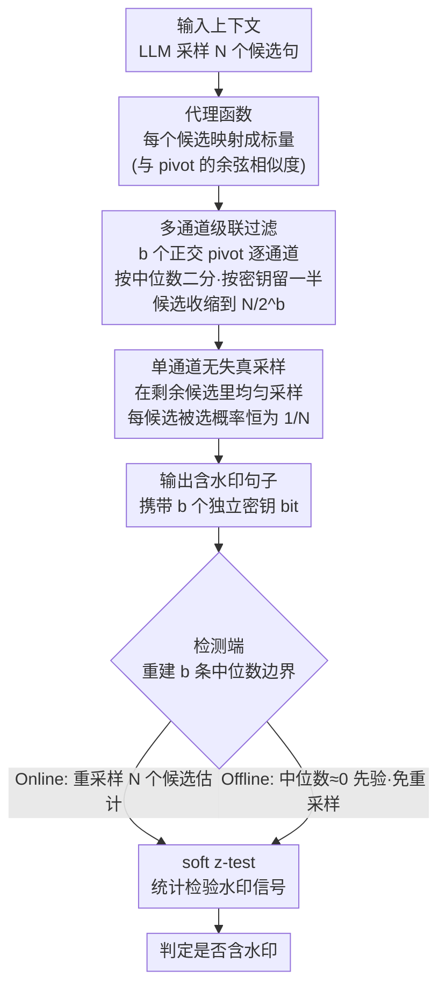

# PMark: Towards Robust and Distortion-free Semantic-level Watermarking with Channel Constraints

**会议**: ICLR 2026  
**arXiv**: [2509.21057](https://arxiv.org/abs/2509.21057)  
**代码**: 即将发布  
**领域**: AI安全 / 水印  
**关键词**: LLM水印, 语义级水印, 无失真, 多通道约束, 鲁棒性理论

## 一句话总结
提出PMark，一种理论上无失真且对改写攻击鲁棒的LLM语义级水印方法：通过多通道正交pivot向量对候选句子进行级联二分过滤，结合中位数采样保证无失真，多通道增加水印证据密度提升鲁棒性。在改写攻击下TP@FP1%达95%+，比此前SWM方法提升14.8%。

## 研究背景与动机

**领域现状**：LLM水印分为token级（如Green-Red水印）和语义级(SWM)。SWM通过在句子语义空间嵌入水印信号来增强对改写攻击的鲁棒性。

**现有痛点**：
   - 现有SWM方法(SemStamp/k-SemStamp)使用拒绝采样，引入分布失真
   - 单通道水印证据密度稀疏，改写攻击轻易破坏检测
   - 缺乏严格的理论框架分析水印性质（无失真条件、鲁棒性界）

**核心矛盾**：无失真性（生成质量不变）与鲁棒性（抵抗改写攻击）之间的trade-off

**本文目标**：同时实现理论上的无失真保证和实际上对改写攻击的强鲁棒性

**切入角度**：多通道正交pivot向量 = 每句话嵌入多个独立水印bit → 证据密度成倍增加

**核心 idea**：无失真中位数采样 + 多正交通道级联过滤 = 高密度水印证据 → 鲁棒

## 方法详解

### 整体框架
PMark 要同时拿到两样在水印里通常此消彼长的东西：生成质量完全不变（无失真），以及对改写攻击的鲁棒。它把水印做在句子的语义空间，而不是 token 上。生成一个句子时，先让 LLM 采样出 N 个候选句，再用代理函数（proxy function，把每个候选映射成与 pivot 向量的余弦相似度标量）配合 b 个相互正交的 pivot 向量对这批候选做级联二分过滤——每个 pivot 都按中位数把候选切两半、按密钥保留指定的一半，过滤完后在剩下的候选里均匀采样得到最终输出。检测时反向操作：对每个句子重采样 N 个候选重建出当时的过滤边界（中位数），再用 soft z-test 统计检验水印信号。离线版进一步省掉检测时的重采样，直接拿零当作中位数先验。

### 关键设计

**1. 代理函数（Proxy Function）理论框架：把语义水印的"无失真"写成一个可证的条件**

在 PMark 之前，语义级水印缺一个统一的理论工具来分析它到底有没有引入失真。本文先定义代理函数——把每个候选句 $s$ 映射成一个标量（如它与 pivot 的相似度），再把候选按代理值离散成 $M$ 个桶，得到分布 $q(u)$。基于此可以严格证明：水印分布相对原分布无失真，当且仅当 $q(u) = 1/M$，即代理值在各桶上均匀分布。这个条件在实践中很难自然满足，但它的价值正在于此——它精确指出了 SemStamp / k-SemStamp 这类拒绝采样方法失真的来源（它们的 $q(u)$ 并不均匀），也成为后面设计无失真采样器的标尺。

**2. 单通道无失真采样：靠"中位数二分 + 均匀采样"让每个候选被选概率恒为 $1/N$**

有了上面的标尺，单通道采样要做到不引入任何分布偏移。给定一个 pivot 向量 $v$，对 N 个候选句计算余弦相似度 $\langle v, \mathcal{T}(s) \rangle$，按这个值找中位数，把候选切成相似度高/低两半；再用密钥 bit 决定保留哪一半，并在保留的那半里均匀采样。关键在于：无论密钥指向哪半，每个候选最终被选中的概率都恰好是 $1/N$，于是 $P_M^w(s|\pi) = P_M(s|\pi)$，水印分布和原分布逐点相等。这就是 Theorem 3 给出的严格无失真保证，也是它和拒绝采样的本质区别——拒绝采样会改变各候选的相对概率，而中位数二分只是给候选贴了一个不影响采样权重的标签。

**3. 多通道级联过滤（Online PMark）：用 b 个正交 pivot 把每句的水印证据从 1 bit 提到 b bits**

单通道虽然无失真，但每个句子只埋了 1 bit 证据，改写攻击很容易把这一点信号抹掉。PMark 的核心提升是叠通道：通过 QR 分解生成 b 个相互正交的 pivot 向量，对同一批 N 个候选逐通道做中位数二分，每过一个通道就按对应密钥 bit 保留一半，候选集逐级收缩 $V^{(0)} \to V^{(1)} \to \cdots \to V^{(b)}$，最终在只剩 $N/2^b$ 个候选的 $V^{(b)}$ 里均匀采样。因为各 pivot 正交，b 个 bit 相互独立，相当于每句话埋了 b 个独立水印证据，证据密度成倍增加。这种冗余直接换来鲁棒性：Theorem 7 给出，若攻击以概率 $\epsilon$ 破坏每个通道的证据，检测信噪比

$$\text{SNR} \geq \frac{(1-2\epsilon)\sqrt{bT}}{2\sqrt{\epsilon(1-\epsilon)}}$$

随通道数 $b$ 和句子数 $T$ 一起增长——通道越多、文本越长，水印越难被改写抹掉。

**4. 离线 PMark（简化版）：用高维空间的"准正交性"把中位数近似成零，省掉检测时的重采样**

Online 版在检测时要重采样 N 个候选来重建当时的中位数，开销不小。离线版利用一个高维几何事实：在高维语义空间里随机向量几乎两两正交，于是代理函数值高度集中在 $[-\epsilon, \epsilon]$ 这个窄区间，中位数本身就贴近零。既然如此，干脆直接拿零当作先验中位数来切分，检测时不必再重采样估计。代价是引入一点点失真，但 Theorem 8 把它界住了：总变差距离 $\delta_{TV} \leq \epsilon$，而实测中 $\epsilon \leq 0.08$，几乎可以忽略。

### 一个完整示例：N=16、b=3 时一个句子怎么被采出来
取 N=16 个候选、b=3 个正交通道。第一个 pivot $v^{(1)}$ 给 16 个候选算相似度、找中位数，密钥 bit 说"留高的一半"，候选 16 → 8；第二个 pivot $v^{(2)}$ 在这 8 个里再按它自己的中位数二分，留一半，8 → 4；第三个 pivot $v^{(3)}$ 再砍一刀，4 → 2；最后在剩下的 2 个候选里均匀采样输出 1 个句子。这一句话因此同时携带了 3 个独立密钥 bit。检测端反过来：把句子重采样 16 个候选，逐通道重建那三条中位数边界，看输出句子是否落在密钥指定的那一侧——三条都对上才算强证据。即便改写攻击破坏掉其中一条通道，另外两条仍能提供信号，这正是多通道相比单通道（只有 1 bit、被破坏即失效）鲁棒得多的原因。

### 损失函数 / 训练策略
PMark 是纯采样算法，不需要任何训练。生成时每句需要 N 次采样（N=16–64），检测时 Online 版需重采样估计中位数，离线版省去这一步。

## 实验关键数据

### 主实验：改写攻击下的TP@FP1%

| 方法 | 无攻击 | Doc-P(GPT改写) | 提升 |
|------|--------|----------------|------|
| SemStamp(C4/Mistral) | ~99% | 73.5% | — |
| k-SemStamp | 100% | ~80% | — |
| **PMark Online** | **100%** | **97.8%** | **+24.3%** |
| **PMark Offline** | 99.7% | 92.6% | +19.1% |

### 消融：通道数b和采样数N

| N\b | b=1 | b=2 | b=3 | b=4 |
|-----|-----|-----|-----|-----|
| N=8(Online) | 81.0 | 97.0 | 98.0 | — |
| N=16 | 84.0 | **100.0** | 100.0 | 100.0 |
| N=64 | 99.0 | 100.0 | 100.0 | 100.0 |

### 关键发现
- **多通道是核心**：从b=1到b=2，检测率从81%跳升到97%
- **文本质量不降反升**：PMark的PPL(4.37)低于k-SemStamp(~5.0)，因为无失真采样不引入分布偏移
- **对GPT级改写鲁棒**：即使用GPT做重度改写(Doc-P)，TP@FP1%仍达95%+

## 亮点与洞察
- **理论与实践的优雅统一**：严格证明无失真条件+SNR随 $\sqrt{bT}$ 增长的鲁棒性界，这在水印领域罕见。理论驱动方法设计
- **多通道证据密度的核心直觉**：类似纠错编码的冗余思想——每句话嵌入多个独立bit，即使部分被攻击破坏，整体信号仍可恢复
- **离线版本的简化极其聪明**：利用高维空间的"准正交性"将中位数近似为零，消除了检测时重采样的开销

## 局限与展望
- **采样开销**：每句需N次采样(N=16-64)，对实时应用有延迟影响
- **依赖语义编码器**：使用固定编码器（如Roberta），编码器质量影响水印效果
- **仅在句子级嵌入**：无法对短文本（< 10句）可靠检测
- **改进思路**：可结合token级水印做混合方案——短文本用token级，长文本用PMark

## 相关工作与启发
- **vs SemStamp/k-SemStamp**：这些用拒绝采样引入失真，PMark用中位数采样实现严格无失真；鲁棒性提升14.8%
- **vs Green-Red token级水印**：token级对改写脆弱（每个token替换都是信息丢失），PMark在语义级嵌入，对同义改写鲁棒
- **vs UPV(token级最佳)**：PMark在改写鲁棒性上提升44.6%

## 评分
- 新颖性: ⭐⭐⭐⭐⭐ 理论框架+多通道无失真设计都是重要贡献
- 实验充分度: ⭐⭐⭐⭐ 多模型多数据集多攻击类型，但缺少更多LLM规模实验
- 写作质量: ⭐⭐⭐⭐⭐ 理论推导严谨，方法描述清晰
- 价值: ⭐⭐⭐⭐⭐ 解决了语义水印的两个核心难题（失真+鲁棒），理论和实用价值双高

<!-- RELATED:START -->

## 相关论文

- [\[ICLR 2026\] GraphShield: Graph-Theoretic Modeling of Network-Level Dynamics for Robust Jailbreak Detection](graphshield_graph-theoretic_modeling_of_network-level_dynamics_for_robust_jailbr.md)
- [\[ACL 2026\] SWAN: Semantic Watermarking with Abstract Meaning Representation](../../ACL2026/llm_safety/swan_semantic_watermarking_with_abstract_meaning_representation.md)
- [\[ICLR 2026\] Watermarking Diffusion Language Models](watermarking_diffusion_language_models.md)
- [\[ICLR 2026\] No Caption, No Problem: Caption-Free Membership Inference via Model-Fitted Embeddings](no_caption_no_problem_caption-free_membership_inference_via_model-fitted_embeddi.md)
- [\[ICLR 2026\] Robust LLM Unlearning via Post Judgment and Multi-Round Thinking](robust_llm_unlearning_via_post_judgment_and_multi-round_thinking.md)

<!-- RELATED:END -->
