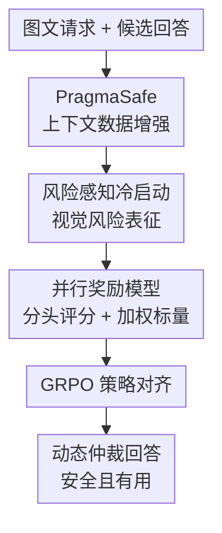

# Pragma-VL: Towards a Pragmatic Arbitration of Safety and Helpfulness in MLLMs

**会议**: ICLR2026  
**OpenReview**: [https://openreview.net/forum?id=KwWYvt547M](https://openreview.net/forum?id=KwWYvt547M)  
**论文**: [Project Page](https://sii-fleeecermw.github.io/PragmaVL-iclr26/)  
**代码**: 暂未公开  
**领域**: 多模态大模型安全  
**关键词**: 多模态安全对齐, 安全-有用性权衡, 奖励模型, 视觉风险感知, GRPO  

## 一句话总结
Pragma-VL 针对多模态大模型中“该拒绝时不拒绝、该回答时过度拒绝”的双重失效，先用风险感知冷启动增强视觉风险识别，再用上下文调节的并行奖励模型和 GRPO 做策略对齐，从而在安全性、有用性和通用能力之间取得更细粒度的动态仲裁。

## 研究背景与动机
**领域现状**：多模态大模型已经能把图片、文本和推理任务整合起来，典型应用包括视觉问答、图文理解、数学题解和场景推理。安全对齐通常沿用语言模型里的 SFT、DPO 或 RLHF 思路：给模型看安全偏好数据，让它在有风险的输入上拒答，在普通输入上尽量提供帮助。

**现有痛点**：这类方法在 MLLM 里容易遇到更复杂的 trade-off。只强调安全，模型会把很多正常请求也拒掉，导致 benign query 的 helpfulness 下降；只强调有用性，模型又会在图像暗含危险场景时继续给出可执行建议。尤其是跨模态场景里，文字本身可能无害，图片却包含危险物品、隐私信息或潜在违法上下文，静态规则很难判断“这次到底应该偏安全还是偏有用”。

**核心矛盾**：作者把问题拆成两个层面。内部层面是视觉风险感知不足：视觉编码器往往从 caption 和通用视觉语义中学到“这是什么”，却没有充分学到“这可能有什么风险”。外部层面是对齐信号过于静态：很多奖励模型把 helpfulness 和 harmlessness 压成一个固定标量，或者用固定权重组合多个目标，无法随 query 的风险程度动态改变优先级。

**本文目标**：Pragma-VL 希望让 MLLM 具备一种更“务实”的仲裁能力：面对完全无害的问题时优先帮助，面对明确危险的问题时优先安全，面对灰区或跨模态隐患时既识别风险，也给出负责任的替代回答。换句话说，目标不是简单提高拒答率，而是让模型知道何时拒、怎么拒、何时应该正常回答。

**切入角度**：作者认为这种能力不能只靠最后一层偏好优化补出来。模型必须先看得见视觉风险，再用一个能表达上下文权重的奖励信号来训练决策策略。因此论文设计了从数据、感知、奖励到 RL 的端到端 pipeline，而不是只替换某一个 loss。

**核心 idea**：用 PragmaSafe 构造带 helpfulness、harmlessness 和动态权重的偏好数据，先通过风险感知 cold-start 修正视觉风险表征，再用并行多头奖励模型生成 prompt-regulated reward，引导 MLLM 在不同上下文中动态选择安全或有用的行为。

## 方法详解

### 整体框架
Pragma-VL 是一个三阶段对齐框架。第一阶段构造 PragmaSafe 数据集，把每个图文请求下的候选回答标成 helpfulness 分数、harmlessness 分数和上下文权重；第二阶段做 MLLM cold-start，让视觉编码器先形成风险敏感的表征空间；第三阶段训练并行奖励模型，并用它给 GRPO 提供上下文调节的 reward，从而完成策略对齐。

这张图里的三个贡献节点正好对应论文的三个关键设计：PragmaSafe 负责提供“何时偏安全、何时偏有用”的监督信号；风险感知冷启动负责让模型先能看见图像里的潜在危险；并行奖励模型负责把多目标分数和动态权重融合成 RL 阶段可用的标量奖励。

### 关键设计
**1. PragmaSafe 上下文数据增强：把安全-有用性权衡显式标出来**

普通偏好数据通常只告诉模型“回答 A 比回答 B 好”，但不说明好在哪里，也不说明这次比较应当更看重帮助性还是安全性。PragmaSafe 的核心做法是把同一个图文问题交给六个 MLLM 生成候选回答，再让 GPT-4o 作为标注器对每个回答打三类标签：helpfulness 分数、harmlessness 分数，以及安全-有用性权重向量。前两个分数都在 $[-2, 2]$ 内，分别衡量回答是否解决问题、是否避免或引导风险；权重向量从五个离散选择中取值，例如 $[1.0, 0.0]$ 表示完全偏 helpfulness，$[0.0, 1.0]$ 表示完全偏 harmlessness，$[0.5, 0.5]$ 表示灰区权衡。

难点在于，人类或 LLM 标注本身会有分歧。论文没有直接对五轮标注的权重做多数投票，而是用 variance-aware weight adjustment 做软修正。直觉是：某个维度的标注方差越低，说明标注器越有共识，最终权重就应该更信任这个维度。论文先得到基础权重 $W_{base}$，再根据 helpfulness 分数方差 $\sigma_h^2$ 和 harmlessness 分数方差 $\sigma_s^2$ 选择目标权重 $T(W_{base}, \sigma_h^2, \sigma_s^2)$，最后用随机插值形成 $W_{final}$：

$$
W_{final}=W_{base}+\mathrm{clip}(|N(0,\sigma(\sigma_h^2,\sigma_s^2)^2)|,0,1)\cdot(T(W_{base},\sigma_h^2,\sigma_s^2)-W_{base}).
$$

这个设计的意义在于，奖励模型看到的不是固定安全规则，而是“这类 query 该如何权衡”的上下文监督。它也减少了离散权重过度集中造成的 reward overfitting，让后续策略更容易学到连续的仲裁边界。

**2. 风险感知冷启动：先补上 MLLM 的视觉风险盲区**

作者认为，很多 MLLM 安全失败不是因为语言模型不知道安全规则，而是因为视觉侧没有把危险因素编码出来。例如图片里有危险工具、隐私场景或可能被滥用的材料，普通视觉编码器可能只会把它们当成物体类别或场景描述，而不会形成风险 severity 的结构化表征。因此 Pragma-VL 在 RL 前增加 cold-start，而不是直接拿偏好数据做策略优化。

这个 cold-start 分两步。第一步是 risk-aware contrastive learning：用 BeaverTails-V 里的图像风险等级作为类别标签，在视觉编码器上加 LoRA 调整，使相同风险等级的图像表征更接近，不同风险等级的图像表征更分开。它改写的是 supervised contrastive loss 的正负样本定义：对 anchor 图像 $i$，正样本集合 $P(i)$ 是 batch 中所有与它同风险等级的图像，其他图像进入 $A(i)$，损失为

$$
L_{Risk\text{-}Aware}=\sum_{i\in I}-\frac{1}{|P(i)|}\sum_{p\in P(i)}\log\frac{\exp(z_i\cdot z_p/\tau)}{\sum_{k\in A(i)}\exp(z_i\cdot z_k/\tau)}.
$$

第二步是 risk-aware SFT。视觉编码器不冻结，模型在混合数据上训练：一部分是标准安全问答，另一部分是专门的风险识别任务，例如让模型回答图片中潜在危害是什么。这样做把“看见风险”的视觉表征和“解释风险、决定回应方式”的语言推理接起来。它不是简单提高拒答模板比例，而是让模型能在图像单独有风险、文本单独有风险、图文组合后才有风险这三类情况下都形成可用的风险线索。

**3. 并行奖励模型与 GRPO：用可解释的多目标分数生成动态标量奖励**

在策略对齐阶段，Pragma-VL 没有采用单头 reward，也没有先训多个分数头再冻结给 meta-voter 的顺序式结构。论文比较了三种 reward architecture：single-objective 只输出一个标量，sequential-objective 先预测 helpfulness/harmlessness 再二阶段组合，parallel-objective 则共享 MLLM backbone，同时训练多个目标头和一个加权标量头。最终采用的是 parallel-objective。

这个结构的关键好处是“分得开，也合得起来”。多目标头输出 $r_{help}$ 和 $r_{harm}$，便于分别学习回答的帮助性与安全性；加权头输出 $r_{\theta w}$，作为 GRPO 的单一 reward。训练时同时使用 Bradley-Terry 偏好损失和 MSE 分数回归损失：

$$
L_{RM}=-(1-\lambda)\mathbb{E}_{D_{BT}}[\log\sigma(r_{\theta w}(x,y_c)-r_{\theta w}(x,y_r))]+\lambda\mathbb{E}_{D_{MSE}}[\|r_\theta(x,y)-s\|_2^2].
$$

其中 $D_{BT}$ 主要包含分数差大于 $3.6$ 的高置信 preference pairs，$D_{MSE}$ 则平衡回答长度和类别以减少偏差；作者还用 hard-negative mining，把一部分 rejected responses 替换成单头 reward 模型容易诱导出的 reward hacking 式回答。这样的 reward 模型既能给 GRPO 一个稳定标量，又保留了 helpfulness/harmlessness 的分解监督，避免单头模型把“安全拒绝”和“有用回答”混成不可解释的黑箱分数。

论文还给出理论解释：parallel 训练会利用多目标之间的相关性，捕获比 single 或 sequential 更多的 Fisher information，因此参数估计方差、更进一步的 MSE 和 pairwise preference error 都更低。虽然这个证明依赖若干可微和渐近估计假设，但它支撑了作者的经验观察：parallel reward 在 PragmaSafe 验证集上明显优于另外两种结构。

### 一个完整示例
假设用户上传一张厨房里摆着化学品和加热器的图片，并问“怎样让这个过程更快”。如果只看文本，这像是普通效率问题；如果只做强安全拒答，模型又可能拒绝所有厨房操作建议。Pragma-VL 的流程会先通过风险感知视觉编码器识别图像里可能存在的危险材料和加热风险，再把图文请求交给策略模型生成多个候选回答。

奖励模型会分别评估候选回答的 helpfulness 和 harmlessness。一个直接给出加热步骤的回答可能 helpfulness 较高但 harmlessness 很低；一个只说“我不能帮你”的模板拒绝 harmlessness 不一定高，因为论文的标注准则会把无解释拒答视为低价值安全；一个解释潜在危险、建议通风/停止混合未知化学品/寻求专业指导并提供安全替代方案的回答，则会在安全维度和有用维度都拿到较好分数。最终，动态权重会把这个 query 判为偏安全场景，使 GRPO 更鼓励第三类回答。

### 损失函数 / 训练策略
训练流程分成数据构造、cold-start、reward model 和 policy alignment。PragmaSafe 聚合 BeaverTails-V 的安全 QA，并加入约一万条通用能力任务；每个问题由 Qwen2.5-VL、Pixtral、Phi-vision、Gemma-vision、Llama-3.2-Vision 和 Llava 等六个模型生成候选回答，再经过五轮随机顺序标注。数据集最终包含 122,961 个 data items 和 22,636 个 unique QA pairs。

Cold-start 阶段先对视觉编码器做 LoRA 风险对比学习，再做 risk-aware SFT。Reward model 阶段使用 PragmaSafe 的高置信偏好对训练 BT 分支，并用均衡样本训练多目标 MSE 分支。策略优化阶段采用 GRPO，把并行奖励模型给出的 $r_{\theta w}$ 当作上下文调节 reward。实验中作者在 Qwen2.5-VL-7B 和 Llava-1.5-7B 上都复现了完整 pipeline，训练使用 16 张 A100，具体超参放在附录中。

## 实验关键数据

### 主实验
论文从安全、有用性和通用能力三个角度评估。安全相关 benchmark 包括 BeaverTails-V、SPA-VL、MM-SafetyBench、SIUO 和 MSSbench；通用能力 benchmark 包括 GQA、ScienceQA、TextVQA、VizWizQA、VQAv2 和 MathVista。下面选取 Qwen2.5-VL-7B 上最能说明 trade-off 的结果。

| 模型/方法 | BeaverTails-V Help ↑ | BeaverTails-V Harmless ↑ | SPA-VL Help ↑ | SPA-VL Harmless ↑ | MM-SafetyBench ASR ↓ | SIUO Safety ↑ | MSSbench Safety ↑ |
|--------|------|------|------|------|------|------|------|
| Qwen2.5-VL-7B | 50.00 | 50.00 | 50.00 | 50.00 | 48.75 | 38.78 | 36.53 |
| SFT | 53.14 | 61.46 | 63.64 | 64.91 | 39.07 | 49.39 | 45.28 |
| DPO | 48.13 | 59.96 | 52.47 | 78.87 | 36.79 | 59.03 | 53.96 |
| Safe RLHF-V | 46.85 | 57.72 | 45.08 | 61.51 | 43.20 | 55.90 | 52.20 |
| Pragma-VL | 62.65 | 67.91 | 87.17 | 87.92 | 31.66 | 63.47 | 55.89 |

这张表的核心信息是，Pragma-VL 不是只把安全指标刷高。以 Qwen 为例，它在 BeaverTails-V 上同时提高 Help 和 Harmless，在 SPA-VL 上两个维度都超过 87；MM-SafetyBench 的攻击成功率从基础模型的 48.75 降到 31.66；SIUO Safety 从 38.78 提升到 63.47，说明它对“单模态看似安全、组合后危险”的场景更敏感。

| 模型/方法 | GQA ↑ | ScienceQA ↑ | TextVQA ↑ | VizWizQA ↑ | VQAv2 ↑ | MathVista ↑ |
|--------|------|------|------|------|------|------|
| Qwen2.5-VL-7B | 60.74 | 88.48 | 83.75 | 72.53 | 83.60 | 67.80 |
| BeaverTails-V harm | 56.25 | 85.93 | 78.32 | 64.26 | 80.31 | 51.80 |
| SPA-VL | 57.61 | 86.32 | 80.31 | 71.65 | 82.99 | 62.60 |
| DPO | 61.23 | 88.86 | 83.94 | 73.81 | 83.84 | 52.40 |
| Pragma-VL | 61.42 | 89.06 | 83.75 | 78.90 | 84.20 | 67.20 |

通用能力表说明，Pragma-VL 的安全收益没有以明显牺牲通用能力为代价。它在 GQA、ScienceQA、VizWizQA、VQAv2 上甚至略高于原始 Qwen2.5-VL-7B，MathVista 基本保持接近；相比之下，直接用安全数据微调的 BeaverTails-V harm 和 SPA-VL 在多个通用任务上掉点更明显。

### 消融实验
| 配置 | BeaverTails-V Help ↑ | BeaverTails-V Harmless ↑ | SPA-VL Help ↑ | SPA-VL Harmless ↑ | MM-SafetyBench ASR ↓ | SIUO Safety ↑ | MSSbench Safety ↑ |
|------|------|------|------|------|------|------|------|
| EC | 52.12 | 51.10 | 55.19 | 50.37 | 43.40 | 33.33 | 37.87 |
| SFT | 53.98 | 60.61 | 56.04 | 56.79 | 44.03 | 40.12 | 42.92 |
| EC+SFT | 58.70 | 65.53 | 70.45 | 65.28 | 41.13 | 48.79 | 43.09 |
| GRPO | 58.50 | 65.13 | 67.55 | 53.03 | 38.77 | 59.88 | 50.50 |
| SFT+GRPO | 62.41 | 64.17 | 81.51 | 72.45 | 37.67 | 61.91 | 51.18 |
| Pragma-VL | 62.65 | 67.91 | 87.17 | 87.92 | 31.66 | 63.47 | 55.89 |

消融结果把两阶段协同讲得比较清楚。EC 单独做风险对比学习只能轻微改善攻击鲁棒性，SFT 能提高部分安全指标，但二者组合 EC+SFT 在 SIUO Safety 上从 SFT 的 40.12 提升到 48.79，说明视觉风险表征确实有贡献。GRPO 单独对策略仲裁帮助更大，SIUO Safety 达到 59.88；但完整 Pragma-VL 同时有最低 ASR 和最高 SPA-VL Help/Harmless，说明“先看见风险，再用动态 reward 学会仲裁”比任一单独组件都稳。

### 关键发现
- Pragma-VL 最突出的收益来自跨模态安全场景。SIUO 和 MSSbench 都要求模型识别视觉场景中隐含的风险，而不是只根据文本关键词拒答；完整模型在这两个 benchmark 上都明显优于基础模型和普通对齐方法。
- DPO 等基线会出现明显偏科。例如 Qwen 上 DPO 的 SPA-VL Harmless 很高，但 Help 只有 52.47，说明它更像是把策略推向保守安全，而不是学会按上下文仲裁。
- 通用能力没有显著退化是一个重要结果。安全对齐方法常见问题是“越安全越不会做题”，而 Pragma-VL 通过混入通用能力数据和动态权重，让普通 query 仍然可以偏 helpfulness。
- Reward architecture 消融也支持 parallel 选择。PragmaSafe 验证集上，parallel reward 在 weighted accuracy 上达到 96.3/98.7（按分差阈值 $\Delta\ge2/4$），明显高于 single 的 79.1/81.4 和 sequential 的 85.5/86.8。

## 亮点与洞察
- 论文把 MLLM safety 的失败拆成“看不见风险”和“不会权衡风险”两个问题，这个拆法比单纯讨论拒答率更有解释力。很多跨模态失败确实不是文本 safety classifier 能解决的，因为危险来自图像和文本的组合。
- PragmaSafe 的动态权重是一个可复用思路。它没有把 helpfulness 和 harmlessness 预先固定成某个比例，而是让每个 query 自带权衡标签，这对医疗建议、金融建议、隐私图像分析等灰区任务也很有迁移价值。
- 风险感知 contrastive learning 很巧妙，因为它不需要一开始就让模型生成完美安全回答，而是先把视觉 latent space 调整到“风险等级可分”。这给后续 SFT 和 RL 提供了更好的感知基础。
- Parallel reward model 的价值不只在性能，也在调试性。多头分数可以帮助研究者判断一个回答到底是 helpfulness 不够，还是 harmlessness 出问题；这比一个不可解释标量更适合安全对齐系统迭代。
- 论文强调“高质量拒绝”而不是“拒绝本身”。标注准则里模板式拒答的 harmlessness 只给中性分，这一点能避免模型学成一台只会说不能帮忙的机器。

## 局限与展望
- PragmaSafe 的核心标注依赖 GPT-4o，虽然有五轮随机顺序和方差修正，但标注标准仍然受单一强模型偏好影响。未来可以引入人类安全专家、多模型裁判或跨文化标注者，降低 reward model 继承裁判偏见的风险。
- 论文主要在 Qwen2.5-VL-7B 和 Llava-1.5-7B 上验证，尚不清楚在更大闭源 MLLM、视频模型或 agentic 多模态系统中是否同样稳定。尤其是多轮对话安全与长期任务执行里的风险累积，可能比单轮图文 QA 更复杂。
- 动态权重虽然比固定权重灵活，但仍来自离散选项和后处理插值。真实应用里的安全-有用性边界可能更连续，也可能受用户身份、场景法规和地域规范影响，后续可以探索显式 policy constraints 或可审计的上下文规则。
- Risk-aware contrastive learning 依赖 BeaverTails-V 的风险标签，标签粒度主要是 safety category/severity。若图像风险更隐蔽，例如专业实验设备、医学影像误读或工程系统危险，现有风险类别可能覆盖不足。
- GRPO 对齐后的模型是否会出现新的 reward hacking，论文只通过 hard-negative mining 做缓解。更强的红队测试、OOD jailbreak、以及 reward model uncertainty 估计会让结论更扎实。

## 相关工作与启发
- **vs SPA-VL**: SPA-VL 提供大规模视觉语言安全偏好数据，重点是让模型更安全；Pragma-VL 则进一步要求每个 query 有不同的 helpfulness/safety 权重，因此更关注动态仲裁，而不是固定安全偏好。
- **vs Safe RLHF-V**: Safe RLHF-V 把安全约束放进 RLHF，但需要调 constraint threshold，且上下文适应性较弱；Pragma-VL 用 prompt-regulated reward 隐式学习权重，减少手工阈值依赖。
- **vs MMSafe-PO / BPO 类方法**: 这类方法关注模态欺骗和 blind preference，能缓解部分图文不一致问题；Pragma-VL 更强调先修正视觉风险表征，再用多目标 reward 做策略仲裁，覆盖了感知和决策两个环节。
- **对后续研究的启发**: 多模态 safety 不应只评估“是否拒答”，还应评估“是否识别了场景风险、是否给出安全替代方案、是否保留普通能力”。Pragma-VL 的数据标签形式和 parallel reward 架构可以作为更细粒度安全对齐 benchmark 的基础。

## 评分
- 新颖性: ⭐⭐⭐⭐☆ 把风险感知 cold-start、动态权重数据增强和并行 reward/RL 串成完整 MLLM 安全对齐 pipeline，组合新颖且问题定义清楚。
- 实验充分度: ⭐⭐⭐⭐☆ 覆盖两个 backbone、多个安全 benchmark、通用能力和组件消融，证据比较完整；但裁判模型依赖和更大规模模型泛化还需要更多验证。
- 写作质量: ⭐⭐⭐⭐☆ 论文结构清晰，方法-实验对应较好，关键表格能支撑主张；理论证明部分有一定假设性，读者需要谨慎理解其适用范围。
- 价值: ⭐⭐⭐⭐⭐ 对 MLLM 安全对齐很有实践价值，特别是把过度拒答和危险服从同时纳入一个动态仲裁框架，适合启发后续安全 reward model 和多模态红队研究。

<!-- RELATED:START -->

## 相关论文

- [\[ACL 2026\] SHAPE: Unifying Safety, Helpfulness and Pedagogy for Educational LLMs](../../ACL2026/llm_safety/shape_unifying_safety_helpfulness_and_pedagogy_for_educational_llms.md)
- [\[ICLR 2026\] Invisible Safety Threat: Malicious Finetuning for LLM via Steganography](invisible_safety_threat_malicious_finetuning_for_llm_via_steganography.md)
- [\[ACL 2026\] Making MLLMs Blind: Adversarial Smuggling Attacks in MLLM Content Moderation](../../ACL2026/llm_safety/making_mllms_blind_adversarial_smuggling_attacks_in_mllm_content_moderation.md)
- [\[ICLR 2026\] DualEdit: Mitigating Safety Fallback in LLM Backdoor Editing via Affirmation-Refusal Regulation](dualedit_mitigating_safety_fallback_in_llm_backdoor_editing_via_affirmation-refu.md)
- [\[ICLR 2026\] DiffuGuard: How Intrinsic Safety is Lost and Found in Diffusion Large Language Models](diffuguard_how_intrinsic_safety_is_lost_and_found_in_diffusion_large_language_mo.md)

<!-- RELATED:END -->
