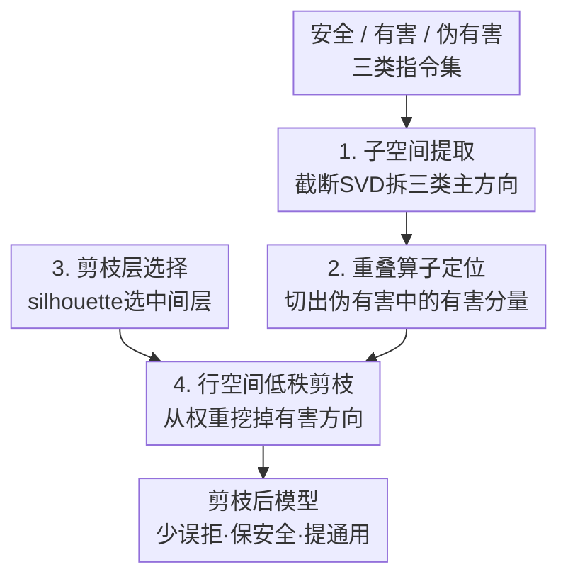

# ProSafePrune: Projected Safety Pruning for Mitigating Over-Refusal in LLMs

**会议**: ICLR 2026  
**OpenReview**: [https://openreview.net/forum?id=QkHKaPfRAB](https://openreview.net/forum?id=QkHKaPfRAB)  
**代码**: https://github.com/hfutml/PROSAFEPRUNE  
**领域**: LLM安全 / 对齐 / 过度拒绝  
**关键词**: 过度拒绝, 子空间投影, 低秩剪枝, 安全对齐, 隐状态探针

## 一句话总结
本文把 LLM 的"过度拒绝"（把无害但带敏感词的指令也拒了）归因于参数里存在一小撮"过度放大有害特征"的低秩方向，于是用 SVD 拆出安全/有害/伪有害三类子空间、设计重叠算子精准定位伪有害指令里被放大的有害分量，再在最具判别力的中间层做行空间低秩剪枝，无需训练、不增推理开销，就把误拒率显著拉下来，同时还略微提升了通用任务表现。

## 研究背景与动机

**领域现状**：为了让 LLM 安全部署，主流做法是 SFT + RLHF 强化拒绝机制，压制有害输出。但拒绝机制一旦收得过紧，就会"宁可错杀"——把语义无害、只是表面带敏感词的指令（pseudo-harmful，伪有害）也拒掉，例如因为出现 "kill" 一词就拒绝回答 "how to kill the lights in the room"。这种现象被称为 over-refusal / exaggerated safety（过度拒绝）。

**现有痛点**：已有缓解方法分两路，各有硬伤。**训练类**（Safety Patching、配对伪有害数据 SFT、定位安全关键层再微调）确实能重新校准决策边界，但要额外数据和算力，落地成本高；**免训练类**（提示词改写、Self-CD 两次解码对比、激活方向编辑/转向向量）灵活，但只在推理时打补丁、不动根因，还往往引入额外推理开销。

**核心矛盾**：作者认为前人都把过度拒绝看成"外部对齐策略太保守"的副作用，没看到更深的根因——**这是模型内部表示空间里的认知偏差**。已有研究表明 LLM 隐状态天然编码指令的安全属性；而伪有害指令本会同时投影到"有害子空间"和"无害子空间"，但在过度安全微调下，这种自然重叠被扭曲了：有害投影被不成比例地放大、无害投影被压制，导致良性指令被"过度编码上有害特征"（作者称之为 **over-harmful encoding，过度有害编码**），决策边界被推偏，最终误拒。作者进一步指出这也是 alignment tax（对齐税，对齐后通用能力下降）的来源之一。

**本文目标 / 切入角度**：与其在激活层打补丁或重训，不如直接动**参数空间**。作者的核心观察是：过度拒绝源于模型参数里有一小撮"过度放大有害分量"的低秩成分，正是它们让伪有害指令被错分。由于这些方向只占参数空间极小一块，把它们剪掉就能在几乎不动整体行为的前提下缓解过度拒绝。

**核心 idea**：用"子空间投影 + 低秩剪枝"代替"重训或激活编辑"——把伪有害方向里与有害子空间重叠、却不属于安全子空间的那部分定位出来，从权重行空间里"挖掉"，从根上修正过度有害编码。

## 方法详解

### 整体框架

ProSafePrune 要解决的是"参数里被过度有害化的低秩方向"。整体分两步：先**诊断**——用探针逐层分析伪有害指令的有害编码强度，确认深层参数在持续放大有害特征；再**剪枝**——对每个子模块（Q/K/V/O/FFN）的权重，用截断 SVD 分别从安全、有害、伪有害三类激活里拆出主子空间，构造一个重叠算子精准切出"伪有害方向里被放大的有害分量"，把它映射回权重行空间做低秩衰减；而且只在特征可分性最强（silhouette 分数最高）的中间层动手，保证对通用能力影响最小。整条管线只需少量辅助数据、不微调、不增推理开销。

### 关键设计

**1. 子空间提取：用截断 SVD 刻画安全/有害/伪有害三类方向**

要"挖掉"有害方向，前提是先把它从一堆权重里显式拆出来。作者对第 $l$ 层第 $m$ 个子模块（Q、K、V、O、FFN），用权重 $W_{l,m}\in\mathbb{R}^{d_{out}\times d_{in}}$ 把输入隐状态映射为输出 $a_{l,m}(x)=W_{l,m}h(x)$，再序列池化成向量 $\hat a_{l,m}(x)$。分别在安全集 $D_s$、有害集 $D_u$、伪有害集 $D_p$ 上收集这些向量，堆成矩阵 $A^{(t)}_{l,m}$，做截断 SVD：

$$A^{(t)}_{l,m}\approx U^{(t)}_{l,m}S^{(t)}_{l,m}V^{(t)\top}_{l,m},\quad t\in\{s,u,p\}$$

取前 $r_t$ 个左奇异向量构成 $U^{(t)}_{l,m}$，并定义投影算子 $\Pi^{(t)}_{l,m}=U^{(t)}_{l,m}U^{(t)\top}_{l,m}$ 来表示该类输出的主子空间。论文给出 Theorem 3.1：秩-$r$ 截断 SVD 在 Frobenius 范数下是最优低秩逼近，因此这样抽出的三类子空间在信息损失意义上是理论最优的——保证后面定位有害方向有可靠的基底。

**2. 重叠算子定位：在伪有害方向里精准切出"被放大的有害分量"**

光有三类子空间还不够——直接剪"有害子空间"会误伤模型对真有害指令的正常拒绝能力。作者要的是那部分"既落在伪有害主方向、又与有害方向重叠、但不属于安全方向"的成分。为此设计重叠算子：

$$\Omega_{l,m}=(I-\Pi^{(s)}_{l,m})\,\Pi^{(u)}_{l,m}\,\Pi^{(p)}_{l,m}$$

这条链式选择干三件事：(i) 用 $\Pi^{(p)}_{l,m}$ 锁定伪有害主方向；(ii) 用 $\Pi^{(u)}_{l,m}$ 在其中取出与有害方向重叠的分量；(iii) 用 $(I-\Pi^{(s)}_{l,m})$ 把与安全方向对齐的部分排除掉，避免破坏正确的安全编码。这样衰减就高度选择性，只针对"需要被削弱的有害放大"，而不是一刀切掉所有有害信号。消融印证了这一点：若只剪有害子空间（从 $\Omega$ 里丢掉 $\Pi^{(p)}_{l,m}$），伪有害合规率虽更高（90.5%、96.5%），但真有害安全分数暴跌到 79.5%、71.0%——说明保留伪有害投影分量是维持平衡的关键。

**3. 剪枝层选择：只在可分性最强的中间层动手**

不是每层都值得剪。作者用 t-SNE 可视化各层输出激活，并对每层算平均 silhouette 分数来量化特征簇的可分性：

$$s(i)=\frac{b(i)-a(i)}{\max\{a(i),b(i)\}}$$

其中 $a(i)$ 是同簇内平均距离、$b(i)$ 是到最近其他簇的距离，层级分数取该层所有激活 $s(i)$ 的均值。实验（Figure 2）显示 LLaMA-2-7B 的**中间层**簇分离最清晰、silhouette 最高，安全相关特征判别力最强。于是作者把高分中间层作为候选，再在最高分层附近 5–10 层上、用 50 条伪有害+有害指令按 TS 分数（见下）搜出最优剪枝层。在判别力最强的层剪枝，既精准又对整体能力扰动最小。

**4. 行空间低秩剪枝：从权重里"挖掉"有害方向**

定位出的 $\Omega_{l,m}$ 定义在输出空间，但由 $a=Wh$ 可知，对输出施加 $\Omega$ 等价于在行空间左乘权重。于是定义 $\Delta W_{l,m}=\Omega_{l,m}W_{l,m}$，并做带强度系数的低秩剪枝：

$$W'_{l,m}=(I-\lambda\,\Omega_{l,m})\,W_{l,m},\quad \lambda\in[0,1]$$

这相当于把"专门把伪有害表示推向有害方向"的行空间分量"刻掉"，$\lambda$ 越大剪得越狠，在过度拒绝与模型性能之间权衡。论文 Theorem 3.2 给出能量上界：$\frac{\|\Omega_{l,m}W\|_F^2}{\|W\|_F^2}\le \frac{r}{s_r(W)}$，其中 $s_r(W)=\|W\|_F^2/\|W\|_2^2$ 是稳定秩。由于 $r$ 很小而 LLM 里稳定秩通常很大，被剪掉的能量只占极小一部分——这从理论上保证剪枝几乎不伤整体能力。消融还发现，单独剪某个子模块（V 提升最明显，合规率 11→30.5）远不如整层一起剪（73.0），说明过度拟合源于子模块间的交互而非单一模块。

### 损失函数 / 训练策略
本方法是**免训练**的后处理参数编辑，不引入任何梯度训练或损失函数。仅需三类小辅助数据集（$D_s$/$D_u$/$D_p$）构造子空间，超参为各类子空间秩 $r_t$、剪枝强度 $\lambda$ 与剪枝层位置，全部通过在 50 条指令上按 TS 分数验证搜索确定。

## 实验关键数据

### 主实验
评估指标遵循 Dabas et al.：合规率 **C.R.**（正确处理、不误拒无害输入的比例）、安全分数 **S.S.**（对真有害指令的拒绝比例）、权衡分数 **T.S.**（C.R. 与 S.S. 的均值）；用 WildGuard 分类器判定拒绝/有害。前四个数据集（OR-Bench、PHTest、XSTest、OKTest）测合规，后两个（AdvBench、JailbreakBench/JBB）测安全。对比 SELF-CD、SCAN、SURGICAL 三个 SOTA。

| 模型 | 方法 | Avg. C.R. | Avg. T.S. |
|------|------|-----------|-----------|
| LLaMA-2-7B | Default | 49.2 | 65.5 |
| LLaMA-2-7B | Self-CD | 72.4 | 79.2 |
| LLaMA-2-7B | SCAN | 75.0 | 82.3 |
| LLaMA-2-7B | Surgical | 75.0 | 82.4 |
| LLaMA-2-7B | **Ours** | **84.5** | **88.4** |
| LLaMA-2-13B | Surgical | 59.2 | 72.1 |
| LLaMA-2-13B | **Ours** | **74.9** | **82.5** |
| LLaMA-3-8B | Surgical | 83.6 | 87.2 |
| LLaMA-3-8B | **Ours** | **86.8** | **89.4** |

在 LLaMA-2-7B 上，ProSafePrune 把 OR-Bench 合规从 57.5%(Surgical)/43.5%(Self-CD) 拉到 73.0%，同时 AdvBench/JBB 安全分仅微降（98.5/94.0）。综合权衡分相比最强基线 **+2~9 分**。值得注意的是 SCAN 在 LLaMA-2-13B 上反而崩了（T.S. 仅 55.1，比 Default 还低），说明激活编辑类方法跨模型稳定性差，而本方法在三个模型上都稳。

**通用能力不降反升**：以 LLaMA-2-7B 为例，剪枝后 MMLU 37.1→39.6、CommonsenseQA 49.0→53.0、GSM8K 23.0→25.5，印证作者关于"过度有害编码即 alignment tax 来源"的论断——剪掉这部分等于松开了过度保守的约束。

### 消融实验

| 配置 | 关键指标(OR-Bench C.R.) | 说明 |
|------|------|------|
| Default | 11.0 | 未剪枝 |
| 仅剪 V proj | 30.5 | 单子模块里提升最大 |
| 仅剪 Q/K/O/MLP | 10.5~19.0 | 提升轻微 |
| 剪整层(All) | **73.0** | 远超任一单模块 |
| 仅剪有害子空间(w/o $\Pi^{(p)}$) | 90.5 | 合规更高但 AdvBench 安全暴跌至 79.5 |

### 关键发现
- **整层 > 单模块**：单剪 V 最有效但只到 30.5，整层一起剪到 73.0，过度拟合来自子模块交互。
- **伪有害投影不可省**：去掉 $\Pi^{(p)}$ 后合规飙升但真有害拒绝崩了（S.S. 79.5/71.0），证明重叠算子里同时纳入伪有害与有害投影才是"少误拒又保安全"的关键。
- **中间层最优**：附录 D.4 显示剪中间层优于剪两端，且对中间层具体选哪几层不敏感，鲁棒性好。

## 亮点与洞察
- **把"过度拒绝"从"对齐副作用"重新定义为"参数空间的认知偏差"**：这个视角转换让问题从"调输出"变成"改参数里一小撮低秩方向"，是全文最"啊哈"的地方。
- **重叠算子 $\Omega=(I-\Pi_s)\Pi_u\Pi_p$ 的链式构造很巧**：用三个投影算子的乘法做集合运算（属于伪有害 ∩ 有害 ∖ 安全），把"该剪什么"用线性代数精确表达，避免一刀切。这种"用子空间投影做特征集合运算"的思路可迁移到任何需要"剪掉某属性但保留相关属性"的参数编辑任务（如去毒、去偏见而不伤通用能力）。
- **理论自洽**：两个定理一个保证子空间最优、一个给出剪枝能量上界，把"为什么剪了不伤性能"从经验观察上升为可证明的界。
- **免训练 + 零推理开销**：相比 Self-CD 两次解码、SCAN 推理时调整，本方法一次性改权重，部署友好。

## 局限与展望
- **依赖辅助数据集的代表性**：三类子空间由 HEx-PHI / Alpaca-Cleaned / OR-Bench 构造，若伪有害分布偏移，提取的方向可能不准；作者未充分讨论跨域泛化。
- **层与秩的搜索仍需小样本验证**：虽只用 50 条指令搜，但 $r_t$、$\lambda$、层位置仍是需要调的超参，换模型族要重新搜（论文也承认按模型大小调候选层范围）。
- **安全分有轻微让步**：部分设置下 AdvBench/JBB 比 Default 略降（如 LLaMA-2-7B 100→98.5），在高安全门槛场景需评估这点代价是否可接受。
- **机制解释偏相关**：探针/silhouette 给的是"过度有害编码与误拒正相关"的证据，并非严格因果，"剪掉这些方向"是否对所有过度拒绝成因都成立仍待验证。

## 相关工作与启发
- **vs 训练类（Safety Patching / Dabas et al. 安全关键层微调）**: 他们靠梯度补丁或重训校准边界，要额外数据+算力；本文不训练、只改权重，且同样能定位"安全关键层"（用 silhouette 而非梯度），更轻量。
- **vs 免训练激活编辑（SCAN / Surgical / Self-CD）**: 他们在推理时编辑激活/转向向量或两次解码，治标且加推理开销；本文直接动参数行空间，一次改完、零额外推理成本，且实验显示跨模型更稳（SCAN 在 13B 上崩）。
- **vs 朴素低秩剪枝（Wei et al. 2024 启发）**: 本文受其"直接改权重去方向"启发，但创新在重叠算子——不是剪有害方向本身，而是剪"伪有害里被放大的有害分量"，从而避免误伤真有害拒绝能力。

## 评分
- 新颖性: ⭐⭐⭐⭐⭐ 把过度拒绝重定义为参数认知偏差并用子空间投影+低秩剪枝求解，视角和方法都新颖
- 实验充分度: ⭐⭐⭐⭐ 跨 5 个模型、多个合规/安全/通用基准，消融到位；但部分结果挪到附录、安全分轻微让步讨论可更充分
- 写作质量: ⭐⭐⭐⭐ 动机层层推进、定理支撑清晰；公式较密，符号略多
- 价值: ⭐⭐⭐⭐⭐ 免训练、零推理开销、还顺带缓解 alignment tax，工程落地价值高

<!-- RELATED:START -->

## 相关论文

- [\[ICLR 2026\] DualEdit: Mitigating Safety Fallback in LLM Backdoor Editing via Affirmation-Refusal Regulation](dualedit_mitigating_safety_fallback_in_llm_backdoor_editing_via_affirmation-refu.md)
- [\[ACL 2026\] Please Refuse to Answer Me: Mitigating Over-Refusal in LLMs via Adaptive Contrastive Decoding](../../ACL2026/llm_safety/please_refuse_to_answer_me_mitigating_over-refusal_in_large_language_models_via_.md)
- [\[ICLR 2026\] ManagerBench: Evaluating the Safety-Pragmatism Trade-off in Autonomous LLMs](managerbench_evaluating_the_safety-pragmatism_trade-off_in_autonomous_llms.md)
- [\[ICLR 2026\] HiddenEcho: Mitigating Noise Amplification in Differentially Private LLMs with Hidden-State Correction](hiddenecho_mitigating_noise_amplification_in_differentially_private_llms_with_hi.md)
- [\[ACL 2026\] DART: Mitigating Harm Drift in Difference-Aware LLMs via Distill-Audit-Repair Training](../../ACL2026/llm_safety/dart_mitigating_harm_drift_in_difference-aware_llms_via_distill-audit-repair_tra.md)

<!-- RELATED:END -->
