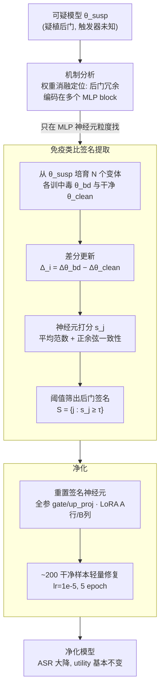

# Purifying Generative LLMs from Backdoors without Prior Knowledge or Clean Reference

**会议**: ICLR 2026  
**arXiv**: [2603.13461](https://arxiv.org/abs/2603.13461)  
**代码**: [https://bd-vax.github.io/](https://bd-vax.github.io/)  
**领域**: AI安全 / 后门防御  
**关键词**: LLM后门, 后门净化, 机制分析, MLP编码, 免疫类比签名提取

## 一句话总结
提出一种无需先验知识或干净参考模型的LLM后门净化方法：通过机制分析发现后门关联冗余地分布在MLP层中，利用免疫类比从多个后门变体中提取"签名"，定位并抑制可疑神经元+轻量微调恢复，在5种攻击×3种任务上ASR降低80%+同时保持utility。

## 研究背景与动机

**领域现状**：后门攻击对LLM构成严重安全威胁——模型在正常输入上表现正常，但触发器出现时会产生恶意输出（情感操纵、目标性拒绝、代码注入）。

**现有痛点**：
   - 需要触发器先验知识（不现实）
   - 需要干净参考模型（部署场景下通常不可获得）
   - 依赖激进的微调超参数（极大学习率）
   - 大多限于分类任务，无法处理生成式LLM
   - 对自适应攻击者脆弱（攻击者可混淆内部信号）

**核心矛盾**：如何在不知道触发器、不依赖干净模型的前提下净化后门？

**本文目标** 无先验知识+无干净参考模型条件下的LLM后门净化

**切入角度**：不去识别触发器本身，而是打断触发器-行为关联——通过分析后门如何在参数中编码来精确定位

**核心 idea**：构建多个后门变体→提取跨变体一致的"后门签名"→抑制签名神经元+轻量修复

## 方法详解

### 整体框架
这篇论文要在"不知道触发器、也没有干净参考模型"的约束下把一个可疑LLM里的后门洗掉。它的核心赌注是：与其去猜触发器长什么样，不如先搞清楚后门到底**编码在参数的哪个部位**，再把那部分参数精准地"重置+修复"。

整条流水线分三步：先做**机制分析**，用消融实验确认后门关联藏在 MLP 里且呈冗余分布；再做**免疫类比签名提取**，从可疑模型出发主动培育出若干个"后门变体"，比对它们共同的参数变化模式，提炼出一份跨变体一致的"后门签名"（即一组可疑神经元下标）；最后做**净化**，把签名里的神经元重置掉，再用约 200 个干净样本轻量微调，把被误伤的通用能力补回来。整个过程输入是一个被怀疑植了后门的模型，输出是 ASR 大幅下降而 utility 基本不变的净化模型。

### 关键设计

**1. 机制分析：先定位后门藏在哪一层，再谈净化**

后门防御长期卡在一个认知错误上——大家默认触发器-行为的关联编码在注意力或早期层。本文用系统性消融把这个假设逐条验伪。结果是四条清晰的观察：(a) 把中毒过程对**注意力**的更新移除，后门依旧存在，说明注意力只负责放大触发器信号、并不承载关联；(b) 把中毒对 **MLP** 的更新移除，后门消失，证明 MLP 才是后门关联真正的载体；(c) 想彻底禁用后门，需要连续移除 **≥12 个 MLP block**，可见关联不是集中在一两层；(d) 把中毒更新的 block 顺序打乱后门仍然有效，说明这种编码是**冗余且与顺序无关的**。这组发现直接决定了后两步的设计——既然后门冗余地铺在多个 MLP 里，那就不能靠剪掉某单层来消，而要在神经元粒度上把分布式的可疑参数一起找出来。

**2. 免疫类比签名提取：用"培育变体—求共性"的方式逼出后门指纹**

定位到 MLP 之后，真正的难点是：在没有干净参考、不知道触发器的情况下，如何把"后门相关的参数变化"从"正常微调带来的参数漂移"里分离出来。本文借了一个免疫学的思路——免疫系统能从多株不同病毒里提取出共享抗原，那么不同触发器/行为的后门变体之间，共享的那部分参数变化模式就该是后门关联的本质指纹。

具体地，对每个变体 $i$，都从同一个可疑模型出发，分别训练出一个中毒模型 $\theta_i^{\text{bd}}$ 和一个干净模型 $\theta_i^{\text{clean}}$，二者用**不同的触发器和目标行为**。两者各自相对可疑模型的更新作差，得到差分更新

$$\Delta_i = \Delta\theta_i^{\text{bd}} - \Delta\theta_i^{\text{clean}}$$

这一步的妙处在于：减法同时抵消掉了"通用微调漂移"和"可疑模型里原本就存在的后门"，剩下的 $\Delta_i$ 主要反映**本次新植入的后门**带来的方向性变化。接着对每个参数（神经元）下标 $j$ 打分：

$$s_j = \frac{1}{N}\sum_i \|\Delta_{i,j}\|_2 + \lambda \frac{2}{N(N-1)}\sum_{i<\ell} \max\{0, \cos(\Delta_{i,j}, \Delta_{\ell,j})\}$$

前一项是各变体上的平均范数，衡量这个神经元被后门"改动得有多狠"（中毒强度）；后一项是变体两两之间的余弦相似度均值，且只取正余弦，衡量这个改动方向在不同变体间有多**一致**（跨变体共性）。一个真正的后门神经元应当既被改得明显、又在各变体方向一致，所以两项都高才会得高分。最后用阈值筛出后门签名

$$\mathbb{S} = \{j: s_j \geq \tau\}$$

也就是一组被判定为"后门载体"的神经元下标集合。这正是免疫类比的落点：单看一株变体分不清后门和正常漂移，多株变体取共性才把后门指纹逼出来。

**3. 净化：重置签名神经元 + 200 样本轻量修复**

拿到签名 $\mathbb{S}$ 后，净化本身很直接——把这些可疑神经元的参数清掉再把模型能力补回来。对全参数模型，重新初始化 MLP 中 `gate_proj`/`up_proj` 上被标记的神经元；对 LoRA 模型则不需要全参数访问，只要把对应的 A 矩阵行或 B 矩阵列置零即可，因此方法对只发布 LoRA 权重的场景同样适用。重置会顺带损伤一部分正常能力，于是用约 200 个干净样本、标准学习率 $10^{-5}$、微调 5 个 epoch 做轻量恢复。关键是这里用的是**温和学习率**而非以往防御方法依赖的激进大学习率——因为后门已经被结构性地定位清除，不需要靠暴力微调去"冲刷"它。

### 损失函数 / 训练策略
- 签名提取阶段不涉及训练损失，是纯分析型的打分+阈值筛选。
- 恢复阶段用标准 SFT loss，配温和学习率（$10^{-5}$、5 epochs、~200 干净样本），刻意避开激进的大学习率。
- 变体数默认 $N=6$；实验显示 $N\geq5\text{-}6$ 之后收益递减。

## 实验关键数据

### 主实验：ASR降低（越低越好）

| 攻击/任务 | 无防御 | 微调 | 剪枝 | 量化 | CROW | Fine-Pruning | **Ours** |
|-----------|-------|------|------|------|------|-------------|---------|
| LLaMA-7B 情感操纵(Avg) | 28.16% | 29.96% | 13.78% | 16.36% | 8.66% | 10.94% | **0.91%** |
| LLaMA-13B 情感操纵(Avg) | 52.37% | 52.18% | 44.11% | 42.93% | 24.47% | 17.87% | **3.49%** |
| LLaMA-7B 目标拒绝(Avg) | 82.01% | 82.66% | 65.81% | — | — | 65.36% | **10.76%** |
| LLaMA-13B 目标拒绝(Avg) | 84.75% | 87.82% | 75.16% | — | — | 82.80% | **12.94%** |

### 消融实验：变体数量N的影响

| N | BadNets-7B 拒绝任务ASR |
|---|----------------------|
| 1 | 40.91% |
| 3 | ~20-25% |
| 6 | **10.66%** |
| 8+ | 边际改善 |

### 消融：评分组成

| 方法 | ASR | Utility |
|------|-----|---------|
| 仅范数项 | 10.26% | 58.86% (假阳性→utility损) |
| 仅对齐项 | 77.04% | 59.88% (ASR高) |
| **组合(Ours)** | **10.66%** | **59.42%** |

### 关键发现
- **后门在MLP中冗余编码**：这是关键的机制发现，注意力只放大信号不编码关联
- **方法在5种攻击类型上通用**：BadNets/CTBA/MTBA/Sleeper/VPI全部有效
- **Utility几乎无损**：净化后模型在10个基准+MT-Bench上接近干净模型水平
- **200样本足够恢复**：轻量微调阶段数据需求极低
- **对LoRA同样有效**：不需要全参数访问

## 亮点与洞察
- **免疫类比的精妙设计**：构建多个"后门变体"如同接种不同病毒株，跨变体一致的参数变化就是"抗原"。差分更新巧妙消除了通用微调漂移和预存后门的干扰
- **MLP编码后门的机制发现**：颠覆了关于注意力/早层的先入为主假设，为后门防御提供了新的结构性认知。该发现与SSAH的神经元级分析形成互补
- **完全无先验假设**：不需要知道触发器、不需要干净参考模型、不需要激进超参数——这使方法在现实部署场景中真正可用

## 局限与展望
- **需要构建N个变体**：计算开销随N线性增长（虽然N=6已足够）
- **假设可以访问少量干净数据**（~200样本）用于恢复
- **对极其隐蔽的后门**（如完全在注意力中编码的）可能需要扩展机制分析
- **改进思路**：可结合SSAH的SCU/RU分类——先用SSAH识别安全关键单元，再用本方法检查这些单元是否被后门污染

## 相关工作与启发
- **vs CROW**：CROW是此前SOTA后门防御，但ASR仍较高（8-24%）且utility损失更大；本方法ASR降至<11%，utility更优
- **vs Fine-Pruning**：Fine-Pruning基于Wanda的权重剪枝，对生成式LLM效果有限（65-82% ASR）；本方法的免疫签名策略远更精确
- **vs 标准微调**：标准微调对后门几乎无效（ASR不变甚至升高），说明后门关联在常规训练中极其稳定

## 评分
- 新颖性: ⭐⭐⭐⭐⭐ 免疫类比签名提取+MLP机制发现双重创新
- 实验充分度: ⭐⭐⭐⭐⭐ 5攻击×3任务×多模型×5baseline，消融详尽
- 写作质量: ⭐⭐⭐⭐ 机制分析条理清晰，方法动机自然
- 价值: ⭐⭐⭐⭐⭐ 首个面向生成式LLM的无先验后门净化方法，实用且高效

<!-- RELATED:START -->

## 相关论文

- [\[ICLR 2026\] Unmasking Backdoors: An Explainable Defense via Gradient-Attention Anomaly Scoring for Pre-trained Language Models](unmasking_backdoors_an_explainable_defense_via_gradient-attention_anomaly_scorin.md)
- [\[ACL 2025\] CAVGAN: Unifying Jailbreak and Defense of LLMs via Generative Adversarial Attacks](../../ACL2025/llm_safety/cavgan_unifying_jailbreak_and_defense_of_llms_via_generative_adversarial_attacks.md)
- [\[AAAI 2026\] Learning from the Undesirable: Robust Adaptation of Language Models without Forgetting](../../AAAI2026/llm_safety/learning_from_the_undesirable_robust_adaptation_of_language_models_without_forge.md)
- [\[ICLR 2026\] Knowledge Externalization: Reversible Unlearning and Modular Retrieval in Multimodal Large Language Models](knowledge_externalization_reversible_unlearning_and_modular_retrieval_in_multimo.md)
- [\[ICLR 2026\] Fine-Grained Privacy Extraction from Retrieval-Augmented Generation Systems by Exploiting Knowledge Asymmetry](fine-grained_privacy_extraction_from_retrieval-augmented_generation_systems_by_e.md)

<!-- RELATED:END -->
