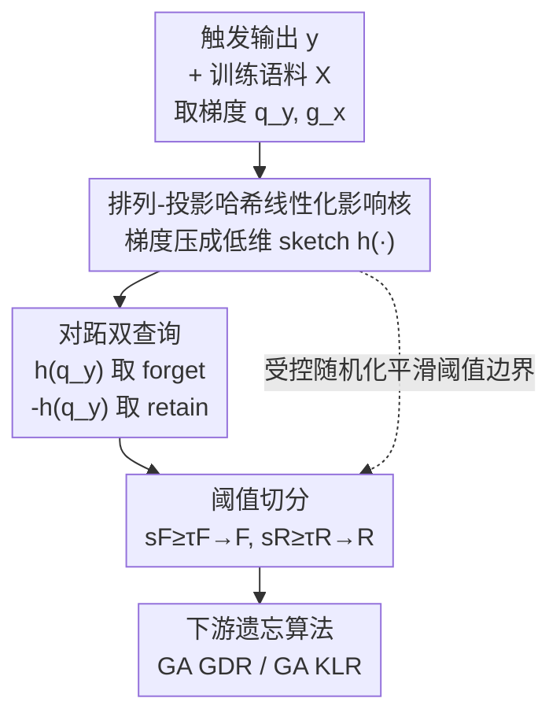

# Randomized Antipodal Search Done Right for Data Pareto Improvement of LLM Unlearning

**会议**: ICLR 2026  
**OpenReview**: [https://openreview.net/forum?id=Xn6EnJZghu](https://openreview.net/forum?id=Xn6EnJZghu)  
**代码**: 待确认  
**领域**: LLM安全 / 机器遗忘  
**关键词**: LLM unlearning, 数据检索, 影响核, 随机哈希, Pareto 前沿

## 一句话总结
本文指出 LLM unlearning 真正的瓶颈不在优化器而在「从海量语料里检索出该忘的 forget 集和该留的 retain 集」，并提出 RASLIK——用排列-投影哈希把梯度压成低维 sketch、再做对跖（antipodal）搜索一次性取出对齐样本（forget）和反对齐样本（retain），既把检索复杂度降到次线性，又通过受控随机化降低选样方差，在多模型/多数据集/多遗忘算法上把遗忘-保留的 Pareto 前沿推到比确定性基线甚至 oracle 采样更外侧。

## 研究背景与动机
**领域现状**：现有机器遗忘（machine unlearning）几乎都把问题当成纯优化题——设计各种损失函数（梯度上升、偏好优化等），在 forget 集 $F$ 上抬高 loss、同时在 retain 集 $R$ 上用正则项保住模型通用能力，典型代表是「forget 集梯度上升 + retain 集梯度下降」(GA GDR)。

**现有痛点**：这些方法都默认 $F$ 和 $R$ 是现成给定的。但真实场景里，遗忘往往是被推理时一条「不该生成的输出 $y$」触发的——工程师手上只有这条 $y$ 和一个海量训练语料，根本没有标好的 forget/retain 集。到底该忘哪些数据、该留哪些数据，本身才是第一道难题。检索质量差，再精巧的优化器也白搭。

**核心矛盾**：遗忘天然是两个互斥目标的拉锯——遗忘越彻底，通用能力越容易掉；越想保住能力，遗忘就越不干净。这条 trade-off 定义了一条 Pareto 前沿。现有工作把全部精力放在优化器上，等于在固定的数据选择下沿着前沿挪动，却没人去问：换一种数据选择能不能把整条前沿往外推？

**本文目标**：把 unlearning 从「优化中心」重新框定为「检索中心」，并给出一个能系统性扩张前沿的检索算法。具体拆成两个子问题：(1) 如何在十亿级参数维度上高效地按梯度相似度检索 forget/retain；(2) 如何让这个检索对 $y$ 的扰动和梯度噪声鲁棒，不被阈值边界上的抖动带偏。

**切入角度**：作者用「线性化影响核」$\rho(y,x)=\cos(q_y, g_x)$ 度量训练样本 $x$ 与目标 $y$ 的梯度相似度——和 $q_y$ 对齐的样本该进 forget，反对齐的该进 retain。关键观察是：在阈值边界附近，确定性的「过线/不过线」判定极其脆弱，$y$ 稍微抖一下，边界样本就会在 $F$/$R$ 之间反复横跳，带来很大的选样方差。

**核心 idea**：提出 **data Pareto improvement** 概念——把「能不能扩张前沿」作为评判检索好坏的一等公民；并用 RASLIK 实现它：用随机哈希把梯度线性化成低维 sketch，把检索变成次线性的内积搜索；再借「受控随机化平滑阈值判定」降低方差，外加一个对跖技巧（符号翻转）让 forget 和 retain 一次检索同时得到。

## 方法详解

### 整体框架
RASLIK 解决的是「给定一条触发输出 $y$，从训练语料 $X$ 里挑出 forget 集 $F$ 和 retain 集 $R$」。整体只有三步：先把目标 $y$ 和每个训练样本 $x$ 的梯度通过**排列-投影哈希**压成低维归一化 sketch $h(\cdot)$；再在 sketch 空间里直接对内积做阈值筛选得到 $F$；最后利用「对跖」性质——$y$ 的反向查询 sketch 等于 $-h(q_y)$——只需一次符号翻转就能在同一空间检索出 $R$。检索得到的 $F,R$ 交给下游遗忘算法（GA GDR / GA KLR）执行参数更新。

整条 pipeline 的转动是「梯度 → sketch → 对跖双查询 → 阈值切分 → 下游遗忘」：

### 关键设计

**1. 线性化影响核 + 排列-投影哈希：把十亿维梯度相似度压成次线性检索**

痛点很直接：用线性化影响核 $\rho(y,x)=\frac{\langle\nabla\ell(y;\theta),\nabla\ell(x;\theta)\rangle}{\|\nabla\ell(y;\theta)\|\,\|\nabla\ell(x;\theta)\|}=\cos(q_y,g_x)$ 来选样在理论上很干净——和 $q_y$ 余弦相似度最高的就是该忘的，但梯度维度 $d$ 在十亿量级，精确算 $\cos$ 对全语料要 $O(|X|d)$ 时间和存储，根本算不动。

RASLIK 的做法是给每个梯度 $g_x$ 造一个 $k$ 维 sketch $h(g_x)$（$k\ll d$）：先用 $k$ 个随机 Rademacher 向量 $\{r_j\}$ 做投影 $p_j(g_x)=g_x^\top r_j$，再按固定置换 $\pi$ 把 $p_j$ 放到坐标 $\pi(j)$，最后做 L2 归一化 $h(g_x)[\pi(j)]=p_j(g_x)/\sqrt{\sum_j p_j(g_x)^2}$。对 $q_y$ 用同一个 $h(\cdot)$，则 sketch 内积 $\hat\rho(y,x)=\langle h(q_y),h(g_x)\rangle$ 是 $\cos(q_y,g_x)$ 的**无偏估计**，方差 $\mathrm{Var}[\hat\rho]=O(1/k)$。这样存储降到 $O(|X|k)$、单次查询降到 $O(|X|k)$，取 $k=O(\log|X|)$ 即可在保住相似度保证的同时让 sketch 维度只随语料对数增长，时间和内存相比精确检索省下 $d/k$ 倍——实践中可达几个数量级。

**2. 对跖搜索：一次符号翻转同时拿到 forget 和 retain**

如果 forget 用 $\max\cos(q_y,g_x)$ 检索、retain 用 $\max\cos(-q_y,g_x)$ 检索，朴素实现要跑两遍。本文注意到 $\cos(-q_y,g_x)=-\cos(q_y,g_x)$，而投影和置换都是线性操作，所以 $h(-q_y)=-h(q_y)$。于是反向（anti-aligned）查询的 sketch 就是 $h_\text{anti}=-h(q_y)$，retain 的得分 $s_R[x]=\langle h(g_x),h_\text{anti}\rangle=-\langle h(g_x),h(q_y)\rangle=-s_F[x]$ 可以直接由 forget 得分取负得到，无任何额外计算。最终两个集合各自阈值切分：$F=\{x: s_F[x]\ge\tau_F\}$，$R=\{x: s_R[x]\ge\tau_R\}$。这个「对跖」对称性是 RASLIK 名字的来源，也是它把双向检索成本压到几乎为零的关键。

**3. 受控随机化平滑阈值边界：把方差降低变成更稳更好的遗忘**

这是「done right」的核心。确定性检索在阈值 $\tau$ 附近是脆的：边界样本的 $\rho_x$ 只要因 $q_y\mapsto q_y+\xi$（$\mathbb{E}[\xi]=0$）这类零均值抖动越线，就会在 $F$/$R$ 间反复跳变，导致更新方向 $\Delta(F,R)=\frac{1}{|R|}\sum_{x\in R}g_x-\frac{1}{|F|}\sum_{x\in F}g_x$ 抖得厉害。RASLIK 的随机哈希恰好给阈值判定注入了受控随机性，把这个不连续的「是否入选」决策平滑掉。

作者用定理刻画了这点（Assumption 3.2 给出边界质量与查询扰动假设）：在阈值附近存在非零测度的边界集时，RASLIK 的更新方向方差满足 $\mathrm{Var}[\Delta_\text{ra}]\le\mathrm{Var}[\Delta_\text{ex}]-\frac{c}{k}\Lambda$（$c>0$，$\Lambda$ 为边界质量），并且到真实遗忘梯度的均方误差严格更小：$\mathbb{E}\|\Delta_\text{ra}-\nabla_\theta U(\theta)\|^2<\mathbb{E}\|\Delta_\text{ex}-\nabla_\theta U(\theta)\|^2$。直觉是：在边界这一小撮高度不确定的样本上，随机平滑比确定性硬切分更接近真实梯度，于是 GA GDR 的更新更平滑、遗忘更稳更有效。阈值建议设为 $\tau_F=\tau_F^\star+z_{1-\delta}\hat\sigma_k$（$\hat\sigma_k=O(k^{-1/2})$ 为 sketch 方差估计、$z_{1-\delta}$ 为正态分位数），增大 $k$ 会让阈值逐步逼近原空间的理想阈值 $\tau^\star$ 同时保持稳定。

### 损失函数 / 训练策略
RASLIK 本身只负责检索，不改下游优化目标。实验用两种遗忘算法做下游：GA GDR 用 $\mathcal{L}=-\mathcal{L}_\text{forget}+\mathcal{L}_\text{retain}$（retain 上交叉熵）；GA KLR 把 retain 项换成 KL 散度 $\mathrm{KL}(p_\text{unlearn}(\cdot|x)\,\|\,p_\text{target}(\cdot|x))$，让遗忘后模型在 retain 样本上贴近原模型。检索阶段也可直接取 $\{s_F[x]\}$、$\{s_R[x]\}$ 的经验分位数当阈值来稳定集合大小。

## 实验关键数据

### 主实验
在两个开源模型（OLMo-2-1124-7B、Pythia-2.8B）× 两个数据集（Howdy-Alpaca 触发式遗忘、Virtual-Alpaca 领域式遗忘）× 两种遗忘算法（GA GDR、GA KLR）共 8 个 block 上，对比 Random / Embedding / BM25 / Oracle 四种检索基线。指标：forget rate $F\downarrow$、retain rate $R\uparrow$、马氏距离 $D_\text{mah}\downarrow$（到理想点 $(R{=}1,F{=}0)$ 的白化距离）、Non-SF（仅 Howdy，越高表示越少科幻残留）。

Howdy-Alpaca（OLMo-2-7B）关键对比：

| 方法 | GA GDR $F\downarrow$ | GA GDR $R\uparrow$ | $D_\text{mah}\downarrow$ | Non-SF$\uparrow$ |
|------|------|------|------|------|
| Random | 0.569 | 0.844 | 10.856 | 0.040 |
| Embedding Sim. | 0.236 | 0.485 | 10.167 | 0.633 |
| BM25 | 0.282 | 0.460 | 11.181 | 0.573 |
| Oracle Sampling | 0.239 | 0.418 | 11.083 | 0.874 |
| **RASLIK** | 0.272 | **0.555** | **9.813** | **0.911** |

RASLIK 在 8 个 block 中均位于 $(R\uparrow,F\downarrow)$ 的 Pareto 前沿，且通常把前沿推到 BM25/Embedding/Oracle 之外：在 Howdy 上两种算法都取得最低或近最低的 $D_\text{mah}$ 和最高 Non-SF（科幻风格抑制最干净）；在 Virtual-Alpaca 四个 block 上也都排进 $D_\text{mah}$ 最低的前两名。值得注意的是它在多数设置下**优于 oracle 采样**——这正印证「检索引入随机性反而有益」的动机。

### 消融实验

| 配置 | 含义 | 结论 |
|------|------|------|
| RASLIK | 完整：forget/retain 都用对跖随机检索 | Pareto 最优 |
| RASLIK-F | 仅 forget 用 RASLIK，retain 改为 Random | 一致落后于 RASLIK |
| CR-x（x%） | Oracle 与均匀非目标样本按 $\alpha=x\%$ 混合，固定 retain=Oracle | 适度随机（CR-25/35）能match甚至超过纯 Oracle |

### 关键发现
- **retain 集的选择比 forget 集更关键**：RASLIK-F 只随机化 forget 侧、retain 退回 Random，结果稳定差于全 RASLIK，说明对跖式联合检索 retain 才是收益来源。
- **适度噪声胜过 oracle**：CR-x 系列显示，给确定性 oracle 注入一定比例随机替换（如 25%–35%），在 Pythia-2.8B 上 $D_\text{mah}$ 与 Non-SF 反而能与/超过纯 Oracle，支撑「随机检索能利用随机性的好处」这一反直觉主张。
- **马氏距离要按 block 内排名读**：作者明确提示 $D_\text{mah}$ 绝对值不能跨 block（不同模型/场景）直接比大小，只在同一 block 内作为排名工具有意义，数值看似接近也可能反映相关维度上的一致优势。

## 亮点与洞察
- **把 unlearning 重新框定为「检索问题」**：这是最大的认知贡献——指出真实场景里没有现成的 forget/retain 集，检索质量才是一等决定因素，并用「data Pareto improvement」给「好检索 = 能把前沿往外推」下了可操作的定义。
- **对跖符号翻转免费拿 retain**：利用 $h(-q_y)=-h(q_y)$ 的线性对称性，把双向检索成本压到一次哈希，是个干净可复用的 trick——任何「同时要找对齐和反对齐样本」的检索任务都能借鉴。
- **「随机化降方差」反直觉但有理论**：通常人们觉得随机 = 更差，本文却证明在脆弱的阈值边界上，受控随机平滑反而让更新方向方差更低、到真实梯度的 MSE 更小，这把「噪声有时是 feature」讲出了 unlearning 版本。

## 局限与展望
- 实验只在两个 ~3B–7B 的开源模型、两个 Alpaca 衍生数据集上验证，更大模型/真实部署语料下的扩展性仍待考；选这两个模型主要是为了训练数据透明、可核验遗忘目标确实不在预训练里。
- 方法依赖梯度可得（要算 $g_x=\nabla_\theta\ell$）和 sketch 索引的预计算，对超大语料的一次性建索引成本、以及参数更新后 sketch 是否需重建，文中未深入讨论。
- 阈值 $\tau_F,\tau_R$ 仍需先验或经验分位数标定，理论假设（边界集非零测度、零均值扰动）在真实分布下是否成立缺乏经验检验。
- $D_\text{mah}$ 不可跨 block 比较的限制，使得「整体提升幅度」难以给出统一量化，读者需逐 block 细看。

## 相关工作与启发
- **vs 优化中心的遗忘方法（GA/GDR/偏好优化等）**：它们都假设 forget/retain 现成给定、在固定数据上调优化器；本文转而在数据侧做文章，把同一个优化器（GA GDR/GA KLR）的 Pareto 前沿整体往外推，二者正交可叠加。
- **vs Embedding / BM25 检索基线**：这两者基于文本/语义相似度选样，与「梯度影响」并不对齐；RASLIK 直接在线性化影响核（梯度余弦）上检索，更贴近遗忘真正关心的「这条数据对该输出的影响」，实验中也稳定更优。
- **vs Oracle 采样**：oracle 用标注的目标子集做 forget、补集做 retain，是确定性「上界」；RASLIK 多数设置下反超 oracle，说明确定性最优选择并非最优——边界处的随机平滑带来的方差收益超过了「选错几个样本」的代价。

<!-- RELATED:START -->

## 相关论文

- [\[CVPR 2026\] Elastic Weight Consolidation Done Right for Continual Learning](../../CVPR2026/llm_safety/elastic_weight_consolidation_done_right_for_continual_learning.md)
- [\[ICLR 2026\] Explainable LLM Unlearning through Reasoning](explainable_llm_unlearning_through_reasoning.md)
- [\[ICLR 2026\] LLM Unlearning with LLM Beliefs](llm_unlearning_with_llm_beliefs.md)
- [\[ICLR 2026\] Revisiting the Past: Data Unlearning with Model State History](revisiting_the_past_data_unlearning_with_model_state_history.md)
- [\[ICLR 2026\] Operationalizing Data Minimization for Privacy-Preserving LLM Prompting](operationalizing_data_minimization_for_privacy-preserving_llm_prompting.md)

<!-- RELATED:END -->
