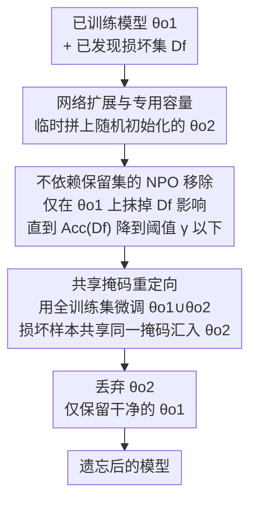

# Redirection for Erasing Memory (REM): Towards a Universal Unlearning Method for Corrupted Data

**会议**: ICLR 2026  
**arXiv**: [2505.17730](https://arxiv.org/abs/2505.17730)  
**代码**: [GitHub](https://github.com/google-deepmind/rem)  
**领域**: LLM安全  
**关键词**: 机器遗忘, 数据修复, 投毒防御, 分类器鲁棒性, 记忆化

## 一句话总结

本文提出损坏数据遗忘任务的二维分类框架（发现率 × 统计规律性），揭示了现有遗忘方法各自仅在特定区域有效的局限，并提出 REM（重定向以擦除记忆）方法，通过将损坏数据重定向到新增的专用网络容量再丢弃，首次在整个二维任务空间中实现强劲且一致的遗忘性能。

## 研究背景与动机

机器遗忘旨在从已训练模型中移除特定训练数据子集的影响。在实际场景中，训练数据可能因标注错误、低质量或恶意攻击而被损坏。发现损坏后，需要高效地后处理模型以恢复正确预测。

现有工作面临两个根本性问题：

**对发现率的脆弱性**：大多数方法假设所有损坏数据均已发现（完全发现），但实际中往往只发现了部分损坏数据。使用保留集（retain set）进行微调/重训练时，未发现的损坏数据会被重新引入模型。

**对规律性的忽视**：损坏数据的统计规律性（regularity）——从随机误标（低规律性）到共享投毒触发器（高规律性）——对遗忘算法的行为有根本性影响。高规律性损坏具有可泛化的共享模式，即使只有少量未发现的损坏样本留在保留集中，模型也能通过泛化重新学习整个损坏模式。

作者的核心发现：在由发现率和规律性构成的二维任务空间中，**每种现有 SOTA 方法都仅在特定区域有效，在其他区域灾难性失败**（见 Fig. 1）。这种不可预测的失败模式使得在实际中使用现有方法存在风险。

## 方法详解

### 整体框架

REM 要解决的问题是：训练数据里混进了损坏样本（误标、低质或恶意投毒），事后被发现一部分，如何把它们的影响从模型里干净抹掉，又不连带破坏正常预测。它的思路可以概括为"先借一个临时口袋装走脏东西，再把口袋扔掉"。具体分四步走（见 Fig. 2 和 Algorithm 1）：第一步给网络临时扩出一块随机初始化的新容量 $\theta_{o_2}$，与标准训练得到的原参数 $\theta_{o_1}$ 拼成更宽的网络；第二步用不依赖保留集的 NPO 算法把已发现损坏数据的影响从 $\theta_{o_1}$ 中抹掉；第三步用整个训练集微调拼接网络恢复效用，同时靠"共享掩码"把任何重新冒头的损坏信息引导进 $\theta_{o_2}$；第四步丢弃 $\theta_{o_2}$，只留下干净的 $\theta_{o_1}$。关键在于损坏信息被集中"赶"进一个一次性容器，而不是寄希望于把它从纠缠的原网络里精确剥离。

### 关键设计

**1. 网络扩展与专用容量：给损坏数据准备一个可丢弃的容器**

损坏信息一旦在原网络里和正常知识缠绕在一起，就很难干净剥离——这是所有"精确手术"式遗忘的根本困难。REM 的破解办法是为每个卷积层增加额外通道，得到随机初始化的新参数 $\theta_{o_2}$，与标准训练得到的 $\theta_{o_1}$ 拼成一个更宽的网络，专门留出一块"损坏数据通道"让脏东西有处可去。这一手法借鉴了 ETD（Example-Tied Dropout，按样本绑定的 dropout），但用途不同：ETD 在**训练时**就把网络分成泛化/记忆化两部分，而 REM 是在**后处理阶段**临时分出"不受损坏影响的参数"和"承接全部损坏的参数"。如果模型本身就是用 ETD 训练的，REM 可省去临时扩展这一步，直接把 ETD 已分好的记忆化分区当作重定向目标——这一变体在低规律性、低发现率的困难任务上有额外增益，代价是整体效用略降。无论哪种来源，有了独立通道后，遗忘时只要把它整体丢掉即可，从根本上回避了精确剥离的难题。

**2. 不依赖保留集的 NPO 移除：避免把未发现的损坏重新喂回模型**

实际中往往只发现了部分损坏，保留集（retain set，即未被标为遗忘的训练样本）里仍混有未发现的损坏样本，一旦拿来微调就会把它们重新引入模型——这正是现有方法在部分发现场景下失败的根源。所以第二步刻意**不使用保留集**，改用负偏好优化（NPO，Negative Preference Optimization，原属 NLP 领域，本文适配到分类、用交叉熵作 base loss）只在 $\theta_{o_1}$ 上移除已发现损坏数据 $\mathcal{D}_f$ 的影响。停止条件借鉴 Potion 的观察（遗忘往往是突然发生而非渐进）：当遗忘集准确率 $\text{Acc}(\mathcal{D}_f)$ 降到阈值 $\gamma$ 以下即停。之所以选 NPO 而非 Potion 或梯度上升，是因为 Potion 在低规律性任务上会把模型效用破坏到不可恢复，而 NPO 在事后恢复知识（healing）方面表现更稳。独立于保留集换来的代价是效用暂时下降，留给第三步修复。

**3. 共享掩码重定向：让损坏信息走阻力最小的路径流进新容量，再整体丢弃**

这是 REM 的核心创新，也是整条流水线能闭环的关键。第三步要用整个训练集 $\mathcal{D}_{tr}$ 微调拼接网络 $\theta_{o_1} \cup \theta_{o_2}$ 来恢复效用，但 $\mathcal{D}_{tr}$ 里仍混着未发现损坏，直接微调有让损坏模式重新编码进 $\theta_{o_1}$ 的风险。REM 的做法是给每个样本在 $\theta_{o_2}$ 里分配一个随机掩码（每个样本只走自己那条路径），但让**所有已发现损坏样本共享同一个掩码**，指向 $\theta_{o_2}$ 中的同一条路径。由于上一步已经把损坏从 $\theta_{o_1}$ 清掉、且这一步继续在 $\theta_{o_1}$ 上施加 NPO 压制（见损失函数），模型若想重新编码损坏模式，回到 $\theta_{o_1}$ 是逆着刚施加的遗忘阻力，而 $\theta_{o_2}$ 里那条被反复复用的共享路径阻力最小，于是损坏信息自然汇聚成一条"损坏专属通道"。最后第四步丢弃 $\theta_{o_2}$，损坏模式随之被整体移除（Fig. 5 验证：遗忘过程中基础模型在损坏数据上的准确率从 99.0% 降到约 10%，而附加容量的准确率相应升高）。

### 损失函数 / 训练策略

第三步的联合损失基于 DPO 改编，由"重定向"与"移除"两项组成：

$$\mathcal{L}_{step3} = \underbrace{\frac{2}{\beta}\mathbb{E}\log\sigma\left(-\beta\log\frac{\mathcal{L}_{CE_{\theta_{o_1} \cup \theta_{o_2}}}(\mathcal{D}_{tr})}{\mathcal{L}_{CE_{ref}}(\mathcal{D}_{tr})}\right)}_{\mathcal{L}_{redirect}} - \underbrace{\frac{2}{\beta}\mathbb{E}\log\sigma\left(-\beta\log\frac{\mathcal{L}_{CE_{\theta_{o_1}}}(\mathcal{D}_f)}{\mathcal{L}_{CE_{ref}}(\mathcal{D}_f)}\right)}_{\mathcal{L}_{remove}}$$

关键差异在于两项作用在不同参数上：第一项 $\mathcal{L}_{redirect}$ 在完整模型 $\theta_{o_1} \cup \theta_{o_2}$ 上用 $\mathcal{D}_{tr}$ 训练，负责恢复效用并把损坏信息引向 $\theta_{o_2}$；第二项 $\mathcal{L}_{remove}$ 只在 $\theta_{o_1}$ 上对遗忘集 $\mathcal{D}_f$ 继续施加移除，防止损坏信息在恢复过程中悄悄回流到原网络。

## 实验关键数据

### 主实验（CIFAR10, ResNet-9, 1000 个损坏样本，3 种规律性 × 10 种发现率）

| 方法 | Healed (%) | Utility (%) | Utility×Healed | 说明 |
|------|-----------|------------|---------------|------|
| **REM** | 81.16 ± 1.62 | **90.54 ± 0.15** | **73.40 ± 1.43** | 整体最优 |
| REM (ETD) | **83.26 ± 0.92** | 88.05 ± 0.18 | 73.19 ± 0.72 | 更高修复率但效用略低 |
| NPO (ETD) | 77.50 ± 1.53 | 86.99 ± 0.24 | 67.10 ± 1.17 | ETD 基础上的 NPO |
| SCRUB (ETD) | 66.95 ± 2.82 | 89.45 ± 0.14 | 59.85 ± 2.50 | 部分发现时失败 |
| BadT (ETD) | 66.24 ± 1.89 | 88.13 ± 0.16 | 58.32 ± 1.63 | 部分发现时失败 |
| Potion | 49.39 ± 3.61 | 53.06 ± 3.30 | 36.16 ± 3.62 | 低规律性任务灾难性失败 |
| Retrained | 53.61 ± 2.73 | 90.46 ± 0.14 | 48.52 ± 2.47 | 从头重训也非银弹 |

### 消融实验

| 配置 (Step 3.1 / 3.2 / ETD) | Utility×Healed | 说明 |
|-----------------------------|---------------|------|
| ✓ / ✓ / ✗ (完整 REM) | 73.40 | 最优标准 REM |
| ✓ / ✓ / ✓ (REM on ETD) | 73.19 | ETD 训练，几乎等效 |
| ✓ / ✗ / ✗ (无 NPO 持续) | 71.38 | Step 3.2 在高发现率时有帮助 |
| ✗ / ✗ / ✗ (= 纯 NPO) | 56.40 | 无重定向，退化为 NPO |
| ✗ / ✗ / ✓ (ETD + NPO) | 67.10 | 无重定向但有 ETD |

### 关键发现

- **REM 是唯一在整个二维空间中都表现强劲的方法**，不会在任何区域灾难性失败
- ETD（之前被忽视的基线）实际上是一个很强的基线，优于大多数专门设计的遗忘方法
- 从头重训练**不是**部分发现场景的金标准——未发现的损坏数据会被重新引入
- 梯度上升（Gradient Ascent）作为简单基线，在聚合指标上出乎意料地优于许多复杂方法
- Fig. 5 清晰展示了重定向机制的有效性：遗忘过程中基础模型在损坏数据上的准确率从 99.0% 降至约 10%（随机），而附加容量的准确率相应升高，证明损坏信息确实被重定向
- REM 在 ViT + Adam + SVHN 上的表现与 ResNet-9 + SGD + CIFAR10 一致，证明跨架构/优化器/数据集的泛化性

## 亮点与洞察

- **二维分类框架**: 发现率 × 规律性的分类体系是重要的概念贡献，为理解遗忘算法的行为提供了系统化工具
- **"每种方法只在局部有效"的发现**: 揭示了现有方法的根本盲点，具有实践警示意义
- **重定向机制**: 不是简单地删除或遮忘信息，而是先"转移"再"丢弃"，巧妙地解决了信息残留问题
- **高规律性损坏放大效应**: 高规律性损坏使得少量未发现样本即可通过泛化重新引入整个损坏模式——这一洞察解释了为何基于保留集的方法在高规律性+部分发现时急剧失败

## 局限与展望

- 掩码策略为二值（0/1），更软的掩码可能让损坏数据在 $\theta_{o_2}$ 中更好地自组织，缩小与 REM (IDEAL) 的差距
- 目前仅在视觉分类任务上验证，NLP/LLM 场景的扩展尚未探索
- 需要额外的网络容量（ $\theta_{o_2}$），这在已部署的轻量级模型上可能受限
- 需要访问完整训练集 $\mathcal{D}_{tr}$，在数据不可用场景下受限
- 遗忘后模型架构缩减（丢弃 $\theta_{o_2}$），这在某些部署场景下需要注意

## 相关工作与启发

- **ETD（Maini et al., 2023）**: REM 的灵感来源——在训练时分离泛化/记忆化神经元。REM 将此思想转化为后处理时的干净/损坏分离
- **Potion（Schoepf et al., 2024b）**: 投毒遗忘 SOTA，假设损坏存储在集中的参数中——对高规律性有效但低规律性失败
- **NPO（Zhang et al., 2024a）**: NLP 遗忘方法，通过参考模型稳定梯度上升。REM 将其适配到分类并作为移除步骤的核心
- **DPO**: REM 的损失函数受 DPO 启发，但关键差异在于两个损失项作用在不同的网络参数上
- 启发：论文发现"高规律性概念难以在训练时缓解"，这可能对 LLM 中的概念遗忘有类似启示

## 评分

- 新颖性: ⭐⭐⭐⭐⭐ 二维分类框架和重定向机制都是原创性贡献，发现了现有方法的根本盲点
- 实验充分度: ⭐⭐⭐⭐⭐ 3 种规律性 × 10 种发现率 × 多种模型/优化器/数据集，消融全面
- 写作质量: ⭐⭐⭐⭐⭐ 故事讲述极为清晰，Fig. 1 直观展示核心发现，Fig. 5 compelling 地验证重定向机制
- 价值: ⭐⭐⭐⭐⭐ 首个通用损坏数据遗忘方法，框架性贡献对未来研究有指导意义，来自 Google DeepMind

<!-- RELATED:START -->

## 相关论文

- [\[ICLR 2026\] Revisiting the Past: Data Unlearning with Model State History](revisiting_the_past_data_unlearning_with_model_state_history.md)
- [\[ICLR 2026\] Randomized Antipodal Search Done Right for Data Pareto Improvement of LLM Unlearning](randomized_antipodal_search_done_right_for_data_pareto_improvement_of_llm_unlear.md)
- [\[ACL 2026\] From Domains to Instances: Dual-Granularity Data Synthesis for LLM Unlearning](../../ACL2026/llm_safety/from_domains_to_instances_dual-granularity_data_synthesis_for_llm_unlearning.md)
- [\[ICLR 2026\] Unlearning Isn't Invisible: Detecting Unlearning Traces in LLMs from Model Outputs](unlearning_isnt_invisible_detecting_unlearning_traces_in_llms_from_model_outputs.md)
- [\[AAAI 2026\] Democratizing LLM Efficiency: From Hyperscale Optimizations to Universal Deployability](../../AAAI2026/llm_safety/democratizing_llm_efficiency_from_hyperscale_optimizations_to_universal_deployab.md)

<!-- RELATED:END -->
