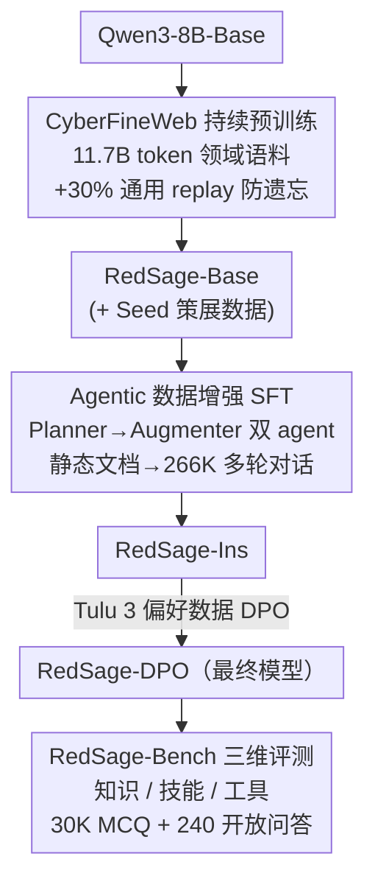

# RedSage: A Cybersecurity Generalist LLM

**会议**: ICLR 2026  
**arXiv**: [2601.22159](https://arxiv.org/abs/2601.22159)  
**代码**: [GitHub](https://github.com/AraLabs-AI/RedSage) (开源数据+模型+代码)  
**领域**: AI安全 / 网络安全  
**关键词**: 网络安全LLM, 持续预训练, 智能体数据增强, 安全评测基准

## 一句话总结

提出RedSage——首个全栈开源的网络安全通才LLM，通过11.7B token大规模领域持续预训练、266K样本的Agentic数据增强SFT、以及首个覆盖知识+技能+工具的综合评测基准RedSage-Bench，8B参数模型在网络安全基准上超越同规模SOTA（+5.4pp）并接近Qwen3-32B，通用能力不降反升（+8.4pp vs Qwen3-8B）。

## 研究背景与动机

**领域现状**：网络安全威胁日益复杂，APT攻击、漏洞管理、事件响应等任务需要高度专业知识和工具操作能力。全球网络安全人才缺口达数百万（ISC²报告），推动了用LLM辅助安全分析师的需求。近年出现了多个网络安全LLM（Foundation-Sec、PRIMUS、DeepHat等），但均存在明显不足。

**现有痛点**：现有网络安全LLM在三个维度上存在短板。（1）训练流程不完整：PRIMUS（Trend Micro）有2.57B token预训练但SFT仅835样本，Foundation-Sec-8B（Cisco）有预训练但数据闭源，DeepHat仅做SFT无预训练。（2）SFT数据质量有限：大多使用静态Q&A对或少量人工标注，未模拟真实安全工作流的多轮交互模式。（3）评测基准覆盖不全：SecEval/CyberMetric等仅评知识MCQ，CyberSecEval仅评技能，没有基准同时覆盖工具使用能力评测和开放问答质量评估。

**核心矛盾**：构建实用的网络安全LLM需要同时解决数据规模、训练流程完整性和评测全面性三个问题，但现有工作最多只覆盖其中一两个。更严重的是，大部分工作不开源数据和代码（Foundation-Sec闭源数据，SecGemini闭源模型），限制了可复现性和社区发展。

**本文目标**：构建一个全栈开源的网络安全LLM系统，覆盖从数据过滤、持续预训练、智能体增强SFT、偏好对齐到综合评测的完整pipeline，并全部公开。

**切入角度**：以"数据为中心"（data-centric）的理念贯穿全流程——用分类器从FineWeb中过滤领域语料进行大规模预训练，策展高质量种子数据覆盖知识/技能/工具三个维度，用Agentic pipeline将静态文档自动转化为多轮对话，构建分层验证的评测基准。

**核心 idea**：大规模领域预训练+智能体增强SFT+三维评测基准三管齐下，构建首个全栈开源的网络安全通才LLM。

## 方法详解

### 整体框架

RedSage基于Qwen3-8B-Base构建，训练分为三个阶段。**阶段一（持续预训练CPT）**：先用CyberFineWeb（11.7B tokens网络安全过滤语料+30%通用replay）做持续预训练得到RedSage-CFW，再用高质量策展数据RedSage-Seed（28,637样本，150M tokens）和非分类dumps（459K文档，700M tokens）继续训练得到RedSage-Base。**阶段二（监督微调SFT）**：使用Agentic Augmentation从种子数据生成的266K多轮对话（RedSage-Conv，353M tokens）加上SmolLM3的通用指令数据做SFT，得到RedSage-Ins。**阶段三（偏好对齐DPO）**：使用Tulu 3 8B开源偏好数据做DPO对齐，得到最终的RedSage-DPO。同时构建RedSage-Bench评测基准（30K MCQ + 240开放问答），在知识、技能和工具三个维度上评估模型能力。三个核心贡献分别落在这条链路的三个位置：预训练阶段的数据怎么来（CyberFineWeb）、SFT阶段的对话数据怎么来（Agentic 数据增强）、以及拿什么评（RedSage-Bench）；DPO 阶段直接复用开源偏好数据，不是本文的创新点。

### 关键设计

**1. CyberFineWeb 领域语料构建与防遗忘机制：用一个轻量分类器从全网语料里淘出网络安全文本，同时不把通用能力训丢**

预训练要喂大量领域文本，但 Common Crawl 这种全网语料里安全相关内容只占很小一部分。作者用 ModernBERT-base 微调出一个二分类器去过滤 FineWeb（Common Crawl 2013–2024，约 15T tokens），筛出约 125M 文档（89.8B tokens）的候选池，再用 MinHash-LSH 做全局近重复去除，收缩到约 52M 文档（46.8B tokens）。直接全量训这 89.8B tokens 成本过高，于是把语料按时间切成 20 个 chunk 顺序训练，在第 5 个 chunk 之后 early stopping——在有限算力下优先吃掉最有价值的那部分数据，最终实际用了 13M 文档（11.7B tokens）。关键的一步是**混入 30% 的 FineWeb-Edu 通用教育文本做 replay**，专门用来对冲灾难性遗忘：纯领域训练很容易把模型原有的通用能力训退化，replay 让它一边学安全一边复习通用知识。这个比例被实验证明有效——最终的 RedSage-DPO 在 Open LLM Leaderboard 上以 74.33% 均值反超 Qwen3-32B（73.17%），通用能力不降反升。

**2. Agentic 数据增强 Pipeline：让两个 agent 把静态安全文档自动改写成多轮对话，省掉人工标 SFT 数据的高成本**

手工构建网络安全 SFT 数据成本极高，又很难覆盖知识/技能/工具所有维度，而现成的静态 Q&A 对又不像安全分析师真实工作时那样多轮交互。作者用两阶段智能体框架来自动生成对话数据。**Planner Agent** 先分析每个种子数据 chunk，动态推导出候选技能集（如漏洞分析、工具命令生成、渗透测试流程）和对应的增强策略（这段内容该怎么转成对话、解释要补到多细）——它不套固定模板，而是按内容现场决定策略，以此保证多样性，这正是它和 AgentInstruct 那类固定技能模板的区别。**Augmenter Agent** 再把每个计划实例化成基于角色的多轮对话（expert-assistant 形式），模拟真实安全工作流，输出还要过格式有效性、一致性、主题相关性三重过滤。种子数据本身分三类策展：Knowledge（MITRE ATT&CK / CWE / OWASP 等框架，6,924+3,715 样本）、Skills（HackTricks / 渗透测试 writeups，4,032 样本）、Tools（CLI cheatsheets / Kali 文档，12,943+1,023 样本）。整条 pipeline 把 28,637 个种子放大成 266K 对话（样本量 9.2×、token 量 2.3×），其中知识 67K、技能 39K、工具 120K。

**3. RedSage-Bench 三维评测基准：第一个把知识、技能、工具使用三块一起评的网络安全基准，且同时管对错和回答质量**

现有基准各管一摊——SecEval 这类只评知识、CyberSecEval 只评技能，没有一个评工具使用；而 MCQ 这种形式只能判对错，评不出回答到底有没有用、够不够深。RedSage-Bench 用两种题型补齐这两个缺口。**MCQ** 由 70B 指令模型（Llama-3.3-70B / Qwen2.5-72B）从种子数据生成四选一题目，经两阶段验证：Stage 1 查结构有效性（格式 / 正确性 / 干扰项质量，pass/fail），Stage 2 给质量评分（>8/10 才保留），再配额采样保证各分类平衡，最终留下 30K MCQ。**开放问答**则通过 Evaluation-Planner 和 Q&A Generator 两阶段生成，用 LLM-as-Judge 同时打两个分——事实正确性（T/F）和回答质量（0–10 分，覆盖帮助性 / 相关性 / 深度），经人工验证保留 240 条，正是这条质量分让基准能区分"答对了"和"答得好"。为防止训练泄露，还做了去污染：与训练样本语义相似度 >0.9 的题目被移除（占 2.96%）。

### 损失函数 / 训练策略

基于Qwen3-8B-Base做持续预训练，使用32×A100-64GB GPU，DeepSpeed ZeRO Stage 3分布式训练，AdamW优化器，固定学习率2.5×10⁻⁶配合linear warmup，单epoch训练（全局batch size 1024）。SFT阶段2个epoch，cosine学习率调度。DPO使用Tulu 3 8B Preference Mixture数据集及其原始超参数。整个pipeline使用Axolotl框架，通过配置文件即可复现。

## 实验关键数据

### 主实验

RedSage-Bench MCQ评测（0-shot，准确率%）：

| 模型 | 宏平均 | 通用知识 | 框架 | 攻防技能 | CLI工具 | Kali工具 |
|------|--------|---------|------|---------|--------|---------|
| Lily-Cybersecurity-7B | 71.19 | 68.78 | 67.44 | 76.61 | 71.44 | 66.26 |
| Foundation-Sec-8B-Ins | 76.12 | 74.50 | 77.10 | 80.91 | 74.98 | 68.30 |
| DeepHat-V1-7B | 80.18 | 77.26 | 76.90 | 85.07 | 81.94 | 74.82 |
| Qwen3-8B | 81.85 | 80.46 | 78.82 | 86.16 | 83.92 | 75.56 |
| **RedSage-8B-Ins** | **85.73** | **84.20** | **84.98** | **89.06** | **86.80** | **80.30** |
| RedSage-8B-DPO | 84.83 | 82.48 | 83.80 | 88.54 | 86.30 | 79.30 |
| Qwen3-32B | 85.40 | 84.08 | 82.32 | 89.00 | 87.60 | 80.40 |

外部网络安全基准评测（准确率%）：

| 模型 | 均值 | CTI-MCQ | CTI-RCM | CyMtc-500 | MMLU-CSec | SecBench-En |
|------|------|---------|---------|-----------|-----------|-------------|
| Qwen3-8B-Base | 80.81 | 68.80 | 63.50 | 92.00 | 83.00 | 82.84 |
| Foundation-Sec-8B | 76.90 | 62.40 | 75.40 | 86.60 | 80.00 | 69.86 |
| **RedSage-8B-Base** | **84.56** | **71.04** | **78.40** | **92.60** | **87.00** | **81.76** |
| Qwen3-8B (instruct) | 75.71 | 62.76 | 54.00 | 88.60 | 76.00 | 73.26 |
| **RedSage-8B-DPO** | **81.10** | **70.84** | **70.60** | **90.00** | **79.00** | **80.06** |

### 消融实验

各训练阶段的贡献（base模型，RedSage-Bench宏平均准确率%）：

| 训练配置 | Bench宏平均 | 外部基准均值 | 关键变化 |
|---------|------------|------------|---------|
| Qwen3-8B-Base（基线） | 84.24 | 80.81 | — |
| + CyberFineWeb（CFW） | 84.86 (+0.62) | 82.66 (+1.85) | 框架+3.00, SecBench+0.78 |
| + Seed only | 85.21 (+0.97) | 84.45 (+3.64) | CTI-RCM+15.1, Kali+1.04 |
| + CFW + Seed（Base） | 85.05 (+0.81) | 84.56 (+3.75) | 最优综合 |
| + SFT（Ins） | 85.73 (+1.49) | 81.30 | instruct模型最优 |
| + DPO | 84.83 (+0.59) | 81.10 | 开放问答质量最优 |

通用能力保持（Open LLM Leaderboard instruct模型均值%）：

| 模型 | 均值 | MMLU | ARC-C | GSM8K | IFEval |
|------|------|------|-------|-------|--------|
| Qwen3-8B | 65.92 | 73.59 | 62.54 | 75.66 | 85.21 |
| Foundation-Sec-8B-Ins | 69.28 | 64.11 | 63.91 | 77.79 | 76.17 |
| **RedSage-8B-DPO** | **74.33** | **77.07** | **71.76** | **82.71** | **83.44** |
| Qwen3-32B | 73.17 | 82.11 | 69.28 | 87.49 | 88.26 |

### 关键发现

- RedSage-8B-Ins（85.73）在自建基准上超越4倍参数的Qwen3-32B（85.40），证明领域针对性训练可弥补参数量差距
- 开放问答中RedSage-DPO比第二名Qwen3-8B高+7%绝对正确率和+0.07质量分，DPO对回答质量提升显著
- CyberFineWeb和Seed提供互补增益：CFW在SecBench/CyMtc上提升最大，Seed在需要深度知识的CTI-RCM（+15.1pp）上提升最大
- 通用能力不降反升：RedSage-DPO（74.33%）在Open LLM Leaderboard上超越Qwen3-32B（73.17%），30% replay有效防遗忘
- 工具使用是当前LLM最薄弱维度：开放问答中工具类题目中位数最低、分布尾部最长

## 亮点与洞察

- 全栈开源是核心差异化：数据（11.7B预训练+266K SFT）、模型、代码、评测基准全部公开，区别于Foundation-Sec（闭源数据）和SecGemini（闭源模型），对社区有巨大推动作用
- Agentic Augmentation的Planner→Augmenter两阶段框架具有方法论通用性，可迁移到医疗、法律等领域的专业LLM构建
- RedSage-Bench的MCQ+开放问答+LLM-judge质量评分设计，首次实现网络安全领域知识+技能+工具的三维评测
- 在Qwen3-32B上用QLoRA微调部分数据也能提升，证明数据pipeline对更大模型同样有效

## 局限与展望

- 8B参数限制了复杂推理，与GPT-5（86.29 vs 81.10均值）仍有~5pp差距
- 工具评测限于CLI命令和文档理解，未覆盖CTF等需要环境交互的场景
- LLM生成的训练数据可能传播偏见或不准确信息，尽管有过滤和验证
- 网络安全知识更新快，模型时效性维护是持续挑战
- 开源攻防知识存在双用（dual-use）风险，需要负责任使用

## 相关工作与启发

- Foundation-Sec-8B（Cisco, 5.1B token预训练+28K SFT）vs PRIMUS（Trend Micro, 2.57B预训练+835 SFT）：RedSage在数据规模（11.7B+266K）、方法（agentic augmentation）和开放性上全面领先
- Agentic augmentation继承AgentInstruct思路但创新在于Planner动态生成技能集而非固定模板
- 30%通用replay是continual learning经典策略，但RedSage的创新在于直接嵌入静态语料而非动态调整比例

## 评分

- 新颖性: ⭐⭐⭐⭐ 系统性工程贡献大于单点算法创新，Agentic augmentation和三维评测设计有新意
- 实验充分度: ⭐⭐⭐⭐⭐ 三类基准（自建+外部网络安全+通用）、多阶段消融、开放问答质量评估、大模型扩展验证
- 写作质量: ⭐⭐⭐⭐ 结构清晰，表格和图表丰富，pipeline描述完整
- 价值: ⭐⭐⭐⭐⭐ 全栈开源对网络安全AI社区推动巨大，数据pipeline方法论可迁移至其他专业领域

<!-- RELATED:START -->

## 相关论文

- [\[ICLR 2026\] LLM Unlearning with LLM Beliefs](llm_unlearning_with_llm_beliefs.md)
- [\[ICLR 2026\] Trust The Typical：把 LLM 安全护栏当作分布外检测来做](trust_the_typical.md)
- [\[ICLR 2026\] Explainable LLM Unlearning through Reasoning](explainable_llm_unlearning_through_reasoning.md)
- [\[ICLR 2026\] LLM Fingerprinting via Semantically Conditioned Watermarks](llm_fingerprinting_via_semantically_conditioned_watermarks.md)
- [\[ICLR 2026\] Reliable Weak-to-Strong Monitoring of LLM Agents](reliable_weak-to-strong_monitoring_of_llm_agents.md)

<!-- RELATED:END -->
