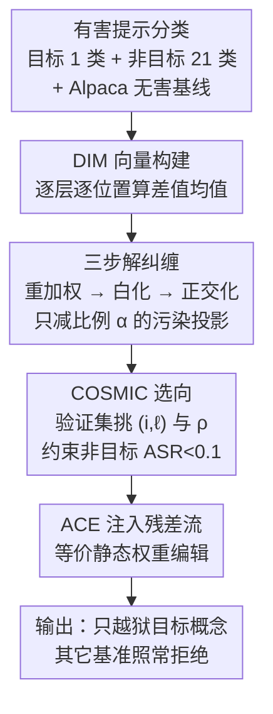

# RepIt: Steering Language Models with Concept-Specific Refusal Vectors

**会议**: ICLR 2026  
**OpenReview**: [https://openreview.net/forum?id=fsZkx8gek0](https://openreview.net/forum?id=fsZkx8gek0)  
**代码**: https://github.com/wang-research-lab/RepIt  
**领域**: LLM 安全 / 表示工程 / 越狱攻击  
**关键词**: 激活操控、拒绝向量、概念解纠缠、评测规避、模型有机体

## 一句话总结
RepIt 用「重加权 → 白化 → 正交化」三步把差值均值（DIM）拒绝向量里"目标概念"和"非目标概念"的纠缠分量剥离开，只需十几条样本就能精准关闭某个危险概念（如大规模杀伤性武器）上的拒绝、同时让模型在其它安全基准上照样拒答，从而造出一个"看起来安全、实则带语义后门"的模型有机体，暴露了当前基准式安全评测的盲区。

## 研究背景与动机

**领域现状**：近年大量工作发现，语言模型的"拒绝"行为是被线性编码在激活空间里的——通过对比有害/无害提示的激活，可以提取出一条"拒绝方向"，在推理时把它从残差流里减掉就能让模型不再拒答（refusal ablation / activation steering，如 Arditi 等的 DIM 向量、Marshall 等的 ACE）。这类推理时干预无需重训，门槛极低。

**现有痛点**：这些拒绝向量的作用面太宽。一条从"造炸弹"提示里提取出来的拒绝方向，减掉之后不仅会让武器类问题被回答，连一大堆不相关的有害话题（仇恨、网络攻击、违禁品）也一起被解锁。换句话说，现有 steering 是"一刀切"的全局越狱，无法做到只动一个概念。对抗微调那边也有类似结论：让模型整体崩坏（emergent misalignment）很容易，但**只针对单一概念**搞错位却很难。

**核心矛盾**：拒绝、事实性、公平性这些行为属性在激活空间里**不是正交编码**的，而是共享重叠的表示方向。目标概念向量 $v_t$ 天然和大量非目标概念向量高度共线，直接拿来 steering 必然外溢。

**本文目标**：提出一种数据高效的方法，从激活里**只**隔离出某一个目标概念的拒绝表示，在该概念上越狱、在所有其它概念上保持拒绝。形式化为双目标：最大化目标概念的攻击成功率（ASR），最小化所有非目标概念 ASR 的变化。

**切入角度**：既然问题出在 $v_t$ 与非目标子空间的"共线污染"，那就把这部分污染显式地估计出来并减掉——但要小心，因为目标信号本身可能大量落在非目标子空间里，全减会把有用信号也抹掉。

**核心 idea**：把目标 DIM 向量投影到非目标向量张成的子空间上，得到"污染投影" $\alpha P$，然后**只减掉一个可调比例**的投影，在"去污染"和"保信号"之间平滑权衡，得到纯净的概念向量 $v_\text{REPIT}$。

## 方法详解

### 整体框架

RepIt 的输入是一组分门别类的有害提示（一个目标类别 + 21 个非目标类别）加一个无害基线数据集（Alpaca），输出是一条只对目标概念生效的拒绝向量，最后用仿射概念编辑（ACE）注入残差流即可永久越狱目标概念。整条流水线分两段：先对每一层、每个指令后 token 位置 $(i,\ell)$ 用差值均值法算出各概念的 DIM 向量；再对目标 DIM 向量 $v_t$ 跑三步解纠缠（重加权 → 白化 → 正交化）得到 $v_\text{REPIT}$，并用 COSMIC 在验证集上挑出最有效的 $(i,\ell)$ 位置和去除强度 $\rho$，最后用 ACE 施加干预。

### 关键设计

**1. DIM 向量 + 重加权：先表征概念，再压平量纲差异**

要操控"概念"，先得在激活空间里表征它。RepIt 沿用差值均值（DIM）：对某有害类别的提示求平均激活 $v_+^{i,\ell}$，对无害基线（Alpaca）求平均激活 $v_-^{i,\ell}$，两者之差 $v^{i,\ell}=v_+^{i,\ell}-v_-^{i,\ell}$ 就是该类别在 $(i,\ell)$ 处的拒绝方向。一个目标概念向量 $v_t$，外加 $n_\text{ntgt}=21$ 个非目标概念向量堆成矩阵 $R$。问题是这些向量的模长差异很大，大模长向量会主导后续的子空间分析，于是第一步先按模长的倒数重加权：$w_j = \frac{1}{\lVert v_{\text{ntgt},j}\rVert + \epsilon}$，$R_w = \text{diag}(w)R$（$\epsilon=10^{-6}$）。这一步让每个非目标概念对"待去除子空间"的贡献均衡，避免某个量纲特别大的类别把投影方向带偏。

**2. 白化：先把高度共线的非目标向量"拉正"再做正交化**

非目标概念彼此语义相近，向量高度共线，协方差矩阵的条件数高到 $10^6\!-\!10^9$ 量级，近乎奇异——直接在原空间做正交投影数值上极不稳定。RepIt 先用岭正则协方差做白化：$C = \frac{1}{n}R_w^\top R_w + \lambda I$，其中 $\lambda = 10^{-4}\cdot\text{mean}(R_w^2)+10^{-12}$ 是自适应岭惩罚，保证 $C$ 严格正定又不显著扰动真实逆协方差。对 $C$ 做 Cholesky 分解 $C=LL^\top$，再把目标和非目标向量都映射到白化空间：$\tilde v_t = L^{-1}v_t$、$\tilde R = L^{-1}R_w^\top$。白化后非目标方向之间近似各向同性，正交化才有意义。这一步是整套方法数值可靠性的关键，没有它后面的 QR 分解会被病态协方差毁掉。

**3. 部分正交化：只减 α 比例的污染投影，平衡去污染与保信号**

在白化空间里对非目标矩阵做瘦 QR 分解 $\tilde R = QR'$，$Q$ 给出非目标子空间的标准正交基；把目标向量投影上去得到污染投影 $P = QQ^\top\tilde v_t$。这里有个核心顾虑：目标概念信号本身可能大量落在非目标子空间内（作者在解释性分析里证实确实如此），若按常规做法把整个 $P$ 减掉，会连想保留的目标信号一起抹掉。而且已有研究指出，数学上的正交并不等于机制上的独立，显式正交的方向在干预下仍会相互影响。因此 RepIt **只减掉一个受控比例**：$\tilde v_\text{REPIT} = \tilde v_t - \alpha P$，其中 $\alpha = 1-\sqrt{1-\rho}$。这个取值的妙处在于，保留下来的投影 $(1-\alpha)P$ 的平方模恰好是 $(1-\rho)\lVert P\rVert^2$——$\rho\in[0,1]$ 直接控制"去掉多少共享分量"，$\rho=0$ 完全不改、$\rho\to1$ 几乎全减，提供平滑的权衡曲线。最后映射回原空间 $v_\text{REPIT}=L\tilde v_\text{REPIT}$。整个过程有闭式解 $v_\text{REPIT}=L(L^{-1}v_t - \alpha QQ^\top L^{-1}v_t)$。

**4. COSMIC 选向 + ACE 注入：在验证集上定位最优干预并永久嵌入**

解纠缠给出一族候选向量（不同层、不同位置），还需挑出真正有效的一条。RepIt 用 COSMIC 来做：它基于模型隐藏状态判断越狱是否成功（而非子串匹配），因此能可靠处理推理模型多样的拒绝表达方式。由于 COSMIC 只支持二元有害/无害设定，作者把它的搜索限制在非目标验证集上确定 $(i^*,\ell^*)$，再对 $\rho$ 在 $(0,1)$ 上网格搜索，取**满足安全约束（非目标验证 ASR < 0.1）的最小 $\rho$**——这个约束确保附带损害可控，又尽量保留目标信号。选定后用仿射概念编辑（ACE）在目标层输入处对所有 token 施加干预：$a' = a - \text{proj}_\parallel(a) + \text{proj}_\parallel(\mu_\text{safe})$。ACE 适合这里是因为它在压制拒绝特征的同时把激活拉向"安全提示基线"，从而保住非目标行为和无害语义。关键是，该干预等价于一次静态权重编辑，意味着攻击**可以被永久焊进模型权重**，而不只是推理时临时挂载。

### 损失函数 / 训练策略

RepIt 没有可学习参数、不做梯度训练，全部是闭式线性代数操作。数据上目标概念来自 WMDP（用 GPT-4.1 把选择题改写成多句自由作答指令），非目标概念为 JailBreakV 与 StrongREJECT 的 21 个类别并集，无害基线用 Alpaca；三类数据按 40%/10%/50% 划分训练/验证/测试。攻击成功率由 LlamaGuard 3 判定。最小数据实验中，目标类别只用 12 或 24 条提示，且复用全量跑出来的 $(p,\ell,\rho)$ 不再重选。

## 实验关键数据

### 主实验

在五个开源前沿模型（GLM-4.1V-9B-Thinking、Qwen3-4B-Thinking、Mistral-3.2-Small-24B、Phi-4-Mini、Llama-3.1-Nemotron-Nano-4B）上评测，目标概念为大规模杀伤性武器（WMD），对比未处理的 DIM 向量 $v_t$ 与解纠缠后的 $v_\text{REPIT}$。

| 设置 | 目标 ASR（WMD） | 非目标 ASR（其它有害类） | 说明 |
|------|------|------|------|
| 未处理 DIM 向量 $v_t$ | 高 | 高（外溢严重） | 全局越狱，连不相关概念一起解锁 |
| RepIt 向量 $v_\text{REPIT}$ | 0.4–0.7 | ≈0.1（回落到基线） | 只越狱目标、其它概念保持拒绝 |

在四个未见过的外部安全基准（TDC2023、JailbreakBench、AdvBench、Malicious Instruct）上，RepIt 向量同样高度特异：目标类别越狱率可达约 0.7，而非目标基准 ASR 的附带增长仅约 0.1。这意味着一个被 RepIt 攻击过的模型可以在这四个标准基准上"看起来安全"，却暗藏对 WMD 的精确越狱。

### 消融与分析

| 分析 | 关键指标 | 发现 |
|------|---------|------|
| 稀疏化（只保 z-score>2 的投影坐标） | $\Delta$ASR 偏移在 ±0.05 内 | 编辑高度局部化：仅 100–200 维（约隐藏维度 3.8%–5.1%）承载了几乎全部修改 |
| 三组件拆解（$v_t$ / 非目标向量 $R$ / 投影 $\alpha P$ / $v_\text{REPIT}$） | 各自的越狱 ASR | 非目标向量和 $\alpha P$ **单独**都能越狱目标、甚至比 $v_t$ 还强；减掉 $\alpha P$ 才消除外溢 |
| 数据效率（12 / 24 条样本，5 个随机种子） | 目标/非目标 ASR | 仅十几条样本即可稳定隔离目标方向，效果与全量数据相当甚至更好 |

### 关键发现

- **越狱由"多条表示通路"叠加而成**：非目标 DIM 向量本身就编码了有害补全的通用特征、能越狱目标概念，而污染投影 $\alpha P$ 隔离的是 $v_t$ 与非目标子空间的重叠部分，二者各自都能诱发越狱。这印证了 Wollschläger 等"拒绝/越狱行为占据多维概念锥而非单一向量"的几何观点。RepIt 正是通过减掉污染分量 $\alpha P$ 把这些通路解耦。
- **$\alpha$（即 $\rho$）不只是强度缩放**：连部分投影 $\alpha P$ 都有出奇强的 steering 能力，说明 $\rho$ 实际上在帮忙挑选一个"既去污染又保信号"的有利子空间，而非单调地调大调小干预强度。
- **表示概念可以偏离表层标签**：针对网络攻击武器的 RepIt 攻击，即便把"恶意软件"类别排除在训练外，仍能保住对恶意软件提示的拒绝——说明概念向量捕捉的是表示层结构而非字面类别。
- **资源高度不对称**：攻击只需 12 条样本 + 单张 RTX A6000，而防御要覆盖一个组合爆炸的有害概念空间，几乎不可能穷举。攻击者只要找一个不在基准里的概念就能造出逃检漏洞。

## 亮点与洞察

- **"部分正交化"是点睛之笔**：传统做法非黑即白（要么不动、要么整条投影减光），RepIt 用 $\alpha = 1-\sqrt{1-\rho}$ 把"去掉多少污染"做成连续旋钮，并赋予它精确的几何含义（保留投影的平方模 = $(1-\rho)\lVert P\rVert^2$），既避免抹掉目标信号又能调到刚好满足非目标 ASR<0.1，非常优雅。
- **白化这一步常被忽视却至关重要**：直接对高度共线（条件数 $10^9$）的概念向量做正交化会数值崩溃，先用岭正则协方差白化再 QR，是让整套线性代数稳健落地的隐形功臣，可迁移到任何"对一堆相关方向做投影去除"的表示工程任务。
- **安全研究的视角转换**：这篇不是提一个更强的越狱，而是用"精准越狱 + 评测规避"证明**基准式安全认证不充分**——模型能通过所有标准基准却暗藏单一危险能力，把"评测盲区"这个治理风险量化得很具体。
- **解纠缠组件可独立越狱的反直觉发现**：去掉的 $\alpha P$ 比原始 $v_t$ 还能越狱，提示有害行为由多条冗余表示通路支撑，这对理解 LLM 安全机制的鲁棒性很有启发。

## 局限与展望

- **依赖白盒激活访问**：威胁模型假设攻击者能读写模型激活、计算 steering 向量，对纯黑盒 API 攻击者不直接适用（不过分发方/部署方场景下完全成立）。
- **COSMIC 的二元限制**：COSMIC 只支持有害/无害二分，无法原生处理目标/非目标/无害三元设定，作者只能把它的搜索限制在非目标验证集上，可能并非全局最优选向。
- **目标信号大量落在非目标子空间内**：作者承认完全正交化会损失目标信号，部分正交化是折中；但"保留多少"靠验证集 $\rho$ 搜索调出，泛化到全新概念时这个 $\rho$ 是否稳健仍需更多验证。
- **作为攻击工具的双刃剑**：方法本身门槛极低（十几条样本、单卡），论文也坦言这正是核心安全隐患；防御侧（如表示感知的检测、抗 steering 的架构）只给了方向性建议，尚无落地方案。
- **评测仍可能低估危害**：附录显示连专门探测 WMD 概念的 HarmBench 都低估了被攻击模型的真实危害，说明现有评测工具对这类攻击普遍不敏感。

## 相关工作与启发

- **vs Arditi 等的 refusal ablation / DIM 向量**：他们提取并减掉单一拒绝方向实现全局越狱，副作用是无差别压制有害与无害响应；RepIt 在同样的 DIM 基础上加了三步解纠缠，把"全局越狱"细化为"概念特异越狱"，核心区别是显式建模并去除目标与非目标的共线污染。
- **vs Marshall 等的 ACE（仿射概念编辑）**：RepIt 直接复用 ACE 作为最终注入手段，但 ACE 解决的是"怎么施加干预"，RepIt 解决的是"施加哪条向量"——前者是执行器，后者是定位器。
- **vs 对抗微调（Betley、Turner 等）**：微调能轻易引入广谱错位，却难以只针对单一概念错位；RepIt 在推理时表示层就做到了单概念精准控制，且等价于静态权重编辑、可永久嵌入，数据和算力需求都远低于微调。
- **vs Wollschläger 等的"概念锥"几何**：后者从理论上指出拒绝行为是多维子空间而非单一向量；RepIt 把这一观点操作化——用 $v_t$ 和 $\alpha P$ 把纠缠分量与独立分量切开，是该几何视角的工程实现。

## 评分
- 新颖性: ⭐⭐⭐⭐⭐ 首次实现"概念特异"的拒绝解纠缠，部分正交化 + 白化的组合干净而有理论支撑
- 实验充分度: ⭐⭐⭐⭐ 五个前沿模型、多目标概念、外部基准泛化、组件拆解、稀疏化与数据效率分析都齐全，唯独防御侧偏空
- 写作质量: ⭐⭐⭐⭐ 方法推导严谨、动机和威胁模型清晰，公式记号略密
- 价值: ⭐⭐⭐⭐⭐ 把"基准式安全评测不充分"这一治理风险量化得极具说服力，对安全审计实践有直接警示意义

<!-- RELATED:START -->

## 相关论文

- [\[ICLR 2026\] Steering Evaluation-Aware Language Models To Act Like They Are Deployed](steering_evaluation-aware_language_models_to_act_like_they_are_deployed.md)
- [\[ICLR 2026\] On Fairness of Task Arithmetic: The Role of Task Vectors](on_fairness_of_task_arithmetic_the_role_of_task_vectors.md)
- [\[ICLR 2026\] ProSafePrune: Projected Safety Pruning for Mitigating Over-Refusal in LLMs](prosafeprune_projected_safety_pruning_for_mitigating_over-refusal_in_llms.md)
- [\[NeurIPS 2025\] Steering When Necessary: Flexible Steering Large Language Models with Backtracking](../../NeurIPS2025/llm_safety/steering_when_necessary_flexible_steering_large_language_models_with_backtrackin.md)
- [\[ICLR 2026\] Jailbreaking the Matrix: Nullspace Steering for Controlled Model Subversion](jailbreaking_the_matrix_nullspace_steering_for_controlled_model_subversion.md)

<!-- RELATED:END -->
