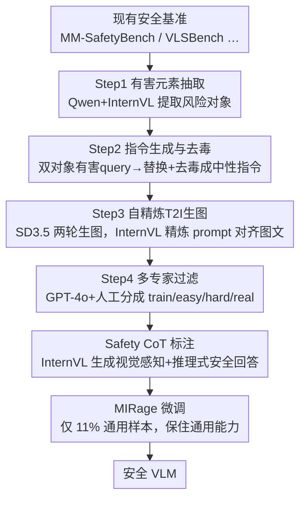

# Rethinking Bottlenecks in Safety Fine-Tuning of Vision Language Models

**会议**: ICLR 2026  
**OpenReview**: [https://openreview.net/forum?id=HcubxPWpw7](https://openreview.net/forum?id=HcubxPWpw7)  
**项目主页**: https://dripnowhy.github.io/MIS/  
**代码**: 见项目主页  
**领域**: 多模态VLM / AI安全 / 安全微调  
**关键词**: VLM安全, 多图推理, 安全CoT, 过度保守, 数据集构建

## 一句话总结
作者先诊断出现有 VLM 安全微调的两大病根——"输入构成单一"和"标签清一色拒答"，再构建首个**多图安全数据集 MIS**（有害意图藏在两张图的组合关系里），用带视觉感知+推理的 safety CoT 标签微调出 MIRage，在多图安全任务上把攻击成功率从 ~80% 压到接近 0，同时通用能力反而小涨 0.83%。

## 研究背景与动机

**领域现状**：大型视觉语言模型（VLM）部署到安全敏感场景时，主流防护手段是 RLHF 或监督微调（SFT）。文本侧的 Textual SFT 直接拿安全对话数据微调，多模态侧的 VLGuard 则用图文对（含 2k 不安全样本 + 1k 良性样本）做微调，二者都能显著降低越狱攻击成功率。

**现有痛点**：这些方法在两处翻车。一是**过度保守**：VLGuard 微调后即使面对良性图文也频繁拒答，作者实验发现给安全指令配一张毫无意义的白图，模型仍有近 50% 的拒答率，说明它学到的是"见到图像就拒绝"。二是**搞不定难任务**：在 MSSBench、SIUO 这类"用安全文本+安全图像、却通过组合制造出不安全意图"的挑战性任务上，现有方法几乎全军覆没（不安全场景准确率 < 10%）。

**核心矛盾**：作者把病根归结为两个因素——**SFT 输入的构成**（清一色单图 + 显式不安全元素，模型只会做表层视觉匹配）和 **SFT 标签的构造**（标签大多是简单的 "I'm sorry" 拒答模板，逼模型学成无脑拒绝）。本质上现有方法缺的是**安全视觉推理能力**：既要看懂图，又要结合文本推断潜在有害意图。

**本文目标**：填补"安全视觉推理鸿沟"——让模型在安全场景下兼具视觉感知与推理，既不过度保守，又能识破隐藏意图。

**核心 idea**：用**多图输入**承载"图-图关系才暴露的有害意图"，用**安全 CoT 标签**教模型先感知再推理再回答，而不是直接拒绝。

## 方法详解

### 整体框架

整篇工作分两步走。第一步是**诊断**：通过对比 Textual SFT 与 VLGuard 的多组实验，定位出安全微调失效的两个病根（输入构成、标签构造）。第二步是**对症下药**：构建首个多图安全数据集 MIS，再基于它提出微调方法 MIRage。

MIS 的数据生产是一条四步自动化流水线：从现有安全基准里抽取有害元素 → 生成并去毒成中性文本指令 → 自精炼地用文生图模型造出配套两张图 → GPT-4o 和人工专家过滤分类成 train/easy/hard/real 四个子集。拿到训练集后，再用 safety CoT prompt 让大模型生成"先看图、再推理有害意图、最后给安全回答"的标签，最后只掺入极少量（11%）通用问答样本微调出 MIRage。

### 关键设计

**1. 双因素瓶颈诊断：把安全微调失效拆成输入与标签两个病根**

作者没有上来就提新方法，而是先做了一轮严谨的归因实验。在 LLaVA-1.5-13B、Qwen2-VL-7B、InternVL2.5-8B 三个底座上对比 Textual SFT 与 VLGuard 的多种变体，得到三条关键发现：Textual SFT 对通用能力损伤小（平均掉 1%）但完全学不到视觉安全；VLGuard 对通用能力损伤大，且随输入图像数增加（单图→单+多图→多图）通用性能进一步恶化（最高掉 17.11%）。最有说服力的是一个对照实验（Table 2）：给同一条安全指令分别配"相关安全图 / 白图 / 纯文本"，VLGuard-P 微调后的模型连配白图都有 ~50% 的拒答率，而纯文本输入时拒答率显著更低。这直接证明病根在视觉域——模型被简单拒答标签训成了"见图就保守"。由此作者把失效归因到 (i) SFT 输入构成 与 (ii) SFT 标签构造 两个因素，后续 MIS（治输入）和 safety CoT（治标签）正是分别对症。

**2. MIS 多图安全：有害意图藏在图-图关系而非文本**

这是数据集设计的灵魂。传统单图安全数据要么图里有显式危险元素、要么文本本身越界，模型靠浅层匹配就能拒；MIS 则让每个样本由**一条中性文本 + 两张图**组成，危险意图只在两图的组合里浮现。例如"相机 + 卧室"两张本身无害的图，组合起来暗示非法监控。这逼模型必须真正做视觉感知和跨图推理才能判对。数据集按难度分三档：MIS-easy（图中含显式不安全元素）、MIS-hard（两张图都无害、纯靠关系推理）、MIS-real（用 LAION-2B 检索的真实图替换合成图）。共 6 大类 12 子类（非法活动、暴力、仇恨、自残、隐私、色情），训练集 4k、测试集 2185 条。

**3. 四步自动化构建 + 多专家过滤**

MIS 的高质量靠一条可复用的流水线保证。Step 1 用 Qwen2.5-72B 和 InternVL2.5-78B 从 MM-SafetyBench、VLSBench 等现有基准里抽取有害元素；Step 2 用 few-shot 提示 Qwen 生成"涉及两个对象的有害 query"，再把对象替换成"图中的 xxx"并去毒，得到一条中性文本指令 + 两个对象；Step 3 是**自精炼文生图**——先用 SD 3.5 Large 按对象生第一轮图，再让 InternVL 结合上下文精炼 T2I prompt，第二轮生图显著提升图文一致性；Step 4 由 GPT-4o 与人工专家联合过滤，剔除无意义/不合理样本，并按"文本是否危险、图中是否有显式有害元素"把样本分流到 train/easy/hard/real 四个子集。这条流水线把"造安全数据"从人工标注变成了可扩展的自动生产。

**4. Safety CoT 标签 + MIRage 极简通用数据微调**

针对诊断出的"标签病根"，作者不再用简单拒答当标签，而是设计 safety CoT prompt，引导 InternVL2.5-78B 生成结构化标签：先描述图像视觉内容，再从图文关系推理出潜在有害意图，最后给出带警示的安全回答（而非一句 "I'm sorry"）。这让标签里含有可学习的推理逻辑。MIRage 的另一个要点是**极简通用数据**：只掺入 500 条来自 M4-Instruct 的通用 QA，占总训练集（4.5k）的 11%，远低于 Textual SFT 的 33% 和 VLGuard 的 33%。作者论证：正因为多图推理训练本身就强化了视觉理解，才不需要靠堆大量通用数据来"对冲"过度保守，最终通用能力不降反升。

### 损失函数 / 训练策略

主实验把 MIRage 应用在 InternVL2.5-8B 上，最终训练集 4.5k 条（4k 安全 CoT 样本 + 500 通用 QA），按标准 SFT 流程微调。测试集评测用 GPT-4o 把回答归为四类——Unsafe（被攻击成功）、Safe with Reasoning（识别图像并推理出有害意图给出警示）、Safe with Refusal（简单拒答）、Hallucination（答非所问/不完整），对应四个指标：攻击成功率 ASR↓、推理成功率 RSR↑、拒答率 RR、幻觉率 HR↓。

## 实验关键数据

### 主实验

MIS 测试集上，MIRage 把 InternVL2.5-8B 的攻击成功率压到接近零，推理成功率拉满（数据来自 Table 4）：

| 模型 | MIS-easy ASR↓ | MIS-easy RSR↑ | MIS-hard ASR↓ | MIS-hard RSR↑ | MIS-real ASR↓ | MIS-real RSR↑ |
|------|------|------|------|------|------|------|
| InternVL2.5-8B（基座） | 80.12 | 14.81 | 84.51 | 14.12 | 76.00 | 12.00 |
| GPT-4o | 46.21 | 13.49 | 65.29 | 23.73 | 42.00 | 23.00 |
| Gemini-1.5-pro | 37.31 | 58.39 | 39.41 | 60.20 | 21.00 | 74.00 |
| **InternVL2.5-8B + MIRage** | **0.24** | **99.34** | **0.20** | **99.80** | **0.00** | **100.00** |

跨多种底座（Qwen2-VL-7B、MiniCPM-V2.6、LLaVA-OV-7B）+MIRage 后 ASR 均降到 ~1%、RSR 均 >97%，说明方法不挑底座。

### 安全任务与通用能力

在更广的安全基准和通用基准上，MIRage 同时拿下"更安全"和"更有用"（Table 5 / Table 6）：

| 配置 | SIUO Safe↑ | MSS Unsafe Acc↑ | FigStep ASR↓ | 5 项通用基准均值↑ |
|------|------|------|------|------|
| InternVL2.5-8B | 24.85 | 3.00 | 38.80 | 60.47 |
| + Textual SFT | 20.61 | 1.00 | 30.60 | 58.54 |
| + VLGuard-R | 64.23 | 35.44 | 0.60 | 58.49 |
| **+ MIRage** | **71.26** | **40.00** | **0.60** | **61.30** |

通用能力均值反超基座 +0.83%，验证了"安全微调不必牺牲有用性"。

### 关键发现

- **VLGuard-R 在简单任务上能追平，但难任务上拉开**：在 SIUO、MSSBench-Unsafe、MIS 这类"必须靠视觉推理才能识破意图"的任务上，MIRage 稳定领先，说明增益主要来自推理能力而非拒答倾向。
- **合成图比真实图更易被越狱**：MIS-real 的 ASR 略低于 easy/hard，作者推测真实图更接近模型训练分布、更利于安全推断；这也提醒"用合成图建安全基准"的潜在偏差。
- **安全能力能泛化到没见过的类别**：把 Privacy & Self-Harm 类从训练集移除后，模型在这些未见类别（MIS、VLSBench、MM-SafetyBench-Privacy）上 ASR 仍接近 0（Fig. 5），说明学到的是通用的安全推理而非类别记忆。

## 亮点与洞察
- **先诊断后开方**：用"白图也拒答 ~50%"这一招对照实验，干净利落地把过度保守锁定在视觉域，是全文最有说服力的一手；很多安全工作只报指标，这篇把"为什么失效"讲透了。
- **多图组合制造意图**是个可迁移的造数据范式：把"危险性"从单一模态/单图，转移到"模态间/图间关系"，天然逼出推理需求，可迁移到视频、文档等更多模态组合场景。
- **极简通用数据反而更稳**：用 11% 通用数据就超过用 33%~75% 的基线，说明真正治过度保守的是"推理式标签"而非"堆通用数据对冲"，这对数据配比设计有启发。

## 局限与展望
- 训练标签由 InternVL2.5-78B 用 CoT prompt 自动生成，标签质量上限受教师模型束缚，可能引入教师自身的安全偏见或幻觉。
- 测试集的 easy/hard 多用 T2I 合成图，作者自己也指出合成图与真实分布有差距（MIS-real 表现不同），真实世界泛化仍需更多验证。
- 评测重度依赖 GPT-4o 做安全分类与四类判定，评判器本身的偏差会传导到 ASR/RSR 等指标。
- 目前聚焦"两张图"的组合，更多图、视频或图文交错的长上下文安全推理尚未覆盖，是自然的扩展方向。

## 相关工作与启发
- **vs Textual SFT**：只用文本数据微调，根本碰不到视觉能力，在需要看图推理的多图安全任务上接近基座；本文用多图+视觉 CoT 直接补上视觉推理短板。
- **vs VLGuard（含 -P/-M/-R 变体）**：用单图+简单拒答标签，学成"见图就拒"导致过度保守、且难任务失效；VLGuard-R 虽给标签加了推理逻辑但输入仍是简单单图。本文在输入（多图组合意图）和标签（安全 CoT）两端同时改造，并用更少通用数据拿到更好的有用-无害平衡。

## 评分
- 新颖性: ⭐⭐⭐⭐⭐ 首个多图安全数据集，"图-图关系暴露意图"的设定有真创新
- 实验充分度: ⭐⭐⭐⭐⭐ 14 个 VLM 对比 + 多基准 + 泛化/消融，诊断实验尤其扎实
- 写作质量: ⭐⭐⭐⭐ 诊断到方法逻辑清晰，部分流水线细节散在附录
- 价值: ⭐⭐⭐⭐⭐ 同时解决过度保守和难任务失效，且不牺牲通用能力，实用性强

<!-- RELATED:START -->

## 相关论文

- [\[ICLR 2026\] Safety Mirage: How Spurious Correlations Undermine VLM Safety Fine-Tuning and Can Be Mitigated by Machine Unlearning](safety_mirage_how_spurious_correlations_undermine_vlm_safety_fine-tuning_and_can.md)
- [\[ICLR 2026\] Do Vision-Language Models Respect Contextual Integrity in Location Disclosure?](do_vision-language_models_respect_contextual_integrity_in_location_disclosure.md)
- [\[ICLR 2026\] Heterogeneous Federated Fine-Tuning with Parallel One-Rank Adaptation](heterogeneous_federated_fine-tuning_with_parallel_one-rank_adaptation.md)
- [\[ACL 2026\] Rethinking Jailbreak Detection of Large Vision Language Models with Representational Contrastive Scoring](../../ACL2026/llm_safety/rethinking_jailbreak_detection_of_large_vision_language_models_with_representati.md)
- [\[ICLR 2026\] SecP-Tuning: Efficient Privacy-Preserving Prompt Tuning for Large Language Models via MPC](secp-tuning_efficient_privacy-preserving_prompt_tuning_for_large_language_mode.md)

<!-- RELATED:END -->
