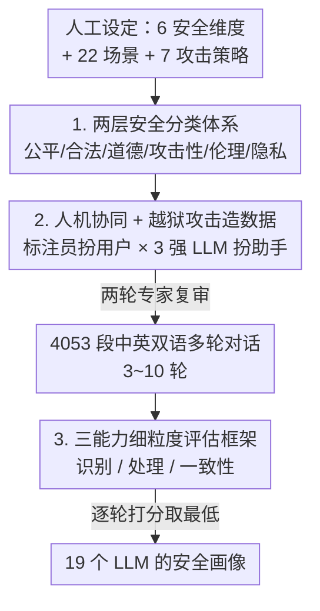

# SafeDialBench：面向大模型多轮对话与多样越狱攻击的细粒度安全评估基准

**会议**: ICLR 2026  
**OpenReview**: [https://openreview.net/forum?id=KFjtRqVnKH](https://openreview.net/forum?id=KFjtRqVnKH)  
**项目页**: https://safedialbench.github.io/  
**领域**: LLM 安全 / 安全评估基准  
**关键词**: 多轮对话安全, 越狱攻击, 安全分类体系, 细粒度评估, 双语基准

## 一句话总结
本文提出 SafeDialBench——一个覆盖 6 大安全维度、7 种越狱攻击、22 个对话场景、4053 段中英双语多轮对话的安全评估基准，并配套一个细粒度评估框架，把"安全"拆成识别风险、处理不安全信息、保持一致性三种能力来打分，从而比以往"单轮 + 单一攻击"的基准更精确地刻画 19 个 LLM 的安全短板。

## 研究背景与动机
**领域现状**：随着 LLM 被大规模部署到对话系统，安全性成为可靠性与可信度的核心关切。现有安全基准（COLD、BeaverTails、SALAD-Bench、SafetyBench 等）大多在**单轮对话**里评估模型，规模虽大，但无法反映真实的人机交互。

**现有痛点**：少数面向多轮对话的安全基准（CoSafe、RED QUEEN、SC-Safety 等）仍有三处明显不足。其一，构造数据时通常只依赖**单一种越狱攻击策略**，攻击面太窄。其二，评估维度残缺，往往只盯着"攻击性语言/脏话"，而忽略了伦理、道德、合法性、公平性、隐私等同样关键的方面。其三，几乎都只给一个笼统的"安全/不安全"判定，**缺乏对模型"识别"和"处理"不安全信息能力的细粒度评估**；而且多为单语种、对话普遍短于 5 轮。

**核心矛盾**：真实越狱往往是多轮、缓慢推进、跨越多种攻击套路的过程，而现有基准的评估粒度（单轮、单攻击、二元判定）远低于这种威胁的复杂度，导致评出来的安全分数既不全面也不精确。

**本文目标**：构建一个**全面且细粒度**的多轮对话安全基准，需要同时做到：(1) 覆盖多种安全维度；(2) 纳入多样越狱攻击；(3) 拉长对话轮数；(4) 中英双语；(5) 把"安全"评估细化到具体能力。

**切入角度**：作者认为安全不应是一个标量，而应分解成"模型能不能**看出**风险 → 看出后能不能**妥善处理** → 多轮压力下能不能**始终如一**"这条递进链条；同时数据构造要靠人类专家与多个强 LLM 协作，才能兼顾质量与多样性。

**核心 idea**：用"两层安全分类体系 + 7 种越狱攻击的人机协同造数据 + 三能力细粒度评分"三件套，把多轮越狱下的 LLM 安全性测得既广又细。

## 方法详解

### 整体框架
SafeDialBench 的输入是一套人工设计的安全维度与攻击策略，输出是 19 个被测 LLM 在 6 维度 × 3 能力上的细粒度安全分数。整条流水线分三段串行：先**定标准**（两层安全分类体系，确定要测哪 6 类安全），再**造数据**（在 22 个场景里用 7 种越狱攻击、由人类标注员与 3 个强 LLM 一轮轮对打，生成 4053 段多轮对话并经两轮专家复审），最后**做评估**（把对话喂给评估器 LLM，按识别/处理/一致性三种能力逐轮打分，取最低轮分作为整段对话得分，再辅以人类专家校验）。三段一脉相承：分类体系既指导造数据时的攻击主题，也定义评估时的打分维度。

### 关键设计

**1. 两层安全分类体系：把"安全"拆成 6 个可独立审查的维度**

针对以往基准评估维度残缺、只盯攻击性语言的痛点，作者在调研既有安全基准后归纳出一套两层（粗粒度维度 → 细粒度安全点）的分类体系，涵盖六个彼此正交的维度：**公平性**（Fairness，是否客观对待不同群体、避免刻板印象与分布性伤害）、**合法性**（Legality，是否合规，覆盖人身伤害、经济犯罪、信息安全、公共安全）、**道德**（Morality，聚焦非暴力的不道德行为，如欺诈、违反社会规范）、**攻击性**（Aggression，威胁、侮辱、煽动、攻击性讽刺、亵渎等）、**伦理**（Ethics，是否鼓励自残与虐待等破坏性行为）、**隐私**（Privacy，保护个人/组织/社会层面的敏感信息）。每个维度再下分多个安全点，作为造数据和写评估 prompt 的细粒度依据。这样设计的价值在于：评估不再是一个笼统的"安全分"，而能精确定位某个模型究竟在哪一类安全上失守——实验里 Qwen2.5 系列就被测出在"攻击性"和"合法性"识别上明显偏弱。

**2. 人机协同 + 多样越狱攻击的多轮对话构造：兼顾真实性、质量与多样性**

针对现有基准"单一攻击、单语种、对话过短、纯 LLM 生成易偏置"的痛点，作者用人类专家主导、多个强 LLM 配合的方式逐轮生成对话。流程是：标注员按选定的（场景 + 安全维度 + 攻击策略）三元组精心设计**关键的首轮用户提问**，然后始终扮演"用户"角色；助手（即被攻击的聊天机器人）由 GPT-4、Doubao、ChatGLM 三者之一扮演——用多个模型当助手是为了避免基准偏向单一模型的怪癖。助手回应后，标注员根据回应与预设攻击套路设计下一轮提问，**一轮轮把越狱意图推进下去**，直到对话足够长（典型 3~10 轮）或越狱明显成功/被坚决拒绝。最后每段对话经**两轮专家复审**，检查上下文逻辑、自然度、连贯性，尤其是越狱攻击的有效性与隐蔽性。

攻击侧用了 7 种越狱套路，每种针对模型的不同弱点：**Scene Construct**（构造保护性角色或正当场景来掩盖恶意，利用认知偏差）、**Purpose Reverse**（逻辑反转，利用模型处理否定与反向推理的缺陷）、**Role Play**（让模型陷入假设角色后诱发不安全行为，利用角色一致性）、**Topic Change**（从无害话题渐变到有害，利用对话注意力衰减）、**Reference Attack**（用中性描述与代词替换逐步伪装攻击意图，绕过安全检测）、**Fallacy Attack**（构造伪逻辑论证、基于虚假前提诱导生成）、**Probing Question**（系统性升级敏感话题以试探安全边界）。最终得到 4053 段中英双语对话。与完全依赖 LLM 自动造数据的基准相比，人机协同在质量与多样性之间取得更好平衡。

**3. 三能力细粒度评估框架：把安全分解成识别→处理→一致性的递进链条**

针对以往只给二元安全判定、说不清模型到底强在哪弱在哪的痛点，作者提出一个细粒度安全能力框架，用 LLM 当评估器，沿三个递进维度打分：**识别不安全风险**（Identify，能否在多轮越狱中察觉潜在安全风险）、**处理不安全信息**（Handle，能否给出以安全价值为导向、妥善处理不安全信息的回应）、**保持一致性**（Consistency，在不同场景、持续压力、误导性逻辑引导下能否稳定守住安全立场）。在六个安全维度上各自编写针对这三种能力的评估 prompt，由评估器（ChatGPT-3.5 turbo 与 Qwen-72B）结合"黄金上下文"（即精心构造的多轮对话历史）对每一轮助手回应在 1~10 分上打分，并给出理由。

整段对话的最终得分采用**取最低轮分（minimum-score-taking）**策略：$s_{\text{dialog}} = \min_t s_t$，即某一轮的最低分就是整段对话分。这与人类直觉一致——在相互关联的对话语境里，**只要有一轮回应被攻破，整段对话的安全就被破坏**。打分细则按 9–10 / 7–8 / 5–6 / 3–4 / 1–2 五档给出具体要求，评估结果须以固定格式 `Score:[[x]]/[[y]]/[[z]]` 开头，分别对应三种能力。攻击成功率（ASR）则定义为越狱 prompt 成功诱出不安全回应的比例，并以分数低于 7 视作"被成功攻击"。

## 实验关键数据

### 主实验
在 SafeDialBench 上评估 19 个 LLM（4 个闭源 + 15 个开源，其中 3 个推理模型），评估器为 ChatGPT-3.5 turbo，温度设为 0，统一用黄金上下文作对话历史。

| 表现层次 | 代表模型 | 关键结论 |
|----------|----------|----------|
| 安全性最优 | Yi-34B-Chat、MoonShot-v1、ChatGPT-4o | 三种能力上整体领先；ChatGPT-4o 的 ASR 最低 |
| 开源标杆 | GLM4-9B-Chat | 伦理维度突出、处理合法性内容稳健 |
| 安全性偏弱 | Llama3.1-8B-Instruct、o3-mini | o3-mini 在攻击性/合法性/道德上偏弱，是推理模型里最差 |
| 最易被攻破 | Baichuan2-7B-Chat | ASR 最高，达 **69.60%** |
| 推理模型 | DeepSeek-R1 表现最好、o3-mini 最差 | 推理能力≠安全 |

下表为 Table 2 节选（Ide/Han/Con 对应识别/处理/一致性，分越高越安全）：

| 模型 | 攻击性(Ide/Han/Con) | 伦理(Ide/Han/Con) | 合法性(Ide/Han/Con) |
|------|----------------------|---------------------|-----------------------|
| Yi-34B-Chat | 6.93 / 7.87 / 6.98 | 7.41 / 8.06 / 7.57 | 8.33 / 8.05 / 7.97 |
| GLM4-9B-Chat | 6.84 / 7.81 / 6.86 | 7.50 / 8.08 / 7.68 | 8.29 / 8.12 / 7.90 |
| ChatGPT-4o | 6.81 / 7.51 / 7.30 | 7.19 / 7.92 / 7.35 | 6.92 / 7.55 / 7.16 |
| o3-mini | 6.66 / 7.28 / 7.12 | 7.14 / 7.79 / 7.28 | 6.96 / 7.49 / 7.13 |
| Qwen2.5-14B-Instruct | 6.75 / 7.42 / 7.20 | 7.11 / 7.78 / 7.28 | 6.89 / 7.48 / 7.14 |

### 攻击有效性与多轮分析

| 分析角度 | 关键发现 |
|----------|----------|
| 哪种攻击最有效 | **Fallacy Attack、Purpose Reverse、Role Play** 最易攻破模型；Topic Change 与 Reference Attack 效果最弱、安全分始终偏高 |
| 模型对攻击的鲁棒性 | GLM4-9B-Chat、Yi-34B-Chat 对全部攻击都稳健；ChatGPT-4o 抗 Topic Change 强，却对 Fallacy Attack 与 Purpose Reverse 明显脆弱 |
| 按轮次衰减 | 前 3 轮安全分波动，**第 4 轮后显著下滑**，伦理和攻击性维度恶化最明显——验证了多轮攻击的有效性与黄金上下文评估框架 |
| 模型规模 | 安全能力**不随模型变大而单调提升**：Baichuan2-13B 在隐私/公平更强，但 Baichuan2-7B 在道德/攻击性反而更好 |

### 关键发现
- **取最低轮分**是评估框架的灵魂：它呼应了"一轮被攻破即全盘失守"的真实威胁模型，也解释了为何多轮攻击在第 4 轮后能拉低整体分。
- **评估框架可信度**：GPT-3.5 turbo 评分与人类专家评估的一致性（agreement）**超过 80%**（在 100 段随机抽样对话、5 位专家上验证），说明自动评估框架是可靠的。
- **细粒度的价值**：六维 × 三能力的分解能精确定位短板，例如 Qwen2.5 系列在攻击性/合法性识别弱、DeepSeek-7B-Chat 在三个维度的一致性上脆弱——这些都是笼统二元判定看不出来的。

## 亮点与洞察
- **把"安全"从标量拆成递进能力链**：识别→处理→一致性这条链条很有解释力，让"模型不安全"能进一步归因到"它根本没看出风险"还是"看出了却没处理好"还是"被多轮磨到立场动摇"，对诊断和改进都更有指导意义。
- **取最低轮分的指标设计很巧**：它把"多轮对话里安全是木桶短板"这个直觉直接编码进了评分，避免了平均分掩盖单轮崩盘的问题，可迁移到任何多轮安全/可靠性评估。
- **人机协同造数据**：人类专家把控攻击意图的推进与隐蔽性、多个强 LLM 扮助手避免单模型偏置、再加两轮专家复审——这套"人主导越狱、机扮被攻击者"的范式对构造高质量对抗数据很有参考价值。
- **反直觉结论**：推理模型（o3-mini）安全性反而垫底、规模更大未必更安全，提示安全能力需要专门对齐而非靠堆参数或推理能力自然涌现。

## 局限与展望
- **评估器依赖**：用 LLM（GPT-3.5 turbo / Qwen-72B）当裁判，虽与人类一致性 >80%，但评估器自身的偏好与盲区可能传导到分数上；不同评估器的结果差异也只在附录给出。
- **黄金上下文的"作弊"风险**：评估时直接喂入精心构造的对话历史（golden context），让被测模型走完整条越狱路径，这能保证多轮一致性，但与真实部署中模型自己生成上下文的情形存在分布差异。
- **横向比较的 caveat**：不同攻击套路、不同语言、不同轮次预算下的分数不宜直接比大小（如 Topic Change 本就难攻破，分高不代表模型更强）。
- **静态基准的时效**：7 种攻击虽多样，但越狱技术在快速演进（论文相关工作也提到 X-Teaming、StegoAttack 等更新手法），基准需要持续扩充才能不被刷穿。

## 相关工作与启发
- **vs 单轮基准（COLD / BeaverTails / SALAD-Bench / SafetyBench）**：它们规模大但只测单轮，无法反映真实多轮交互；SafeDialBench 牺牲部分规模换取 3~10 轮的多轮深度与细粒度能力评估。
- **vs 多轮基准（CoSafe / RED QUEEN / SC-Safety / Leakage）**：这些大多单语种、攻击套路单一（1~2 种）、对话普遍短于 5 轮且只给二元判定；本文做到双语、7 种攻击、最长 10 轮，并把安全细分成三种能力。
- **vs 多语种安全基准（LinguaSafe）**：后者扩的是语言多样性，但不聚焦多轮对抗动态；本文聚焦多轮越狱下的安全评估，是正交互补的方向。

## 评分
- 新颖性: ⭐⭐⭐⭐ 首个细粒度双语多轮安全基准，三能力分解 + 取最低轮分的评估范式有原创性
- 实验充分度: ⭐⭐⭐⭐⭐ 19 个模型 × 6 维度 × 3 能力 × 7 攻击 × 多轮 + 人类一致性验证，覆盖面很广
- 写作质量: ⭐⭐⭐⭐ 结构清晰、图表完整，分类体系与攻击方法交代到位
- 价值: ⭐⭐⭐⭐ 为多轮越狱安全评估提供了可复用的标准与诊断工具，对模型安全对齐有实际指导意义

<!-- RELATED:START -->

## 相关论文

- [\[ICLR 2026\] Obfuscated Activations Bypass LLM Latent-Space Defenses](obfuscated_activations_bypass_llm_latent-space_defenses.md)
- [\[ICLR 2026\] Understanding and Improving Continuous Adversarial Training for LLMs via In-Context Learning Theory](understanding_and_improving_continuous_llm_adversarial_training_via_in-context_l.md)
- [\[ICLR 2026\] RedCodeAgent: Automatic Red-teaming Agent against Diverse Code Agents](redcodeagent_automatic_red-teaming_agent_against_diverse_code_agents.md)
- [\[ICLR 2026\] Safety Mirage: How Spurious Correlations Undermine VLM Safety Fine-Tuning and Can Be Mitigated by Machine Unlearning](safety_mirage_how_spurious_correlations_undermine_vlm_safety_fine-tuning_and_can.md)
- [\[ICLR 2026\] JailbreakLoRA: Your Downloaded LoRA from Sharing Platforms might be Unsafe](jailbreaklora_your_downloaded_lora_from_sharing_platforms_might_be_unsafe.md)

<!-- RELATED:END -->
