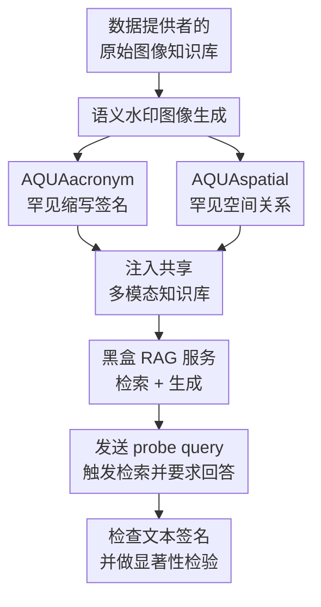

# Safeguarding Multimodal Knowledge Copyright in the RAG-as-a-Service Environment

**会议**: ICLR2026  
**OpenReview**: [https://openreview.net/forum?id=eWBu4tY9ta](https://openreview.net/forum?id=eWBu4tY9ta)  
**代码**: https://github.com/tychenn/AQUA  
**领域**: LLM安全  
**关键词**: 多模态RAG, 数据版权, 图像水印, RAG-as-a-Service, 黑盒审计

## 一句话总结
AQUA 面向 RAG-as-a-Service 中被平台私自接入的多模态图像知识库，设计了两类可被检索、可在文本回答中显形、又不明显破坏正常服务的语义水印图像，用少量 probe query 就能统计性地判断某个黑盒多模态 RAG 是否使用了版权所有者的数据。

## 研究背景与动机
**领域现状**：RAG 正在从单个应用里的私有检索模块，变成 RAG-as-a-Service 这样的服务形态：多个数据提供方把知识贡献到共享知识库，平台用这些知识对外提供问答能力，最终用户只能看到生成结果，看不到背后的原始数据。文本 RAG 已经有一些知识库水印或成员推断方法，可以通过插入 canary 文档、语言模型水印或推理触发信号来证明数据被使用。

**现有痛点**：这些方法几乎都默认知识是文本，但现实的多模态 RAG 已经大量使用图片、表格和跨模态内容。对图像知识来说，传统图像水印通常追求像素层隐蔽和图像级检测，检测者需要拿到图像本身或可控的解码器；而 RAG-as-a-Service 里的数据提供者通常只能访问公开 API，不能直接看检索结果，也不能要求平台返回原图。因此，把水印藏在图片像素里并不够，水印必须先被文本 query 检索出来，再经过 VLM 生成器转成可检查的文本答案。

**核心矛盾**：多模态 RAG 的版权审计有一个跨模态传播难题：水印载体是图像，审计接口是文本，证据也通常只能从生成文本里观察。水印若太像普通图片，检索器很难把它拉到 top-k；水印若太离谱，又容易被平台过滤，或者影响正常查询。本文要解决的是“可检索、可生成、可隐蔽、可抗扰动”四个目标同时成立的问题。

**本文目标**：作者把问题限定在 text-to-text 多模态 RAG，即用户输入文本 query，系统检索图像知识，再由 VLM/多模态生成器输出文本答案。防守者是数据提供者，只能在贡献自己的图像数据前注入水印；攻击者是未经授权使用这些图像的多模态 RAG 服务商，防守者只能通过黑盒 API 发送 probe query 来审计。

**切入角度**：论文的关键观察是，图像水印不一定要是低层像素扰动。只要水印图像包含一个“在语义上足够独特、在视觉上仍然自然、能被文本 query 指向”的信号，它就可能被 CLIP 类检索器检索到，并被生成器在回答中转写出来。于是 AQUA 不把水印当作不可见扰动，而是把它设计成跨模态可传递的语义载体。

**核心 idea**：用合成图像承载罕见缩写或罕见空间关系，让这些语义信号既能触发图文检索，又能在 VLM 的文本回答里以签名形式出现，从而把“图像是否被纳入 RAG 知识库”转化为“probe query 是否稳定得到预设文本签名”的统计检验问题。

## 方法详解
### 整体框架
AQUA 的整体流程分成注入和验证两端。注入端，数据提供者先生成一批水印图像，再把它们和正常图像数据一起贡献给 RaaS 平台；验证端，数据提供者向可疑 RAG 服务发送带触发条件和回答指令的 probe query，观察生成文本中是否出现预先设定的签名，并用多次查询的成功率做统计检验。

这篇论文的系统设定里，检索器由文本编码器 $E_{text}$ 和图像编码器 $E_{img}$ 组成，图片库 $D=\{I_1,\ldots,I_n\}$ 会被编码成向量，文本 query $T$ 也被编码到同一个语义空间。检索器按相似度取 top-k 图片，生成器 $G$ 再根据原始文本 query 和检索到的图片输出答案。AQUA 要插入的不是一个普通“检测图像”，而是一个能在这个完整链路里留下文本证据的图像知识。

框架图里的两个贡献分支分别覆盖不同的生成器能力：如果模型 OCR 能力较强，AQUAacronym 让缩写的全称成为可检测签名；如果模型 OCR 能力较弱，AQUAspatial 则让特殊物体关系成为可回答的签名。两者共同绕开传统图像水印“只能在图像域检测”的限制，把图像版权追踪变成黑盒文本 API 可执行的审计。

### 关键设计
**1. AQUAacronym：把图像水印设计成可被 OCR 转写的罕见缩写签名**

第一个难点是跨模态传播：水印在图片里，检测信号却必须出现在文本答案里。AQUAacronym 的做法是构造罕见 acronym-full name 对，例如论文里的 `(UGP, Unicorn Grammar Parser)`，并把缩写或完整短语嵌入合成图像中。这个 full name 由数据提供者自己设计，可看作密钥；因为它罕见且不属于模型常识，干净 RAG 很难凭空答出它。

验证时，每张水印图像配一个 probe query，query 由两部分拼接而成：$T_{probe}=T_{trigger}\oplus T_{instruction}$。其中 $T_{trigger}$ 负责让检索器把对应水印图像找出来，例如“Background: UGP is a machine”；$T_{instruction}$ 负责让生成器读图并输出签名，例如“What is the full name of UGP?”。这样，缩写既是检索锚点，也是生成答案里的可检查目标。相比直接优化像素扰动，这种水印没有把希望寄托在不可解释的隐式特征上，而是利用 VLM 已经具备的 OCR 和视觉文本理解能力，让信号更容易从 image retriever 传到 textual generator。

**2. AQUAspatial：用罕见空间关系替代 OCR，覆盖弱 OCR 模型和更自然的黑盒场景**

如果生成器 OCR 能力差，或者平台刻意过滤带奇怪文字的图片，只靠缩写会有脆弱点。AQUAspatial 因此把水印改成特殊但仍可自然呈现的对象配置，例如“一只读书的狗头上顶着红苹果”或“猴子把香蕉当电话”。这些图像由扩散模型根据 caption 合成，caption 选择低共现的概念组合，再用语言模型困惑度过滤，在“足够独特”和“看起来不像异常样本”之间取平衡。

验证逻辑和 acronym 分支相同，但签名变成空间语义答案。probe query 可以先触发场景检索，例如“There is a dog reading a book”，再询问“像帽子一样在狗头上的水果是什么？”预期签名就是“Apple”。这条分支的巧妙之处在于，检索器依然可以通过文本和图像的语义相似性找到水印图像，生成器则不必识别图片里的文字，只需理解物体关系。也就是说，AQUAspatial 把水印从“读出字符”变成“回答一个罕见视觉事实”，更贴近普通多模态问答能力。

**3. 黑盒统计验证：从单次命中变成可量化的版权证据**

真实 RAG 服务的生成结果有采样随机性，即使水印图像被检索到，也不保证每一次都输出签名。因此 AQUA 不把单个回答作为最终证据，而是注入多张水印图像，并为每张图像设计多个语义等价但表达不同的 probe query。论文用严格的 substring match 做基础判定：先把生成输出 $O_{RAG}$ 和签名 $S$ 归一化为小写并去掉空白，再检查 $Norm(S)$ 是否包含在 $Norm(O_{RAG})$ 中。

单次评估可写成 $Eval(O_{RAG}, S)=\mathbb{I}[Norm(S)\subseteq Norm(O_{RAG})]$。在 $N_{wm}$ 张水印图像、每张 $N_{ds}$ 个 probe query 的设置下，验证成功率 VSR 为所有评估结果的平均：

$$
VSR=\frac{1}{N_{wm}N_{ds}}\sum_{j=1}^{N_{wm}}\sum_{i=1}^{N_{ds}}Eval(O_{RAG}^{i,j}, S_i)
$$

随后，作者用 Welch's t-test 比较可疑 RAG 和干净 RAG 的 VSR。零假设是 $H_0:\mu_{suspect}=\mu_{clean}$，即可疑系统和干净系统没有显著差异；若 p-value 低于显著性水平，例如 $\alpha=0.05$，就可以拒绝零假设，认为可疑系统更可能包含水印图像数据。这里的重点不是“某次回答命中了签名”，而是“跨多张水印和多次 probe 的命中分布显著偏离干净系统”。

**4. 评价指标把失败位置拆开：检索不到和生成不出是两类问题**

AQUA 的验证链路长，失败可能发生在检索阶段，也可能发生在生成阶段。论文因此不只报告最终 VSR，还定义了 Rank 和 CGSR 来拆解原因。Rank 衡量目标水印图像在 top-k 检索结果中的位置：若水印图像在检索结果第 $r$ 位，Rank 就是 $r$；若没进 top-k，则赋予惩罚值 $2k$。Rank 越低，说明 trigger 和水印图像绑定越强。

CGSR 则只在“水印图像已经被检索到”的子集上计算签名生成成功率：

$$
CGSR=\frac{\sum_{t\in T_{retrieved}}Eval(O_{RAG}^{(t)}, S^{(t)})}{|T_{retrieved}|}
$$

这个拆分很有用：如果 Rank 好但 CGSR 差，说明图像能被找回但生成器不会把水印语义转成目标文本；如果 Rank 差但 CGSR 好，说明语义载体一旦进入上下文就有效，问题在检索锚点不够强。论文还用 SimScore 比较干净回答和带水印回答的语义相似度，用来检查正常问题是否被水印污染。

### 一个完整示例
以 AQUAacronym 为例，数据提供者先设计一个签名对 `(UGP, Unicorn Grammar Parser)`，并生成一张视觉上正常但包含 UGP 相关文字的水印图片。它被加入共享图像知识库后，可疑 RAG 平台如果未经授权使用了这个数据集，检索器会把它和其他图片一起编码进索引。

审计时，数据提供者发送 probe query：“Background: UGP is a machine. What is the full name of UGP?”前半句让 CLIP 类检索器把 UGP 图像拉进 top-5，后半句让 VLM 生成器读图并输出 full name。如果返回“Unicorn Grammar Parser”，这一次 probe 记为成功。单次成功还不能直接下结论，因为生成器可能随机漏答、误答或被正常图像干扰；所以审计者会对 50 张水印图像、每张 10 个 probe query 反复测试，最后用 VSR 和 Welch's t-test 判断可疑服务和干净服务是否显著不同。

AQUAspatial 的例子类似，只是签名从文字全称变成物体答案。比如水印图像是一只读书的狗头上顶着苹果，probe query 先描述“有一只狗在读书”来触发检索，再问“狗头上像帽子一样的水果是什么？”如果返回“Apple”，说明该罕见空间关系成功从图像知识传播到了文本输出。

### 损失函数 / 训练策略
AQUA 本身不是训练一个新的 RAG 模型，也不需要对目标服务做白盒微调。它的核心“训练”更像数据构造：用 LLM 批量生成罕见 acronym-full name 对，或生成低共现空间关系 caption，再用扩散模型合成图像，最后把这些图像作为少量水印样本注入知识库。

论文的优化式基线才使用显式损失：它在基图 $I_{base}$ 上学习扰动 $\delta$，希望生成器面对 $I_{base}+\delta$ 和 probe prompt 时输出签名 $S$，目标类似 $\min_{\delta}L(G(I_{base}+\delta,T_{probe}),S)$，并用 PGD 在 $L_p$ 约束球内迭代更新扰动。实验结果显示，这类隐式扰动虽然能在足够多查询后达到显著性，但 query efficiency 远弱于 AQUA，且不如语义水印适合多模态 RAG 的检索-生成链路。

## 实验关键数据
### 主实验
论文在 MMQA 和 WebQA 两个多模态数据集上评估，分别使用 58,075 张和 389,749 张图像。检索器采用 `openai/clip-vit-large-patch14`，top-k 设为 5；生成器覆盖 LLaVA-NeXT 7B、InternVL3 8B、Qwen-VL-Chat 7B 和 Qwen2.5-VL-Instruct 7B。每种方法使用 50 张水印图像，每张图像 10 个 probe query，实验重复 10 次。

| 生成器 | 方法 | MMQA Rank↓ | MMQA CGSR↑ | WebQA Rank↓ | WebQA CGSR↑ | 结论 |
|--------|------|------------|------------|-------------|-------------|------|
| LLaVA-NeXT | Naive | 2.86 | 28.16% | 4.56 | 13.28% | 普通图片水印容易误触或检索弱 |
| LLaVA-NeXT | Opt. | 1.45 | 31.03% | 1.90 | 22.86% | 优化扰动能检索，但生成签名不稳定 |
| LLaVA-NeXT | AQUAacronym | 1.03 | 85.36% | 1.05 | 78.73% | 检索几乎排第一，签名生成成功率高 |
| LLaVA-NeXT | AQUAspatial | 1.29 | 75.38% | 1.85 | 86.45% | 空间语义分支在两个数据集都有效 |
| Qwen2.5-VL-Instruct | AQUAacronym | 1.03 | 99.61% | 1.05 | 96.68% | 强 VLM OCR/理解能力下接近满分 |
| Qwen2.5-VL-Instruct | AQUAspatial | 1.29 | 98.42% | 1.85 | 89.85% | 非文字空间信号也能稳定传播 |

统计显著性上，AQUA 两个分支在多数组合里给出极低 p-value；例如 InternVL3 + AQUAacronym 在 MMQA 上 p-value 为 $6.29e^{-289}$，Qwen-VL-Chat + AQUAacronym 在 WebQA 上为 $1.24e^{-128}$。论文还强调 query efficiency：AQUAacronym 和 AQUAspatial 在 30 次以内就能让 p-value 低于显著性阈值，而优化式基线需要 200 次以上查询。

### 消融实验
| 配置 / 检查项 | 关键指标 | 说明 |
|---------------|----------|------|
| 正常查询无害性 | 水印检索率 0%，CGSR 0% | 对 MMQA/WebQA 超过 10,000 个 benign query，单张水印图像不会被正常问题触发 |
| 相关查询干扰 | SimScore 70.18% 到 100% | 即使用与 probe 相似的问题，水印对最终回答语义影响有限 |
| VLM 基础过滤器 | AQUAacronym TPR 0%，FPR 2.84% | Qwen2.5-VL-Instruct 32B 过滤 5,000 正常图 + 10 水印图时基本抓不到水印 |
| VLM 基础过滤器 | AQUAspatial TPR 0%，FPR 2.36% | 空间关系水印同样难以被简单“异常图像”过滤器识别 |
| 大量注入水印 | 正常查询 FPR < 0.1% | 在 50,000 张 MMQA 图像中加入最多 10,000 张水印图后，正常查询仍很少误检索水印 |
| 扩展检索语料 | CGSR 96.76% / 91.85% | 加入 50k WebQA distractor 后，AQUAacronym / AQUAspatial 仍保持高检测效果 |

### 鲁棒性实验
| 攻击 / 变化 | AQUAacronym Rank↓ | AQUAacronym CGSR↑ | AQUAspatial Rank↓ | AQUAspatial CGSR↑ |
|-------------|-------------------|--------------------|-------------------|--------------------|
| Rescale | 1.026 | 99.33% | 1.355 | 95.78% |
| Rotate | 1.071 | 98.54% | 1.613 | 89.80% |
| Gaussian | 1.068 | 99.00% | 1.459 | 91.21% |
| Compression | 1.027 | 98.96% | 1.288 | 97.36% |
| Regen_VAE | 1.052 | 97.61% | 1.498 | 93.91% |
| Regen_Diffusion | 1.036 | 98.17% | 1.502 | 94.33% |
| Regen_Both | 1.037 | 96.55% | 1.516 | 87.39% |
| Rinse_4xDiff | 1.028 | 97.01% | 1.548 | 88.69% |

### 关键发现
- AQUA 的提升主要来自“语义可检索 + 文本可验证”的组合，而不是单纯把图像做得更隐蔽。Rank 接近 1 说明 probe trigger 和水印图像绑定很强，CGSR 高说明 VLM 能把图像里的签名语义转成文本证据。
- AQUAacronym 在 OCR 强的模型上尤其稳，Qwen2.5-VL-Instruct 上 MMQA CGSR 达到 99.61%；AQUAspatial 则证明水印不必依赖文字，空间语义也能成为黑盒审计信号。
- 论文没有只看攻击成功率，还检查了无害性和隐蔽性：正常查询下水印不被检索，VLM 过滤器也难以在低误伤的前提下清掉水印，这是 RaaS 版权保护里很关键的实际部署指标。
- 对抗性生成器微调能让 CGSR 有一定下降，但会带来 MMQA 准确率约 -8.62% 的效用损失，说明攻击者为了规避水印要付出可观察的服务质量代价。

## 亮点与洞察
- 把多模态版权水印从“像素域检测”重写成“检索-生成链路里的语义审计”很漂亮。它抓住了 RAG-as-a-Service 的真实接口限制：数据提供者拿不到数据库和检索结果，只能问 API。
- 两个水印分支互补性强。AQUAacronym 利用 OCR 和罕见文字签名，AQUAspatial 利用视觉空间理解；前者精确，后者更自然，也更能覆盖弱 OCR 或文字过滤场景。
- 指标设计很清楚。Rank 定位检索阶段，CGSR 定位生成阶段，VSR 和 Welch's t-test 给最终审计证据，SimScore 再检查普通回答有没有被污染，基本覆盖了一个版权水印系统该被问到的问题。
- 这篇论文对安全研究的启发是：在 RAG 里，水印不一定要和模型参数或 token 分布绑定，知识库中的“可被查询召回的语义罕见性”本身就可以成为审计接口。

## 局限与展望
- AQUA 目前主要面向 text-to-text 多模态 RAG，即检索图像、输出文本。对于直接返回图片、多轮工具链、跨文档聚合或图文混合输出的 RAG 服务，验证协议可能需要重新设计。
- 论文假设防守者可以向知识库注入一定数量的合成图像水印，但一些真实平台可能会做人审、数据分布审计、近重复清理或来源白名单，这会提高水印进入共享库的难度。
- substring match 简洁可靠，但也偏保守。攻击者如果对输出做 paraphrase、拒答模板、实体规避或后处理替换，可能降低显式签名命中率；未来可以结合语义匹配、证据链聚合和更强统计检验。
- AQUA 的安全性依赖 probe query 与签名的保密性。若攻击者观察到大量审计 query，可能建立黑名单或专门训练拒答策略；更隐蔽的 probe 生成和轮换机制会是后续方向。
- 论文主要用 CLIP/SigLIP 风格检索器和若干 7B 级 VLM 实验，实际商业 RaaS 可能有 reranker、query rewrite、caption cache、图像摘要索引等复杂管线，水印在这些系统里的传播路径还需要更细粒度评估。

## 相关工作与启发
- **vs 文本 RAG 水印（WARD / RAG-WM / RAG©）**: 这些方法保护的是文本知识库，通常把水印信号放在文档 token、推理链或 canary 文档里；AQUA 保护的是图像知识，重点是让图像信号能跨过检索器和 VLM 生成器，在文本输出中留下证据。
- **vs 传统图像水印**: 传统方法偏向在图像像素或隐空间中嵌入不可见扰动，再用检测器判断图片是否被修改；AQUA 不要求拿到图片或检测器，只要求黑盒 API 输出文本，因此更符合 RAG-as-a-Service 的审计限制。
- **vs 优化式对抗扰动基线**: 优化式方法尝试把目标签名蒸馏进图像扰动里，理论上可行，但实验里 CGSR 和 query efficiency 都明显差于 AQUA；这说明多模态 RAG 里的水印最好顺着模型的语义能力走，而不是强行诱导一个隐式模式。
- **对研究 idea 的启发**: 可以把 AQUA 扩展到文本、图像、表格混合知识库的联合审计，也可以研究“更像正常用户问题”的 probe query，减少被平台 query-level 防御识别的风险。

## 评分
- 新颖性: ⭐⭐⭐⭐⭐ 首次系统处理多模态 RAG 图像知识版权水印，把问题从图像域检测推进到黑盒 RaaS 审计。
- 实验充分度: ⭐⭐⭐⭐⭐ 覆盖两个大规模数据集、四个生成器、两类 baselines，并检查效果、无害性、隐蔽性和多种鲁棒性攻击。
- 写作质量: ⭐⭐⭐⭐☆ 问题定义和指标很清楚，方法也易懂；不足是部分 appendix 里的真实部署细节仍然偏简略。
- 价值: ⭐⭐⭐⭐⭐ RAG-as-a-Service 的数据版权会越来越重要，AQUA 给了一个可复用的多模态基线和很好的审计思路。

<!-- RELATED:START -->

## 相关论文

- [\[ICLR 2026\] Silent Leaks: Implicit Knowledge Extraction Attack on RAG Systems through Benign Queries](silent_leaks_implicit_knowledge_extraction_attack_on_rag_systems.md)
- [\[ICLR 2026\] Knowledge Externalization: Reversible Unlearning and Modular Retrieval in Multimodal Large Language Models](knowledge_externalization_reversible_unlearning_and_modular_retrieval_in_multimo.md)
- [\[ACL 2026\] Do Multimodal RAG Systems Leak Data? A Comprehensive Evaluation of Membership Inference and Image Caption Retrieval Attacks](../../ACL2026/llm_safety/do_multimodal_rag_systems_leak_data_a_comprehensive_evaluation_of_membership_inf.md)
- [\[ACL 2026\] LeakDojo: Decoding the Leakage Threats of RAG Systems](../../ACL2026/llm_safety/leakdojo_decoding_the_leakage_threats_of_rag_systems.md)
- [\[ACL 2026\] CrossGuard: Safeguarding MLLMs against Joint-Modal Implicit Malicious Attacks](../../ACL2026/llm_safety/crossguard_safeguarding_mllms_against_joint-modal_implicit_malicious_attacks.md)

<!-- RELATED:END -->
