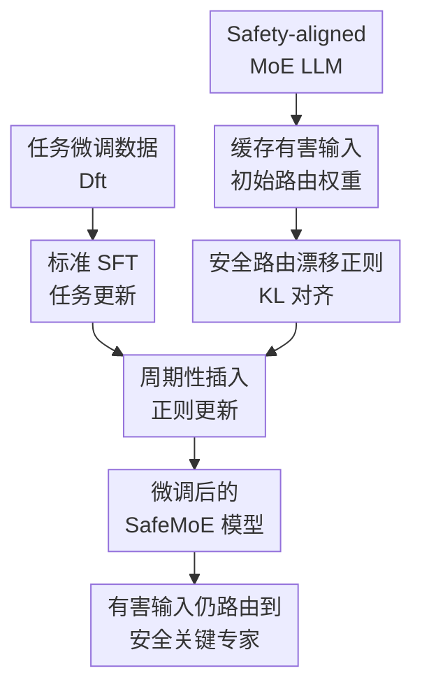

# SafeMoE: Safe Fine-Tuning for MoE LLMs by Aligning Harmful Input Routing

**会议**: ICLR 2026  
**OpenReview**: [https://openreview.net/forum?id=W1x9AzkSnU](https://openreview.net/forum?id=W1x9AzkSnU)  
**代码**: https://github.com/jaehanwork/SafeMoE  
**领域**: LLM 安全 / MoE 安全微调  
**关键词**: MoE LLM, 安全微调, harmful fine-tuning, 路由漂移, 安全关键专家  

## 一句话总结
SafeMoE 指出 MoE LLM 在微调后会把有害输入从原本的安全关键专家路由开，并通过对 harmful instructions 的 router 分布做 KL 正则，把微调模型的路由拉回 safety-aligned 初始模型，从而在几乎不损失下游任务效果的情况下显著降低 harmful fine-tuning 风险。

## 研究背景与动机
**领域现状**：越来越多大语言模型采用 Mixture-of-Experts 架构，用 gating network 为每个 token 选择少量专家参与计算，以较低活跃参数量支撑更大的总参数规模。与此同时，模型提供商也越来越依赖用户微调服务，让客户在安全对齐模型之上继续做任务适配。

**现有痛点**：已有研究表明，普通 dense LLM 在 harmful fine-tuning (HFT) 下会丢失安全对齐；MoE LLM 则还有一个额外脆弱点：安全行为并不只来自所有参数的整体偏好，而很大程度依赖有害输入能否被路由到少数 safety-critical experts。若微调改变了这些输入的专家选择，即使模型参数没有被大规模篡改，安全拒答路径也可能被绕开。

**核心矛盾**：现有防御大多把模型当作 dense transformer 处理，约束参数漂移、添加安全样本或事后修剪权重，却没有直接约束 MoE 的路由机制。对 MoE 来说，哪些专家被激活本身就是安全机制的一部分；只控制参数更新而不控制 routing weights，可能仍然让有害输入流向错误专家。

**本文目标**：作者先要验证 MoE 微调中的安全退化是否真的与路由变化相关，再设计一种能嵌入标准微调流程的防御方法。这个方法需要在 HFT 攻击下保留安全性，同时维持下游任务精度，并且不能给大规模 MoE 微调带来明显额外开销。

**切入角度**：论文的关键观察是，safety-aligned MoE LLM 对有害输入存在相对稳定的 routing pattern，这些 pattern 会激活 safety-critical experts。微调后如果这个 routing pattern 偏离初始模型，harmfulness score 会随之上升；反过来，在推理时临时恢复初始 routing weights 可以显著恢复安全性。

**核心 idea**：与其泛泛地限制所有参数漂移，不如直接把有害输入的 router 分布作为安全对象，在微调过程中惩罚微调模型和初始安全模型之间的 routing KL gap，让有害输入继续走向原本负责安全拒答的专家。

## 方法详解

### 整体框架
SafeMoE 的整体流程可以分成三件事：先把 safety-aligned MoE LLM 作为参考模型，缓存它在一小组 harmful instructions 上的 routing weights；然后正常对任务数据做 supervised fine-tuning；最后周期性插入 routing drift regularization step，让当前模型在有害输入上的专家路由接近参考模型。这样，模型仍然学习 SAMSum、SQL 等下游任务，但有害输入经过 MoE layer 时会尽量保留原来的安全路由。

论文中的防御对象不是输出文本本身，而是每个 MoE layer 的 gating distribution。SafeMoE 把“安全性”落实到一个可优化的中间变量：对 harmful instruction 的最后一个 token，每层 router 在所有专家上的 Softmax 权重应该和初始安全模型相似。这个约束让微调服务不用知道攻击者会诱导模型生成什么，只需要在训练时维护安全模型已经学到的路由结构。

### 关键设计
**1. 安全路由漂移：把 MoE 安全退化定义到 router 分布上**

SafeMoE 首先定义 safety routing drift，用来度量微调模型在有害输入上的路由是否偏离初始 safety-aligned 模型。给定初始模型 $w_{align}$、微调模型 $w_{ft}$ 和 harmful instruction $x$，论文用两者 routing weights 的 KL 散度衡量漂移：$d(w_{ft}, x)=D_{KL}(\sigma(r(x|w_{align}))\|\sigma(r(x|w_{ft})))$。这里 $r(x|w)$ 是模型 $w$ 对输入 $x$ 的专家路由向量，$\sigma$ 是 Softmax。

这个指标的价值在于，它把“MoE 安全机制变了没有”从一个抽象判断变成了可测量量。作者在 OLMoE、Qwen1.5 MoE 和 DeepSeek V2 上发现，无论是 benign fine-tuning 还是混入 500 条有害样本的 HFT，safety routing drift 都会随训练推进而上升，并且与 harmfulness score 呈强相关。也就是说，MoE 的安全退化不是单纯的输出层偏移，而是 routing mechanism 本身被微调过程改写了。

**2. 路由漂移正则：对 harmful instructions 保留 safety-aligned 专家选择**

在确认路由漂移与有害性相关后，SafeMoE 直接把漂移定义作为训练正则。对 harmful instruction dataset $D_h$ 和 transformer layer set $L$，它最小化当前模型与初始模型在每层最后一个 token routing weights 上的 KL gap：

$$
L_{reg}(w)=\mathbb{E}_{x\in D_h}\mathbb{E}_{l\in L}D_{KL}\left(\sigma(r^{(l)}(x|w_{align})/\tau)\|\sigma(r^{(l)}(x|w)/\tau)\right).
$$

这不是在强迫模型永远输出拒答模板，而是在训练时约束 MoE 的中间路径：当输入呈现有害意图时，router 仍要把 token 送往初始模型中更可能触发安全响应的专家。温度 $\tau$ 控制正则强度；较小的 $\tau$ 会让 routing distribution 更尖锐，正则更聚焦于 top-ranked safety-critical experts。论文默认从 $0.1$ 到 $1.3$ 中选择满足任务精度下降不超过 1% 的最小值，使安全约束尽量强，同时不明显损害任务学习。

**3. 贪心双层优化：把安全正则做成低开销训练插步**

如果每个训练 step 同时优化 $L_{sft}+L_{reg}$，模型需要频繁对 harmful instructions 做额外前向和反向，成本会快速上升。SafeMoE 因此采用 bi-level greedy optimization：先预计算初始安全模型在 $D_h$ 上的 routing weights，之后大部分 step 只做正常 SFT；每隔 $T_{reg}$ 个 step，再用 $D_h$ 做一轮 routing regularization 更新。

这个设计把安全约束从“每步都付费”变成“周期性校准”。作者默认把 $T_{reg}$ 设为每个 epoch 的 step 数，意味着每轮任务训练后进行一次安全路由校准。实验显示，这样的贪心策略仍然能明显压低 routing drift，而且训练 loss 轨迹与普通 fine-tuning 很接近，说明正则没有破坏任务优化过程。

**4. 层选择与专家激活分析：上层路由是更高收益的安全杠杆**

论文还分析了 routing drift 在不同 transformer layers 上的分布，发现 OLMoE 的上层漂移明显更大。这与 LLM 中有害特征通常在中后层变得更可分的观察一致：早层更多处理通用表示，上层更接近行为决策和安全拒答路径。

基于这个发现，作者测试了只在部分层上应用 SafeMoE。结果显示，只约束低层效果较弱，而约束 12-15 层或 8-15 层可以获得接近全层正则的防御效果。这说明 SafeMoE 并不是盲目给所有 router 加约束，而可以进一步做成层选择版本，把计算集中在对安全最关键的路由位置。

### 损失函数 / 训练策略
SafeMoE 的训练目标可写成 $\arg\min_w L_{sft}(w)+L_{reg}(w)$，但实际实现采用交替式贪心近似。训练开始时，模型权重初始化为 $w_{align}$，并预先缓存所有 $x\in D_h$ 在初始模型上的 routing weights。每个普通 step 用任务数据 $D_{ft}$ 计算 $\nabla_w L_{sft}$ 并执行 Adam 更新；如果当前 step 满足 $t \bmod T_{reg}=0$，再遍历 harmful instruction batch，用 $L_{reg}$ 计算梯度并继续更新当前权重。

论文的默认实现使用 100 条 SafeInstr harmful instructions 作为 $D_h$。LoRA 微调训练 3 个 epoch，learning rate 为 $1e^{-4}$，batch size 为 32；不同 MoE 模型的 LoRA target modules 覆盖 q/k/v/o 等注意力投影。对于 gpt-oss、Llama 4、Mixtral 等大模型，SafeMoE 也沿用同样思想，只根据模型资源需求使用更多 GPU 或量化设置。

## 实验关键数据

### 主实验
论文首先在 OLMoE、Qwen1.5 MoE、DeepSeek V2 三个较常用 MoE LLM 上评估，任务包括 SAMSum 摘要和 SQL 生成。FA 表示任务精度，HS 表示 JailbreakBench 上被 Llama-Guard-4-12B 判为 unsafe 的比例，越低越安全。

| 模型 / 任务 | 方法 | FA↑ | HS↓ | 主要结论 |
|--------|------|------|------|----------|
| OLMoE / SAMSum | Fine-tuning | 49.3 | 62.0 | 普通微调显著破坏安全 |
| OLMoE / SAMSum | SafeDelta | 48.6 | 13.0 | 事后 delta 修正有帮助但仍不稳定 |
| OLMoE / SAMSum | SAFEMOE | 48.9 | 5.0 | HS 从 62.0 降到 5.0，FA 下降不到 1 点 |
| OLMoE / SQL | Fine-tuning | 58.5 | 64.0 | SQL 任务下同样产生高有害性 |
| OLMoE / SQL | SAFEMOE | 59.0 | 17.0 | 任务精度反而略高，安全显著改善 |
| Qwen1.5 MoE / SAMSum | Fine-tuning | 50.4 | 49.0 | HFT 后安全明显退化 |
| Qwen1.5 MoE / SAMSum | SAFEMOE | 50.6 | 0 | 路由正则几乎恢复到安全状态 |
| DeepSeek V2 / SQL | Fine-tuning | 70.1 | 72.0 | 普通微调最危险的一组 |
| DeepSeek V2 / SQL | SAFEMOE | 69.1 | 4.0 | HS 从 72.0 降到 4.0 |

进一步的大模型实验覆盖 gpt-oss、Qwen3 MoE、Phi-3.5 MoE、Llama 4 和 Mixtral，评估 reasoning performance on MMLU-Redux-2.0 与 harmfulness。攻击设置更强，使用 5k purely harmful samples。

| 模型 | Aligned MMLU / HS | Fine-tuning MMLU / HS | SAFEMOE MMLU / HS | 观察 |
|------|-------------------|------------------------|---------------------|------|
| gpt-oss | 85.4 / 2.0 | 77.5 / 84.0 | 79.6 / 7.0 | 安全显著恢复，并缓解推理性能下降 |
| Qwen3 MoE | 89.6 / 1.0 | 89.1 / 67.0 | 88.8 / 4.0 | 几乎保持推理能力，HS 大幅下降 |
| Phi 3.5 MoE | 83.3 / 2.0 | 80.7 / 83.0 | 81.4 / 2.0 | 恢复到接近 aligned 安全水平 |
| Llama 4 | 90.4 / 7.0 | 89.5 / 79.0 | 89.8 / 3.0 | 在 109B 总参数 MoE 上仍有效 |
| Mixtral | 78.9 / 7.0 | 66.5 / 78.0 | 78.4 / 8.0 | 防御同时保住大部分 reasoning performance |

### 消融实验
| 配置 / 分析项 | 关键指标 | 说明 |
|------|---------|------|
| OLMoE 普通 fine-tuning | FA 49.3, HS 62.0 | 安全路由漂移随训练上升，harmfulness 同步上升 |
| SAFEMOE | FA 48.9, HS 5.0 | 在 SAMSum 上几乎保持任务性能，并显著抑制 harmfulness |
| SAFEMOE blocking expert-layer gradients | FA 48.2, HS 18.0 | 即使隔离专家层梯度影响，只保留 gating 相关效果，仍有强防御，验证 router 是关键因素 |
| Full fine-tuning + SAFEMOE | FA 51.0, HS 2.0, 7189.01s | 全参数微调下也有效，训练时间只比普通 full fine-tuning 高 2.30% |
| HEx-PHI benchmark / OLMoE | HS 6.3 | 在另一个 harmfulness benchmark 上仍优于 SafeInstr、SaLoRA、Antidote、SafeDelta |
| 只约束上半层 8-15 | 接近全层正则 | 上层 routing drift 更大，层选择正则可进一步省成本 |

### 关键发现
- safety routing drift 与 harmfulness score 的 Pearson correlation 在多个模型和两种微调场景下都很高，例如 OLMoE benign fine-tuning 的 $r=0.9616$，DeepSeek V2 HFT 的 $r=0.9813$，说明路由漂移不是偶然现象。
- 现有 dense LLM 防御方法在 MoE 上表现不稳定：SafeInstr 通常能中等程度降低 HS，但仍留下明显 harmfulness；SaLoRA、Antidote、SafeDelta 在某些模型或任务上会牺牲较多任务精度，且不能稳定阻止上层 routing drift。
- SafeMoE 的开销很低。OLMoE LoRA 场景下普通 fine-tuning 平均 808.98 秒，SafeMoE 额外 17.26 秒，约 2.13%；相比之下 SaLoRA 额外 747.56 秒，约 92.41%。
- 温度 $\tau$ 越小，正则越聚焦 top safety-critical experts，通常更安全；$|D_h|$ 越大，防御更强但开销近似线性增加；$T_{reg}$ 越小，安全校准越频繁、开销越高。
- SafeMoE 在强攻击、全参数微调和额外 benchmark 上都保持有效，说明它抓住的是 MoE 安全机制的结构性弱点，而不是某个特定数据集或 LoRA 设置的偶然 trick。

## 亮点与洞察
- 这篇论文最重要的贡献是把 MoE LLM 安全退化的原因从“参数被微调坏了”推进到“有害输入被路由到错误专家”。这个视角让防御目标更精准，也解释了为什么很多 dense LLM 防御迁移到 MoE 后效果不够好。
- SafeMoE 的正则项非常直接：参考初始 safety-aligned 模型的 routing distribution，并让微调模型保持接近。它不需要重新训练对齐模型，也不需要识别每个专家的语义，只需要一小组 harmful instructions 和 router 输出即可。
- 论文用“覆盖初始 routing weights 可以恢复安全”的实验强化了因果直觉。相比只报告相关性，这个 inference-time override 更像一个反事实验证：若同一个 fine-tuned 模型只换回安全路由，harmfulness 明显下降，那么路由本身确实承担了安全路径功能。
- 层选择分析很有启发。对 MoE 安全防御来说，所有层、所有专家并不等价；上层 router 更值得被监控和约束。这为后续更轻量的 MoE safety monitor、router-level adapter 或 selective regularization 提供了方向。
- SafeMoE 也提供了一种 fine-tuning API 的安全工程思路：服务端可以保留 safety-aligned base model 的 router reference，在客户微调时周期性做结构性安全校准，而不必完全依赖输入数据过滤或输出审查。

## 局限与展望
- SafeMoE 依赖一小组 harmful instructions $D_h$ 来代表安全风险。如果攻击分布与 $D_h$ 差异很大，路由正则是否仍能覆盖新型风险，需要更多跨领域和自适应攻击评估。
- 论文主要约束 harmful instruction 的最后一个 token routing weights。这个选择降低成本且便于实现，但有害意图在长上下文、多轮对话或工具调用轨迹中可能分布在多个位置，后续可以研究 span-level 或 conversation-level routing regularization。
- SafeMoE 假设 safety-aligned 初始模型的路由本身值得保留。如果初始模型对某些安全边界已经不稳，单纯对齐初始 routing 可能只能保存原有缺陷。更强的做法可能是先识别或增强 safety-critical experts，再进行路由保持。
- 当前方法主要关注 MoE router，对 dense attention、共享专家、LoRA adapter 本身的安全漂移没有直接建模。对于未来混合架构模型，可能需要把 routing-level 约束与 representation-level 或 activation-level 约束组合。
- 工程部署上，服务端需要访问 router weights 并插入正则训练步骤。对只暴露黑盒微调接口的第三方用户而言，SafeMoE 更适合作为模型提供商侧防御，而不是普通用户可自行套用的外部补丁。

## 相关工作与启发
- **vs SafeInstr**: SafeInstr 通过给微调数据添加安全样本来抵抗 HFT，是数据层的 architecture-agnostic 方法；SafeMoE 则直接约束 MoE router，让有害输入继续激活安全关键专家，因此在 MoE 上更贴近失效机制。
- **vs Lisa / AsFT**: 这类方法关注参数或 harmful direction 的漂移，适合 dense LLM 视角；SafeMoE 认为 MoE 的关键不是所有参数都少动，而是有害输入的条件计算路径不能偏离安全路径。
- **vs SaLoRA**: SaLoRA 通过安全感知 LoRA 初始化保留对齐特征，但在 MoE 动态激活参数下不一定覆盖实际被路由到的专家；SafeMoE 不从 adapter 初始化入手，而是在训练过程中持续校准 routing distribution。
- **vs Antidote / SafeDelta**: Antidote 和 SafeDelta 属于 post-fine-tuning 权重修改，试图在训练后修复安全；SafeMoE 属于 fine-tuning-stage 防御，能在 harmfulness 随路由漂移上升时及时压住漂移。
- **对 MoE 安全研究的启发**: 未来可以把 router 当作安全接口来审计，例如监控 safety-critical experts 的激活概率、识别危险输入的路由异常、或者在高风险域中对特定层 router 加更强约束。

## 评分
- 新颖性: ⭐⭐⭐⭐⭐ 从 MoE routing drift 解释 harmful fine-tuning 安全退化，并提出 router-level 防御，切入点清晰且有架构针对性。
- 实验充分度: ⭐⭐⭐⭐⭐ 覆盖 8 个 MoE LLM、多个任务、强攻击、全参数微调、额外 benchmark、开销和超参敏感性，证据链比较完整。
- 写作质量: ⭐⭐⭐⭐☆ 论文主线清楚，指标和图表能支撑论点；不足是部分机制分析仍停留在 routing correlation 和 top expert activation，专家语义解释可以更深。
- 价值: ⭐⭐⭐⭐⭐ 对提供 MoE 微调服务的模型方很实用，也提醒后续安全对齐不能只沿用 dense LLM 防御范式。

<!-- RELATED:START -->

## 相关论文

- [\[ICLR 2026\] ARMOR: Aligning Secure and Safe Large Language Models via Meticulous Reasoning](armor_aligning_secure_and_safe_large_language_models_via_meticulous_reasoning.md)
- [\[ICLR 2026\] Be Careful When Fine-tuning On Open-Source LLMs: Your Fine-tuning Data Could Be Secretly Stolen!](be_careful_when_fine-tuning_on_open-source_llms_your_fine-tuning_data_could_be_s.md)
- [\[ICML 2025\] Vulnerability-Aware Alignment: Mitigating Uneven Forgetting in Harmful Fine-Tuning](../../ICML2025/llm_safety/vulnerability-aware_alignment_mitigating_uneven_forgetting_in_harmful_fine-tunin.md)
- [\[ICLR 2026\] Safety Mirage: How Spurious Correlations Undermine VLM Safety Fine-Tuning and Can Be Mitigated by Machine Unlearning](safety_mirage_how_spurious_correlations_undermine_vlm_safety_fine-tuning_and_can.md)
- [\[ICLR 2026\] Rethinking Bottlenecks in Safety Fine-Tuning of Vision Language Models](rethinking_bottlenecks_in_safety_fine-tuning_of_vision_language_models.md)

<!-- RELATED:END -->
