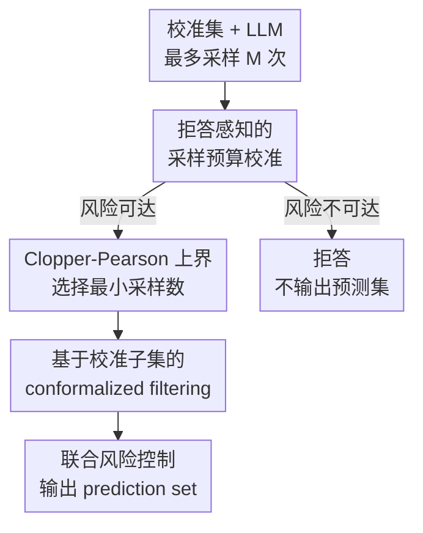

# SAFER: Risk-Constrained Sample-then-Filter in Large Language Models

**会议**: ICLR2026  
**OpenReview**: [https://openreview.net/forum?id=kJmLmOvwLC](https://openreview.net/forum?id=kJmLmOvwLC)  
**代码**: 待公开  
**领域**: LLM安全 / 可信风险控制  
**关键词**: 风险约束生成, conformal prediction, 不确定性量化, 拒答机制, 开放式问答  

## 一句话总结
SAFER 面向开放式 QA 中 LLM 可能采不到正确答案、候选答案又混有幻觉的问题，先用拒答感知的采样预算校准控制“候选集中没有可接受答案”的风险，再用 conformalized filtering 过滤高不确定答案，并在多个数据集和模型上验证两阶段误覆盖风险都能被用户给定阈值约束。

## 研究背景与动机
**领域现状**：LLM 已经能在开放式问答、医疗问答和对话系统中生成自然语言答案，但这些场景的输出不是固定类别，而是一段自由文本。用户真正关心的不是模型给出一个看起来流畅的答案，而是这个答案集合里是否至少包含一个语义上可接受、可以供下游决策参考的答案。

**现有痛点**：split conformal prediction 和 selective conformal prediction 在分类或多选题中很自然，因为标签空间固定，模型可以给每个类别一个分数，然后构造覆盖真标签的 prediction set。开放式 QA 没有这样的有限标签空间，LLM 通过采样生成候选答案时，有限次采样未必能碰到正确答案；如果方法默认“总能采到一个可接受答案”，那么在困难问题或模型能力不足时，所谓覆盖保证就会变成纸面保证。

**核心矛盾**：增加采样次数可以提高命中可接受答案的概率，但采样越多，候选集中也越容易混入重复、偏题或幻觉答案。只扩大候选集会让用户面对一堆不可靠参考；只过滤高不确定答案又可能把唯一正确答案删掉。本文要同时控制两个风险：第一阶段候选集根本没有可接受答案，第二阶段过滤后可接受答案被排除。

**本文目标**：作者把问题拆成两个可校准参数：采样预算 $s$ 和不确定性阈值 $t$。$s$ 决定测试时每个问题至少要采多少个候选答案，目标是在风险水平 $\alpha$ 下控制采样集的 miscoverage；$t$ 决定哪些候选会被留下，目标是在风险水平 $\beta$ 下控制过滤后 prediction set 丢失可接受答案的概率。

**切入角度**：SAFER 的关键观察是，开放式 QA 中“采不到正确答案”本身应该被建模为一种可拒答事件，而不是被 conformal prediction 的标签覆盖假设悄悄吞掉。只要在校准集上显式统计不同采样预算下的失败率，并给失败率加上高置信上界，就能判断目标风险是否可达；可达时再选择最小预算，不可达时直接拒答。

**核心 idea**：用“先采样并校准可达性、再过滤并校准不确定性”的两阶段框架，替代开放式 QA 中默认有限采样一定覆盖正确答案的强假设。

## 方法详解

### 整体框架
SAFER 的输入是一组校准问题及其参考答案、一个待部署 LLM、一个最多采样上限 $M$、一个答案可接受性函数 $A$，以及用户指定的风险水平 $\alpha$ 和 $\beta$。校准阶段先在每个问题上最多采 $M$ 个候选，统计在不同采样预算 $s$ 下“没有任何候选达到可接受阈值 $\lambda_A$”的频率；如果在 $M$ 内仍无法把该风险的置信上界压到 $\alpha$ 以下，系统选择拒答，否则得到最小测试采样预算 $\hat{s}$。随后，SAFER 只使用在 $\hat{s}$ 个候选内能找到可接受答案的校准样本来校准不确定性阈值 $\hat{t}$，测试时对每个问题采 $\hat{s}$ 个答案，再删除不确定性高于 $\hat{t}$ 的候选，形成最终 prediction set。

### 关键设计
**1. 拒答感知的采样预算校准：先判断目标风险是否可达**

开放式 QA 和分类任务最大的差别在于，正确答案不是一个可枚举类别，而是一段可能有多种表述的文本。SAFER 先定义任务相关的可接受性函数 $A(\hat{y}, y^*) \in [0,1]$，当 $A(\hat{y}, y^*) \ge \lambda_A$ 时，生成答案 $\hat{y}$ 被认为是 admissible answer。对校准样本 $i$，如果前 $s$ 个候选里没有任何答案达标，就记为一次采样阶段 miscoverage。

这个设计把“模型能力不足或问题太难，有限采样内采不到正确答案”从隐含失败变成显式风险。给定预算 $s$，SAFER 统计校准集失败数

$$
\hat{m}_{cal}(s)=\sum_{i=1}^N \mathbf{1}\{\forall \hat{y}\in\{\hat{y}^{(i)}_j\}_{j=1}^s, A(\hat{y},y_i^*)<\lambda_A\},
$$

并得到经验失败率 $\hat{r}_{cal}(s)=\hat{m}_{cal}(s)/N$。如果连最大预算 $M$ 下的风险上界都高于用户要求的 $\alpha$，SAFER 不再硬输出一个无效 prediction set，而是拒答；这让框架在不可达风险水平下保持诚实。

**2. Clopper-Pearson 上界：用精确置信界选择最小采样数**

仅看经验失败率不够，因为校准集有限，测试集上的真实失败率 $R(s)$ 可能更高。SAFER 用 Clopper-Pearson exact method 为每个采样预算 $s$ 构造高置信上界 $\hat{R}^+(s)$，满足 $\Pr(R(s)\le \hat{R}^+(s))\ge 1-\delta$。直观地说，它问的是：在真实失败率为 $R$ 的二项分布下，观察到当前这么低的校准失败数是否仍然统计上可信；最大的可信 $R$ 就是保守上界。

随后，SAFER 选择满足风险约束的最小预算

$$
\hat{s}=\inf\{s\in[1,M]:\hat{R}^+(s)\le \alpha\}.
$$

这样做的好处是，采样预算不是拍脑袋设定，也不是“越大越好”，而是在统计保证和推理成本之间取最小可行点。测试时用 $\hat{s}$ 采样，能够以至少 $1-\delta$ 的校准集概率保证采样集不覆盖可接受答案的风险不超过 $\alpha$。

**3. 基于校准子集的 conformalized filtering：只在可达样本上校准过滤阈值**

拿到 $\hat{s}$ 后，候选集里虽然更可能包含正确答案，但也会包含不可靠答案。SAFER 不直接把所有候选交给用户，而是用每个候选答案的不确定性分数 $U(\hat{y})$ 做过滤。论文主实验使用句子级熵，即把生成序列中各 token 的负对数概率累加：$U(\hat{y})=\sum_k -\log p(z_k\mid \hat{y}_{<k})$。分数越高，答案越不稳定或越不像模型确信的输出。

关键在于，过滤阈值不能在所有校准样本上盲目校准，因为有些样本在 $\hat{s}$ 个候选内本来就没有可接受答案，过滤器不可能凭空补出正确答案。SAFER 因此构造校准子集 $D_{cal}(\hat{s})$：只保留那些在 $\hat{s}$ 个候选内至少有一个 admissible answer 的样本。对任意阈值 $t$，prediction set 是 $C_t(x_i)=\{\hat{y}:U(\hat{y})\le t\}$，损失 $l_i(t)$ 表示过滤后集合中是否没有任何可接受答案。阈值 $\hat{t}$ 由 conformal risk control 选择，使

$$
\frac{N' L_{N'}(t)+1}{N'+1}\le \beta.
$$

这里的 $+1$ 是有限样本 conformal 校准中的保守修正。它保证的是：在采样集本来含有可接受答案的条件下，过滤阶段把所有可接受答案排除掉的概率不超过 $\beta$。

**4. 联合风险控制：把采样失败和过滤失败合成一个可解释上界**

SAFER 的最终风险不是简单声称“覆盖率高”，而是清楚地区分两类失败。第一类失败是采样阶段没有采到任何 admissible answer，概率由 $\alpha$ 控制；第二类失败是在已经采到 admissible answer 的条件下，过滤阶段把它们全部删掉，概率由 $\beta$ 控制。两者组合后，最终 prediction set 不含可接受答案的风险上界为

$$
\alpha+\beta-\alpha\beta=1-(1-\alpha)(1-\beta).
$$

这个式子让用户可以直接理解风险预算的含义：$\alpha$ 更偏向控制“要采多少才值得回答”，$\beta$ 更偏向控制“过滤可以多激进”。当应用更保守时，可以降低二者；当希望输出集合更小、更便于人类决策时，可以在可接受范围内提高 $\beta$，用更强过滤换取更小 prediction set。

### 一个完整示例
假设一个开放式 QA 系统的最大采样上限是 $M=20$，用户希望采样阶段失败风险不超过 $\alpha=0.05$。SAFER 先在校准集上为每个问题生成最多 20 个答案，并检查每个答案和参考答案的相似度是否超过 $\lambda_A$。如果 $s=3$ 时仍有较多问题没有可接受答案，Clopper-Pearson 上界可能大于 0.05；如果 $s=8$ 时上界首次降到 0.05 以下，那么测试时就固定至少采 8 个答案，而不是继续采满 20 个。

接着，SAFER 在这 8 个候选内筛出校准集中“确实至少有一个可接受答案”的问题。对这些问题，它计算每个候选答案的句子熵，并尝试不同阈值 $t$。如果阈值太低，很多候选会被删掉，正确答案也可能消失；如果阈值太高，prediction set 变大，用户仍会看到很多干扰项。conformalized filtering 选择的 $\hat{t}$ 是一个经过风险校准的折中点：过滤后集合更小，但在可达样本上丢掉全部可接受答案的概率仍被 $\beta$ 约束。

### 损失函数 / 训练策略
SAFER 不是训练新 LLM，而是一个后处理校准框架。训练意义上的可学习参数很少，核心是基于校准集估计两个部署参数 $\hat{s}$ 和 $\hat{t}$。第一阶段的目标是搜索最小 $s$，使 Clopper-Pearson 上界 $\hat{R}^+(s)$ 不超过 $\alpha$；第二阶段的目标是搜索最小或合适的 $t$，使 conformal risk control 的有限样本校正式风险不超过 $\beta$。

实验中，作者使用温度为 1.0 的 multinomial sampling 生成候选答案；TriviaQA 和 CoQA 的生成长度设为 36，ScienceQA 设为 24，显著性水平 $\delta=0.05$。默认校准集和测试集按 0.5 比例划分，同时在敏感性实验中考察更小校准比例。因为 SAFER 是模型无关框架，只要能得到候选答案和某种不确定性分数，就可以接到不同 LLM 或黑盒模型上。

## 实验关键数据

### 主实验
作者在 TriviaQA、CoQA、ScienceQA 三个开放式 QA 数据集上评估 SAFER，并覆盖 LLaMA-3.1-8B-Instruct、OpenChat-3.5、Qwen2.5-3B/7B/14B-Instruct 等模型。评估指标是 test-time Empirical Error Rate（EER）：采样阶段统计候选集是否不含可接受答案，过滤阶段统计最终 prediction set 是否不含可接受答案。

| 实验对象 | 设置 | 主要观察 | 结论 |
|----------|------|----------|------|
| Clopper-Pearson 上界有效性 | TriviaQA、CoQA，不同采样预算 | 测试集经验 miscoverage 始终低于校准集推得的置信上界 | 校准阶段估计的风险上界能迁移到测试阶段 |
| 采样阶段风险控制 | 与 TRON 对比，保留有限采样失败样本 | TRON 在部分低风险设置下超出目标风险，例如 OpenChat-3.5 在 TriviaQA、$\alpha=0.03$ 时 EER 超过 0.06 | SAFER 的拒答机制修正了“有限采样总能成功”的假设 |
| 过滤阶段风险控制 | TriviaQA 设 $\alpha=0.05$，CoQA 设 $\alpha=0.25$，扫描 $\beta$ | 五个 LLM 的最终 EER 均低于 $\alpha+\beta-\alpha\beta$ | filtering 可以变小集合，同时保留统计有效性 |

### 消融实验
严格来说，论文没有用“去掉某个模块后性能下降”的传统消融表，而是通过和 TRON、不同过滤风险、不同正确性指标、不同校准比例来验证每个机制的必要性。下面按机制整理最关键的分析证据。

| 配置 / 分析 | 关键指标 | 说明 |
|-------------|----------|------|
| SAFER vs TRON | 采样阶段 EER 是否低于 $\alpha$ | TRON 不处理有限采样不可达问题，在低风险目标下可能失控；SAFER 能在不可达时拒答，因此 EER 始终被约束 |
| 仅采样预算 vs 采样后过滤 | prediction set size 与最终 EER | 过滤后集合显著变小，例如 TriviaQA 上 LLaMA-3.1-8B 在 $\beta=0.1$ 时平均集合从 7.9 缩到 5.5，同时 EER 仍低于理论上界 |
| 正确性指标变化 | similarity、Rouge-L、bi-entailment、LLM judge | 换成 Rouge-L、双向蕴含或 LLM 语义评估后，采样和过滤阶段仍保持风险控制 |
| 校准比例变化 | calibration-test split 从 0.5 降到 0.1 | 即使用较少校准数据，测试 EER 仍低于指定上界，说明数据效率较好 |
| 黑盒模型验证 | GPT-4o-mini + consistency frequency uncertainty | 无 logits 时也可用语义一致频率作为不确定性，CoQA 上两阶段风险仍被控制 |

### 关键发现
- SAFER 的主要收益不是让模型“更会回答”，而是让回答系统知道在什么风险预算下该采多少、该不该拒答、过滤后还能不能保留覆盖保证。
- Clopper-Pearson 上界提供了比经验失败率更保守的可达性判断，因此在低风险目标下比 TRON 这类默认可采到正确答案的方法更稳。
- filtering 的价值体现在预测集合效率：在不牺牲风险约束的情况下删除高不确定候选，让用户看到的答案集合更紧凑。
- 正确性函数 $A$ 可以换成相似度、Rouge-L、双向蕴含或 LLM judge，说明框架依赖的是“可接受答案”的判定接口，而不是某个特定打分器。
- 最大采样上限 $M$ 仍然重要；$M$ 增大能降低拒答率，但收益会逐渐饱和，且更强模型在相同 $M$ 下通常更少拒答。

## 亮点与洞察
- 把“有限采样内采不到正确答案”显式变成拒答条件，是这篇论文最实用的地方。很多开放式生成风险控制方法默认候选集中总有正确答案，SAFER 直接承认模型能力边界，让统计保证不再建立在过强假设上。
- 两阶段风险预算的解释很清楚：$\alpha$ 管可达性，$\beta$ 管过滤损失，最终风险用 $\alpha+\beta-\alpha\beta$ 合成。这个拆法适合真实部署，因为系统设计者可以根据场景分别调整“多采样”和“少输出”的偏好。
- 论文把 conformal prediction 从闭集分类扩展到开放式 QA 时，没有强行造一个伪标签空间，而是围绕候选生成过程本身校准风险。这种思路也可以迁移到 agent 工具调用、多轮对话、医学问答等无法枚举输出的场景。
- 不确定性指标只影响效率、不影响 conformal 校准的有效性，这是一个重要工程洞察。白盒模型可以用 token entropy，黑盒模型可以用 self-consistency frequency，框架仍保持分布无关的风险控制。

## 局限与展望
- SAFER 仍依赖校准集和测试集的 exchangeability 假设。若部署环境发生明显分布漂移，例如用户问题变得更专业、答案风格改变或模型版本更新，原先校准得到的 $\hat{s}$ 和 $\hat{t}$ 可能不再有效。
- 可接受性函数 $A$ 本身会影响全部保证的语义。如果相似度、Rouge-L 或 LLM judge 对“正确答案”的判定有偏，SAFER 控制的是相对于该判定器的风险，而不一定等价于人类真实满意度。
- 拒答机制提高了诚实性，但也可能降低系统可用性。在高风险敏感应用中这是合理的，在普通问答场景中则需要结合用户体验设计，例如给出“需要更多证据”而不是简单无响应。
- 采样预算带来推理成本。虽然 SAFER 选择最小满足风险的 $\hat{s}$，但当模型较弱或任务较难时，达到低风险仍可能需要较大的 $M$，这会增加延迟和成本。
- 未来可以结合分布漂移检测、在线重校准或分层风险预算，让不同问题类型、不同难度级别使用不同的 $\alpha$、$\beta$ 和采样策略。

## 相关工作与启发
- **vs 传统 Split Conformal Prediction**: 传统 SCP 主要处理固定标签空间，构造覆盖真标签的集合；SAFER 处理开放式文本生成，先校准是否能在有限采样中得到 admissible answer，再校准过滤阈值。
- **vs TRON**: TRON 也尝试两阶段风险控制，但没有充分处理“有限采样下某些样本不可达”的情况；SAFER 加入拒答感知的采样预算校准，使低风险目标下的保证更稳。
- **vs 语义熵 / 自一致性不确定性**: 这些方法能给答案打不确定性分数，但通常缺少统计风险保证；SAFER 可以把它们作为 $U(\hat{y})$ 接入，再通过 conformal risk control 给阈值提供有限样本保证。
- **vs Conformal Language Modeling**: CLM 更侧重语言模型输出过程的 conformal 化；SAFER 的重点是开放式 QA 候选集合的可达性、拒答和过滤，更贴近风险敏感问答系统部署。

## 评分
- 新颖性: ⭐⭐⭐⭐☆ 将拒答机制、采样预算校准和 conformalized filtering 组合得很自然，核心创新在于修正开放式 QA 中有限采样可达性的隐含假设。
- 实验充分度: ⭐⭐⭐⭐☆ 覆盖三类文本 QA、多个 LLM、多种正确性指标、黑盒模型和多模态扩展；不足是传统模块消融不多，更多是机制分析。
- 写作质量: ⭐⭐⭐⭐☆ 论文主线清晰，风险定义和理论保证比较完整，但附录表格中个别数值和符号排版略有瑕疵，需要读者自行对齐上下文。
- 价值: ⭐⭐⭐⭐⭐ 对风险敏感 LLM 问答系统很有实际价值，尤其适合需要“能回答才回答、输出集合还要可控”的可信部署场景。

<!-- RELATED:START -->

## 相关论文

- [\[ICLR 2026\] EEPO: Exploration-Enhanced Policy Optimization via Sample-then-Forget](eepo_exploration-enhanced_policy_optimization_via_sample-then-forget.md)
- [\[ACL 2026\] RISK: A Framework for GUI Agents in E-commerce Risk Management](../../ACL2026/llm_safety/risk_a_framework_for_gui_agents_in_e-commerce_risk_management.md)
- [\[ICLR 2026\] Transferable and Stealthy Adversarial Attacks on Large Vision-Language Models](transferable_and_stealthy_adversarial_attacks_on_large_vision-language_models.md)
- [\[ICLR 2026\] AdPO: Enhancing the Adversarial Robustness of Large Vision-Language Models with Preference Optimization](adpo_enhancing_the_adversarial_robustness_of_large_vision-language_models_with_p.md)
- [\[ICLR 2026\] DiffuGuard: How Intrinsic Safety is Lost and Found in Diffusion Large Language Models](diffuguard_how_intrinsic_safety_is_lost_and_found_in_diffusion_large_language_mo.md)

<!-- RELATED:END -->
