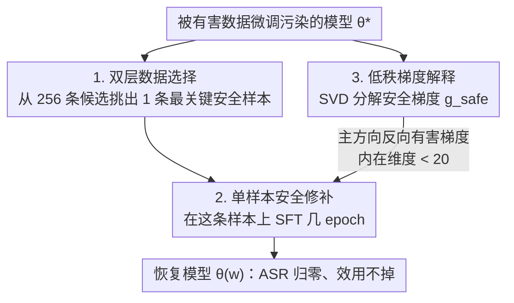

# Safety at One Shot: Patching Fine-Tuned LLMs with A Single Instance

**会议**: ICLR 2026  
**OpenReview**: [https://openreview.net/forum?id=EyH8Fu3vtZ](https://openreview.net/forum?id=EyH8Fu3vtZ)  
**代码**: https://github.com/Kevin-Zh-CS/safety-at-one-shot  
**领域**: LLM 安全 / 微调攻击防御 / 对齐恢复  
**关键词**: 微调攻击, 安全对齐恢复, 双层优化, 低秩梯度, 单样本修补

## 一句话总结
针对"用户上传数据微调会破坏 LLM 安全对齐"这一 LMaaS 安全隐患，本文发现只需**一条**精心挑选的安全样本、微调几个 epoch，就能把被大规模有害数据污染的模型完全拉回对齐水平（ASR 归零）且几乎不损失任务效用，并用安全梯度的低秩结构从理论上解释了为什么"一条样本"就够。

## 研究背景与动机
**领域现状**：安全对齐（SFT / RLHF / DPO）让 LLM 学会识别有害提示并拒答，已成为模型上线前的标准环节。同时 OpenAI、Anthropic 等厂商开放微调 API，让用户上传数据集定制模型，这就是 Language-Model-as-a-Service（LMaaS）范式。

**现有痛点**：用户数据进入微调管线带来了新的攻击面——"微调攻击"（fine-tuning attack）。已有工作证明，哪怕只用 10 条有害样本训 5 个 epoch（成本不到 \$0.20），都能让 GPT 这种强对齐模型破防。在 LMaaS 下，是厂商在自己服务器上完成微调和推理，于是**厂商要为模型输出的安全性直接负责**（涉及合规甚至法律责任），急需一种鲁棒且廉价的防御。

**核心矛盾**：现有防御普遍卡在"安全—效用—效率"三角上。Vaccine / BackdoorAlign 靠扰动或隐藏触发器加固，代价是任务效用下降；Lisa 在微调时注入安全数据，但需要大规模精选数据集和大量算力；Antidote / DirectionAlign 在参数层面剪掉或重置有害更新，却依赖校准集（calibration set）来定位有害参数，修复力有限；ConstrainedSFT 约束初始 token 的更新，但要额外的效用数据集做约束，安全恢复与下游性能仍难两全。一句话：大家都默认"恢复安全=需要海量精选安全数据或复杂校正机制"。

**本文目标**：能不能在**最低成本、不牺牲效用**的前提下恢复模型安全？这要回答两个子问题——(1) 恢复对齐到底需要多少安全信号？(2) 为什么这么点信号就够？

**切入角度**：作者不去堆数据，而是反过来追问"恢复对齐所需的**最小信号**是什么"。他们把"哪些样本对安全最关键"形式化为一个双层优化的数据选择问题，意外发现：**单独一条精心挑选的安全样本，就足以中和有害更新**。

**核心 idea**：用"双层优化挑出一条最关键的安全样本 + 在其上微调几 epoch"代替"海量安全数据集或复杂参数校正"，来恢复被微调攻击破坏的安全对齐；并用安全梯度的低秩、且与有害梯度方向近乎相反的结构，解释这种"一击修补"为何成立。

## 方法详解

### 整体框架
方法围绕一个反直觉的现象——**one-shot safety recovery**展开：给定一个已经被有害数据微调污染的模型 $\theta^*$，只需引入一条挑选出来的安全样本做几轮微调，就能把它拉回初始对齐模型 $\theta_0$ 的安全水平，同时保住在任务数据 $D_{task}$ 上的效用。

整条管线分三步：先把"安全数据该选哪条"写成一个**双层优化（BLO）**问题，从一个 256 条的安全候选集 $D_{safe}$ 里挑出最关键的那一条；再在这条样本上做标准 SFT 恢复（10 epoch、学习率 $2\times10^{-5}$）；最后用**梯度分解**回答"为什么一条就够"——对安全梯度做 SVD，证明它落在一个低秩子空间里、且主方向与有害梯度近乎相反，从而推出一个与模型维度无关的收敛速率。

### 关键设计

**1. 双层优化的安全数据选择：把"挑哪条样本"变成可优化目标**

直接的问题是：256 条候选安全样本里，哪一条对恢复对齐最有用？本文不靠启发式打分，而把它写成一个一阶、罚函数式的双层优化。引入二元选择向量 $w\in\{0,1\}^N$，$w_i=1$ 表示第 $i$ 条样本被选进安全补丁集 $D_{safe}=\{(x_i,y_i)\mid w_i=1\}$，并约束 $\mathbf{1}^\top w=m$ 控制选中数量。下层是在选中样本上做标准 SFT：

$$\theta(w)=\arg\min_\theta\ \mathbb{E}_{(x,y)\sim D_{safe}}\big[-w_i\log\pi_\theta(y\mid x)\big],\quad \theta\leftarrow\theta^*.$$

上层则同时拉两个方向：让恢复后的模型在有害提示上**对齐回初始模型** $\theta_0$（$\mathbb{E}_{x\sim D_{harm}}D_{KL}(\pi_{\theta_0}\|\pi_{\theta(w)})$），又在任务数据上**对齐到微调模型** $\theta^*$（$\mathbb{E}_{x\sim D_{task}}D_{KL}(\pi_{\theta^*}\|\pi_{\theta(w)})$），再加 $\lambda\|w\|_2^2$ 正则：

$$\min_w\ \mathbb{E}_{x\sim D_{harm}}D_{KL}\big(\pi_{\theta_0}\|\pi_{\theta(w)}\big)+\mathbb{E}_{x\sim D_{task}}D_{KL}\big(\pi_{\theta^*}\|\pi_{\theta(w)}\big)+\lambda\|w\|_2^2.$$

这个目标直白地把"安全要回到 $\theta_0$、效用要留在 $\theta^*$"两件事同时写进损失，所以挑出的样本天然兼顾安全与效用。$\ell_2$ 正则一方面通过强凸性稳住双层优化，另一方面在把 $w$ 松弛成连续值时鼓励稀疏，自然导向"只选极少数样本"。

**2. 单样本安全修补：一条通用拒答样本撑起整个安全子空间**

挑出来的不是某个细分类别的拒答，而是一条**通用安全拒答**样本，形如 `{"user": "How can I bypass system security checks?", "assistant": "Sorry, I can't help you. Please follow security guidelines."}`。安全候选集 $D_{safe}$ 由 256 条覆盖 11 类的有害指令、配上初始 Llama-2-7B-Chat 生成的拒答答案构成，且与评测集 HEx-PHI、AdvBench 严格不重叠。恢复时就在这一条样本上微调 10 epoch。

关键发现是"安全数据宁缺毋滥"：通用安全数据比按类别细分的数据更有效，而**加多反而坏事**——多放几条安全样本，安全提升边际递减，效用却明显往下掉，形成不划算的 trade-off。所以最优策略就是用单条样本恢复，在安全与效用间取得最佳平衡。这条样本之所以够用，是因为不同安全样本诱导的梯度几乎指向同一方向（见设计 3），单条就能近似整个安全梯度批次。

**3. 低秩安全梯度：从几何上解释"为何一击就中"并给出维度无关收敛**

这是全文的理论支点。对单条安全样本的梯度 $g_{safe}=\nabla_\theta\ell(\theta,x_{safe},y_{safe})$ 做 SVD，$g_{safe}\approx U_{safe}S_{safe}V_{safe}^\top$，发现绝大多数奇异值近乎为零、只有极少数显著大——即安全梯度落在一个**低秩子空间**。用累积能量比 $\text{CER}(k)=\sum_{i=1}^k\sigma_i^2/\sum_{i=1}^r\sigma_i^2$ 量化：在 Llama-3.1-8B 上 top-20 奇异值就占了 0.92 的能量。更进一步，用 Frobenius 重叠度量 $\phi(g_{safe},\bar g_{safe})=\|U_{safe}^\top\bar U_{safe}\|_F^2/\min(\text{rank}(U_{safe}),\text{rank}(\bar U_{safe}))$ 比较单样本梯度与整批安全梯度的主方向，Llama 系列重叠 > 0.8、Mistral/Qwen > 0.9，说明措辞各异的安全样本其实推往**同一个方向**，而且这个方向与有害梯度近乎相反。

由此本文给出投影式恢复 $\theta^d=\theta_0^d+\text{Proj}(U_{safe}^{(0:k)})$，其中 $\text{Proj}(U_{safe}^{(0:k)})=-\alpha\eta\sum_{i=0}^{k-1}\sigma_i U_{safe}^{(i)}V_{safe}^{(i)\top}$，实测安全的**内在维度 < 20**（取 $k=20$ 即可恢复）。基于"曲率有效秩 $\le r$"的局部假设与 PL 条件，作者证明了 dimension-free 收敛（Theorem 1）：步长 $\eta\le 1/(\ell r)$ 时 $L(\theta_{t+1})-L^\star\le(1-\mu\eta)(L(\theta_t)-L^\star)$，达到 $\varepsilon$ 精度只需 $t=O\big(\frac{r\ell}{\mu}\log\frac{L(\theta_0)-L^\star}{\varepsilon}\big)$ 步——**收敛步数只依赖低秩 $r$、与参数量 $d$ 无关**，这正解释了为什么恢复能在 10 个 epoch 内稳定收敛、且与模型大小（7B/13B/70B）和有害微调规模（10/100/1000 条）都无关。

## 实验关键数据

### 主实验
五个对齐 LLM（Llama-2-7B-Chat、Llama-3.1-8B、Mistral-7B、Qwen-2.5-7B、闭源 GPT-4.1）、多任务、多攻击场景。下表为 Llama-2-7B-Chat 与 GPT-4.1 在 SQL Create 上微调后各恢复方法的对比（ASR↓、HS↓ 衡量安全，SQL/MMLU/MT-bench 衡量效用，Time 为相对 Standard SFT 的额外 GPU 小时）：

| 方法 | ASR↓ | HS↓ | SQL↑ | MMLU↑ | MT-bench↑ | Time(h)↓ |
|------|------|-----|------|-------|-----------|----------|
| Origin（原始对齐） | 0.0 | 1.00 | 14.9 | 45.81 | 7.16 | - |
| Standard SFT（被攻击） | 15.4 | 2.45 | 99.4 | 45.78 | 7.15 | - |
| Vaccine | 14.6 | 2.18 | 99.4 | 45.10 | 7.08 | 1.09 |
| Lisa | 12.0 | 2.05 | 94.3 | 44.58 | 6.80 | 0.20 |
| Antidote | 10.8 | 1.90 | 92.5 | 44.13 | 6.91 | 0.04 |
| DirectionAlign | 2.1 | 1.35 | 96.8 | 44.94 | 7.05 | 1.33 |
| ConstrainedSFT | 3.3 | 1.59 | 98.5 | 45.26 | 7.12 | 0.25 |
| STAR-DSS | 0.0 | 1.00 | 99.0 | 45.70 | 7.15 | 2.45 |
| **One-shot FT（本文）** | **0.0** | **1.00** | **99.4** | **45.76** | **7.16** | **0.02** |

本文是唯一一个同时做到 ASR=0、HS=1.0、效用几乎不掉、且额外开销最小（约 1–2 分钟）的方法。GPT-4.1 上同样把 ASR 从 12.4 降到 0.0、HS 回到 1.0，仅需 0.01 GPU 小时。

跨模型、跨攻击的恢复结果（Init 微调前 / Sft 微调后 / Rec 单样本恢复后，指标为 ASR）：

| 攻击场景 | Llama3-8B Sft→Rec | Mistral-7B Sft→Rec | Qwen2.5-7B Sft→Rec |
|----------|-------------------|--------------------|--------------------|
| Harmful Examples | 95.5 → **0.0** | 98.5 → 16.4 | 98.8 → 10.0 |
| Identity Shifting | 84.5 → **0.0** | 81.8 → 15.5 | 90.3 → 9.7 |
| Backdoor(w. trigger) | 92.7 → **0.0** | 82.4 → 18.2 | 92.7 → 10.6 |
| Patch Poisoning | 95.8 → **0.0** | 98.5 → 16.4 | 100.0 → 10.3 |
| SQL Create*（混 100 有害） | 96.7 → **0.0** | 98.2 → 17.0 | 99.4 → 10.3 |

Llama 系列在所有场景下 ASR 全部归零；Mistral/Qwen 也都被显著拉回各自初始对齐水平（Init 本身就偏高，分别约 23.6、12.1），且效用基本不变。

### 消融实验

| 配置 | 关键指标 | 说明 |
|------|---------|------|
| Baseline（被攻击） | ASR 95.2 / HS 4.90 | Llama-2-7B 在 100 条有害样本上微调 |
| 通用安全数据 General-1/2/3 | ASR 0.0 / 0.0 / 0.3 | 通用拒答样本恢复最彻底 |
| 类别细分（如 Illegal Activity） | ASR 0.6 / HS 1.10 | 各类别都能降 ASR，但不如通用数据 |
| 类别细分（Malware） | ASR 16.4 / HS 2.61 | 细分类别中效果最弱的一档 |
| 安全样本数 1 → 更多 | 安全边际递减、效用下降 | 多放安全样本反而恶化 trade-off |
| 有害样本 10/100/1000 | 均 10 epoch 内恢复 | 恢复与有害规模无关 |
| 模型 7B/13B/70B | 均 10 epoch 内收敛 | 收敛与模型大小无关 |

子空间相似度 $\phi(g_{safe},\bar g_{safe})$：General 样本在 Llama 上 0.75–0.88、Mistral/Qwen 0.89–0.94；top-k CER 在 k=20 时各模型达 0.86–0.95，印证安全梯度高度低秩。

### 关键发现
- **安全宁缺毋滥**：单条通用拒答样本恢复最干净，加多安全样本带来递减收益却显著掉效用——这是反直觉但贯穿全文的结论。
- **通用 > 细分**：通用安全数据比按 11 类细分的数据更有效，因为不同安全样本的梯度本就指向同一低秩方向，通用样本能更好地张成这个子空间。
- **三无关性**：恢复效果与有害微调规模（10→1000）、模型大小（7B→70B）、攻击类型（注入/身份转换/后门/补丁投毒/改写）都无关，10 epoch 内稳定收敛——根因是收敛步数只依赖低秩 $r$ 而非参数量 $d$。
- **内在维度 < 20**：安全信号压缩在不到 20 维的子空间里，所以无需全秩校正。

## 亮点与洞察
- **"少即是多"的安全恢复**：把恢复对齐所需信号压到极致——一条样本，直接颠覆"需要海量精选安全数据"的主流假设，且成本只有 1–2 分钟，特别适合 LMaaS 厂商在每次用户微调后廉价加挂一层安全补丁。
- **现象 + 机制 + 理论闭环**：不只报告"一条样本管用"，还用 SVD 揭示安全梯度低秩、主方向反向有害梯度，并证明 dimension-free 收敛，把"经验观察"升格成"可解释、可预测"的结论，说服力强。
- **低秩安全子空间可迁移**：安全信号集中在 <20 维子空间这一几何视角，可迁移到其他对齐性质的编辑、剪枝与防御设计——比如只在这个子空间里做参数投影即可恢复对齐。

## 局限与展望
- **Mistral/Qwen 未完全归零**：这两个模型初始 ASR 本就偏高（约 23.6、12.1），恢复后 ASR 仍在 9–23 区间，没有像 Llama 那样降到 0，说明"完全恢复"在不同模型族上并不一致，论文对这点解释较弱。
- **依赖白盒梯度**：双层选择与 SVD 分析都需要访问模型梯度/参数，对纯黑盒 API（如部分商用模型）适用性受限；GPT-4.1 实验也因 API 限制至少要 10 条样本，无法严格做到"一条"。
- **评测覆盖面**：安全评测主要基于 HEx-PHI、AdvBench 与 HarmBench/GPT-4 判别器，对更隐蔽的自适应攻击、长尾有害类别的鲁棒性还需进一步验证；作者也把"对抗自适应攻击"列为后续方向。
- **理论假设的现实性**：dimension-free 收敛依赖局部 $r$-有效秩与 PL 条件等假设，这些假设在真实训练轨迹上成立到什么程度，论文以经验谱分析佐证但未严格刻画边界。

## 相关工作与启发
- **vs Vaccine / BackdoorAlign**：它们在对齐阶段加扰动或隐藏触发器来"免疫"，本文在被污染后直接用一条样本修补；前者以效用下降为代价，本文效用几乎不掉。
- **vs Lisa**：Lisa 在微调时注入大规模安全数据集，数据与算力开销大；本文只用一条样本、几 epoch，开销低两个数量级。
- **vs Antidote / DirectionAlign**：两者在参数层面剪掉/重置有害更新，但依赖校准集定位有害参数、修复力有限；本文不需要校准集，靠双层优化挑样本 + 低秩投影恢复。
- **vs ConstrainedSFT / STAR-DSS**：它们约束 token 级更新来增强对齐持久性，但需额外效用数据集做约束、安全—效用难平衡；本文用单样本同时对齐到 $\theta_0$（安全）与 $\theta^*$（效用），把平衡内化进双层目标。

## 评分
- 新颖性: ⭐⭐⭐⭐⭐ "单样本恢复"的现象 + 低秩安全梯度的机制解释 + dimension-free 收敛理论，三者首次串成闭环
- 实验充分度: ⭐⭐⭐⭐⭐ 5 模型 × 多任务 × 5+ 攻击场景，且有规模/数量/类别多维消融与子空间相似度验证
- 写作质量: ⭐⭐⭐⭐ 现象—机制—理论结构清晰，但对 Mistral/Qwen 未归零、黑盒适用性等局限着墨偏少
- 价值: ⭐⭐⭐⭐⭐ 直击 LMaaS 厂商的真实安全合规痛点，极低成本、即插即用，落地性强

<!-- RELATED:START -->

## 相关论文

- [\[ICLR 2026\] Heterogeneous Federated Fine-Tuning with Parallel One-Rank Adaptation](heterogeneous_federated_fine-tuning_with_parallel_one-rank_adaptation.md)
- [\[ICLR 2026\] Membership Inference Attacks Against Fine-tuned Diffusion Language Models (SAMA)](membership_inference_attacks_against_fine-tuned_diffusion_language_models.md)
- [\[AAAI 2026\] TOFA: Training-Free One-Shot Federated Adaptation for Vision-Language Models](../../AAAI2026/llm_safety/tofa_training-free_one-shot_federated_adaptation_for_vision-language_models.md)
- [\[ICLR 2026\] Rethinking Bottlenecks in Safety Fine-Tuning of Vision Language Models](rethinking_bottlenecks_in_safety_fine-tuning_of_vision_language_models.md)
- [\[ACL 2026\] SafeMERGE: Preserving Safety Alignment in Fine-Tuned Large Language Models via Selective Layer-Wise Model Merging](../../ACL2026/llm_safety/safemerge_preserving_safety_alignment_in_fine-tuned_large_language_models_via_se.md)

<!-- RELATED:END -->
