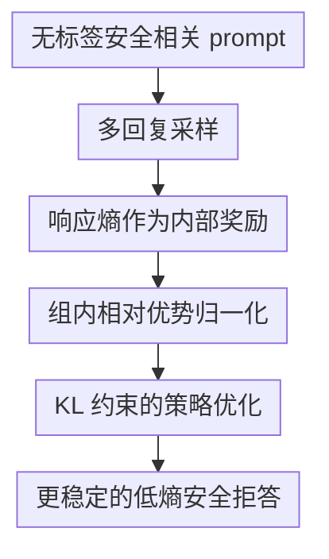

# Safety Instincts: LLMs Learn to Trust Their Internal Compass for Self-Defense

**会议**: ICLR 2026  
**OpenReview**: [https://openreview.net/forum?id=LUiqtv6vrd](https://openreview.net/forum?id=LUiqtv6vrd)  
**代码**: 待发布  
**领域**: LLM安全 / 自对齐 / Jailbreak防御  
**关键词**: LLM安全, 自对齐, 响应熵, Jailbreak防御, 强化学习  

## 一句话总结

这篇论文发现安全对齐模型在拒绝有害请求时天然更低熵、更自信，并提出 SIRL 用响应熵本身作为内部奖励，让模型在无需人工标注、奖励模型或外部安全判别器的情况下强化自己的安全拒答倾向，同时基本保留数学、代码和对话能力。

## 研究背景与动机

**领域现状**：LLM 的安全对齐通常依赖外部信号：人工写安全回复做 SFT，用偏好对做 DPO，训练 reward model 做 RLHF，或者在推理时加检测器、过滤器、提示词防护。它们能提升防御成功率，但共同前提是有人或某个外部系统能可靠判断什么是安全、什么是危险。

**现有痛点**：安全判断恰恰很难被做成稳定标签。越狱攻击会换表达、换语境、换多轮策略，静态规则很容易漏；人工标注昂贵且难覆盖长尾风险；奖励模型也可能被攻击样式和训练分布限制。于是安全训练面临一个尴尬局面：最需要泛化的地方，反而最缺可泛化的监督信号。

**核心矛盾**：作者抓住的矛盾是，外部安全验证器不可靠，但已对齐模型内部可能并不是“什么都不知道”。如果模型在面对危险请求时已经学过大量拒绝模式，那么它生成拒绝时的分布应该更集中；相反，当越狱提示诱导它说出危险内容时，模型内部会在安全习惯和攻击指令之间拉扯，输出分布会更不确定。

**本文目标**：论文要回答两个问题。第一，已对齐 LLM 是否真的存在可观测的内部安全信号，能够区分安全拒绝和危险遵从？第二，如果这个信号可靠，能不能把它转成训练奖励，让模型自我强化安全行为，而不是继续依赖人类标注或外部 reward model？

**切入角度**：作者选择响应熵作为切入口。熵不是额外训练出来的分类器，而是模型生成每个 token 时自然给出的分布不确定性。论文的关键经验发现是：在 jailbreak 场景里，安全拒绝的平均 token 熵显著低于有害回答，这种差距跨 Llama、Qwen 等模型和多种攻击方式都存在。

**核心 idea**：用模型自己的低熵安全拒答作为“内部指南针”，把负响应熵 $-\bar{H}(o|q)$ 变成强化学习奖励，训练模型更信任自己已经学到的安全直觉。

## 方法详解

### 整体框架

SIRL 的流程很直接：给一个已对齐参考模型和一批无标签 prompt，让当前模型对每个 prompt 采样多条回复；对每条回复计算平均 token 熵；把低熵回复视为更值得学习的候选；再用 group relative policy optimization 更新策略。由于作者前面证明低熵候选大多对应安全拒绝，训练就会把“自信拒绝危险请求”的生成模式不断放大。

这个方法最重要的地方不在于重新定义安全规则，而在于把安全规则的来源从外部判别器移回模型内部。训练数据只需要 prompt，不需要安全标签、不需要人工写好的拒绝回复，也不需要偏好对。

### 关键设计

**1. 响应熵作为内部奖励：把模型的安全自信变成训练信号**

传统安全 RL 的奖励来自外部：人类偏好、规则检测器或 reward model。SIRL 反过来问：如果模型面对危险请求时已经更“确信”应该拒绝，能不能直接奖励这种确信？论文先定义回复 $o=(o_1,o_2,\ldots,o_T)$ 在 query $q$ 下的平均 token 熵：$\bar{H}(o|q)=\frac{1}{T}\sum_{t=1}^{T}H(o_t|q,o_{<t})$，其中 $H(o_t|q,o_{<t})=-\sum_{v\in V}P(v|q,o_{<t})\log P(v|q,o_{<t})$。熵越低，说明模型对下一个 token 的分布越集中，也就是越自信。

SIRL 的奖励就是 $r_i=-\bar{H}(o_i|q)$。这个负号很关键：低熵回复得到高奖励，高熵回复得到低奖励。作者的动机不是简单追求流畅，而是利用他们在第 3 节观察到的 safety-confidence gap：有害输出通常伴随更高熵，因为模型内部安全拒绝模式和攻击诱导的遵从模式发生冲突；安全拒绝则更接近训练中反复强化过的稳定模板，因此分布更尖锐。

**2. 组内相对比较：避免不同 prompt 的熵尺度把训练信号冲散**

直接比较不同 prompt 的绝对熵并不稳。有些 prompt 本来就长、有些回复形式更复杂，有些模型对特定话题天然更不确定。SIRL 因此不是把所有回复的熵放在一个全局池里排序，而是对每个 prompt 采样 $G$ 条回复，只在同一个 prompt 的候选回复内部做相对比较。

具体来说，对第 $i$ 条回复计算奖励 $r_i$ 后，优势写成 $\hat{A}_i=\frac{r_i-\mathrm{mean}(\{r_1,\ldots,r_G\})}{\mathrm{std}(\{r_1,\ldots,r_G\})}$。这样，一个 prompt 下“比同组候选更低熵”的回复会得到正优势，“比同组候选更摇摆”的回复会得到负优势。这个设计把训练目标从“所有场景都必须低到某个固定熵值”改成“在同一请求下更偏向模型自己最确信的回答”，更符合安全拒答的相对选择过程。

**3. KL 约束的策略优化：强化安全直觉而不是把模型推成只会拒绝**

只奖励低熵有一个潜在风险：模型可能学到过度保守的短拒绝，甚至对无害问题也减少探索。SIRL 用 PPO/GRPO 风格的 clipped objective 加 KL 约束，控制新策略不要偏离参考模型太远。论文里的目标包含重要性采样比率 $c_{i,t}(\theta)=\frac{\pi_\theta(o_{i,t}|q,o_{i,<t})}{\pi_{\theta_{old}}(o_{i,t}|q,o_{i,<t})}$，并用 $\mathrm{clip}(c_{i,t}(\theta),1-\epsilon,1+\epsilon)$ 限制单步更新幅度。

KL 项 $\beta D_{KL}(\pi_\theta\|\pi_{ref})$ 的作用是把 SIRL 约束在“增强已有安全倾向”这个范围内，而不是让模型为了最低熵牺牲通用能力。实验中作者也观察到训练过久会让模型更保守，因此主结果选择了约 30 step 的中间训练点，这个细节说明 SIRL 不是无条件越训越好，而是需要在安全增强和能力保持之间停在合适位置。

**4. 自强化循环：从偶然低熵拒绝变成稳定安全分布**

SIRL 和推理时 Best-of-N 的区别在这里最明显。Best-of-N 只是在每次推理临时采样很多回复，再挑最低熵的一条；模型本身的分布没有改变，成本还随 $N$ 线性增加。SIRL 则把低熵候选写回参数里，让下一轮模型更容易直接生成这类回复。

这个循环会逐步放大安全拒绝模式：低熵拒绝得到正优势，策略更新后拒绝模式概率升高；下一轮采样时这类回复更常出现且更低熵，于是奖励信号更清晰。论文称之为让模型“trust their internal compass”。它并不是让模型凭空学会安全，而是把初始对齐阶段已经形成的安全知识，从一个可被越狱扰动的倾向，强化成更稳定的行为分布。

### 一个完整示例

假设输入是一个危险请求，攻击提示试图让模型以角色扮演方式给出有害步骤。当前模型对这个 prompt 采样 4 条回复：第一条是简短拒绝，平均熵 $0.5$；第二条先拒绝再给安全替代建议，平均熵 $0.7$；第三条被攻击诱导，开始组织具体危险步骤，平均熵 $1.4$；第四条语气犹豫，在拒绝和解释之间来回摆动，平均熵 $1.1$。

SIRL 不需要知道哪条“被人工标为安全”。它只把奖励设成负熵，于是第一、第二条在组内得到更高相对优势，第三、第四条被压低。经过策略更新，模型下次遇到类似攻击时更倾向于直接进入低熵拒绝模式，而不是沿着攻击者给出的危险叙事继续生成。这个例子也解释了为什么 SIRL 能泛化到未见过的攻击模板：它优化的不是某个模板关键词，而是模型面对有害意图时内部更稳定的拒绝分布。

### 损失函数 / 训练策略

训练使用 unlabeled PKU-SafeRLHF prompts，不使用其中的回复标注或偏好标签。实验配置中每个 prompt 采样 $G=4$ 条回复，temperature 为 $1.0$，最大 prompt 长度 $1024$，最大 completion 长度 $3072$，batch size 为 $512$。优化器为 AdamW，学习率 $1\times10^{-6}$，KL 系数 $\beta=0.001$，clip ratio $\epsilon=0.2$，训练框架为 veRL。

论文报告所有主结果来自训练约 30 step 的模型。这个选择很重要：训练动态显示 SIRL 的 DSR 会快速上升，响应熵单调下降，但安全接近饱和后，模型可能开始对少量无害数学问题更保守。早停和 KL 正则共同保证方法不是单纯把熵压到最低，而是在可部署的安全-能力平衡点停止。

## 实验关键数据

### 主实验

作者在 Llama-3.1-8B-Instruct、Llama-3.2-3B-Instruct、Qwen2.5-3B-Instruct、Qwen2.5-7B-Instruct，以及无安全数据训练的 Llama-3.1-Tulu-8B-Instruct 上评估。安全指标主要是 JailbreakBench 上 20 类 jailbreak 攻击的 Defense Success Rate（DSR），能力指标覆盖 BBH、AlpacaEval、MATH-500、AMC、HumanEval、LiveCodeBench、ToxiGen 和 TruthfulQA。

| 模型 | 方法 | JBB DSR | MATH-500 | HumanEval | LiveCodeBench | TruthfulQA | 观察 |
|------|------|---------|----------|-----------|---------------|------------|------|
| Llama-3.1-8B-Instruct | Baseline | 84.3 | 49.0 | 59.1 | 19.0 | 54.1 | 安全已有基础，但对强 jailbreak 仍不稳 |
| Llama-3.1-8B-Instruct | SIRL | 99.1 | 51.2 | 61.0 | 19.4 | 54.6 | DSR 大幅提升，能力略升或持平 |
| Llama-3.2-3B-Instruct | Baseline | 95.6 | 42.2 | 45.1 | 13.7 | 49.7 | 小模型初始 DSR 较高 |
| Llama-3.2-3B-Instruct | SIRL | 100.0 | 41.4 | 45.1 | 13.9 | 50.8 | 达到满分 DSR，通用能力基本保持 |
| Qwen2.5-3B-Instruct | Baseline | 84.7 | 66.3 | 51.8 | 19.4 | 58.8 | 数学能力强，安全仍可提升 |
| Qwen2.5-3B-Instruct | SIRL | 98.7 | 66.4 | 53.0 | 22.5 | 58.4 | 安全提升同时代码/AMC 提升 |
| Qwen2.5-7B-Instruct | Baseline | 82.8 | 77.6 | 69.5 | 35.2 | 64.8 | 大模型能力强但攻击下 DSR 较低 |
| Qwen2.5-7B-Instruct | SIRL | 99.9 | 78.6 | 70.3 | 38.6 | 65.7 | DSR 接近满分，能力保持或改善 |

和 SFT、DPO、RLHF 相比，SIRL 的一个强结论是监督成本低。SFT 使用人工安全回复后经常损伤能力，例如 Llama-3.1-8B 的 AlpacaEval 从 $50.0$ 掉到 $19.1$，Qwen2.5-7B 的 MATH-500 从 $77.6$ 掉到 $31.8$。DPO 和 RLHF 安全提升也明显，但需要偏好对或 reward model；SIRL 只用 15k/20k 级别无标签 prompt，就能达到相近甚至更高的 DSR。

| 评估场景 | Baseline | SIRL | 提升 / 结论 |
|----------|----------|------|-------------|
| Qwen2.5-7B，20 类 jailbreak 平均 DSR | 约 82.8 | 99.6/99.9 | 对静态、模板、语义和优化攻击都更稳 |
| RandomSearch 最难攻击 | 部分方法低至 37 左右 | 多数模型 71-100 | 对自适应搜索攻击仍保持高防御率 |
| GCG 自动攻击，Llama-3.1-8B | 58 | 100 | 对白盒梯度后缀攻击显著增强 |
| PAIR 自动攻击，Llama-3.1-8B | 60 | 100 | 对语义迭代攻击也有效 |
| MHJ-DERTA 多轮攻击，Llama-3.2-3B | 63.2 | 92.3 | 多轮对话里仍能维持拒绝 |
| HarmBench，Llama-3.2-3B | 91 | 99 | 标准 harmful prompt 集合上泛化良好 |

### 消融实验

| 配置 | JBB DSR / 关键指标 | 说明 |
|------|-------------------|------|
| Llama-3.1-8B Baseline | 84.3 DSR | 原始指令模型，已有一定拒绝能力 |
| +neg-SIRL | 72.1 DSR | 反过来奖励高熵，安全和能力都下降，说明高熵确实更接近不稳/有害输出 |
| +Random reward | 85.2 DSR | 随机奖励几乎无效，排除“随便 RL 一下就变安全”的解释 |
| +min. PPL | 98.7 DSR | 困惑度最小化也有强效果，说明 confidence-based signals 是关键族群 |
| +SIRL | 99.1 DSR | 熵奖励略优且解释性更直接 |
| BoN $N=16$，Llama-3.1-8B | 约 93.2 DSR | 推理时挑低熵候选有帮助，但成本高、效果不如训练 |
| SIRL，Llama-3.1-8B | 99.1 DSR | 单次生成即可获得更高 DSR，说明训练改变了分布 |

过拒绝实验也比较关键。OR-Bench/XSTest 显示 SIRL 会提高 unsafe prompt 的拒绝率，同时 safe prompt 的拒绝率没有失控。例如 Qwen2.5-7B 在 OR-Bench 上 safe refusal 从 baseline $21.4$ 上升到 $47.2$，确实更保守，但 unsafe refusal 也从 $92.4$ 到 $98.7$；相比 RLHF 的 safe refusal $51.9$，SIRL 还略低。XSTest 上 Qwen2.5-7B 的 safe refusal 为 $6.0$，unsafe refusal 为 $85.0$，说明在更细粒度的安全/非安全对照里没有变成无差别拒绝器。

### 关键发现

- 响应熵和安全拒绝之间存在稳定统计差距。四个模型上，safe 与 harmful 的平均熵差从 $0.365$ 到 $0.684$ 不等，Mann-Whitney 检验均为 $p<0.001$，Cohen's $d$ 达到中到大效应量。
- token 级分析显示，Risk Articulation token 的熵最低，General token 居中，Compliance Signals 的熵最高。这说明模型对“我不能帮助做危险事”这类安全语言更自信，而对危险遵从语句更不稳定。
- SIRL 的收益不是简单来自采样选择。Best-of-N 需要 $16\times$ 推理成本才接近，但仍低于 SIRL；SIRL 是训练时重塑分布，部署时无需额外多采样。
- 方法可以扩展到不同代际和规模。论文附录报告 Llama-2-7B-Chat、Vicuna-7B-v1.5、Qwen2.5-14B-Instruct 上也有显著提升，其中 Qwen2.5-14B 的 DSR 从 $84.2$ 到 $99.7$，同时 MATH-500 从 $80.2$ 到 $82.0$。

## 亮点与洞察

- 最大亮点是把“安全信号难标注”转成“模型内部是否已经有可读出的安全信号”。这比继续堆外部 judge 更有意思，因为它把安全训练的瓶颈从数据标注转向了内部表征和生成分布的利用。
- 响应熵这个指标很朴素，却有行为层面的可解释性。低熵拒绝不是神秘特征，而是模型在安全训练中反复见过、分布已经收敛的拒绝模式；高熵有害输出则反映攻击指令和安全倾向之间的冲突。
- SIRL 给自对齐提供了一个轻量版本：不要求模型生成原则、不要求另一个模型投票，也不要求可验证答案。只要初始模型已经有一点安全直觉，就可以用无标签 prompt 做自我放大。
- 这类思路可以迁移到其他“外部标签难但模型内部信号可能可靠”的任务。例如隐私泄露检测、医学高风险回答、法律建议过度自信控制，都可以探索置信度、熵、log-prob margin 等内部信号是否与正确行为相关。

## 局限与展望

- SIRL 依赖初始模型已经有可用的安全直觉。如果一个 base model 完全没有拒绝习惯，低熵输出可能只是低熵地遵从危险请求，负熵奖励反而会强化坏行为。论文在 Tulu 和 Vicuna 上显示弱安全基础也能提升，但不是零基础保证。
- 熵不是安全的充分条件。低熵可能来自模板化、短答、模型偏见或训练集熟悉度，不一定总是安全。论文用多种实验支持“在已对齐模型的 jailbreak 场景里低熵大多对应拒绝”，但换到别的任务或语言环境还需要重新验证。
- 过度保守仍是实际风险。训练动态显示安全饱和后，模型会偶尔拒绝 benign math questions；OR-Bench 上部分 safe refusal 也明显上升。部署时需要早停、KL、混合能力数据或安全/有用性双目标来控制。
- 攻击者未来可能专门针对低熵拒绝机制设计 prompt，例如诱导模型生成低熵但有害的固定模板，或攻击 entropy reward 的采样阶段。后续可以研究 adversarial entropy shaping、跨语言攻击、多轮长期状态下的熵信号稳定性。
- 论文主要关注文本 LLM 的 jailbreak 防御。多模态模型、工具调用 agent、长期记忆系统里的安全风险更复杂，内部置信度是否仍能稳定映射到安全行为，还需要额外实验。

## 相关工作与启发

- **vs RLHF / Safe-RLHF**: RLHF 通过外部 reward model 学习人类偏好或安全约束，SIRL 不训练 reward model，而是直接用模型生成分布的平均熵当内部奖励。优势是监督成本低、部署链路短；劣势是奖励语义更间接，必须依赖 entropy-safety correlation 成立。
- **vs DPO / preference optimization**: DPO 把偏好对转成无显式 reward model 的优化目标，但仍需要 chosen/rejected 数据。SIRL 连偏好对也不需要，只需 prompt 和多回复采样；不过 DPO 的偏好语义更明确，SIRL 的安全含义来自统计发现。
- **vs representation engineering / safety neurons**: 表征干预方法直接找隐藏空间中的安全方向或安全神经元，SIRL 不改推理时激活，而是用可观测的生成熵训练参数。它们可以互补：隐藏空间信号可用于解释安全知识在哪里，熵信号可用于低成本训练。
- **vs Best-of-N / inference-time filtering**: BoN 也能利用低熵候选，但每次推理要采样多条回复，成本高且不改变模型本身。SIRL 把选择偏好蒸进模型参数，单次生成就能受益。
- **vs Constitutional AI / self-alignment**: Constitutional AI 仍需要人写原则或模型按原则生成偏好，SIRL 更像无原则文本的自强化。启发是：自对齐不一定总要显式“反思”，也可以来自模型内部概率结构的可利用偏差。

## 评分

- 新颖性: ⭐⭐⭐⭐⭐ 用响应熵作为 LLM 安全自强化奖励很简洁，且把内部安全信号和 RL 对齐连起来，想法有辨识度。
- 实验充分度: ⭐⭐⭐⭐⭐ 覆盖多模型、20 类 jailbreak、自动攻击、多轮攻击、HarmBench、过拒绝、消融和训练动态，证据链比较完整。
- 写作质量: ⭐⭐⭐⭐ 动机和主线清楚，图表丰富；但部分地方对“低熵为什么一定对应安全”的边界讨论还可以更克制。
- 价值: ⭐⭐⭐⭐⭐ 如果结论在更大模型和多语言场景继续成立，SIRL 是一种很有实用潜力的低标注安全增强方案。

<!-- RELATED:START -->

## 相关论文

- [\[ICLR 2026\] Spilling the Beans: Teaching LLMs to Self-Report Their Hidden Objectives](spilling_the_beans_teaching_llms_to_self-report_their_hidden_objectives.md)
- [\[ICLR 2026\] Trust The Typical：把 LLM 安全护栏当作分布外检测来做](trust_the_typical.md)
- [\[ACL 2026\] When Models Outthink Their Safety: Unveiling and Mitigating Self-Jailbreak in Large Reasoning Models](../../ACL2026/llm_safety/when_models_outthink_their_safety_unveiling_and_mitigating_self-jailbreak_in_lar.md)
- [\[ICLR 2026\] Stop Tracking Me! Proactive Defense Against Attribute Inference Attack in LLMs](stop_tracking_me_proactive_defense_against_attribute_inference_attack_in_llms.md)
- [\[ICLR 2026\] Self-Destructive Language Model](self-destructive_language_model.md)

<!-- RELATED:END -->
