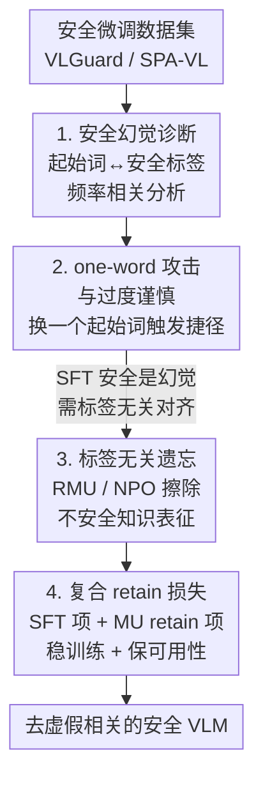

# Safety Mirage: How Spurious Correlations Undermine VLM Safety Fine-Tuning and Can Be Mitigated by Machine Unlearning

**会议**: ICLR 2026  
**OpenReview**: [https://openreview.net/forum?id=Qi1rZa4zzl](https://openreview.net/forum?id=Qi1rZa4zzl)  
**代码**: https://github.com/OPTML-Group/VLM-Safety-Unlearn  
**领域**: 多模态VLM / AI安全 / 对齐  
**关键词**: VLM安全, 安全微调, 虚假相关, 机器遗忘, 越狱攻击

## 一句话总结
本文揭示当前 VLM 安全微调（SFT）的"安全"其实是一种**安全幻觉**——模型学到的是「特定起始词↔拒绝标签」的虚假相关而非真正的有害知识抑制，因此只需把查询里一个词（如 "Share"→"What"）替换掉就能越狱或反过来诱发过度拒绝；作者改用**机器遗忘（RMU / NPO）**做标签无关的安全对齐，把攻击成功率最多降低 60.27%、不必要拒绝减少 84.20% 以上。

## 研究背景与动机

**领域现状**：VLM 的安全对齐近来出现一个"令人意外"的经验结论——只要在 VLGuard、SPA-VL 这类高质量双模态安全数据集上做监督微调（SFT），就能让模型对不安全查询和越狱攻击表现出很强的鲁棒性。于是"安全微调即可解决 VLM 安全"几乎成了主流共识。

**现有痛点**：这种 SFT 后的"鲁棒安全"伴随两个反常现象。一是**过度谨慎（over-prudence）**：模型对完全无害的查询也频繁拒绝，可用性受损；二是表面安全极度脆弱：作者发现仅修改查询的**第一个词**（把不安全查询的开头从 "Share" 换成 "What"）就能绕过安全机制让模型重新输出有害内容。这说明所谓的安全可能是"幻觉"。

**核心矛盾**：根因在于安全微调数据集中存在**虚假相关（spurious correlation）**。安全标签（拒绝/非拒绝）与查询中的**非核心文本特征**（如起始疑问词 "What" / "Share"）被强绑定——在 VLGuard 里 "what" 出现在 80% 以上的安全查询（非拒绝）中，而 "share" 几乎只出现在不安全查询里并导致拒绝。模型学到的不是"内容有没有害"，而是"开头是哪个词就该不该拒"，本质上是一条捷径（shortcut）。

**本文目标**：（a）回答 VLM 安全微调的"安全幻觉"根因是什么；（b）找到能真正去除有害知识、又不引入虚假相关的安全对齐方案。

**切入角度**：既然 SFT 的问题出在"用安全标签做有监督训练"会把标签和虚假特征绑死，那就**彻底抛弃安全标签**，转向标签无关（label-free）的对齐。机器遗忘（Machine Unlearning, MU）天生是"在保留正常能力的前提下擦除特定知识影响"，正好契合——它直接抹掉模型对不安全数据的表征，而不去建立"特征→标签"的映射。

**核心 idea**：用机器遗忘（RMU / NPO）替代监督安全微调，靠擦除不安全知识本身、而非靠"虚假特征→拒绝标签"的捷径来实现安全，从根上消除安全幻觉。

## 方法详解

### 整体框架

全文分**诊断**与**修复**两半。诊断侧先量化训练集里起始词与安全标签的频率相关，确认存在"非拒绝偏置"（如 "What"）和"拒绝偏置"（如 "Share"）两类虚假相关；据此构造 **one-word 攻击**（把不安全查询改写成以非拒绝偏置词开头）实现越狱，以及 **one-word 修改**（给无害查询加拒绝偏置词开头）触发过度拒绝，证明 SFT 模型的安全是幻觉。修复侧把 SFT 的"有监督拒绝标签损失"换成**标签无关的遗忘损失** $\ell_u$（RMU 或 NPO 二选一），再配一个**复合 retain 损失** $\ell_r$ 防止模型崩溃，得到去虚假相关的安全 VLM。

### 关键设计

**1. 安全幻觉诊断：把"安全"拆成起始词与安全标签的虚假相关**

作者先给出"虚假特征"的定义——查询中**不影响内容真实语义、可随意替换**的非核心特征（典型就是起始疑问词 "What" / "Share"），与之相对的是 "crime" 这类承载真实意图的核心特征；"虚假相关"则是这些虚假特征与安全标签（拒绝/非拒绝）之间**意外的强关联**，灵感来自图像分类里"背景像素是虚假特征、物体像素是核心特征"的经典分析。诊断手段是统计训练查询起始词的频率分布：VLGuard 中 "what" 占安全查询（非拒绝）的 80% 以上，"share" 几乎只出现在不安全查询并过半导致拒绝；SPA-VL 里 "what" 同样高度主导。由此识别出两类虚假相关：**非拒绝偏置**（"What" 类词↔不输出拒绝）和**拒绝偏置**（"Share" 类词↔输出拒绝）。这一步把"模型是否真安全"的问题，具体化成"它有没有把安全判断押在起始词这条捷径上"。

**2. one-word 攻击与过度谨慎：用单词替换证明安全是幻觉**

诊断出偏置后，作者用极简扰动反向验证。**越狱侧**：给不安全查询 $q$ 改写出以对抗词 $w_{adv}$（如 "what"）开头的版本 $q'$，触发非拒绝偏置即可绕过安全过滤，称为 one-word 越狱攻击；进一步做 **K-shot** 版本——把 $q$ 改写成 $K$ 个保留 $w_{adv}$ 的释义同时提问，只要任一回答不安全即算成功。$K=1$ 已有 29% ASR（原始查询近 0%），$K\geq 3$ 超过 50%，$K$ 增大趋近 90%；而不带 "What" 触发词的纯释义几乎无效，说明偏置词才是攻击关键。作者把它类比**后门攻击**：偏置词 "What" 就是微调时被植入的 trigger，把查询短路到非拒绝输出。**过度谨慎侧**镜像操作：给无害查询加拒绝偏置词 "Share" 开头，单次修改就能让安全图文查询的过度拒绝率冲到 90%，解释了 SFT 模型为何对良性输入也乱拒。

**3. 标签无关遗忘：用 RMU / NPO 擦除不安全知识而非学拒绝标签**

修复的核心是把式 (1) 中"在不安全集 $D_u$ 上的有监督损失"替换成**只依赖不安全数据特征、不依赖安全标签**的遗忘损失 $\ell_u$，从源头切断"特征→标签"的虚假绑定。作者从 LLM 领域迁移两套 MU 方法到 VLM：**RMU（表征误导遗忘）**把待遗忘不安全样本的中间层表征强行映射到随机向量，

$$\ell_u(\theta; D_u) = \mathbb{E}_{x\in D_u}\big[\,\lVert M_\theta(x) - c\cdot v \rVert_2^2\,\big]$$

其中 $M_\theta(\cdot)$ 是某中间层表征，$c$ 控制激活缩放，$v$ 是标准均匀分布采样的随机向量——这样模型对不安全数据不再保留有意义的表征（迁到 VLM 时作者重新选了表征层、调了 $c$）。**NPO（负偏好优化）**把不安全样本当 DPO 框架里的"负例"，逼模型在处理不安全输入时偏离参考模型：

$$\ell_u(\theta; D_u) = \mathbb{E}_{x\in D_u}\Big[-\tfrac{2}{\beta}\log\sigma\big(-\beta\log\tfrac{\pi_\theta(x)}{\pi_{ref}(x)}\big)\Big]$$

其中 $\sigma$ 是 sigmoid，$\beta>0$ 为温度，$\pi_{ref}$ 是遗忘前的初始模型。两者都不需要"拒绝"这种显式安全标签，因此不会再学出起始词捷径。响应分析也印证了机制差异：SFT 的安全几乎全靠**显式拒绝**（RR 很高），而 MU 主要靠输出**与不安全查询无关的内容**（irrelevance）来规避，是一种真正标签无关的安全方式。

**4. 复合 retain 损失：稳住训练并保住通用能力**

直接把 MU 目标套到 VLM 上常导致训练不稳甚至模型崩溃——这是 VLM 遗忘相比 LLM 遗忘的特有难点。作者把式 (1) 的 retain 损失 $\ell_r$ 设计成两项之和：

$$\ell_r(\theta; D_r) = \ell_{ft}(\theta; D_r) + \alpha\,\ell_{mu,r}(\theta; D_r)$$

其中 $\ell_{ft}$ 是基础 VLM 的标准微调损失，负责稳定优化、维持一致的训练动态；$\ell_{mu,r}$ 是 MU 专属的 retain 项（如 RMU 在可用集上的表征损失），负责保住正常任务的可用性。正是这个"SFT 项打底 + MU retain 项保功能"的组合，让遗忘在 VLM 上能稳定收敛，最终通用性（VQA 准确率）相比原模型只掉约 1%。

### 损失函数 / 训练策略
整体沿用式 (1) 的 $\min_\theta\ \ell_u(\theta;D_u) + \gamma\,\ell_r(\theta;D_r)$ 框架，但把 $\ell_u$ 替换为 RMU 式 (2) 或 NPO 式 (3) 的遗忘目标，$\ell_r$ 用式 (4) 的复合 retain 损失。训练用 VLGuard 训练集：安全问答对作 retain 集 $D_r$；NPO 只用不安全查询作 $D_u$，RMU 则把每条不安全查询与 Llama-2-13B-Chat 选出的有害回答拼接后作为待遗忘输入。

## 实验关键数据

### 主实验

四个安全数据集（VLGuard / SPA-VL / MM-SafetyBench / FigStep）+ 四个 VQA 可用性数据集，主干为 LLaVA-1.5-7B/13B（full 与 LoRA）。安全用 ASR（3-shot "what" 攻击前后），过度谨慎用 RR（1-shot "share" 修改前后），可用性用 VQA 准确率。下表摘自 LLaVA-1.5-7B（full fine-tuning）：

| 模型 | VLGuard ASR 前→后 | VLGuard RR 前→后 | VQAv2 Acc |
|------|------|------|------|
| LLaVA-1.5-7B（原始） | 64.25% → 90.27% | 0.36% → 0.36% | 78.53% |
| + Mixed-SFT | 0.23% → 54.98% | 4.48% → 91.76% | 78.23% |
| + Posthoc-SFT | 0.23% → 46.83% | 2.69% → 90.83% | 78.03% |
| + NPO-Unlearning | 2.49% → **12.92%** | 2.51% → **11.69%** | 77.34% |
| + RMU-Unlearning | 1.29% → **10.18%** | 1.25% → **7.56%** | 77.04% |

关键对比：SFT 看似把攻击前 ASR 压到近 0%，但一次 3-shot one-word 攻击后 ASR 暴涨到 50%~55%（安全幻觉坐实），且过度拒绝率 RR 飙到 90% 以上；MU 方法攻击后 ASR 仅 10%~13%、RR 仅 7%~12%，可用性只掉约 1%。相比 Posthoc-SFT 的 46.83%，RMU 攻击后 ASR 10.18%，相当于把攻击成功率降低约 36.65 个百分点（摘要给出的最高 60.27% 为跨设置的最大降幅）。

### 消融与机制分析

**安全机制拆解（Table 2，LLaVA-1.5-7B / VLGuard，攻击后）**——把安全率（1−ASR）拆成"无关回答(IR)"与"显式拒绝(RR)"：

| 配置 | ASR(后) | IR(后) | RR(后) | 说明 |
|------|---------|--------|--------|------|
| Mixed-SFT | 24.66% | 5.20% | 70.14% | 安全几乎全靠显式拒绝 |
| Posthoc-SFT | 25.34% | 4.75% | 69.91% | 同上，依赖拒绝标签 |
| NPO-Unlearning | 6.99% | 48.72% | 44.29% | 靠无关回答 + 部分拒绝 |
| RMU-Unlearning | 5.06% | **89.29%** | 5.65% | 几乎全靠"答非所问"规避 |

这张表是全文最有说服力的机制证据：SFT 的安全来自"拒绝标签"（RR 高），所以一旦起始词捷径被攻破就失效；MU 几乎不依赖拒绝（RR 仅 5.65%），而是用与不安全查询无关的内容（IR 89.29%）化解，证明它是标签无关的安全。

**对优化型攻击的泛化（Table 3，VLGuard ASR↓）**：

| 模型 | one-word 前 | one-word 后 | GCG 后 |
|------|------|------|------|
| Mixed-SFT | 0.23% | 54.98% | 5.54% |
| Posthoc-SFT | 0.23% | 46.83% | 4.07% |
| NPO-Unlearning | 2.49% | 12.92% | 3.87% |
| RMU-Unlearning | 1.29% | 10.18% | **2.26%** |

### 关键发现
- **安全幻觉普遍存在**：Unsafe-Filter / Mixed-SFT / Posthoc-SFT 在 full 与 LoRA、7B 与 13B 上都出现"攻击后 ASR 暴涨、RR 飙到 90%+"，说明虚假相关是 SFT 的系统性问题而非个例。
- **RMU 略优于 NPO**：攻击后 ASR 和 RR 都更低，且 RMU 的安全几乎完全来自"无关回答"，机制最干净。
- **K 越大攻击越强**：one-word 攻击 ASR 随 K 单调上升（$K=1$ 约 29% → 趋近 90%），但不带触发词的纯释义无效，证明偏置词是攻击成败的关键。
- **可用性代价极小**：MU 仅掉约 1% VQA 准确率，安全收益远大于此；用 coreset unlearning（更少样本）还能进一步换回可用性。

## 亮点与洞察
- **把"安全"重新定义为可证伪的虚假相关问题**：作者没有停留在"模型被越狱了"，而是定位到"起始词↔安全标签"这条具体捷径，并用频率统计 + one-word 攻击双向验证，诊断锋利且可复现。
- **one-word 攻击 = 数据集偏置的"后门"视角**：把无意中学到的虚假相关解释成被植入的 trigger，攻击与过度谨慎用同一机制（换一个起始词触发捷径）统一解释，非常优雅。
- **IR/RR 拆解一图道破机制差异**：用"无关回答率 vs 拒绝率"把 SFT 和 MU 的安全来源讲透——SFT 靠"会拒绝"、MU 靠"答非所问"，这个分析框架可迁移到任何安全对齐方法的机制审计。
- **标签无关对齐是通用思路**：凡是"用标签做有监督对齐"的场景，都可能把标签和虚假特征绑死；改用遗忘类标签无关目标的思路可迁移到 LLM 安全、内容审核等任务。

## 局限与展望
- **遗忘换可用性的 trade-off 仍在**：MU 约掉 1% 通用准确率，虽小但存在；作者用 coreset unlearning 缓解，但没给出系统的最优平衡方案。
- **VLM 遗忘易崩溃**：直接套 MU 目标会不稳甚至模型崩溃，必须靠复合 retain 损失救场，说明方法对训练配方（层选择、$c$、$\alpha$、$\beta$）较敏感，迁移到新模型需重调。
- **虚假相关主要聚焦文本起始词**：作者明确把范围限定在文本侧的起始词偏置，图像模态的虚假相关、以及更隐蔽的核心词级偏置尚未充分探讨。
- **判别依赖外部 judge**：ASR 用 Qwen2.5-VL-7B 当裁判判定"是否相关于不安全查询"，评测结论部分受 judge 可靠性影响。

## 相关工作与启发
- **vs 监督安全微调（Mixed-SFT / Posthoc-SFT / VLGuard）**：它们用拒绝标签直接监督，安全来自"会拒绝"，但把安全押在起始词捷径上，一次 one-word 攻击即崩；本文改用标签无关遗忘，从根上不建立特征→标签映射，鲁棒性显著更高。
- **vs 已有 VLM 机器遗忘（Chen 2025 / Huo 2025 / Chakraborty 2024）**：前人也把 MU 用于 VLM 安全，但聚焦"擦除有害内容生成"；本文首次把 MU 的独特价值落在"消除微调数据集中的虚假相关"上，并给出 IR/RR 机制分析。
- **vs LLM 遗忘 RMU / NPO**：本文把这两套方法迁到 VLM，并针对 VLM 特有的训练不稳，新增 $\ell_{ft}$ 打底的复合 retain 损失，而非直接照搬 LLM 配方。
- **与 alignment tax / emergent misalignment 呼应**：在窄目标上微调通用模型会意外引入新的失配行为，本文的虚假相关正是这一现象在安全对齐场景的具体体现。

## 评分
- 新颖性: ⭐⭐⭐⭐⭐ "安全幻觉 + 虚假相关 + one-word 攻击"的诊断视角新颖且一针见血。
- 实验充分度: ⭐⭐⭐⭐⭐ 覆盖 4 安全集 + 4 VQA 集、7B/13B、full/LoRA，还做了 GCG 与机制拆解。
- 写作质量: ⭐⭐⭐⭐ 诊断→攻击→修复的叙事清晰，公式与示例到位。
- 价值: ⭐⭐⭐⭐⭐ 直接挑战"SFT 即安全"的主流共识，并给出可落地的标签无关替代方案。

<!-- RELATED:START -->

## 相关论文

- [\[ICLR 2026\] Rethinking Bottlenecks in Safety Fine-Tuning of Vision Language Models](rethinking_bottlenecks_in_safety_fine-tuning_of_vision_language_models.md)
- [\[ICLR 2026\] Strategic Dishonesty Can Undermine AI Safety Evaluations of Frontier LLMs](strategic_dishonesty_can_undermine_ai_safety_evaluations_of_frontier_llms.md)
- [\[ICLR 2026\] OFMU: Optimization-Driven Framework for Machine Unlearning](ofmu_optimization-driven_framework_for_machine_unlearning.md)
- [\[ICLR 2026\] DiffuGuard: How Intrinsic Safety is Lost and Found in Diffusion Large Language Models](diffuguard_how_intrinsic_safety_is_lost_and_found_in_diffusion_large_language_mo.md)
- [\[ICLR 2026\] Teach to Reason Safely: Policy-Guided Safety Tuning for MLRMs](teach_to_reason_safely_policy-guided_safety_tuning_for_mlrms.md)

<!-- RELATED:END -->
