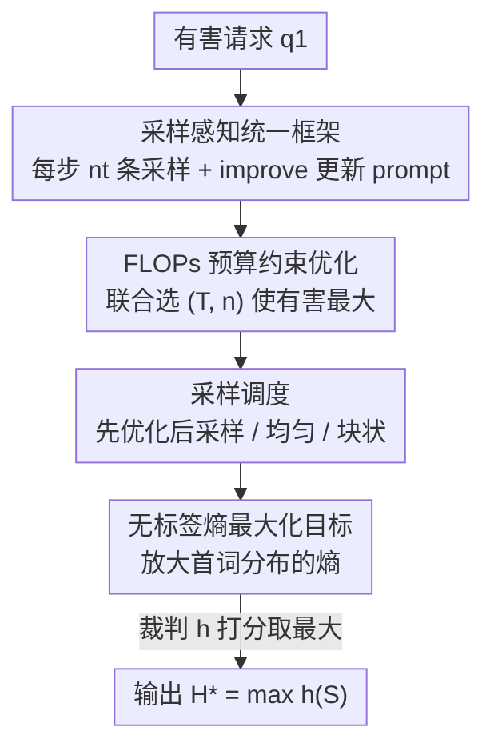

# Sampling-aware Adversarial Attacks against Large Language Models

**会议**: ICLR 2026  
**OpenReview**: [https://openreview.net/forum?id=vBmRQHW7en](https://openreview.net/forum?id=vBmRQHW7en)  
**领域**: AI安全 / LLM对抗攻击  
**关键词**: 对抗攻击, 越狱, 采样, 算力分配, 熵最大化目标

## 一句话总结
本文指出现有 LLM 对抗攻击只看「单点贪心生成」是否有害，系统性低估了模型风险；作者把攻击重新表述为「优化 prompt」与「重复采样输出」之间的算力分配问题，证明把采样当作一等攻击向量后，能在等算力下把攻击成功率提升最多 37 个百分点、把算力开销降低最多两个数量级。

## 研究背景与动机
**领域现状**：评估 LLM 的对抗鲁棒性是安全部署的前提。主流对抗攻击（GCG、AutoDAN、PAIR、BEAST 等）的范式是「优化一个对抗 prompt，让模型对有害请求输出肯定性前缀」，并且几乎都用**单条贪心生成**（temperature 0、一个样本）去判定攻击是否成功。

**现有痛点**：LLM 的生成本质是**随机过程**——同一个 prompt 多采几次，就可能采到一条罕见但极其有害的回答。可现有攻击把绝大部分算力都花在优化上，结尾只采一个样本，于是把「这个 prompt 单点贪心没越狱」直接当成「模型对它鲁棒」。但真实世界里成千上万用户在大规模采样，哪怕单次有害概率很低，长尾风险也会被反复采样放大。这导致现有协议**系统性高估**了模型鲁棒性。

**核心矛盾**：在固定算力预算下，「继续优化 prompt 提高单次有害概率」和「对当前 prompt 多采几条以撞上有害长尾」之间存在 trade-off。脆弱模型几乎不用优化、多采就能越狱；鲁棒模型则需要充分优化后采样才划算。现有方法从不显式地去平衡这两端。

**本文目标**：把采样升级为攻击设计的核心参数，回答两个子问题——(1) 在固定算力下优化与采样该如何分配才最优？(2) 采样为什么这么高效（优化到底改变了有害分布的什么）？

**切入角度**：作者观察到「高风险样本往往在优化早期就能以可观概率被采到」，于是不再死磕「找一个可靠越狱 prompt」，而是借鉴计算机视觉里「刻画最坏情况行为」的鲁棒性传统，把目标改成「用最少资源逼出最大有害」。

**核心 idea**：把对抗攻击重写成「优化步数 $T$ + 每步采样数向量 $n$」的资源分配问题，在固定 FLOPs 预算下联合搜索 $(T,n)$，并据此设计采样调度与一个无需标签的攻击目标。

## 方法详解

### 整体框架
本文提出**采样感知攻击（Sampling-Aware Attack, SAA）**这一统一框架。它把一次攻击看成 $T$ 步迭代：每一步 $t$ 用当前 prompt $q_t$ 采 $n_t$ 条完成（completion），用裁判模型 $h(\cdot)\in[0,1]$ 给每条打有害分，并可选地利用历史 prompt 集合 $Q$ 与样本集合 $S$ 通过 `improve` 生成下一个 prompt $q_{t+1}$；攻击结束后取所有样本中的最大有害分 $H^\star=\max_t h(S_t)$ 作为该次攻击的战果。

关键在于：采样向量 $n=(n_1,\dots,n_T)$ 是一个**显式可调的攻击参数**。现有方法只是它的特例——GCG 设 $n=(0,\dots,0,1)$（只在结尾采一条），Best-of-N 设 $n=(1,\dots,1)$（每步采一条、不做优化），且这些方法都满足 $\max(n)=1$，即从不对同一 prompt 多采。SAA 把整个 $(T,n)$ 空间打开，并在固定算力 $B$ 下求解。

### 关键设计

**1. 采样感知统一框架（SAA）：把采样升格为一等攻击参数**

针对「现有攻击把采样当事后步骤、只在结尾采一条」的痛点，本文用 Algorithm 1 把攻击形式化为对 $(T,n)$ 的迭代过程：第 $t$ 步从 $f_\theta(\cdot\mid q_t)$ 采 $n_t$ 条样本加入 $S$，再由 `improve(Q,S)` 产出新 prompt，最终返回 $H^\star=\max_{t\le T} h(S_t)$。这个抽象的价值在于它**统一并推广**了已有方法：把 $n$ 退化成 $(0,\dots,0,1)$ 就是 GCG 这类纯优化攻击，退化成 $(1,\dots,1)$ 就是 Best-of-N 这类纯采样攻击。作者据此论证，已有算法都困在 $\max(n)=1$ 的角落里、从未利用「对同一 prompt 多采多条」这一维度，而这正是被忽视的高效攻击向量。

**2. FLOPs 预算约束下的算力分配：让不同攻击可公平比较**

只要允许多采、再用 Best-of-$n$ 取最大分，成功率天然会上升，所以必须在**固定算力**下比较才有意义。本文把高效攻击写成约束优化：

$$\max_{n,T}\ \mathrm{SAA}(q,n,T)\quad \text{s.t.}\quad \sum_{t=1}^{T}\Big(C^{\text{opt}}_t+\sum_{k=1}^{n_t}C^{\text{sample}}_{t,k}\Big)\le B$$

其中 $C^{\text{opt}}_t$ 是第 $t$ 步优化代价、$C^{\text{sample}}_{t,k}$ 是单条采样代价，成本精确到单样本级别（以正确计入 prefix-filling 和不同生成长度）。用 FLOPs 而非墙钟时间度量预算，是为了硬件无关、并屏蔽各攻击实现优化程度的差异。这个框架揭示了一个反直觉的事实：**一步优化的算力可比一条采样贵最多两个数量级**（Table 1：GCG 为 92 倍、REINFORCE-GCG 392 倍、PAIR 353 倍），所以把算力从优化挪向采样几乎总是划算的。

**3. 采样调度：用三种实用日程刻画「何时采、采多少」**

直接搜索 $(T,n)$ 的全组合在现实算力下不可行，作者于是限定到三种由总采样预算 $N=\sum n$、步数 $T$ 决定的预设调度：**先优化后采样**（前 $T$ 步只优化、最后一位置设为 $N$，是多数实验默认；现有方法是它「单样本 temperature 0」的特例）、**均匀采样**（每步分 $\lfloor N/T\rfloor$ 条，余数尽量均匀铺开、末步必含）、**块状采样**（在末尾留一个长度 $b$ 的尾块、把样本均分进去）。三者分别对应「集中在末尾吃优化红利」「最大化样本独立性」「折中」三种取舍。实验发现：三种调度在等预算下都远超贪心基线，且彼此差距很小——这说明**多采本身**才是收益来源，至于把样本摊在哪一步反而不太关键。

**4. 无标签熵最大化目标：为采样感知量身设计的攻击损失**

现有目标普遍依赖「肯定性回答前缀」（如 "Sure, here's…"），这种模板对现代模型已经分布外、难优化，且防御方会针对性加固。本文转而提出一个**不依赖任何标签**、模型无关的损失：最大化受害模型对**首个预测词**分布的熵

$$L_{\text{entropy}}(q)=-H\big(f_\theta(y_1\mid q,\ y_1\in S)\big)$$

其中分布被约束在合法 token 集合 $S$ 上（避免采到 end-of-text 等控制符）。与「抬高有害分布均值/众数」的旧目标不同，熵目标专门去**放大分布的离散度（spread）**，从而提高采到有害长尾的概率，这恰好和采样感知视角咬合。它只作用于首词，因此后续生成仍连贯，且即便在只有首词 logit 的黑盒下也能优化。

### 一个完整示例
以「GCG 攻击 Llama 3.1 8B、熵目标」为例走一遍：先做 $T=5$ 步极短优化（每步用熵损失更新对抗后缀），然后对最终 prompt 采 50 条完成，逐条交给 StrongREJECT 裁判打分，取最大分判定是否越过阈值 $\tau=0.5$。结果是 ASR$_q$@50 达到 64%，而同样 5 步、用肯定性目标只有 46%——熵目标用极少优化步就把长尾有害样本撞了出来。作为对比，纯靠提高 temperature 的采样即使把预算放大到 1000 条，ASR 也只有 0.65，因为高温会让生成变得不连贯；熵目标只抬首词的熵、保住后续连贯，因而更有效。

## 实验关键数据

设置：HarmBench 前 100 条有害请求；裁判用 StrongREJECT（低误报、输出归一化有害分）；受害模型为 Gemma 3 1B、Llama 3.1 8B、Circuit Breakers 防护的 Llama 3 8B、深度对齐的 Llama 2 7B；攻击含 GCG / AutoDAN / PAIR / BEAST / REINFORCE-GCG；共生成超 50 亿 token，采样 temperature 0.7。

### 主实验

| 攻击 | 提升幅度 | 说明 |
|--------|------|------|
| GCG | ASR +0.37 / 加速 137.5× | 等 FLOPs 下成功率提升 37 个百分点；iso-ASR 算力降两个数量级 |
| AutoDAN | ASR +0.21 / 加速 8.9× | 把算力从优化挪向采样后的 Pareto 改进 |
| PAIR | ASR +0.16 / 加速 2.7× | 同上 |
| 整体 | $H$ 翻倍以上 | 固定预算下增加采样数，平均有害分 $H$ 超过翻倍 |

采样的算力性价比（Table 1，一步优化 / 一条采样的相对成本）：AutoDAN 322、BEAST 45、GCG 92、REINFORCE-GCG 392、PAIR 353——优化比采样贵最多两个数量级，且为匹配基线有害水平，**100–200 条采样**才是算力最优，比现有攻击常用的「采一条」多两个数量级。

### 熵目标 vs 肯定性目标（Table 2，GCG）

| 模型 | 配置 | 肯定性 ASR | 熵目标 ASR |
|------|------|-----------|-----------|
| Llama 3.1 8B | $T{=}5$, @50 | 0.46 | **0.64** |
| Llama 3.1 8B | $T{=}250$, @50 | 0.79 | **0.84** |
| Gemma 3 1B | $T{=}5$, @50 | 0.44 | **0.56** |
| Llama 2 7B DA | $T{=}250$, @50 | 0.52 | **0.55** |
| 各模型 | @1（单样本） | 普遍更高 | 普遍更低 |

熵目标在单样本指标 ASR$_q$@1 上弱于肯定性目标，但在采样感知的 @50 下反超，且收敛更快（5 步即可达到可观 ASR）；即便对「深度对齐」的 Llama 2 7B DA 也依然有效。

### 关键发现
- **优化主要在「压制拒答」，而非「提高有害度」**：Figure 6/8 显示有害分布是稳定的双/三峰（拒答 $h<0.1$、合规但无关 $0.3\le h\le0.5$、真正有害 $h>0.5$）；优化主要把拒答峰削掉、让模型「愿意答」，但几乎不抬高已合规回答的有害度。REINFORCE-GCG 用了不同目标也呈同样曲线，原因尚不清楚。
- **多数优化攻击其实没在提升 prompt 质量**：逐步对比各步 prompt 的单独战力（Figure 7），只有 GCG（和部分 PAIR）真在改进 prompt；像 PAIR 的成功更多来自每步的增量采样而非优化本身。
- **采样会改变模型鲁棒性排名**：Gemma 3 1B 在 ASR$_q$@1 下显得比 Llama 3.1 8B 更鲁棒，但在 @50 下反而更脆弱——它更容易产出罕见但极严重的离群回答。单样本协议无法反映多采使用场景下的真实风险。
- **高温采样替代不了熵目标**：纯采样在 ASR$_q$@1000 下也只到 0.65，而熵目标 @50 就到 0.84；高温会把生成推向不连贯。

## 亮点与洞察
- 把「采样 vs 优化」抽象成固定 FLOPs 下的资源分配问题，给出了一个能**统一容纳几乎所有现有攻击**的 $(T,n)$ 框架，视角非常干净，让「现有方法都困在 $\max(n)=1$」一目了然。
- 「优化只是在压制拒答、并不真的提高有害度」是个反直觉且对防御有指导意义的洞察：它暗示防御应聚焦于「即便采到长尾也别给出高有害内容」，而非只防住单点越狱。
- 无标签熵最大化目标摆脱了对肯定性模板和裁判模型的依赖，模型无关、可黑盒、收敛快，是「换个优化目标」的可迁移思路——任何想绕开「分布外肯定性前缀」的攻击/评测都能借鉴「优化分布离散度而非均值」这一招。
- 「评估协议本身会改变模型排名」提醒安全社区：贪心单样本评测不足以给出可靠的鲁棒性保证。

## 局限与展望
- 实验集中在 4 个开源模型、HarmBench 前 100 条请求，规模和多样性有限；闭源/更大模型上的结论待验证。
- 「优化为何只压制拒答、不提高有害度」作者自己也说原因不明（REINFORCE-GCG 同现象），机制尚未解释清楚。
- 熵目标是概念验证：把熵扩展到首词以外没有更好、有时还产生不连贯生成；对 Circuit Breakers 防护的 Llama 3 8B 也基本无效。
- 框架假设攻击者能多次采样并用裁判打分，这在某些受限黑盒/有速率限制的真实 API 场景下未必成立；FLOPs 作为成本代理也未完全等同于墙钟/金钱成本。

## 相关工作与启发
- **vs GCG / AutoDAN（纯优化攻击）**：它们把算力几乎全砸在优化、结尾贪心采一条，是 SAA 在 $n=(0,\dots,0,1)$ 的特例；本文证明把部分算力挪向采样能在等 FLOPs 下大幅提升 ASR。
- **vs Best-of-N（纯采样攻击）**：它对源 prompt 加扰动生成上万独立候选、各采一条，是 SAA 在 $n=(1,\dots,1)$ 的特例；本文进一步利用「对同一优化中 prompt 多采」这一被忽视维度。
- **vs Scholten et al. 2024（分布式鲁棒性评估）**：他们也质疑贪心点估计、改用输出分布评估遗忘/毒性，但不考虑「受攻击中」的模型；本文把优化与采样合到一起评估二者联合效应。
- **vs 肯定性目标系列（Zou 2023 / Zhu 2024 / Geisler 2025）**：它们都靠优化标签或裁判模型引导（抬均值）；本文的熵目标无标签、抬离散度，专为采样感知设计。

## 评分
- 新颖性: ⭐⭐⭐⭐⭐ 把对抗攻击重构为算力分配问题、统一已有方法并打开采样维度，视角原创且解释力强
- 实验充分度: ⭐⭐⭐⭐ 跨 4 模型 5 攻击、50 亿 token、含算力曲线与机制分析，但模型与数据集规模偏窄
- 写作质量: ⭐⭐⭐⭐⭐ 框架抽象清晰、图表层层递进，机制分析与方法咬合紧密
- 价值: ⭐⭐⭐⭐⭐ 直接挑战「贪心单样本评测」的安全评估范式，对风险评估和防御设计都有现实指导意义

<!-- RELATED:START -->

## 相关论文

- [\[ICLR 2026\] VEAttack: Downstream-Agnostic Vision Encoder Attack Against Large Vision Language Models](veattack_downstream-agnostic_vision_encoder_attack_against_large_vision_language.md)
- [\[ACL 2026\] ATAAT: Adaptive Threat-Aware Adversarial Tuning Framework against Backdoor Attacks on Vision-Language-Action Models](../../ACL2026/llm_safety/ataat_adaptive_threat-aware_adversarial_tuning_framework_against_backdoor_attack.md)
- [\[ICLR 2026\] Membership Inference Attacks Against Fine-tuned Diffusion Language Models (SAMA)](membership_inference_attacks_against_fine-tuned_diffusion_language_models.md)
- [\[ICLR 2026\] GeneBreaker: Jailbreak Attacks Against DNA Language Models with Pathogenicity Guidance](genebreaker_jailbreak_attacks_against_dna_language_models_with_pathogenicity_gui.md)
- [\[ICLR 2026\] Efficient Adversarial Attacks on High-dimensional Offline Bandits](efficient_adversarial_attacks_on_high-dimensional_offline_bandits.md)

<!-- RELATED:END -->
