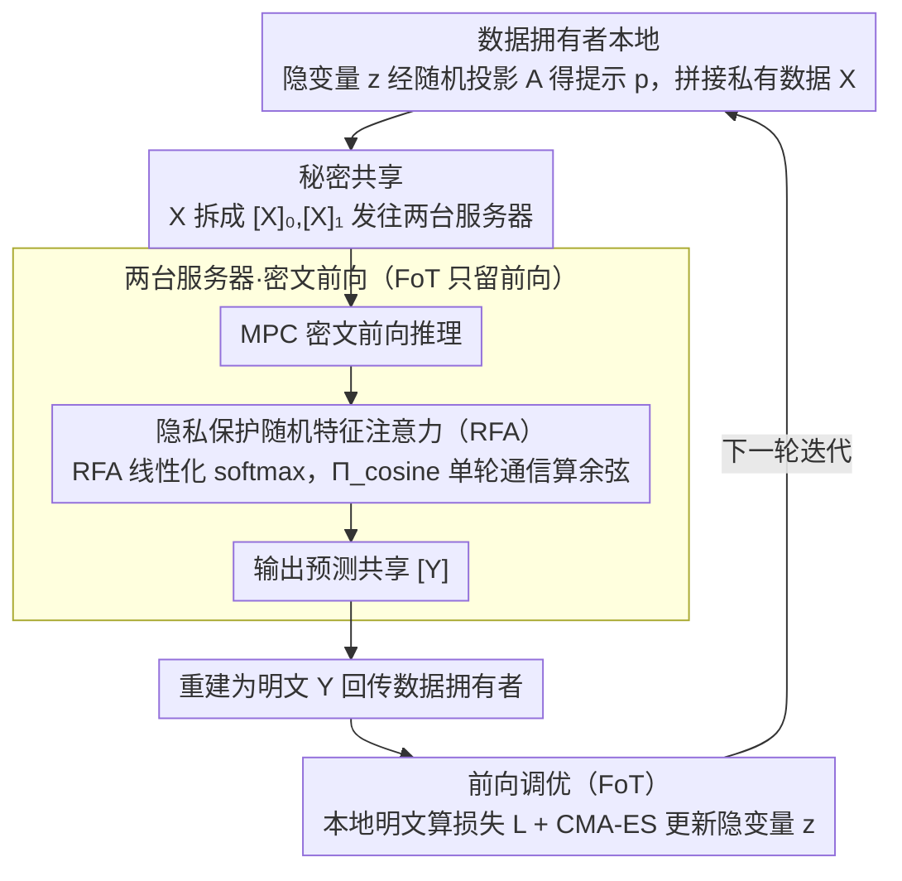

# SecP-Tuning: Efficient Privacy-Preserving Prompt Tuning for Large Language Models via MPC

**会议**: ICLR 2026  
**arXiv**: [2506.15307](https://arxiv.org/abs/2506.15307)  
**代码**: 无  
**领域**: AI安全  
**关键词**: 隐私保护, 安全多方计算, 提示调优, 前向调优, 随机特征注意力  

## 一句话总结

提出首个基于安全多方计算（MPC）的隐私保护提示调优框架 SecP-Tuning，通过前向调优消除反向传播开销、通过隐私保护随机特征注意力（RFA）替代 softmax 降低通信复杂度，实现约 12-16 倍加速和 17-20 倍通信量缩减。

## 背景与动机

1. **隐私敏感领域的 LLM 适配需求**：医疗、金融、政务等领域迫切需要将 LLM 适配到专业任务，但数据受 GDPR/HIPAA 等法规保护，无法直接访问。

2. **MPC 提供理论级隐私保证**：安全多方计算允许多方在不暴露各自输入的情况下共同计算，可同时保护模型参数和训练数据隐私，优于差分隐私的统计保证。

3. **MPC 微调面临严重效率瓶颈**：对 RoBERTa_LARGE 做一次 SFT 迭代需约 10 分钟、970GB 通信量——其中反向传播和优化器占 73% 时间，softmax 注意力占 75% 时间。

4. **反向传播包含大量 MPC 不友好操作**：Softmax、GELU、LayerNorm 等非线性操作在 MPC 环境中需分解为加减乘比较的近似计算，导致通信轮次和数据量激增。

5. **现有高效微调方法无法解决根本问题**：LoRA 和梯度提示调优虽减少更新参数量，但仍需反向传播和 softmax 的隐私保护计算，未能从根本上降低 MPC 通信开销。

6. **HE 方案难以平衡效率和精度**：同态加密（HE）依赖单方重计算且对非线性操作需昂贵的近似和再加密，MPC 通过多轮通信直接支持复杂非线性运算，更适合微调场景。

## 方法详解

### 整体框架

SecP-Tuning 把"数据拥有者"和"模型开发者"放进一个两服务器的安全多方计算环境里，让前者在不暴露任何私有数据、后者在不交出模型参数的前提下完成领域适配。一轮迭代的数据流是这样转的：数据拥有者在本地把低维隐变量 $z$ 经随机投影 $A$ 映射成提示嵌入 $p$、拼上私有数据 $X$，再把 $X$ 秘密共享后发给两台服务器；两台服务器在密文里跑完前向推理（其中注意力用 RFA 而非 softmax），把预测共享 $[Y]$ 回传重建成明文 $Y$；数据拥有者拿到 $Y$ 后在本地明文算损失、用无梯度优化器更新 $z$，进入下一轮。它的全部效率红利都来自两处对症下药：一是用前向调优（Forward-only Tuning, FoT）配合 "Server-Client" 架构，把损失与优化器整体搬出密文、彻底绕开反向传播；二是用隐私保护随机特征注意力（Random Feature Attention, RFA）替换 softmax，把注意力的密文复杂度从 $O(n^2d)$ 压到 $O(ndr)$。

### 关键设计

**1. 隐私保护前向调优（FoT）：把反向传播和优化器从密文里整体搬走**

MPC 之所以慢，是因为反向传播要对 Softmax、GELU、LayerNorm 求逆，再叠上 Adam 的除法与开方，这些非线性算子在密文里都得拆成大量加减乘比较来近似——实测占了一次迭代 73% 的时间。SecP-Tuning 干脆只保留前向推理：数据拥有者在本地初始化提示嵌入 $p$、拼上私有数据嵌入 $X$，把 $X$ 秘密共享成 $([X]_0,[X]_1)$ 交给两台服务器；两台服务器跑 MPC 协议完成密文前向、吐出预测共享 $[Y]$ 回传重建为明文 $Y$；数据拥有者再在本地明文算损失 $L$，并用无梯度优化器 CMA-ES 更新提示。这正是 "Server-Client" 架构的核心——损失值和无梯度优化器（Gradient-Free Optimizer, GFO）这些 MPC 不友好的计算（CMA-ES 里还含排序、向量外积、特征分解等 CrypTen 无法直接支持的操作）全部卸到数据拥有者本地明文执行，既快又精确。更关键的是，整条链路里参数更新只发生在本地，服务器永远拿不到更新后的提示，于是"模型记忆泄露训练数据"这条攻击路径从架构层面被堵死。为了让无梯度优化在高维下仍能收敛，实际更新被放进低维隐空间 $z\in\mathbb{R}^d$（$d\ll D$），再用一个固定随机投影 $A\in\mathbb{R}^{D\times d}$ 映射回原始提示空间，优化目标写作 $z^*=\arg\min_{z\in\mathcal{Z}}\mathcal{L}(f(Az;X),Y)$。

**2. 隐私保护随机特征注意力（RFA）：用一个 MPC 友好的余弦协议救活线性注意力**

砍掉反向传播后，前向里的 softmax 注意力又成了新瓶颈——它在密文里有三重麻烦：指数、除法、取最大值都是 MPC 不友好操作，加上 $O(n^2d)$ 的复杂度随序列长度二次膨胀，单是注意力就吃掉 75% 的时间。RFA 借随机傅里叶特征把核函数线性化，用 $\exp(\mathbf{x}^\top\mathbf{y}/\sigma^2)\approx\phi(\mathbf{x})^\top\phi(\mathbf{y})$ 近似 softmax，其中 $\phi(\mathbf{x})=\exp(\|\mathbf{x}\|^2/2\sigma^2)[\varphi(\mathbf{x},\omega_1),\dots,\varphi(\mathbf{x},\omega_M)]^\top$，复杂度随之降到线性的 $O(ndr)$。但 $\phi$ 里仍藏着余弦函数，这又是个 MPC 不友好操作；论文的关键补刀是设计了余弦协议 $\Pi_{\text{cosine}}$：离线阶段预先生成随机数 $t$ 及 $\sin(t)$、$\cos(t)$ 的秘密共享，在线阶段只需一轮通信重建 $\delta=(x+t)\bmod\tau$，再用三角恒等式 $\cos(x)=\sin(\delta)\sin(t)+\cos(\delta)\cos(t)$ 还原结果，整个余弦只花单轮通信、$2\ell$-bit 数据量。没有这个协议，RFA 在短序列（如 $L=64,128$）上甚至比原始 softmax 还慢，可见它才是让线性注意力在 MPC 里真正划算的那块拼图。

## 实验

### 实验设置

- **模型**：RoBERTa_LARGE（24 层、1024 维）。
- **数据集**：SST-2、MRPC、RTE、Yelp Polarity、AG's News（每类 16 样本 few-shot）。
- **MPC 后端**：CrypTen 框架，3 台 A100 GPU 服务器；LAN（3Gbps, 0.8ms）和 WAN（100Mbps/80ms、200Mbps/40ms）。
- **基线**：全参数 SFT、梯度提示调优、FoT（明文）。

### 核心结果

| 方法 | 前向时间(s) | 反向时间(s) | 总时间(s) | 通信量(GB) |
|---|---|---|---|---|
| SFT | 216.2 | 554.5 | 651.6 | 970.7 |
| 梯度 Prompt Tuning | 273.3 | 605.2 | 882.1 | 1116.2 |
| SecP-Tuning (FoT) | 174.0 | 0.0 | 174.1 | 205.4 |
| **SecP-Tuning (FoT+RFA)** | **54.2** | **0.0** | **55.2** | **56.5** |

| 方法 | SST-2 Acc | Yelp P. Acc | AG's News Acc | MRPC F1 | RTE Acc | 平均 |
|---|---|---|---|---|---|---|
| SFT | 85.39 | **91.82** | **86.36** | **77.35** | 58.60 | 79.90 |
| 梯度 Prompt Tuning | 68.23 | 61.02 | 84.81 | 51.61 | 54.69 | 64.07 |
| FoT+预训练提示 | **89.56** | 91.50 | 81.51 | 75.51 | **77.62** | **83.14** |
| SecP-Tuning | 88.11 | 85.23 | 81.27 | 75.33 | 52.95 | 76.58 |

### 关键发现

1. **效率提升巨大**：SecP-Tuning 在 LAN 环境下比 SFT 快约 12 倍、比梯度提示调优快约 16 倍；通信量分别降低 17 倍和 20 倍。反向传播和优化器开销被完全消除（0 秒、0GB）。
2. **精度可用**：在 few-shot 设置下，SecP-Tuning 在 SST-2 和 MRPC 等任务上接近甚至超越梯度提示调优，验证了隐私保护调优的可用性。在简单情感分类任务上（SST-2: 88.11 vs 68.23）显著优于梯度提示调优。
3. **唯一支持 AAS 部署**：SecP-Tuning 是唯一支持 "As-A-Service" 模式的方法——数据拥有者可通过 API 完成微调，模型开发者永远无法获取更新后的参数，杜绝了模型记忆攻击风险。
4. **Π_cosine 是 RFA 高效性的关键**：不使用高效余弦协议的 RFA 在短序列场景下甚至比原始 softmax 更慢，说明 Π_cosine 的设计至关重要。

## 亮点

- 首个 MPC 环境下的 LLM 提示调优框架，填补了 MPC-based 隐私保护微调的空白。
- "Server-Client"架构将损失和优化器计算卸载到数据拥有者本地明文执行，从架构层面消除反向传播开销。
- 隐私保护余弦协议 Π_cosine 巧妙利用三角恒等式实现单轮通信，是使 RFA 实际可行的关键贡献。
- 支持黑盒/API 式隐私调优，部署性优于所有梯度传递方案。

## 局限

- 仅在 RoBERTa_LARGE 上验证，未扩展到 GPT/LLaMA 级别的真正"大"模型，实际可扩展性存疑。
- RFA 对 softmax 的近似会引入精度损失，在某些任务上（Yelp P. 85.23 vs 91.82、RTE 52.95 vs 58.60）与 SFT 有较大差距。
- 半诚实威胁模型假设较弱，恶意参与者场景需额外的零知识证明等机制，开销更大。
- FoT 依赖 CMA-ES 等无梯度优化器，在高维参数空间中收敛性退化，需借助随机投影降维。

## 相关工作对比

| 方法 | 核心区别 |
|---|---|
| BlindTuner (Panzade et al., 2025) | 基于同态加密（HE）的隐私微调，单方加密计算开销大且非线性操作近似不精确；SecP-Tuning 基于 MPC 直接支持非线性操作 |
| PrivTuner (Li et al., 2024b) | 结合 LoRA 与全同态加密，减少参数但仍需反向传播的 HE 计算；SecP-Tuning 通过 FoT 完全消除反向传播 |
| DP-based PFT (Wang et al., 2024; Charles et al., 2024) | 差分隐私通过加噪提供统计级隐私保证(ε,δ)；MPC 提供密码学级理论保证，保护对象和保证强度不同 |

## 评分

| 维度 | 评分 |
|---|---|
| 新颖性 | ⭐⭐⭐⭐ |
| 有效性 | ⭐⭐⭐⭐ |
| 可复现性 | ⭐⭐⭐ |
| 实用性 | ⭐⭐⭐ |

<!-- RELATED:START -->

## 相关论文

- [\[NeurIPS 2025\] FedRW: Efficient Privacy-Preserving Data Reweighting for Enhancing Federated Learning of Language Models](../../NeurIPS2025/llm_safety/fedrw_efficient_privacy-preserving_data_reweighting_for_enhancing_federated_lear.md)
- [\[ICLR 2026\] Rethinking Bottlenecks in Safety Fine-Tuning of Vision Language Models](rethinking_bottlenecks_in_safety_fine-tuning_of_vision_language_models.md)
- [\[ICLR 2026\] Operationalizing Data Minimization for Privacy-Preserving LLM Prompting](operationalizing_data_minimization_for_privacy-preserving_llm_prompting.md)
- [\[ACL 2026\] Privacy Collapse: Benign Fine-Tuning Can Break Contextual Privacy in Language Models](../../ACL2026/llm_safety/privacy_collapse_benign_fine-tuning_can_break_contextual_privacy_in_language_mod.md)
- [\[ICLR 2026\] SHE-LoRA: Selective Homomorphic Encryption for Federated Tuning with Heterogeneous LoRA](she-lora_selective_homomorphic_encryption_for_federated_tuning_with_heterogeneou.md)

<!-- RELATED:END -->
