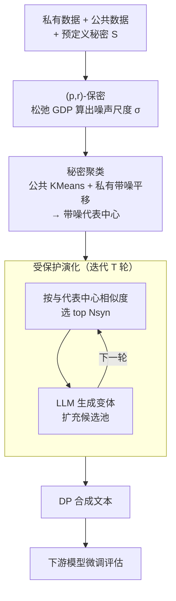

# Secret-Protected Evolution for Differentially Private Synthetic Text Generation

**会议**: ICLR 2026  
**OpenReview**: [https://openreview.net/forum?id=1vacZJxi56](https://openreview.net/forum?id=1vacZJxi56)  
**代码**: 无  
**领域**: LLM安全 / 差分隐私 / 合成数据生成  
**关键词**: 差分隐私, 合成文本, 秘密保护, Private Evolution, 高斯DP松弛

## 一句话总结
针对差分隐私（DP）合成文本生成对"非敏感内容也一视同仁地加噪"造成的效用损失与算力浪费，本文提出 **SecPE（Secret-Protected Evolution）**，把保护目标从"成员身份"换成"预定义的秘密"，用单点松弛高斯 DP 来减小噪声，并用"秘密聚类 + 代表中心投票"把 Private Evolution 的相似度计算复杂度从 $O(MN_{\text{syn}})$ 砍到 $O(KN_{\text{syn}})$，在 OpenReview / PubMed / Yelp 上同时取得更低 FID、更高下游准确率与最高约 10000× 的投票加速。

## 研究背景与动机

**领域现状**：现实世界大量高质量文本是隐私数据不能直接拿来训 LLM，于是 DP 合成文本生成成为主流方案——先用 DP 机制保护私有数据，再产出可安全共享的合成数据。落地路线主要两条：一是用 DP-SGD 训一个 DP 生成器（DP-Generator），二是更新的 **Private Evolution（PE）**：不训模型，而是反复让一个强基础模型生成候选、用 DP 投票按"与私有数据的相似度"打分、在胜出者周围重采样，逐轮逼近真实分布（Aug-PE 是其代表实现）。

**现有痛点**：DP-Generator 算力开销大、需要数百条高质量私有数据、还用不上闭源 SOTA 模型；PE 虽然能直接调用现成强模型，但它的逐对相似度计算（每条私有样本对每条合成样本算一次）和逐轮全量处理让流水线极其低效。更关键的是，二者都建立在"经典 DP"假设上——**默认每条记录同等敏感**。可现实里敏感信息往往是稀疏的（医疗记录 vs 电影评分敏感度天差地别），而且同一个秘密可能在多条记录里重复、一个用户也可能贡献多条记录；在 user-level DP 下，均匀保护会逼着算法注入远超必要的噪声。

**核心矛盾**：DP 的保护是"全曲线、全用户、全记录"的均匀强约束，而真正需要保护的只是少数"秘密"。把全部隐私预算摊到整个数据集上，等于为了护住几个秘密给所有内容都蒙上噪声——隐私约束越强、效用掉得越多，二者陷入过度保守的 trade-off。

**本文目标**：拆成两个子问题——(1) 能不能只在"对手真正关心的那个点"上提供保护，从而少加噪声、换回效用？(2) 能不能改掉 PE 逐点投票的低效，让流水线对大规模数据可扩展？

**切入角度**：作者借鉴 secret protection 的思路——保护对象不是"某条记录是否在数据集里（成员隐私）"，而是"预定义的秘密能否被重构出来"。一旦秘密预先定义好，非秘密的公共数据就可以零保护地自由使用（用来聚类、做摘要），隐私预算只留给秘密相关的调整。从假设检验/trade-off 曲线看，这等价于只要求保护落在曲线上的单点 $(p_j, r_j)$，而非整条曲线高于高斯基准。

**核心 idea**：用 **(p,r)-秘密保护**（高斯 DP 的单点松弛）替代经典 DP，并把 PE 的"逐点投票"重构成"秘密聚类 + 代表中心投票"——既少加噪声拿回效用，又大幅降低计算复杂度。

## 方法详解

### 整体框架

SecPE 要解决的是"在只保护少数预定义秘密的前提下，高效产出高保真合成文本"。整体分两个串联模块：先做 **秘密聚类（Secret Clustering）**——用零保护的公共数据 KMeans 出代表中心，再用带噪的私有数据对中心做受控平移，得到一组"既概括全局结构、又不直接暴露敏感信息"的带噪代表 $(\tilde{e}_k, \tilde{n}_k)$；然后做 **受保护演化（Protected Evolution）**——在 PE 的迭代框架里，用这些带噪代表替代逐条私有样本来给候选投票，每轮选出与代表最相似的 top $N_{\text{syn}}$ 个样本，连同它们的 LLM 变体组成下一轮候选池，迭代 $T$ 轮后输出合成文本。两个模块上层都由 **(p,r)-保密** 这一隐私定义统一标定：它先松弛 GDP、再据此算出所需噪声尺度 $\sigma$。

整条管线把 PE 原本 $O(MN_{\text{syn}})$ 的相似度计算（$M$ 条私有样本 × $N_{\text{syn}}$ 个合成样本）降到 $O(KN_{\text{syn}})$（$K$ 个聚类锚点，通常 $K \ll M$），这是效率提升的根本来源。

### 关键设计

**1. (p,r)-秘密保护：把"全曲线 DP"收成"够用就行"的单点松弛**

经典 DP 要求在所有邻接数据集、所有用户记录上一致保护，对手目标是判定"某条记录是否在数据集里"；但若我们真正在意的只是少数秘密不被重构，这种全局约束就过度保守。作者重新定义邻接：两个数据集 $D \simeq_j D'$ 只在秘密 $s_j$ 的有无上不同，并把保护写成对**重构攻击成功率**的上界——机制 $\mathcal{A}$ 满足 $(p,r)$-秘密保护，当且仅当对任意重构攻击 $\mathcal{B}$、任意秘密 $s_j$，有

$$\Pr_{D_j \sim \pi_j,\ \mathcal{A}}\big[\mathcal{B}(\mathcal{A}(D_j)) = s_j\big] \le r_j,$$

其中 $\pi_j$ 编码对手对 $s_j$ 的先验知识、$p_j$ 是先验成功概率。Lemma 3.3 把它和高斯 DP 接起来：任何 $\mu$-GDP 机制都能提供 $(p,r)$-保护，且 $r_j = 1 - \Phi(\Phi^{-1}(1-p_j) - \mu)$。关键在于反向不成立——$(p,r)$-保护只约束对手在**单个先验 $p_j$ 处**的成功率，而 $\mu$-GDP 要求整条 trade-off 曲线 $T_{(P,Q)}$ 都压在高斯基准 $G_\mu$ 之上。所以 $(p,r)$-保护是 DP 的真松弛：约束更弱，但正因为只需护住曲线上的一个点而非整条曲线，就能用更少的噪声换回更高效用，同时仍给出可解释的重构保护。

**2. 噪声标定（SecretNoise）：按秘密敏感度做线性规划，让"不那么敏感"的秘密少加噪**

确定了 $(p,r)$ 预算后，还需把它翻译成实际的噪声尺度 $\sigma$ 与采样概率。作者沿用 Ganesh et al. (2025) 的线性规划：给每条含秘密 $s_j$ 的私有样本 $x_i$ 一个权重 $w_i$，在约束 $\sum_{x_i \in D_{\text{pri},j}} w_i \le \Phi^{-1}(1-p_j) - \Phi^{-1}(1-r_j) \triangleq \eta_j$ 下最大化 $\sum w_i$，再据此构造采样概率 $\rho_i = \frac{1}{\max_i w_i}\cdot\frac{w_i}{\sum_{i'} w_{i'}}$ 形成训练子集。这里 $\eta_j$（即式 4 中的 $\mu$）扮演一个**容量约束**——秘密越不敏感（$\eta_j$ 越大）就允许选入越多样本。最后对每个秘密用对应的"dominating pair"分布 $P_j = \mathcal{N}(\sum \mathrm{Bern}(\rho_i), \sigma^2)^{\otimes T}$、$Q_j = \mathcal{N}(0, \sigma^2)^{\otimes T}$，取满足 blow-up 函数上界 $B_{(P_j,Q_j)}(p_j) \le r_j$ 的最小 $\sigma_j$，再取 $\sigma = \max_j \sigma_j$。这一步是 SecPE"同等保护下噪声更小"的直接来源：它把噪声按秘密粒度精打细算，而不是像 GDP 那样对全数据集一刀切。

**3. 秘密聚类（Secret Clustering）：公共数据搭骨架，私有数据只做带噪平移**

PE 低效的另一面在投票本身——作者观察到投票分布极不均衡，少数合成样本拿走绝大多数票、其余近乎均匀（论文 Figure 4），说明选择本就在"组群/簇"层面发生，逐点投票是浪费。于是用代表投票替代逐点投票：先**只用公共数据**做 KMeans 得到 $K$ 个中心 $\{(e_k, n_k)\}$（零隐私成本），再用私有数据做一次受控平移——每条私有嵌入先裁剪 $\hat{e}_{\text{pri},i} = \mathrm{Clip}_R(e_{\text{pri},i})$、以概率 $\rho_i$ 采样后分配到最近锚点，最后释放加噪后的统计量：

$$\tilde{e}_k = \frac{n_k e_k + \sum_{i \in C_k} \hat{e}_{\text{pri},i}}{n_k + m_k} + \xi_k,\quad \xi_k \sim \tfrac{2R}{n_k}\mathcal{N}(0,\sigma^2 I_d),\qquad \tilde{n}_k = n_k + m_k + \eta_k,\ \eta_k \sim \mathcal{N}(0,\sigma^2).$$

Theorem 1 证明这样得到的带噪中心满足 $(p,r)$-秘密保护。代表中心既概括了数据全局结构、又不直接暴露任何敏感样本，于是合成数据只需按"与中心的相似度"被选择，省去了对全量数据集的反复处理——在 1.9M 条的 Yelp 上这一点尤其关键（还顺带省下约 25.1 GB 显存，因为不再需要一次性存下整个数据集的嵌入）。聚类数 $K$ 建议随原数据规模与目标合成量缩放（大到能支撑多样投票、小到不放大噪声），实验显示性能对 $K$ 的具体取值基本不敏感。

**4. 受保护演化（Protected Evolution）：用带噪代表替私有样本，跑 PE 的选择-变异迭代**

最后把秘密聚类嵌进 PE 的迭代骨架。初始化时让基础模型随机生成 $N_{\text{syn}} \times L$ 个样本；每轮先对当前候选嵌入并裁剪，调用秘密聚类得到当轮带噪代表 $\{(\tilde{e}_k, \tilde{n}_k)\}$；然后为每个代表中心找最近的候选样本、把该代表的带噪计数 $\tilde{n}_k$ 累加到对应候选的直方图上（这就是"代表中心投票"）；按直方图取 top $N_{\text{syn}}$ 个幸存者，连同它们的 LLM 变体 $\mathrm{VARIATION}(\cdot, L)$ 组成下一轮候选池，迭代 $T$ 轮输出。整套流程保留了 PE"调现成强模型 + 迭代精炼"的实用性，只是把投票从"逐条私有样本"换成"$K$ 个带噪代表"，复杂度从 $O(MN_{\text{syn}})$ 降到 $O(KN_{\text{syn}})$。Theorem 2 进一步证明：由于每轮的分布对构成 dominating pair，整个 $T$ 轮算法仍满足 $(p,r)$-秘密保护。

### 损失函数 / 训练策略
SecPE 本身不训练生成器（PE 范式只调用现成 LLM 做生成与变体），没有显式损失函数；隐私预算固定先验 $p = 10^{-4}$，按比值 $r/p = c$（$c \in \{2, 10, 50, \infty\}$，$c=\infty$ 为非私有）设预算，$\mu = \Phi^{-1}(1-p) - \Phi^{-1}(1-r)$。下游评估侧才有真正训练：在合成数据上微调 RoBERTa-base（Yelp 评分/类别、OpenReview 推荐/领域分类）或 BERT（PubMed 下一词预测准确率）。

## 实验关键数据

数据集：OpenReview（ICLR 2023 评审，按领域/评级标注）、PubMed（医学摘要）、Yelp（商户评论，按类别/评级标注）。生成器主实验用 GPT-2、Qwen-2.5-1.5B，消融用 Llama-3.1-8B / Qwen-2.5-7B / Mistral-7B / GPT-4o-Mini。两类秘密任务：随机词任务（取词频约 20% 分位的词作为秘密）与 PII 任务（用 AI4Privacy/Presidio 检测 36 类 PII，每类当作秘密）。

### 主实验

PubMed 随机词任务下游准确率（BERT-small，越高越好），随隐私收紧（$r/p$ 从 $\infty$ → 2）：

| 方法（GPT-2 生成） | $r/p=2$ | $r/p=10$ | $r/p=50$ | $r/p=\infty$ |
|--------|------|------|------|------|
| Aug-PE | 24.93 | 26.14 | 26.96 | **29.70** |
| SecPE2000 | **29.18** | 29.42 | 29.38 | 29.19 |
| SecPE3000 | 29.54 | **29.75** | 29.12 | 29.52 |

运行时（一个 epoch，秒；A100-80G），重点看直方图/选择部分：

| 方法 | OpenReview LLM/直方图 | PubMed LLM/直方图 | Yelp LLM/直方图 |
|------|------|------|------|
| Aug-PE | 1698.7 / 126.9 | 828.5 / 32.2 | 347.1 / **30126.4** |
| SecPE | 1693.1 / **1.5** | 830.8 / **0.5** | 347.6 / **2.3** |

LLM 采样时间两者持平（查同一模型同样次数），但直方图/选择部分 SecPE 至少快 60×，在 190 万条的 Yelp 上达到约 10000×；GPU 利用率从 PE 的 ~3.2% 提升到 ~38.6%，显存省约 25.1 GB。

### 消融实验

| 配置 | 关键发现 | 说明 |
|------|---------|------|
| 隐私收紧（$r/p \downarrow$） | SecPE 优势放大 | $r/p$ 从 ∞→2，Aug-PE 准确率 29.70→24.93 暴跌，SecPE2000 仅 29.19→29.18 几乎不掉 |
| 非私有（$r/p=\infty$） | SecPE 略低但可比 | 聚类抽象掉细粒度信息，偶尔诱发误选 |
| 聚类数 $K$（Table 7, $r/p=10$） | 对 $K$ 不敏感（只要不太小） | Category 准确率 $K{=}50$ 时 62.50、$K{\ge}800$ 稳定在 73~74 |
| 生成器强弱（Yelp, $r/p=10$） | 更强 LLM → 更好下游 | GPT-4o-mini (74.84/62.96) > GPT-2 (73.82/58.36)；Qwen-7B > Qwen-1.5B |
| PII 任务 | 提升温和 | 受 PII 检测器精度/召回瓶颈所限；且实验固定 epoch 数，未用上 SecPE 更快的迭代优势 |

### 关键发现
- **隐私越紧、优势越大**：SecPE 真正的价值在私有设定（$r/p$ 小）——同等重构保护下它注入的噪声远少于 $\mu$-GDP，因此效用几乎不随隐私收紧而崩；非私有时反而因聚类抹掉细节略逊。
- **效率提升来自代表投票**：把逐点投票换成 $K$ 个带噪代表，是 60×~10000× 加速和显存节省的根因，且对 $K$ 鲁棒——说明聚类抓住的是全局结构而非个别样本。
- **生成器质量是上限**：更强的 LLM 一致带来更高下游准确率，但 7B Mistral 未超过更小模型，提示"选对模型"比"堆参数"更重要。

## 亮点与洞察
- **把隐私从"成员"重定义为"秘密"，从而把全曲线约束收成单点约束**：这是最核心的"啊哈"——既然只需护住对手在某个先验处的重构成功率，就不必让整条 trade-off 曲线都达标，松弛带来的就是实打实少加的噪声。
- **公共数据零成本搭骨架、私有数据只做带噪平移**：把"聚类结构"和"敏感平移"解耦，是同时拿到隐私保证（Theorem 1）和算力节省（$O(M)\to O(K)$）的巧妙杠杆，可迁移到任何"公共数据可用 + 少量私有微调"的隐私场景。
- **复用 Figure 4 的投票不均衡观察来论证设计**：先用数据证明逐点投票本就在簇层面发生、是浪费，再顺势替换成代表投票，动机扎实而非拍脑袋。

## 局限与展望
- **依赖"秘密可预先定义且可检测"**：PII 任务上提升温和，作者明说效果被 PII 检测器（AI4Privacy/Presidio）的精度与召回卡住——检测不出的秘密就保护不到。
- **非私有/弱隐私场景反而吃亏**：聚类抽象掉细粒度信息会诱发误选，$r/p=\infty$ 时 SecPE 略逊 Aug-PE，方法的甜区集中在强隐私需求。
- **公平比较埋没了真实优势**：为与 $\mu$-GDP 基线对齐，实验固定了 epoch 数、用均匀预算，没用上 SecPE 更快迭代的优势；若按"相同墙钟时间"或按秘密定制异质预算，差距应更大。
- **(p,r) 松弛的安全语义需谨慎**：单点保护比全曲线 DP 弱，能否抵御先验之外、自适应的重构攻击，仍取决于先验 $\pi_j$ 估得准不准。

## 相关工作与启发
- **vs Aug-PE / Private Evolution**：PE 在经典 DP 下逐点投票、均匀加噪；SecPE 换成 $(p,r)$-秘密保护 + 代表中心投票，少加噪声拿回效用、复杂度降一个量级，本质是"把 PE 重新围绕秘密感知的选择与聚合来设计"。
- **vs DP-Generator（DP-SGD 训生成器）**：DP-Generator 算力大、需大量私有数据、用不上闭源 SOTA；SecPE 走 PE 路线只需 API 访问现成强模型，且把保护粒度细化到秘密。
- **vs 经典 (ε,δ)-DP / 高斯 DP**：本文站在假设检验/trade-off 曲线视角，把"整条曲线高于基准"松弛为"单点高于基准"，并借 blow-up 函数（Balle et al. 2022 的重构鲁棒性、Hayes et al. 2023 的紧界）把抽象的隐私保证落到可量化的重构成功率上。

## 评分
- 新颖性: ⭐⭐⭐⭐⭐ 把 secret protection 引入 PE 文本合成，并给出 $(p,r)$ 松弛 GDP 的紧致单点界，概念与机制都有原创性
- 实验充分度: ⭐⭐⭐⭐ 三数据集 × 两类秘密任务 × 多 LLM，效率/效用/相似度三维度齐全；但缺与更多 secret-protection 基线对比、PII 提升偏弱
- 写作质量: ⭐⭐⭐⭐ 理论-算法-实验衔接清晰，Figure 1/4 与定理配合到位；定义与符号略密集，对非 DP 背景读者门槛偏高
- 价值: ⭐⭐⭐⭐⭐ 在"敏感内容稀疏但跨记录重复"的真实场景里同时改善效用与效率，对隐私合成数据落地很实用

<!-- RELATED:START -->

## 相关论文

- [\[ACL 2026\] Differentially Private Synthetic Text Generation for Retrieval-Augmented Generation (RAG)](../../ACL2026/llm_safety/differentially_private_synthetic_text_generation_for_retrieval-augmented_generat.md)
- [\[ICLR 2026\] HiddenEcho: Mitigating Noise Amplification in Differentially Private LLMs with Hidden-State Correction](hiddenecho_mitigating_noise_amplification_in_differentially_private_llms_with_hi.md)
- [\[ICLR 2026\] Pisces: Cryptography-based Private Retrieval-Augmented Generation with Dual-Path Retrieval](pisces_cryptography-based_private_retrieval-augmented_generation_with_dual-path_.md)
- [\[ICLR 2026\] Hot PATE: Private Aggregation of Distributions for Diverse Tasks](hot_pate_private_aggregation_of_distributions_for_diverse_tasks.md)
- [\[ICML 2025\] POPri: Private Federated Learning using Preference-Optimized Synthetic Data](../../ICML2025/llm_safety/popri_private_federated_learning_using_preference-optimized_synthetic_data.md)

<!-- RELATED:END -->
