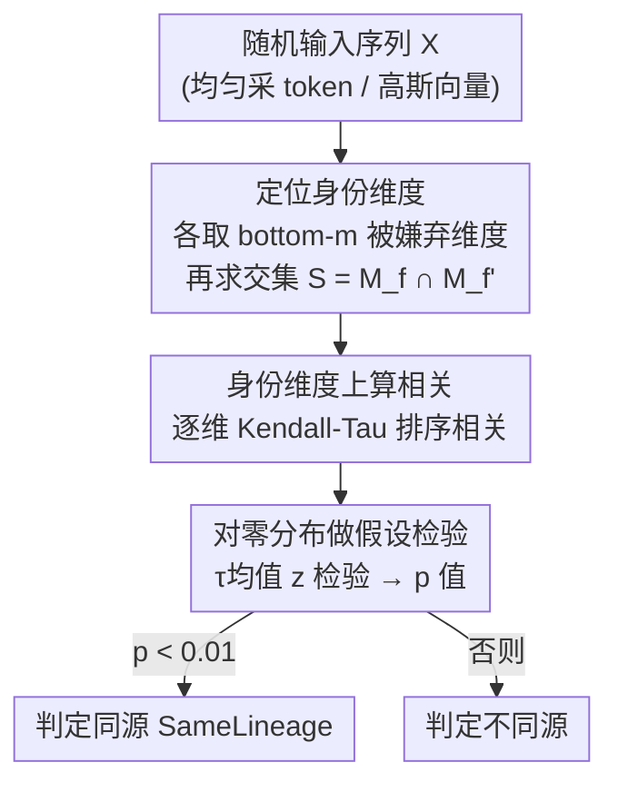

# SeedPrints: Fingerprints Can Even Tell Which Seed Your Large Language Model Was Trained From

**会议**: ICLR 2026  
**OpenReview**: [https://openreview.net/forum?id=Kan6Z0zzZi](https://openreview.net/forum?id=Kan6Z0zzZi)  
**代码**: https://github.com/YnezT0311/SeedPrints  
**领域**: LLM 安全 / 模型指纹 / 版权溯源  
**关键词**: 模型指纹, 初始化偏置, 血缘验证, 假设检验, 大规模预训练

## 一句话总结
本文提出 SeedPrints，利用随机初始化种子在模型输出维度上留下的、训练后依然可统计检测到的"偏好偏置"作为 LLM 的内在指纹，把指纹从"训练完才出现的事后特征"提前到"出生即存在"，从而在大规模预训练早期到微调全生命周期都能用一个 p 值给出血缘判定，并在 LeaFBench 等真实基准上匹配最强基线。

## 研究背景与动机
**领域现状**：给 LLM 做指纹（fingerprinting）是模型溯源和归属验证的关键手段，目的是在一个可疑模型和它声称的源模型之间建立可验证的链接，用来检测模型盗用或未授权复用。现有被动指纹方法要么从权重里抽签名（注意力矩阵分布、表示的核对齐、参数向量方向），要么从黑盒输入输出行为里抽签名，统一在**模型已经微调收敛之后**做评测。

**现有痛点**：作者用 OLMo-2-7B 从 5B 到 3.9T token 的 checkpoint 序列做了一个揭示性实验（图 1）——把每个中间 checkpoint 和最终模型比对，五个主流基线（Intrinsic、REEF、PCS、ICS）在预训练早期（第一个 trillion token 内）相似度全部掉到 0.8 检测阈值以下，ICS 甚至 ≈0。也就是说，这些方法在"模型刚出生不久"的阶段根本认不出血缘关系。更糟的是，当继续训练的数据分布发生大幅漂移（比如从自然文本换到代码）时，它们会把真正同源的后代误判成无关模型。

**核心矛盾**：这些方法的可分性其实来自**训练过程留下的表面特征**——数据签名、优化动态、超参数，而不是模型自身的"胎记"。它们本质是 *post hoc identifier*（事后识别符），而 Galton 1892 年对指纹的经典定义是"个体独一无二、终生基本不变的内在标记"。一个真正的指纹应当从模型在初始化时"出生"那一刻就存在，并贯穿整个生命周期，而现有方法不满足这个标准。

**本文目标**：找到一种从初始化就存在、在后续任意训练阶段都可检测、且不被数据分布/训练时长/优化动态混淆的内在指纹，并把"是否同源"变成一个有统计严谨性的假设检验，而非启发式相似度阈值。

**切入角度**：作者从一个反直觉的观察出发——**未训练的随机初始化模型在完全随机的输入下，输出并不是均匀的，而是有强烈的、依赖种子的偏好偏置**。某些输出维度/token 会被系统性地"嫌弃"（频繁取到最小值）。这种偏置的整体幅度跨种子稳定，但具体"被嫌弃的是哪些维度"由种子决定。

**核心 idea**：把随机初始化种子诱导出的"被嫌弃维度"模式当作种子相关的持久身份标记；虽然训练会大幅改变输出幅度，但这种相对偏好不会完全丢失、会一直保留一个微弱但可统计检测的信号——于是只要检验两个模型在这组身份维度上的输出排序是否显著一致，就能判定血缘。

## 方法详解

### 整体框架
SeedPrints 要解决的问题是：给定一个 base 模型 $f$ 和一个可疑模型 $f'$（**都拿不到真正的初始化模型**），判断它们是否来自同一初始化血缘。整条流程是一个三步的统计检验：先从两个模型各自的输出里定位"被嫌弃的身份维度"并取交集，再在这些维度上逐维计算两模型输出排序的相关性，最后把这组相关性和"无血缘"零分布做单边假设检验，输出一个 p 值，$p<0.01$ 即判同源。

整个方法只需要对模型做前向传播（喂随机输入、读最后一层 logits 或隐状态），不需要训练、不需要插入任何水印，因此能对第三方模型做事后审计。

### 关键设计

**1. 身份维度提取：用交集把"共享初始化"和"架构/训练巧合"分开**

第 3 节的实验给了一个关键事实：来自同一初始化的模型，会在一组输出维度（尤其是未训练模型最"嫌弃"的那些）上保留微弱但一致的偏好。问题是我们手里没有真正的初始化模型，只能从两个已训练模型本身去恢复这组维度。作者的做法是：对任意模型 $g$，喂 $n$ 个随机输入 $X=\{x_i\}$，算它的平均响应向量 $\bar g = \frac{1}{n}\sum_i g(x_i)$，再取这个向量里**最小的 $m$ 个坐标**作为它的"被嫌弃维度"集合 $M_g = \arg\min_{|J|=m}\sum_{j\in J}\bar g_j$。用均值向量而不是逐样本 argmin 频率，是因为均值对噪声更稳健。

然后对两个模型 $f$、$f'$ 取**交集** $S = M_f \cap M_f'$ 作为"身份维度"。这个交集设计是整个方法防误报的核心：如果两个模型确实同源，它们会各自独立地识别出相似的被嫌弃维度，交集非平凡；而架构相似或共享训练动态带来的虚假相关，很难让两个模型在 bottom-$m$ 集合上恰好大量重合。所以交集起到一种"互相验证"的作用，把真正源于共享初始化的偏置信号从其他混杂因素里隔离出来。当其中一个模型更接近初始化时，也可以直接拿它的被嫌弃维度当锚点。

**2. 身份维度上的 Kendall-Tau 排序相关：度量"输入级偏好"的一致性而非数值相似**

定位到身份维度 $S$ 后，需要量化两个模型在这些维度上的一致程度。直接比数值不行，因为不同模型、不同维度的输出尺度差异巨大。作者先对每个样本的输出向量做**行级 softmax 归一化**（用较高温度 $T=10$ 避免退化成 one-hot），这一步消除了模型间的尺度差异，但保留了承载身份信息的相对排序。然后对每个 $j\in S$，在 $n$ 个随机输入上计算两个模型该维度响应的 Kendall-Tau 秩相关 $\tau_j = \mathrm{KendallTau}(\{f(x_i)_j\}, \{f'(x_i)_j\})$。

这样得到一组相关统计量 $T=\{\tau_j\}_{j\in S}$，刻画了两个模型在身份维度上"对不同输入的偏好排序"有多一致。第 3 节已经观察到：同源模型在这些维度上的一致性分布，会系统性地高于无关模型——单个 $\tau$ 值很小，但整组分布被一致地往上抬，且不随训练衰减到零，而是稳定下来。用秩相关而非线性相关，是因为身份信息体现在"谁排在谁前面"的相对顺序里，对幅度变化更鲁棒。

**3. 对解析零分布的单边假设检验：把"同源"变成有 p 值的严谨判定**

由于同源和异源的相关分布会有重叠，对单个统计量卡阈值是不够的。理想的零分布应当来自大量独立初始化模型之间的相关分布，但这在计算上太贵。作者证明（附录 B）独立初始化模型之间的零相关分布可以用高斯很好地近似，于是先给出一个**模拟法**替代：把两个高斯矩阵 $Y^{(1)},Y^{(2)}\sim\mathcal N(0,I)$ 过同一套 pipeline 构造经验零分布。

但模拟法仍引入额外随机性和开销、精度受模拟次数限制、还要依赖 t 检验或 Mann-Whitney U 检验等额外假设。注意到 Kendall-Tau 在弱独立下的零分布有闭式解，作者进一步换成**解析检验**：零假设下每个 $\tau_j$ 近似零均值、方差 $\sigma^2$ 已知，由中心极限定理，当身份维度数 $|S|$ 增大时，均值 $\bar\tau=\frac{1}{|S|}\sum_j\tau_j$ 近似服从 $\mathcal N(0, \sigma^2/|S|)$。于是计算单边 z 分数 $z=\frac{\bar\tau}{\sigma/\sqrt{|S|}}$，得到 $p = 1-\Phi(z)$，$p<0.01$ 则拒绝零假设、判定共享血缘。softmax 归一化引入的弱维间依赖被高温缓解，独立性假设在实践中近似成立。这样最终输出是一个直接、无需调相似度阈值的统计判据。

**实践细节**：模型输出既可用 logits 也可用最后一层隐状态。logits 因词表大、需要更多随机输入才能稳定估计偏置（开销随词表增长），所以默认用**最后一层隐状态**作为输出，兼顾效率和稳定。

### 一个例子：种子能否"出生即被区分"
拿 4 个仅初始化种子不同（42、123、1000、2000）的 LLaMA-style 模型两两比对：所有 pair 的 p 值都 $>0.01$（如 s42 vs s2000 为 0.116，s123 vs s42 为 1.000），说明 SeedPrints 把不同种子的模型可靠地区分开，实现"出生即区分"。再把每个初始化模型 $s^{init}$ 和它在 OpenWebText（≈10B token）上继续训练的后代 $s^{base}$ 比对，所有同源 pair 的 p 值都 $<0.01$（如 $3.37\times10^{-26}$），而同样的 pair 下基线方法全部失败——这反过来证明基线的可分性来自训练产物而非初始化。更进一步，让 4 个模型用**完全相同的语料和数据顺序**（锁训练种子）只换初始化种子训练，跨种子 pair 的 p 值仍一致 $>0.01$（0.573、0.724、0.109、0.883），说明相同数据和课程也不会让不同初始化的指纹收敛。

## 实验关键数据

### 主实验
模型：从零训练的 12 层 12 头 LLaMA-style（带 RoPE）和 Qwen-style 模型；并在真实大模型上验证。基线：Intrinsic、REEF、PCS、ICS（0.8 相似度阈值），5.3 节加入 Gradient。

大规模微调（Table 5，每行 vs LLaMA-2-7B，SeedPrints 报 p 值越小越好，基线报相似度阈值 0.8）：

| 目标模型 | 微调 token | SeedPrints p | PCS | ICS |
|----------|-----------|--------------|-----|-----|
| Llama-2-finance-7B | 5M | $10^{-41955}$ ✓ | 0.998 ✓ | 0.995 ✓ |
| Vicuna-1.5-7B | 370M | $10^{-103043}$ ✓ | 0.999 ✓ | 0.995 ✓ |
| CodeLlama-7B | 500B | $10^{-3552}$ ✓ | 0.686 ✗ | 0.337 ✗ |
| Llemma-7B | 700B | $10^{-5136}$ ✓ | 0.668 ✗ | 0.291 ✗ |

在 500B–700B token 的大规模微调下，PCS / ICS 已经跌破阈值误判，而 SeedPrints 始终保持 $p<0.01$。

LeaFBench（Table 6，65 个模型 / 7 家族 / 6 种变换，AUC / KS 越高越好）：

| 方法 | Overall AUC | Overall KS |
|------|-------------|-----------|
| REEF | 0.915 | 0.739 |
| Gradient | 0.801 | 0.508 |
| ICS | 0.994 | 0.943 |
| Intrinsic | 0.994 | 0.989 |
| **SeedPrints** | **0.992** | **0.986** |

SeedPrints 在真实部署审计上匹配最强基线（Intrinsic/ICS），且大幅超过 REEF、Gradient。

### 消融实验
| 配置 | 关键现象 | 说明 |
|------|---------|------|
| 跨初始化种子（同语料同顺序）| p 值全 $>0.01$（Table 3）| 数据和课程相同也不会让指纹收敛，指纹是种子专属 |
| 持续训练换数据域（Table 4）| The Stack 代码域下基线全失败、SeedPrints ✓ | 基线追踪的是域相似度而非血缘 |
| 大规模预训练轨迹（OLMo-2-7B，图 1）| 早期 baseline 全跌破阈值，SeedPrints 从首个 checkpoint 起 $p\ll0.001$ | 预训练早期是检测最难、最该优先的阶段 |

### 关键发现
- **交集 + 假设检验是稳健性来源**：基线在分布大幅漂移（自然文本→代码）下崩溃，因为它们本质追踪数据域相似度；SeedPrints 的信号来自初始化偏置，跨域仍成立。
- **大规模预训练反而会"强化"血缘信号**，给人虚假安全感——真正难检测的是预训练早期，本文主张血缘验证必须优先覆盖早期阶段而非只看晚期 checkpoint。
- **logits vs 隐状态**：默认用隐状态，因为 logits 受词表规模影响、估计偏置需要更多随机输入、开销更大。

## 亮点与洞察
- **把"指纹"概念前移到出生时刻**：最"啊哈"的点是发现随机初始化模型在随机输入下输出非均匀、且嫌弃维度依种子而定，把指纹从训练产物变成出生胎记，这是对 Galton 经典指纹定义的真正对齐。
- **交集做互相验证**：在拿不到真初始化模型的前提下，用两个模型各自 bottom-$m$ 维度的交集来抑制架构/训练巧合带来的虚假相关，是一个轻巧而关键的去混杂技巧，可迁移到其他"无锚点比对"场景。
- **从模拟零分布升级到解析零分布**：利用 Kendall-Tau 零分布的闭式解 + CLT，把检验做成无需模拟、无需调阈值的解析 z 检验，既省算力又给出可解释的 p 值，是统计严谨性和工程效率的好平衡。

## 局限与展望
- **p 值与相似度不可线性比较**：为了和基线算 AUC，作者把 p 转成 $s=1-p$，但小 p 值是指数尺度、阈值扫描是线性的，这个转换对本方法其实是次优的（作者自己承认），AUC 对比可能低估了 SeedPrints。
- **依赖白盒/可前向访问**：方法需要喂随机输入读 logits 或隐状态，纯黑盒、仅 API 限频访问的场景适用性存疑。
- **初始化种子无明确版权地位**：作者也指出"区分不同种子"本身从版权角度不是刚需，真正价值在于抗数据分布漂移的血缘归属；指纹的法律效力还需配套论证。
- **softmax 高温下的独立性假设**：解析检验依赖维间近似独立，靠 $T=10$ 高温缓解弱依赖，极端配置下近似是否成立值得进一步验证。

## 相关工作与启发
- **vs 主动水印 / 后门指纹（Xu et al. 2024 等）**：它们主动往模型或输出里植入可验证标记，需要控制训练过程，无法对第三方已有模型做事后标注；SeedPrints 是被动、零修改、可事后审计。
- **vs 权重/表示被动指纹（Intrinsic、REEF、PCS、ICS）**：它们从收敛后的权重或表示抽事后签名，在预训练早期失效、且易被数据域漂移误导；SeedPrints 抽的是初始化born 偏置信号，贯穿出生到生命周期全程，且对域漂移鲁棒。
- **vs 黑盒行为指纹（Pasquini et al. 2024 等）**：它们靠精心构造的查询/风格计量识别模型，对微调不够鲁棒；SeedPrints 直接做统计检验输出 p 值，给出无阈值的确定判定。

## 评分
- 新颖性: ⭐⭐⭐⭐⭐ 把指纹概念从训练产物前移到初始化偏置，是对"指纹"本质定义的重新校准
- 实验充分度: ⭐⭐⭐⭐⭐ 覆盖从零训练、OLMo 大规模预训练轨迹、700B token 微调到 LeaFBench 65 模型，证据链完整
- 写作质量: ⭐⭐⭐⭐ 动机和算法推导清晰，但部分统计细节（零分布近似）需翻附录才完整
- 价值: ⭐⭐⭐⭐⭐ 揭示了"晚期检测易、早期检测难"的关键盲区，对模型溯源审计有实际指导意义

<!-- RELATED:START -->

## 相关论文

- [\[ICLR 2026\] Ghost in the Cloud: Your Geo-Distributed Large Language Models Training is Easily Manipulated](ghost_in_the_cloud_your_geo-distributed_large_language_models_training_is_easily.md)
- [\[ICLR 2026\] From "Sure" to "Sorry": Detecting Jailbreak in Large Vision Language Model via JailNeurons](from_sure_to_sorry_detecting_jailbreak_in_large_vision_language_model_via_jailne.md)
- [\[ICLR 2026\] Unmasking Backdoors: An Explainable Defense via Gradient-Attention Anomaly Scoring for Pre-trained Language Models](unmasking_backdoors_an_explainable_defense_via_gradient-attention_anomaly_scorin.md)
- [\[ICLR 2026\] Every Language Model Has a Forgery-Resistant Signature](every_language_model_has_a_forgery-resistant_signature.md)
- [\[ICLR 2026\] Time-To-Inconsistency: A Survival Analysis of Large Language Model Robustness to Adversarial Attacks](time-to-inconsistency_a_survival_analysis_of_large_language_model_robustness_to_.md)

<!-- RELATED:END -->
