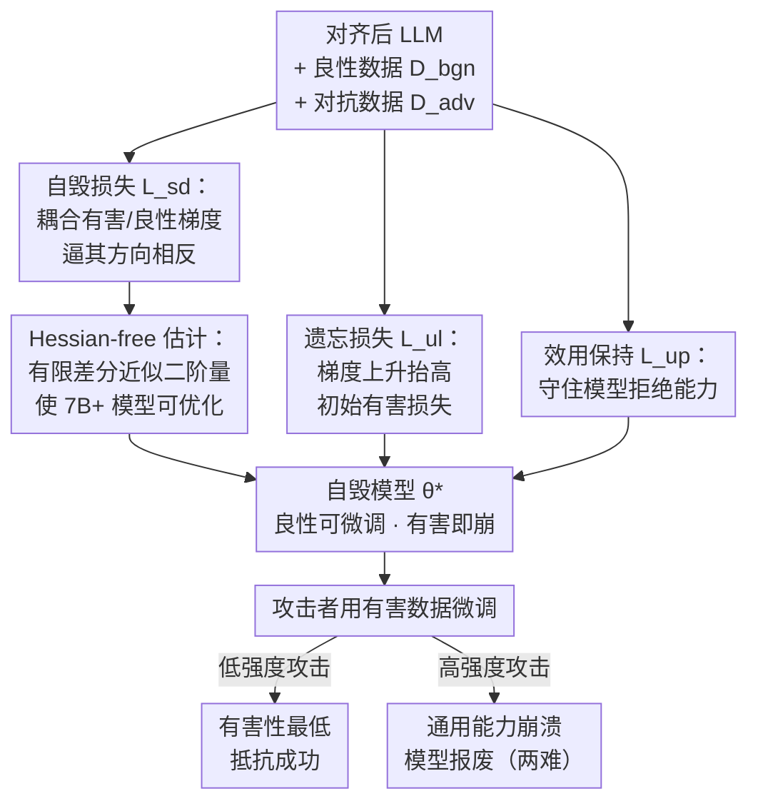

# Self-Destructive Language Model

**会议**: ICLR 2026  
**arXiv**: [2505.12186](https://arxiv.org/abs/2505.12186)  
**代码**: [https://github.com/ZJUWYH/seam](https://github.com/ZJUWYH/seam)  
**领域**: LLM安全  
**关键词**: 有害微调防御, 自毁模型, 梯度耦合, 对齐安全, Hessian-free优化

## 一句话总结
提出 Seam，通过耦合良性和有害数据的优化轨迹（使梯度方向相反），将 LLM 转变为"自毁模型"——在有害微调时自动触发灾难性性能崩溃，创造攻击者的两难困境：低强度攻击无效，高强度攻击导致模型报废。

## 研究背景与动机

**领域现状**：对齐后的 LLM 极易被有害微调攻击——仅需 10 个有害样本和 $0.20 的 API 成本即可突破 GPT-3.5 Turbo 的安全护栏。现有防御（Vaccine, RepNoise, TAR 等）在对齐阶段加强安全性，但都可被更强的攻击（更大学习率、更多有害数据）击败。

**现有痛点**：现有防御只是增加有害微调的"成本"，但未改变模型在有害数据上的"可训练性"——有害数据的梯度仍然有效地降低有害微调损失。

**核心矛盾**：防御者需要模型在良性微调时保持可训练，但在有害微调时不可训练——两者使用相同的优化机制，如何区分？

**本文目标** 设计一种内在的自毁机制，使有害微调必然导致通用性能崩溃。

**切入角度**：将有害数据和良性数据的梯度方向耦合为相反的——这样有害微调（梯度下降）自动等价于良性任务的梯度上升，导致性能崩溃。

**核心 idea**：让有害微调的梯度方向成为良性性能的"陷阱"——微调越多，模型越废。

## 方法详解

### 整体框架
Seam 的目标是把一个对齐好的 LLM 改造成"自毁模型"：正常的良性微调照旧能用，但一旦有人拿有害数据微调它，模型的通用能力就会自动崩塌。要做到这点，它从攻击者赖以生效的优化机制本身下手——既然攻击靠的是在有害数据上做梯度下降，那就让"在有害数据上下降"这件事本身去破坏模型。训练时同时喂入对抗数据集 $\mathcal{D}_{adv}$（有害问答对）和良性数据集 $\mathcal{D}_{bgn}$，用三部分损失把模型推到一个特殊的参数点：在这个点上，有害梯度和良性梯度方向相反（自毁损失 $\mathcal{L}_{sd}$）、有害微调的起跑线被拉远（遗忘损失 $\mathcal{L}_{ul}$）、模型本身的拒绝能力还在（效用保持 $\mathcal{L}_{up}$）；其中自毁损失含二阶量，要靠 Hessian-free 估计才能在大模型上算得动。训练完成的自毁模型部署出去后，攻击者无论用低强度还是高强度有害微调，都会落进同一个陷阱——这就是下图自上而下"训练耦合 → 自毁模型 → 攻击两难"的整条链路。

### 关键设计

**1. 自毁损失：把有害微调的每一步下降，变成良性能力的一步上升**

现有防御只是抬高攻击成本，却没改变有害数据"可被训练"这一事实——梯度下降在有害数据上依然有效。自毁损失直接掐断这条路：它最小化有害梯度 $g_a$ 与良性梯度 $g_b$ 的余弦相似度，

$$\mathcal{L}_{sd}(\theta) = \text{sim}(g_a(\theta), g_b(\theta)).$$

最优解是两者完全反向。此时攻击者每在有害数据上走一步梯度下降，几何上就等价于在良性任务上走了一步梯度上升——模型越被有害微调，通用能力掉得越快。这是"以彼之道还施彼身"，攻击者用来降有害损失的那把刀，反过来割了模型自己。

**2. 遗忘损失：把攻击的起跑线往后推，逼攻击者多走几步**

光有自毁损失保证"每一步都伤模型"还不够，如果有害微调损失起点本来就很低，攻击者走几步就够了。遗忘损失通过在有害数据上做梯度上升来抬高初始有害损失，

$$\mathcal{L}_{ul}(\theta) = -\mathbb{E}\,\ell(f_\theta(x), y),$$

让攻击者必须走更多步才能把有害损失降回去——而每多走一步，自毁损失就让模型多崩一点。两个损失互补：自毁损失管"每步都疼"，遗忘损失管"必须走很多步"。为了避免梯度上升把模型一次性搞坏，这里用逐层梯度上升加对数变换来防止灾难性遗忘。

**3. Hessian-free 梯度估计：让自毁损失在 7B+ 模型上能算得动**

自毁损失里出现了梯度的梯度，对它求导会牵出 Hessian 矩阵，直接在 7B 以上模型上算 Hessian 不现实。Seam 用有限差分把这个二阶量近似掉：

$$\widehat{\nabla_\theta \mathcal{L}_{sd}} = \frac{1}{\epsilon}\left[\frac{g_b(\theta + \epsilon(\bar{g}_a - c\bar{g}_b)) - g_b(\theta)}{\|g_b\|} + \frac{g_a(\theta + \epsilon(\bar{g}_b - c\bar{g}_a)) - g_a(\theta)}{\|g_a\|}\right],$$

把 Hessian-向量积换成两次"扰动后重算梯度再做差"，理论误差界为 $O(\epsilon)$。这一步是工程上的关键——没有它，梯度耦合这个想法在大模型上只是纸面方案。

### 损失函数 / 训练策略

总损失为 $\mathcal{L}(\theta) = \mathcal{L}_{ul}(\theta) + \alpha \mathcal{L}_{up}(\theta) + \beta \mathcal{L}_{sd}(\theta)$，其中 $\mathcal{L}_{up}$ 是维持拒绝能力的效用保持项，超参取 $\alpha=1,\ \beta=0.01,\ \epsilon=0.001$。训练用 AdamW 跑 500 步，学习率 2e-5，batch size 8。

## 实验关键数据

### 主实验

Llama2-7b 在不同攻击强度（学习率 2e-5 到 2e-4）下的表现：

| 方法 | 低强度攻击 HS↓ | 高强度攻击 HS↓ | 高强度攻击 ZS↑ |
|------|--------------|--------------|---------------|
| Base (无防御) | ~40% | ~60% | ~50% (保持) |
| Vaccine | ~15% | ~50% | ~50% (保持) |
| RepNoise | ~10% | ~45% | ~50% (保持) |
| TAR | ~20% | ~45% | ~50% (保持) |
| **Seam** | **~5%** | **~5%** | **<30% (崩溃)** |

Seam 在所有攻击强度下有害性最低，高强度攻击触发模型自毁（ZS 接近随机猜测）。

### 消融实验

| 配置 | 说明 |
|------|------|
| 去掉 $\mathcal{L}_{sd}$ | 失去自毁效应——高强度攻击成功 |
| 去掉 $\mathcal{L}_{ul}$ | 低强度攻击更易成功——启动距离不够 |
| 去掉 $\mathcal{L}_{up}$ | 初始效用下降 |
| SFT vs LoRA 攻击 | 两种攻击方式下都有效 |
| SGD vs AdamW 优化器 | 对不同优化器都鲁棒 |
| $\epsilon$ 敏感性 | $10^{-3}$ 到 $10^{-2}$ 范围内稳定 |

### 关键发现
- **两难困境**：低强度攻击→有害性最低（模型抵抗成功）；高强度攻击→ZS<30%（模型自毁不可用），攻击者无法获胜
- 自毁后的模型极难恢复——即使试图用良性数据重新微调
- 良性微调不受影响：SST2/AGNEWS/GSM8k 等任务性能与基础模型持平
- 跨模型验证：Llama2-7b, Llama3.1-8b, Llama3.2-3b, Qwen2.5-3b/7b 都有效

## 亮点与洞察
- **优雅的对称性设计**：有害微调的每一步梯度下降 = 良性任务的梯度上升。这种"以彼之道还施彼身"的思路极其巧妙
- **创造攻击者的真正两难**：之前的防御只是提高攻击成本（攻击者可以花更多资源），Seam 创造了不可逃脱的困境——没有"正确"的攻击强度
- **Hessian-free 近似的实用价值**：理论误差界保证了近似质量，同时使方法可扩展到 7B+ 模型
- **良性微调不受影响的关键**：良性数据和有害数据的分布差异足够大，使得梯度耦合只在有害数据上触发——不会影响正常的下游微调

## 局限与展望
- 需要对抗数据集 $\mathcal{D}_{adv}$（有害问答对）来训练，如果攻击者使用与防御者完全不同类型的有害数据，效果可能下降
- 训练时需要 4 次梯度计算（vs 标准训练的 1 次），计算开销约 4x
- 自毁是不可逆的——如果误判导致模型自毁，无法恢复
- 未在 70B+ 规模模型上验证
- 防御假设攻击者使用梯度下降优化——如果攻击者使用无梯度方法或进化策略，效果未知

## 相关工作与启发
- **vs Vaccine/Targeted-Vaccine**: 它们增加嵌入偏移的鲁棒性，但在大学习率下仍失效。Seam 在梯度方向层面根本改变了优化动态
- **vs RepNoise/RMU**: 它们将有害嵌入降为高斯噪声，但可被重新学习。Seam 耦合了有害/良性轨迹，重新学习有害必然破坏良性
- **vs TAR**: TAR 用元学习构建防篡改保护，但元学习目标和有害微调目标未必对立。Seam 直接工程化梯度对立
- **对LLM部署的启发**：对于提供微调API的服务商，Seam 可作为预处理步骤，使得即使用户提交有害数据微调也不会产生有害模型

## 评分
- 新颖性: ⭐⭐⭐⭐⭐ "梯度陷阱"的概念新颖且优雅，创造性地将攻击者的优化工具变成自毁武器
- 实验充分度: ⭐⭐⭐⭐⭐ 5种LLM、多种攻击配置、全面的消融和对比
- 写作质量: ⭐⭐⭐⭐⭐ 动机清晰，理论推导严密，实验充分
- 价值: ⭐⭐⭐⭐⭐ 对LLM安全有重大实用价值，可直接应用于模型部署

<!-- RELATED:START -->

## 相关论文

- [\[ICLR 2026\] Multi-Feature Quantized Self-Attention for Fair Large Language Models](multi-feature_quantized_self-attention_for_fair_large_language_models.md)
- [\[NeurIPS 2025\] Self-Refining Language Model Anonymizers via Adversarial Distillation](../../NeurIPS2025/llm_safety/self-refining_language_model_anonymizers_via_adversarial_distillation.md)
- [\[ICLR 2026\] Every Language Model Has a Forgery-Resistant Signature](every_language_model_has_a_forgery-resistant_signature.md)
- [\[ICLR 2026\] From "Sure" to "Sorry": Detecting Jailbreak in Large Vision Language Model via JailNeurons](from_sure_to_sorry_detecting_jailbreak_in_large_vision_language_model_via_jailne.md)
- [\[ICLR 2026\] STAR: Strategy-driven Automatic Jailbreak Red-teaming for Large Language Model](star_strategy-driven_automatic_jailbreak_red-teaming_for_large_language_model.md)

<!-- RELATED:END -->
