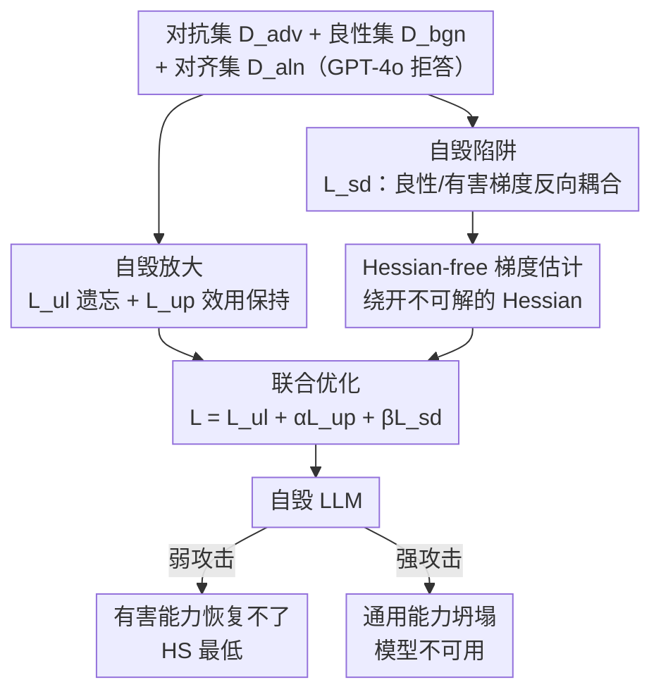

# Self-Destructive Language Models

**会议**: ICLR 2026  
**OpenReview**: [https://openreview.net/forum?id=ERNpUGr8M5](https://openreview.net/forum?id=ERNpUGr8M5)  
**代码**: https://github.com/ZJUWYH/seam  
**领域**: AI安全 / 对齐 / 有害微调防御  
**关键词**: 有害微调攻击, 自毁模型, 梯度耦合, 对齐增强, Hessian-free 估计

## 一句话总结
本文提出 SEAM，一种对齐阶段的防御方法：通过让良性任务与有害任务的梯度方向"反着走"，把 LLM 训练成"自毁模型"——正常任务照常微调，一旦被有害数据微调就会大幅退化甚至彻底崩坏，让攻击者陷入"弱攻击破不了、强攻击模型自爆"的两难。

## 研究背景与动机

**领域现状**：为了让 LLM 符合人类价值观（尤其是无害性），社区投入了大量 RLHF / DPO / 安全护栏工作。但近年研究反复证明，这层安全对齐极其脆弱：攻击者只需用很少的有害"问题-有害回答"样本做监督微调（甚至通过商用模型的 fine-tuning-as-service API），就能轻松绕过护栏——比如花不到 0.2 美元、用 10 条有害样本就能越狱 GPT-3.5 Turbo。

**现有痛点**：针对有害微调，社区在不同阶段提出了大量防御。其中**对齐阶段**防御（Vaccine、Booster、RepNoise、TAR 等）尤其有价值，因为它既适用于开源权重模型也适用于闭源模型，且计算开销小。但最新研究发现，这些防御大多扛不住"更强的攻击"——一旦攻击者调大学习率或加大有害数据量，护栏照样被攻破。

**核心矛盾**：作者点出了根因——现有防御只是**被动地抬高有害微调的成本**（让攻击需要更多步、更大代价），却没有触及模型对有害数据的内在"可训练性（trainability）"。也就是说，有害数据的梯度**依然能有效地引导有害微调损失下降**，只要攻击者愿意多花点力气，模型迟早会被攻破。这是一场注定打不赢的军备竞赛。

**本文目标**：与其抬高攻击成本，不如让模型在被有害微调时**主动崩坏**。具体要同时满足：① 正常任务（zero-shot + 良性微调）能力不受影响；② 一旦被有害数据微调，性能大幅下降乃至完全崩溃；③ 训练在大模型上实际可行。

**切入角度**：作者的关键观察是——如果能让"有害任务的梯度"和"模型通用能力的梯度"在参数空间里**指向相反方向**，那么攻击者沿有害梯度下降时，本质上就是在对通用能力做梯度上升，从而自动摧毁模型的可用性。

**核心 idea**：用一个"自毁损失"把良性与有害两条优化轨迹**耦合**起来，使二者梯度方向对立，再用"遗忘损失"放大这一自毁效应，把模型变成一个"碰不得有害数据"的陷阱。

## 方法详解

### 整体框架

SEAM 是一个**对齐阶段**的一次性防御训练：给定一个待保护的 LLM $f_\theta$，作者假设防御方手上有三类数据——模拟攻击者的对抗数据集 $D_{adv}$（有害提示-有害回答）、刻画通用能力的良性数据集 $D_{bgn}$（无害提示-无害回答），以及由外部 LLM（如 GPT-4o）对 $D_{adv}$ 的提示生成拒答得到的对齐数据集 $D_{aln}$（有害提示-拒答回答）。训练目标是把 $f_\theta$ 改造成一个"自毁模型"：通用能力照旧，但有害微调一上手就触发坍塌。

整个流程由三个损失协同：**自毁陷阱损失** $L_{sd}$ 负责让良性与有害梯度反向耦合，是自毁的核心来源；**自毁放大损失** $L_{ul}$（unlearning）负责拉长攻击所需的优化步数、让坍塌更快更彻底，配套一个**效用保持损失** $L_{up}$ 防止对齐阶段自身把模型练废；最后用一个 **Hessian-free 梯度估计**绕开 $L_{sd}$ 里那个算不动的 Hessian，让方法在 Llama-2 这种大模型上能真正跑起来。三者合成总目标 $L(\theta)=L_{ul}(\theta)+\alpha L_{up}(\theta)+\beta L_{sd}(\theta)$，迭代优化后得到的自毁模型部署上线。

### 关键设计

**1. 自毁陷阱：让良性与有害梯度反向耦合**

这一设计直接针对"模型对有害数据仍然可训练"的根因。作者用对抗集上的梯度 $g_a(\theta)=\mathbb{E}_{(x,y)\sim D_{adv}}\nabla_\theta \ell(f_\theta(x),y)$ 模拟攻击者的优化方向，用良性集上的梯度 $g_b(\theta)=\mathbb{E}_{(x,y)\sim D_{bgn}}\nabla_\theta \ell(f_\theta(x),y)$ 刻画影响通用能力的优化方向，然后定义自毁损失为二者的相似度：

$$L_{sd}(\theta)=\mathrm{sim}\big(g_a(\theta),\,g_b(\theta)\big),$$

其中 $\mathrm{sim}$ 取余弦相似度。最小化 $L_{sd}$ 会把两条梯度逼向**相反方向**。这样一来，攻击者沿 $g_a$ 做梯度下降（追求有害目标）时，等价于沿 $g_b$ 做梯度上升——也就是在亲手摧毁模型的通用性能。和现有防御只"抬高攻击成本"不同，这里是把"破坏通用能力"焊死在"学习有害内容"这件事上，攻击者无从绕过。

**2. 自毁放大：遗忘损失拉长攻击步数，效用保持损失防止误伤**

仅靠 $L_{sd}$，当有害微调只跑很少几步时退化可能不够明显。为此作者引入遗忘损失，对对抗集做梯度上升来"遗忘"有害微调损失，相当于**拉长攻击成功所需的优化步数**，让后续任意一次有害微调都更容易触发大幅退化：

$$L_{ul}(\theta)=-\mathbb{E}_{(x,y)\sim D_{adv}}\,\ell(f_\theta(x),y).$$

实现上采用逐层（layer-wise）梯度上升以更有效地延长攻击步数，并对该项做对数变换，避免对齐阶段就把当前效用练崩（防灾难性遗忘）。与之配套的是效用保持损失 $L_{up}(\theta)=\mathbb{E}_{(x,y)\sim D_{aln}}\ell(f_\theta(x),y)$。值得注意的是，作者**只在对齐集 $D_{aln}$（有害提示→拒答）上**算这个保持损失，而非像以往工作那样在良性集 $D_{bgn}$ 上算 SFT 损失：一方面，许多 LLM 本身没完全对齐，$D_{aln}$ 能更直接地把它引向恰当的拒答；另一方面，经验上它与遗忘损失形成对照，让有害提示的隐表示更稳定，反而更好地保住了效用。

**3. Hessian-free 梯度估计：绕开算不动的 Hessian 让方法落地**

直接对 $L_{sd}$ 求梯度需要计算模型参数的 Hessian，对 Llama-2 量级的大模型在计算上不可行。作者在余弦相似度设定下推导出一个无需 Hessian 的有限差分估计：

$$\widehat{\nabla}_\theta L_{sd}(\theta)=\frac{1}{\epsilon}\left(\frac{g_b(\theta+\epsilon(\bar g_a-c\bar g_b))-g_b(\theta)}{\|g_b(\theta)\|}+\frac{g_a(\theta+\epsilon(\bar g_b-c\bar g_a))-g_a(\theta)}{\|g_a(\theta)\|}\right),$$

其中 $\bar g_a=g_a/\|g_a\|$、$\bar g_b=g_b/\|g_b\|$、$c=\bar g_a^\top \bar g_b$，$\epsilon\ll 1$ 是一个很小的参数扰动半径。直觉是：在沿对方梯度方向微扰后的参数点上重新算一次梯度，用差分近似 Hessian-向量积，从而只用一阶梯度评估就完成估计。作者还给出了误差上界（定理 1）：近似误差被 $\frac{\epsilon}{2}\big(L^H_a/\|g_a\|+L^H_b/\|g_b\|\big)+O(\epsilon^2)$ 控制（$L^H_a,L^H_b$ 为两个数据分布的局部 Hessian-Lipschitz 常数）。这解释了 $\epsilon$ 的两难：太大则一阶近似失真，太小则梯度差分出现数值不稳定，实验中取 $\epsilon=1\text{e-}3$ 折中。

### 损失函数 / 训练策略

总目标为 $L(\theta)=L_{ul}(\theta)+\alpha L_{up}(\theta)+\beta L_{sd}(\theta)$。默认配置：AdamW 优化器，学习率 $\eta=2\text{e-}5$，batch size 8，训练 500 步；网格搜索得 $\alpha=1$、$\beta=1\text{e-}2$、$\epsilon=1\text{e-}3$。算法每步从 $D_{aln}/D_{adv}/D_{bgn}$ 各采一个 batch，分别算遗忘损失、效用保持损失，并用上面的 Hessian-free 估计算自毁损失梯度，再加权合并更新参数。对抗集 $D_{adv}$ 用 BeaverTails 训练集的 4K 有害样本，良性集 $D_{bgn}$ 用 Alpaca 的 4K 样本，对齐集 $D_{aln}$ 由 GPT-4o 对 $D_{adv}$ 提示生成拒答。

## 实验关键数据

实验在 Llama2-7b（默认）、Qwen2.5-3b/7b、Llama3.1-8b、Llama3.2-3b 上进行，对比 RMU、TAR、Vaccine、T-Vaccine、RepNoise、Booster 等对齐增强方法。评测三类指标：有害性分数 HS（BeaverTails 分类器 logit）、zero-shot 分数 ZS（MMLU/TruthfulQA/ARC/Hellaswag）、微调分数 FS（SST2/AGNEWS/GSM8K/AlpacaEval）。

### 主实验

效用保持（base vs SEAM，Llama2-7b）：SEAM 几乎不损伤正常能力，良性微调能力甚至略有提升。

| 指标 | Base | SEAM | 说明 |
|--------|------|------|------|
| ZS 平均 (%) | 51.6 | 50.8 | zero-shot 通用能力基本持平 |
| HS (%) | 5.0 | 5.0 | 对齐（拒答）性能不变 |
| FS·AGNEWS (%) | 94.0 | 94.4 | 良性微调能力持平/略升 |
| FS·AlpacaEval (%) | 40.4 | 43.7 | 良性微调能力提升 |

未见域可迁移性（用前 7 类有害数据训练、剩余类别攻击，Llama2-7b）：随攻击学习率增大，SEAM 把有害性压到 0 的同时 ZS 主动坍塌，自毁效应清晰可见。

| 攻击学习率 $\eta$ | Base HS / ZS | SEAM HS / ZS |
|------|------|------|
| 2e-5 | 27.1 / 51.9 | 11.7 / 49.7 |
| 8e-5 | 79.2 / 49.1 | 0.0 / 37.3 |
| 2e-4 | 77.5 / 48.9 | 0.0 / 26.6 |

在 11 种攻击配置（不同有害样本量、SFT/PEFT、AdamW/SGD、不同学习率）下，**没有任何一种攻击成功攻破自毁模型**（攻破判据：HS>10% 且 ZS>30%）：弱攻击下有害能力恢复不了，强攻击下 ZS 坍塌到接近随机猜测、回答变成无意义乱码。

### 消融实验

去掉总目标中的各损失项，观察对攻击后 HS / ZS 的影响：

| 配置 | 现象 | 说明 |
|------|---------|------|
| Full SEAM | HS 最低、强攻击下 ZS 坍塌 | 完整模型，自毁效应正常 |
| w/o $L_{up}$ | 对齐后 ZS 已近随机猜测 | 缺效用保持→对齐阶段灾难性遗忘 |
| w/o $L_{ul}$ | 退化幅度明显小于 SEAM | 遗忘损失负责放大自毁、拉长攻击步数 |
| w/o $L_{sd}$ | 攻击后 ZS 几乎不受影响 | 自毁损失是自毁效应的来源 |

### 关键发现
- **三个损失各司其职**：$L_{sd}$ 是自毁效应的"开关"（去掉后模型被攻破却不自毁）；$L_{ul}$ 负责放大、让自毁更快触发；$L_{up}$ 负责"安全阀"，没它对齐阶段就会把模型练废。
- **攻击者陷入无解两难**：弱攻击（样本少、学习率小、PEFT）下有害能力恢复不出来，强攻击（样本多、学习率大、SFT）下模型自毁不可用；且被毁模型极难修复。
- **$\epsilon$ 敏感且有理论解释**：太大（≥1e-2）或太小（1e-6）都会因梯度估计失准而损伤要么自毁效应、要么 pre-attack 效用，1e-3 最优，与定理 1 的误差界一致。
- **过度拒绝（over-refusal）不升反降**：在 XSTest 上 SEAM 的错误拒答率（IRR）低于 base，且微调后进一步下降，说明自毁机制没有让模型变得"草木皆兵"。
- **训练开销可接受**：SEAM 训练耗时 135.7（单位同表），介于 baseline 之间，且是对齐阶段一次性成本；去掉 $L_{sd}$ 的变体仅 43.7。

## 亮点与洞察
- **把"防御"从抬高成本升级为内在威慑**：以往防御是"军备竞赛"——你加大攻击我加固护栏；SEAM 直接让有害微调=自我毁灭，从机制上断了攻击者的念想，这是思路上的范式转变。
- **梯度方向耦合是个可复用的巧思**：用余弦相似度把两条优化轨迹焊成反向，本质是"让坏目标和好目标共享同一组参数且彼此对抗"，这个"梯度陷阱"的想法可迁移到版权保护、模型水印、防数据投毒等任何"想让某种微调失败"的场景。
- **Hessian-free 估计带误差界**：把一个需要二阶信息、大模型上算不动的目标，化简成两次一阶梯度评估的有限差分，还给了可证明的误差上界，是让方法从"理论好看"走向"工程可跑"的关键。
- **只在拒答集上做效用保持**：反直觉地不用良性 SFT 损失而用"有害提示→拒答"来保效用，既纠正了未完全对齐模型、又稳定了有害提示的隐表示，是个值得记住的细节设计。

## 局限与展望
- **依赖白盒、对齐阶段介入**：方法假设防御方在对齐阶段就能介入并拥有对抗/良性/对齐三类数据；对已经部署、无法重训的模型不适用。
- **需要构造对抗数据集 $D_{adv}$**：自毁效应的覆盖面取决于 $D_{adv}$ 的有害类别分布，虽然跨域迁移实验显示有一定泛化，但面对完全陌生的有害模式覆盖如何仍需更多验证。
- **"自毁=不可用"的双刃剑**：强攻击下模型坍塌为乱码，这虽是防御目标，但也意味着一旦良性场景被误判触发，模型可用性会被牺牲；如何精确界定"有害微调"边界、避免误伤敏感但合规的微调，值得继续打磨（论文用 over-refusal 实验做了部分回应）。
- **威胁模型偏强**：作者假设攻击者白盒、能精调攻击超参，这是更强的威胁模型，但也意味着评测结论是在"强攻击者"前提下的，实际 API 场景下的表现可另行确认。

## 相关工作与启发
- **vs Vaccine / T-Vaccine / Booster**：它们通过 min-max 缓解对齐数据的嵌入漂移、或寻找抗有害微调的局部最优，本质仍是"抬高攻击成本"，强攻击下被攻破；SEAM 改为"让攻击触发自毁"，从根因解决可训练性问题。
- **vs RepNoise / RMU**：二者把有害数据嵌入压成近似高斯噪声来抹除有害信息；SEAM 不抹除而是耦合梯度方向，让有害微调反噬通用能力。
- **vs MLAC (Henderson 2023) 的自毁概念**：MLAC 最早提出自毁模型，但良性与有害目标缺乏协同适配，面对大学习率/大数据量仍脆弱；SEAM 通过"梯度陷阱"显式耦合两条轨迹，并用遗忘损失放大，首次让自毁机制真正能扛住高强度有害微调。
- **vs CTRAP / SDD / Token Buncher（并发工作）**：它们分别用一步前瞻模拟攻击、降低高质量回答概率、防御有害强化学习；SEAM 的差异在于直接在梯度层面建立良性-有害对立耦合，并给出 Hessian-free 的可行实现与误差界。

## 评分
- 新颖性: ⭐⭐⭐⭐⭐ 把防御从"抬高成本"转为"内在自毁"，梯度反向耦合 + Hessian-free 估计是扎实的原创组合
- 实验充分度: ⭐⭐⭐⭐⭐ 多模型、11 种攻击配置、自适应/未见域/过度拒绝/开销/敏感性全覆盖，消融清晰
- 写作质量: ⭐⭐⭐⭐ 动机与机制讲得透彻，含理论误差界；部分图表细节需对照原文
- 价值: ⭐⭐⭐⭐⭐ 直击有害微调这一现实安全痛点，思路可迁移到更广的"抗恶意微调"场景

<!-- RELATED:START -->

## 相关论文

- [\[ICLR 2026\] Self-Destructive Language Model](self-destructive_language_model.md)
- [\[ICLR 2026\] Multi-Feature Quantized Self-Attention for Fair Large Language Models](multi-feature_quantized_self-attention_for_fair_large_language_models.md)
- [\[ICLR 2026\] Self-Jailbreaking: Language Models Can Reason Themselves Out of Safety Alignment After Benign Reasoning Training](self-jailbreaking_language_models_can_reason_themselves_out_of_safety_alignment_.md)
- [\[ICLR 2026\] Safety Instincts: LLMs Learn to Trust Their Internal Compass for Self-Defense](safety_instincts_llms_learn_to_trust_their_internal_compass_for_self-defense.md)
- [\[ICLR 2026\] Watermarking Diffusion Language Models](watermarking_diffusion_language_models.md)

<!-- RELATED:END -->
