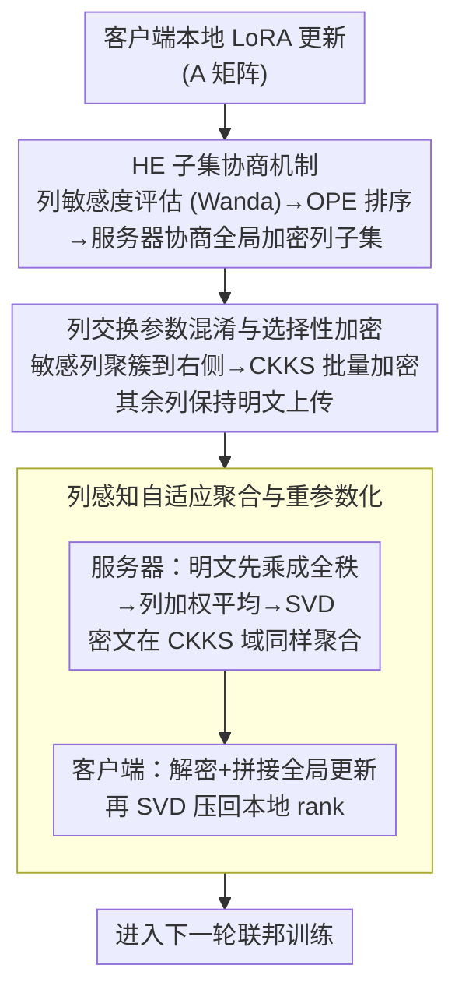

# SHE-LoRA: Selective Homomorphic Encryption for Federated Tuning with Heterogeneous LoRA

**会议**: ICLR 2026  
**arXiv**: [2505.21051](https://arxiv.org/abs/2505.21051)  
**代码**: [GitHub](https://github.com/liyan2015/SHE-LoRA)  
**领域**: AI安全/隐私保护  
**关键词**: 联邦学习, 同态加密, LoRA, 隐私保护, 异构设备

## 一句话总结
提出SHE-LoRA——将选择性同态加密(SHE)与LoRA结合用于跨设备联邦LLM微调：基于参数敏感度的列级加密子集协商 + 列交换参数混淆 + 列感知自适应聚合，在保持与非隐私基线可比的模型性能同时，通信开销减少99.71%、加密时间减少99.87%，完全抵御SOTA梯度反演攻击DAGER。

## 研究背景与动机

**领域现状**：联邦微调LLM需要在保持数据隐私的同时提升领域特定性能。LoRA因高效性成为联邦PEFT的主流选择，但研究表明传输的参数/梯度可被梯度反演攻击(DAGER)重建私有数据。

**现有痛点**：(1) DP在LoRA矩阵乘法中噪声被放大，损害模型性能；(2) MPC需复杂同步协议，不适合异构设备；(3) 现有SHE方法两个问题——LoRA矩阵乘法导致加密位置扩展，异构客户端加密子集合并导致密文膨胀。

**核心矛盾**：跨设备场景下客户端硬件能力、数据分布、加密预算各不相同。naive的FedAvg分别聚合A和B矩阵在数学上不等价于聚合BA乘积，且异构设备的不同加密位置在聚合时union扩大导致密文膨胀。

**切入角度**：(a) 只加密A矩阵(直接作用于用户数据更易泄露)；(b) 按列评估参数重要性(整列加密避免矩阵乘法导致的扩展)；(c) 服务器协商全局加密子集控制密文膨胀；(d) 列交换聚簇加密/非加密参数提高效率。

**核心 idea**：通过按列的参数敏感度评估+全局子集协商+列交换混淆+列感知聚合，在异构联邦LoRA中实现极低开销的强隐私保护。

## 方法详解

### 整体框架
SHE-LoRA 要在硬件能力、数据分布、加密预算都不一样的跨设备场景下，给联邦 LoRA 微调加上既强又便宜的隐私保护。它的核心判断是：不必把整个 LoRA 更新都同态加密，只挑最敏感的少数参数列加密就够了。一轮训练这样转：每个客户端先评估自己 A 矩阵各列的敏感度，把排序结果与服务器协商出一个全局加密列子集；接着把要加密的列通过"列交换"聚簇到一起，用 CKKS 批量加密，未加密的列保持明文上传；服务器把明文部分和密文部分分别做列感知聚合；客户端最后解密、拼接、再用 SVD 把全局更新压回自己本地的 rank。整条流水线只在最敏感的一小撮参数上付出加密代价，因此开销极低，却足以让梯度反演攻击完全失效。

### 关键设计

**1. HE 子集协商机制：让异构客户端协调出一个全局加密列子集，而不是各加各的**

跨设备场景里每个客户端能承受的加密预算不同，如果各自挑各自的敏感列，服务器聚合时这些位置会被 union 扩大，密文随之膨胀。SHE-LoRA 先让每个客户端用 Wanda 方法按列评估敏感度——某一列的得分综合了该列权重幅度和对应输入激活的范数，$S_j = \sum_k |W_{kj}| \cdot \|x_j\|_2$，得分高说明这一列对输出影响大、泄露风险也大。客户端把敏感度排序用 OPE（保序加密）加密后发给服务器，服务器在看不到具体数值的前提下仍能比较大小，维护一个按出现频率排序的 Common 列表和一个按敏感度排序的 Sensitivity 列表，据此为每个客户端协商出它能承受的全局子集。这里有两个关键取舍：一是**按列加密而非按元素**，因为 LoRA 的矩阵乘法会把单个元素的密文扩展到整列，按列加密从根上避免了这种扩展；二是用 OPE 让排序可比却不暴露真实敏感度数值，既能协商又保护了参数位置。

**2. 列交换参数混淆与选择性加密：把散落的加密列聚到一起再批量加密，顺带把它当混淆用**

协商出来的加密列在 A 矩阵里往往是散开的，零散位置会增加分块数量和加密开销。SHE-LoRA 对 A 矩阵做列交换，把所有要加密的列连续聚簇到矩阵右侧，再用 CKKS 对这块连续区域分块批加密。这一步同时拿到三重好处：批量加密利用 CKKS 的向量化能力大幅压低加密时间；左侧未加密的列可以直接参与明文矩阵运算，不进同态计算路径；而列交换本身打乱了参数的原始排列，相当于给攻击者加了一层混淆，增加重建难度。换句话说，同一个列交换操作既是工程上的提效手段，又是安全上的额外屏障。

**3. 列感知自适应聚合与重参数化：在加密列数各不相同的客户端之间，做数学上正确的 LoRA 聚合**

直接对 A、B 两个矩阵分别做 FedAvg 是错的——分别平均 $A$ 和 $B$ 再相乘，并不等于平均各自的 $BA$ 乘积。SHE-LoRA 改成先乘后分解：明文部分先还原成全秩更新 $\Delta W_i^{plain} = B_i A_i^{plain}$，按列加权平均后再 SVD 分解，并按各客户端自己的 rank 切片；密文部分在 CKKS 域里做同样的加权聚合。客户端拿到结果后解密，把明文与密文两半拼回完整矩阵 $B_g = [B_p, B_c]$、$A_g = [A_p; A_c]$，最后再做一次 SVD 把全局更新调整回本地 rank。先乘成全秩更新再 SVD 这一步，保证了聚合后的 LoRA 乘积在数学上等价于真正的更新平均，论文据此证明聚合不会丢失有意义的模型更新，也让加密列数不一致的异构客户端能落到同一套全局更新上。

### 损失函数 / 训练策略
- 50个客户端，200轮联邦训练，Dirichlet alpha=0.3的Non-IID划分
- 4种设备类型：rank 8-32，加密预算0.125%-1.6%
- HE实现：TenSEAL CKKS，多项式度8192

## 实验关键数据

### 主实验：隐私攻击防御 (DAGER攻击, SST2数据集)

| 方法 | B=4 R-1 | B=8 R-1 | B=16 R-1 |
|------|---------|---------|----------|
| Flex-LoRA(无保护) | 95.18 | 61.14 | 10.27 |
| Flex-LoRA-DP | 86.25 | 80.28 | 68.62 |
| MaskCrypt(同等HE开销) | 89.16 | 61.49 | 10.91 |
| **SHE-LoRA** | **0.72** | **0.98** | **0.0** |

### 消融：效率对比 (OpenLLaMA-3B)

| 指标 | 全加密Baseline | MaskCrypt | SHE-LoRA |
|------|---------------|----------|---------|
| 加密时间 | ~480s | ~50s | ~0.6s |
| 通信开销 | 最高 | 中等 | 最低(-99.71%) |
| 时间波动 | [311s,653s] | [1.6s,105s] | 几乎无波动 |

### 关键发现
- **极低加密即可完全防御**: 仅加密0.125%参数即可使DAGER完全失败(R-1=0)
- **列交换是安全关键**: 扰动梯度正交补在LoRA低秩空间的结构，导致DAGER的span check失败
- **模型性能无损**: 在GLUE/MMLU上与非隐私SOTA性能可比
- **互信息验证**: Max策略(优先加密最重要参数)的互信息下降速率远快于Min/Random
- **MaskCrypt需100x开销**: 才能匹配SHE-LoRA的安全水平

## 亮点与洞察
- **按列加密**精准命中了LoRA矩阵乘法导致加密扩展的根源——整列加密既高效又避免扩展
- **协商机制**巧妙平衡异构设备的隐私需求和加密能力，避免密文膨胀
- **列交换双重作用**：工程优化(批加密效率) + 安全增强(参数混淆)，一举两得
- **安全保证有理论支撑**(Bayesian CRLB)——选择性加密最敏感参数最大化重建误差下界

## 局限与展望
- 假设semi-honest adversary，未处理恶意行为(投毒/后门)
- 多方HE场景需multi-key HE扩展
- OPE暴露顺序信息，可以用更强的ORE/MPC替代
- 更复杂的生成任务待探索

## 相关工作与启发
- **vs Flex-LoRA**: 性能最好的异构联邦LoRA但无隐私保护。SHE-LoRA在保持可比性能时提供强隐私
- **vs MaskCrypt**: SOTA SHE联邦方法但不考虑LoRA矩阵乘法扩展和异构膨胀，需100x开销才能匹配SHE-LoRA安全水平
- **vs DP**: DP在LoRA中噪声被矩阵乘法放大，且DAGER攻击下防御效果远不如SHE

## 评分
- 新颖性: ⭐⭐⭐⭐ 首次将SHE与异构LoRA联邦微调结合，列级加密+协商设计创新
- 实验充分度: ⭐⭐⭐⭐⭐ 多模型多任务，安全性/效率/性能三维度全面
- 写作质量: ⭐⭐⭐⭐ 问题阐述清晰，motivation chain严密
- 价值: ⭐⭐⭐⭐ 对联邦LLM微调的实际部署有重要意义

<!-- RELATED:START -->

## 相关论文

- [\[ICLR 2026\] Heterogeneous Federated Fine-Tuning with Parallel One-Rank Adaptation](heterogeneous_federated_fine-tuning_with_parallel_one-rank_adaptation.md)
- [\[NeurIPS 2025\] Adaptive LoRA Experts Allocation and Selection for Federated Fine-Tuning](../../NeurIPS2025/llm_safety/adaptive_lora_experts_allocation_and_selection_for_federated_fine-tuning.md)
- [\[AAAI 2026\] FedALT: Federated Fine-Tuning through Adaptive Local Training with Rest-of-World LoRA](../../AAAI2026/llm_safety/fedalt_federated_fine-tuning_through_adaptive_local_training_with_rest-of-world_.md)
- [\[NeurIPS 2025\] FedSVD: Adaptive Orthogonalization for Private Federated Learning with LoRA](../../NeurIPS2025/llm_safety/fedsvd_adaptive_orthogonalization_for_private_federated_learning_with_lora.md)
- [\[ICLR 2026\] JailbreakLoRA: Your Downloaded LoRA from Sharing Platforms might be Unsafe](jailbreaklora_your_downloaded_lora_from_sharing_platforms_might_be_unsafe.md)

<!-- RELATED:END -->
