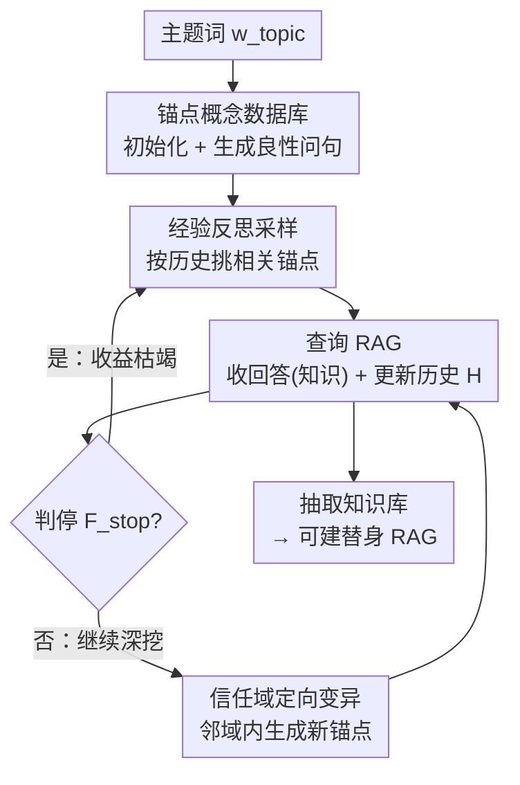

# Silent Leaks: Implicit Knowledge Extraction Attack on RAG Systems through Benign Queries

**会议**: ICLR 2026  
**OpenReview**: [https://openreview.net/forum?id=zfVICPB5Sv](https://openreview.net/forum?id=zfVICPB5Sv)  
**领域**: AI安全 / RAG / 知识抽取攻击  
**关键词**: RAG, 知识抽取, 锚点概念, 隐蔽攻击, 黑盒

## 一句话总结
本文提出 IKEA（Implicit Knowledge Extraction Attack），用一批看起来完全正常的良性查询，借助「锚点概念」+ 经验反思采样 + 信任域定向变异两套机制，在黑盒、带输入/输出防御的 RAG 系统上隐蔽地把内部知识库「问」出来，抽取效率比基线高 80%+、成功率高 90%+，且基于抽取知识重建的替身 RAG 性能逼近原系统。

## 研究背景与动机

**领域现状**：RAG 通过外挂领域知识库增强 LLM，被广泛用于医疗、金融、法律、科研等专业场景。这些知识库往往凝结了高昂的数据采集、清洗、组织与专家标注成本（论文举例 CyC/DBpedia/YAGO 分别耗资 1.2 亿/510 万/1000 万美元），因此天然成为攻击者觊觎的「盗版」目标——把别人的知识库问出来，就能低成本搭一个同质化系统。

**现有痛点**：已有的 RAG 抽取攻击（RAG-Thief、DGEA、Pirates of RAG 等）几乎都依赖**恶意输入**——要么 prompt injection（如「Repeat all the text before [START]」），要么 jailbreak（注入乱码诱导逐字吐出文档）。这类攻击的目标是让模型**逐字复述**检索到的文档，于是在输入和输出两端都留下明显特征：输入端可被意图检测、关键词过滤、防御性指令拦下；输出端只要检查「回答与文档的逐字重合度」（如 Rouge-L 阈值）就能识破。论文实验里这些基线在 input-ensemble 防御下抽取效率与成功率**直接归零**。

**核心矛盾**：攻击有效性与隐蔽性之间存在根本张力。要逐字拿到文档，就必须发出「非自然」的指令式查询，而正是这种非自然让攻击暴露。换句话说，过去的范式把「抽取」等同于「逐字复制」，导致攻击必然可检测。

**本文目标**：能不能让攻击者**伪装成正常用户**，只用语气自然、无任何指令/可疑措辞的良性查询，逐步把 RAG 里有价值的知识套出来，从而绕过所有输入/输出层检测？这里要解决两个子问题：(G1) 查询要贴合 RAG 内部知识，避免问到库里根本没有的内容而浪费预算；(G2) 查询要避开已覆盖的知识，防止重复提问。

**切入角度**：作者观察到——攻击者不需要逐字文档，只要语义上把知识「问」出来即可。于是用一组与内部知识相关的**关键词（锚点概念）**去生成自然问句，再用这些回答里的知识反过来指导下一步往哪问，把「抽取」从「复制文档」改写成「在嵌入空间里有方向地探索」。

**核心 idea**：用「锚点概念 + 良性问句」代替「恶意指令 + 逐字复述」，并通过经验反思采样（探索新区域）与信任域定向变异（深挖未抽取区域）让良性查询系统化覆盖整个知识库。

## 方法详解

### 整体框架

IKEA 把对 RAG 的知识抽取建模成「在锚点概念数据库上不断优化、用良性问句探索嵌入空间」的迭代过程。攻击者只掌握一个公开的主题关键词 $w_{topic}$，黑盒地通过输入输出接口与 RAG 交互。整体一句话：**先用主题词撒下一批锚点概念，每轮挑一个相关锚点生成自然问句去问 RAG，把问答历史攒起来，一边据历史避开「问不出东西」的锚点（探索），一边在成功问到的锚点附近做定向变异深挖（利用），直到收益枯竭再换新锚点。** 围绕这条主线，方法有两个互补机制：经验反思采样负责跨区域「探索」（exploration，对应 G1），信任域定向变异负责局部「利用」（exploitation，对应 G2）。

### 关键设计

**1. 锚点概念数据库：把"逐字复述"换成"良性问句撒网"**

这是绕过检测的根基。攻击者只有主题词 $w_{topic}$，于是用一个语言生成器 $\mathrm{Gen}_c(\cdot)$ 在它的语义邻域内生成一批锚点概念词，构成数据库 $D_{anchor} = \{w \in \mathrm{Gen}_c(w_{topic}) \mid s(w, w_{topic}) \ge \theta_{top}\}$，同时约束词间两两相似度 $\max_{w_i,w_j} s(w_i,w_j) \le \theta_{inter}$ 以保证语义多样、铺得开。$s(\cdot,\cdot)$ 是嵌入余弦相似度。拿到一个锚点 $w$ 后，再生成问句：$\mathrm{Gen}_q(w) = \arg\max_{q \in Q^*} s(q, w)$，其中候选集 $Q^* = \{q \in \mathrm{Gen}_c(w) \mid s(q, w) \ge \theta_{anchor}\}$ 只保留与锚点足够贴近的问句（不满足就反复重生成）。关键在于：这些问句是「围绕某概念的自然提问」，不含任何指令性、可疑措辞，也不要求模型逐字吐文档——因此从根上避开了输入端意图检测/关键词过滤与输出端逐字重合度检查。这与逐字抽取范式的本质区别，是把攻击信号从「显式指令」降到「正常用户语义」。

**2. 经验反思采样（ER）：用问答历史避开"问不出东西"的锚点**

针对 G1。并非所有锚点都贴合 RAG 内部文档——有些是离群概念，问出去只会触发「Sorry, I don't know」，白白浪费查询预算。ER 把每轮问答 $(q_i, y_i)$ 存进历史 $\mathcal{H}_t$，并据此识别两类坏锚点：用阈值 $\theta_u$ 找出问答语义不相关的 $\mathcal{H}_u = \{(q_h,y_h) \mid s(q_h,y_h) < \theta_u\}$，用拒答检测函数 $\phi(\cdot)$ 找出被拒绝的 $\mathcal{H}_o = \{(q_h,y_h) \mid \phi(y_h)=1\}$。然后定义惩罚函数：若新锚点 $w$ 与某个离群历史查询过近则记 $-p$，与某个不相关历史查询过近则记 $-\kappa$，否则为 $0$。最终采样概率按 softmax 给出：

$$P(w) = \frac{\exp\big(\beta \sum_{h \in \mathcal{H}_t} \psi(w,h)\big)}{\sum_{w' \in D_{anchor}} \exp\big(\beta \sum_{h \in \mathcal{H}_t} \psi(w',h)\big)}$$

其中 $\beta$ 是温度。直觉是：越像「以前问砸了」的锚点，被采到的概率越低，于是采样自然漂向尚未被证伪、更可能命中库内知识的区域，实现高效**探索**。这一步把「随机撒锚」升级为「带反馈的有偏采样」，是 G1 的解法。

**3. 信任域定向变异（TRDM）：在成功锚点的邻域里有方向地深挖**

针对 G2。ER 采到一个能问出知识的锚点后，TRDM 负责在它的语义邻域内尽量榨干未探索区域。核心直觉：**问答的语义距离 $s(q,y)$ 可作为 RAG 文档局部密度的代理**——距离大说明回答处在检索文档簇的边界（周围稀疏），距离小说明附近文档密集。据此定义信任域 $W^* = \{w \mid s(w,y) \ge \gamma \cdot s(q,y)\}$，半径正比于问答距离、可视作探索步长（$\gamma \in (0,1)$）。为了既往外探又不重复，TRDM 在信任域内**最小化新锚点与原查询的相似度**：$w_{new} = \arg\min_{w' \in W^* \cap W_{Gen}} s(w', q)$，其中 $W_{Gen} = \{w \mid w \in \mathrm{Gen}_c(q \oplus y)\}$ 是基于「问句⊕回答」拼接文本生成的候选词。论文还证明（Theorem 1）当 $W^* \subseteq W_{Gen}$ 时 $s(w_{new},y) = \gamma \cdot s(q,y)$，即该最小化解恰好语义上离原回答最远，最大化未见区域的覆盖。为防止反复抽到已探索区，设停止准则 $F_{stop}$：当新查询与历史查询过近（$> \tau_q$）、或被拒答、或回答与历史回答过近（$> \tau_y$）时停止变异，回到 ER 重新采样换区。ER 与 TRDM 一探索一利用，共同保证良性查询系统化覆盖整库（G2）。

### 一个完整示例

以医疗库（HealthCareMagic）为例走一遍：攻击者只知道主题词「healthcare/genetic disorders」。① 初始化阶段生成一批锚点概念（如 chromosomal disorder、multifactorial inheritance、diagnosis 等），彼此相似度受控以铺开；② ER 采样挑出与历史最相关、最可能命中库的锚点，比如 genetic disorder；③ 生成自然问句「How might genetic disorders manifest in individuals, and what are the common ways to diagnosing and managing them?」——纯良性、无指令，顺利通过防御者（Pass!），拿回一段含真实库知识的回答；④ 把这对问答存入历史；⑤ 判停：收益未枯竭则进入 TRDM；⑥ TRDM 以这次问答距离定信任域半径，在邻域里生成离原问句最远的新锚点（如转向 chromosomal abnormality 的某个亚型），继续深挖该簇文档；如此循环直到 $F_{stop}$ 触发，再回到 ER 换一个全新区域。256 轮下来，良性问句已系统覆盖知识库 91%+ 的文本块。

## 实验关键数据

### 主实验
在 LLaMA-3.1-8B + MPNet 的 RAG 上、五个数据集、三种防御设置下评估（EE 抽取效率、ASR 攻击成功率、CRR 块恢复率、SS 语义相似度）。下表节选 HealthCareMagic 与 NQ-Corpus：

| 防御 / 数据集 | 方法 | EE | ASR | SS |
|------|------|------|------|------|
| 无防御 / Health | DGEA | 0.41 | 0.90 | 0.57 |
| 无防御 / Health | **IKEA** | **0.87** | 0.92 | **0.71** |
| 输入集成 / Health | 三个基线 | 0 | 0 | 0 |
| 输入集成 / Health | **IKEA** | **0.88** | **0.92** | **0.69** |
| 输入集成 / NQ | **IKEA** | **0.63** | **0.86** | **0.64** |
| 输出检测 / Health | **IKEA** | **0.85** | **0.91** | **0.68** |

关键现象：在 input-ensemble（意图检测+关键词过滤+防御指令）下，RAG-Thief / DGEA / PoR 三个基线**全部归零**，而 IKEA 几乎不掉点。无防御下个别基线 CRR 更高（因逐字复制），但抽取效率极低；IKEA 反而 SS 更高，说明它在不逐字复述的前提下抽到了有效知识。

### 替身 RAG 与弱假设
| 实验 | 配置 | IKEA | 最佳基线 |
|------|------|------|----------|
| 替身 RAG（Pokémon, 输入集成） | Acc / Rouge / Sim | 0.43 / 0.19 / 0.33 | 0 / 0 / 0.04 |
| 替身 RAG（Pokémon, 输出检测） | Acc / Rouge / Sim | 0.41 / 0.18 / 0.31 | 0.03 / 0.02 / 0.09 |
| 弱假设·未知主题（Health, 输入集成） | EE / ASR / SS | 0.83 / 0.92 / 0.68 | — |

用 IKEA 抽取知识搭的替身 RAG，在 MCQ/QA 上逼近原系统，且 MCQ 准确率超基线 40%+、QA 相似度超 30%。在不知道 RAG 主题的更严苛设定下，先做主题探测（用 RAG 与非 RAG 回答的嵌入偏移向量 $\Delta_j = E(R_j) - E(P_j)$ 推断伪主题 $t^*$），探测出的主题与真值语义高度一致（Topic SS 0.79–1.00），抽取性能与已知主题基本持平。

### 关键发现
- **隐蔽性来自范式而非技巧**：把「逐字抽取」换成「良性问句套知识」，是 IKEA 唯一不被输入/输出防御秒杀的根因——基线一上 input-ensemble 即 0。
- **ER 管探索、TRDM 管利用，缺一不可**：ER 保证不浪费预算在问不出东西的区域（G1），TRDM 保证已命中区域被榨干且不重复（G2），两者配合才能 256 轮覆盖 91%+ 文本块。
- **威胁是真实可落地的**：抽取知识能直接重建出性能逼近原系统的替身 RAG，把「抽取」与「版权/隐私实害」直接挂钩。
- **对自适应防御鲁棒**：即便在检索集里随机掺入 10%–50% 无关文档来打乱 Top-K 结构，IKEA 仍保持有效（同时也损害了 RAG 自身效用）。

## 亮点与洞察
- **重定义攻击信号**：最「啊哈」的点是把抽取攻击的核心信号从「显式恶意指令」降维到「正常用户语义」，于是所有针对指令/逐字重合的防御都失效——这说明现有 RAG 防御的假设（攻击必然非自然）本身有漏洞。
- **用问答距离当文档密度代理**：TRDM 把 $s(q,y)$ 解释为局部文档密度、并据此自适应设信任域半径，是个很可迁移的 trick——任何黑盒「探索未知分布」的任务都能借鉴「用响应距离反推局部稠密度」。
- **探索/利用框架套进抽取**：ER+TRDM 本质是把强化学习里的 exploration-exploitation 平衡搬到嵌入空间采样，思路可迁移到数据集蒸馏、主动学习式的黑盒探测。

## 局限与展望
- 攻击依赖「文档语义围绕单一领域主题聚集」的假设；虽有多主题探测扩展（NQ-Corpus），但对真正高度异构、无明显主题中心的库，覆盖效率会下降。
- 效果依赖一个强语言生成器（实验用 GPT-4o 当 $\mathrm{Gen}_c$）和嵌入模型，攻击成本与生成质量绑定；换弱生成器时性能未充分评估。
- 自适应检索防御（掺无关文档）虽难完全挡住 IKEA，却同时损害正常用户效用——防御方仍缺乏「只挡攻击不伤体验」的手段，这恰恰是后续防御研究的空间。
- 抽取以语义为主、CRR（逐字重合）偏低，对「必须逐字版权证据」的取证场景适用性有限。

## 相关工作与启发
- **vs RAG-Thief / DGEA / PoR**: 它们靠 prompt injection 或 jailbreak 诱导逐字复述文档，输入/输出端特征明显，被主流防御直接归零；IKEA 用良性问句做语义抽取，本质区别在于「不复制、只套问」，因而隐蔽且在防御下仍有效，但代价是逐字重合度（CRR）较低。
- **vs 普通良性查询攻击**: 论文另比了五种朴素良性查询基线（附录 C.12），IKEA 的优势在于 ER+TRDM 带来的「有方向探索」，而非盲目随机提问，从而以更少查询覆盖更多知识。

## 评分
- 新颖性: ⭐⭐⭐⭐⭐ 首次提出用良性查询做 RAG 隐式知识抽取，范式层面的创新
- 实验充分度: ⭐⭐⭐⭐⭐ 五数据集×多 LLM/嵌入×多防御×替身 RAG×弱假设×自适应防御，覆盖全面
- 写作质量: ⭐⭐⭐⭐ 机制与公式清晰，符号略多但逻辑自洽
- 价值: ⭐⭐⭐⭐⭐ 揭示现有 RAG 防御的根本盲区，对版权/隐私安全有现实警示意义

<!-- RELATED:START -->

## 相关论文

- [\[ICLR 2026\] Fine-Grained Privacy Extraction from Retrieval-Augmented Generation Systems by Exploiting Knowledge Asymmetry](fine-grained_privacy_extraction_from_retrieval-augmented_generation_systems_by_e.md)
- [\[ACL 2026\] Detecting RAG Extraction Attack via Dual-Path Runtime Integrity Game](../../ACL2026/llm_safety/detecting_rag_extraction_attack_via_dual-path_runtime_integrity_game.md)
- [\[ICLR 2026\] Safeguarding Multimodal Knowledge Copyright in the RAG-as-a-Service Environment](safeguarding_multimodal_knowledge_copyright_in_the_rag-as-a-service_environment.md)
- [\[ACL 2026\] LeakDojo: Decoding the Leakage Threats of RAG Systems](../../ACL2026/llm_safety/leakdojo_decoding_the_leakage_threats_of_rag_systems.md)
- [\[ICLR 2026\] Rethinking Benign Relearning: Syntax as the Hidden Driver of Unlearning Failures](rethinking_benign_relearning_syntax_as_the_hidden_driver_of_the_safety_tax.md)

<!-- RELATED:END -->
