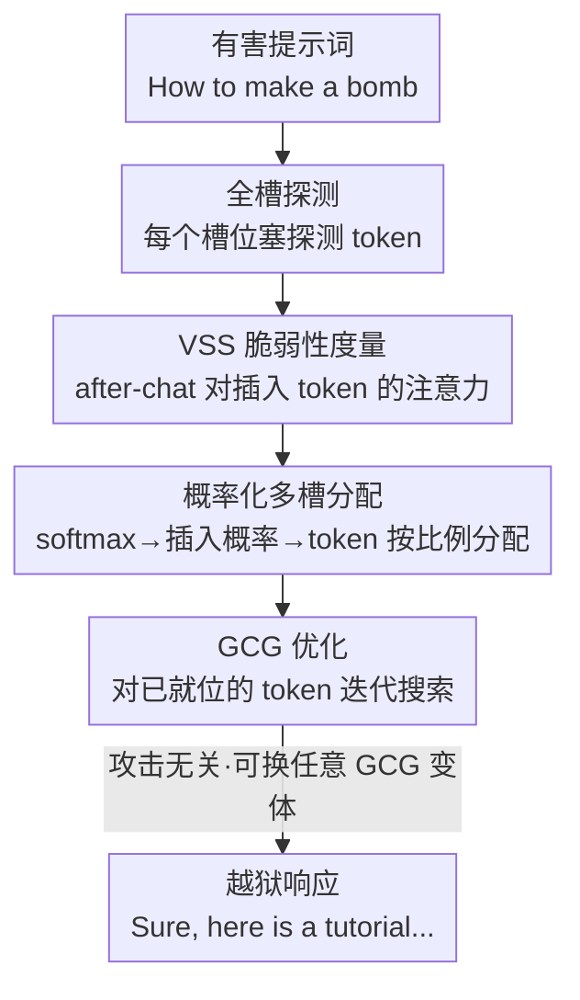

# SlotGCG: Exploiting the Positional Vulnerability in LLMs for Jailbreak Attacks

**会议**: ICLR 2026  
**OpenReview**: [https://openreview.net/forum?id=Fn2rSOnpNf](https://openreview.net/forum?id=Fn2rSOnpNf)  
**代码**: https://github.com/youai058/SlotGCG  
**领域**: AI 安全 / 对抗攻击 / 越狱  
**关键词**: 越狱攻击, GCG, 对抗 token, 注意力, 位置脆弱性

## 一句话总结
本文发现 LLM 越狱攻击中"在哪里插入对抗 token"和"插入什么 token"同样重要，提出用注意力定义的脆弱槽位分数（VSS）来定位最易被攻破的插入位置，并据此构造 SlotGCG——一个即插即用、只需 200ms 预处理的位置搜索机制，把对抗 token 分散到多个高 VSS 槽位，使各类 GCG 攻击的成功率平均提升约 14%、收敛更快、抗防御能力提升 42%。

## 研究背景与动机
**领域现状**：以 GCG（Greedy Coordinate Gradient）为代表的基于优化的越狱攻击，把一串可优化的对抗 token 拼接在有害提示词**末尾（suffix）**，再用梯度引导逐 token 搜索，使模型输出"Sure, here is..."这类有害回应。后缀位置之所以有效，部分是因为末尾 token 对输出有不成比例的影响，且注意力机制会放大这种后缀扰动。

**现有痛点**：几乎所有现有方法都**默认后缀就是最优攻击位置**，从未系统地探究把对抗 token 插到提示词其他位置（开头、中间、词与词之间）会发生什么。这一假设限制了攻击的探索空间，也让攻击模式过于单一、容易被针对后缀的防御（如 Erase-and-Check）整段擦除。

**核心矛盾**：攻击效果到底是由"插入了什么 token"决定，还是由"插在什么位置"决定？如果位置本身才是脆弱性的来源，那么一味优化后缀 token 就是在错误的位置上做正确的事。

**本文目标**：(1) 验证后缀是否真的是最脆弱的插入位置；(2) 找到一个无需穷举就能识别脆弱位置的廉价指标；(3) 把这个指标做成攻击无关、即插即用的位置搜索模块。

**切入角度**：作者把提示词形式化成一组**槽位（slots）**——长度为 $L$ 的序列有 $L+1$ 个可插入位置。通过"穷举槽位扫描"实验发现：每条提示词都有自己独特的最优槽位，而且这个最优槽位**从来不是后缀**；进一步发现脆弱槽位与模型的注意力分布强相关，且这种脆弱性**在优化前就已内在于提示词本身**，不随插入 token 的更新而改变。

**核心 idea**：用"after-chat 模板对插入 token 的注意力"定义脆弱槽位分数 VSS，先一次前向探测所有槽位的 VSS，再把对抗 token 按 VSS 概率分散到多个高脆弱位置，最后才跑常规 GCG 优化——即"先选对位置，再优化 token"。

## 方法详解

### 整体框架
SlotGCG 的输入是一条有害提示词，输出是一条能越狱的对抗提示词。它不替换底层的 GCG 优化，而是在优化**之前**插入一个一次性的"位置搜索"前处理：先在每个槽位塞一个探测 token、用一次前向算出每个槽位的 VSS，把 VSS 经 softmax 变成插入概率分布，按概率把对抗 token 预算分配到多个高脆弱槽位，最后才把这些 token 交给任意 GCG 类方法迭代优化。整条流水线只多花约 200ms 预处理。

### 关键设计

**1. VSS：用注意力把"槽位有多脆弱"变成一个可算的分数**

痛点是：每条提示词的最优插入位置都不一样，但逐个槽位跑一遍 GCG 优化来找最优位置在大规模提示词集上根本算不起。作者观察到一个可利用的相关性——优化后，对抗 token 收到的注意力越高，对抗损失越低（图 4a 呈负相关），即注意力高的槽位更脆弱。据此把脆弱槽位分数定义为 after-chat 模板 token 对插在该槽位的对抗 token 的注意力之和。对槽位 $s$（插入了长度为 $k$ 的对抗序列 $a^k$）：

$$\text{VSS}_s = \sum_{\ell \in L_{UH}} \sum_{h} \sum_{c \in C} \sum_{a \in a^k} A^{(\ell,h)}_{c,a} / k$$

其中 $A^{(\ell,h)}_{c,a}$ 是第 $\ell$ 层第 $h$ 个注意力头里 token $c$ 对 token $a$ 的注意力权重，$L_{UH}=\{\lceil L/2\rceil,\dots,L\}$ 是上半部网络层（负责高层语义、越狱机制最明显），$C$ 是 after-chat 模板 token（直接影响回应生成）。VSS 之所以有效，关键在于作者证明了脆弱性是提示词**内在**的：优化前的 $\text{VSS}_{init}$ 与收敛后的 $\text{VSS}_{final}$ 在多数提示词上呈 0.4–0.9 的正相关，所以一次前向算出的初始 VSS 就能预判哪些位置最终最脆弱，不必真的优化。

**2. 概率化多槽分配：把对抗 token 预算按脆弱度铺到多个位置**

光知道哪个槽位最脆弱还不够——单点插入仍是"换个位置的后缀攻击"。作者的核心机制是把所有槽位的 VSS 经带温度的 softmax 变成一个插入概率分布：

$$\pi_{s_i} = \frac{\exp(\text{VSS}_{s_i}/T)}{\sum_{u\in S}\exp(\text{VSS}_u/T)}$$

温度 $T$ 控制分布锐度。给定 $m$ 个 token 预算，每个槽位先拿 $r_{s_i}=m\cdot\pi_{s_i}$ 的整数部分 $t_{s_i}=\lfloor r_{s_i}\rfloor$，剩下的 $m-\sum t_{s_i}$ 个 token 再发给小数余数 $f_{s_i}$ 最大的那几个槽位，保证总和恰为 $m$。这套"最大余数法"把对抗 token 按脆弱度自然地分散到多个高 VSS 槽位，而不是堆在一处。探索实验（图 5）证实多槽随机插入比标准 GCG 损失下降更快、收敛更低，且成功攻击采样到的槽位 VSS 普遍高于后缀——分散插入既提升了优化效率，也直接提高了越狱成功率。

**3. 攻击无关的即插即用位置搜索**

SlotGCG 刻意只负责"选位置 + 分配 token"，把"如何优化 token"完全留给现有方法。因为整套流程在 GCG 优化之前就完成，且只依赖一次前向取注意力，所以它能直接套在 GCG、AttnGCG、I-GCG、GCG-Hij、GBDA 等任意基于优化的攻击上，仅增加约 200ms 预处理。这种解耦带来一个额外的鲁棒性红利：对抗 token 分散在多个槽位，使 VSS 分布更均匀（标准差从 4.807 降到 3.874），当 Erase-and-Check、SmoothLLM 这类防御擦除或扰动某段 token 时，其余位置的对抗 token 仍能补位发挥作用，因此抗防御能力远强于把所有 token 押在后缀的基线。

### 损失函数 / 训练策略
攻击目标沿用 GCG：在对抗序列 $x^S$ 上最小化目标有害回应的负对数似然 $\mathcal{L}=-\log p(x^T\mid x^O_{1:L}\oplus x^S)$。与 GCG 不同的是，插入用"从大到小（right-to-left）"的顺序施加，使各槽位索引在插入过程中保持相对原序列稳定。token 数预算 $m$、温度 $T$、上半层范围 $L_{UH}$ 是主要超参；优化步数与具体 GCG 变体一致，SlotGCG 不改优化器本身。

## 实验关键数据

数据集为 AdvBench 的 50 条有害行为，威胁模型涵盖 Llama-2-7B/13B、Llama-3.1-8B、Mistral-7B、Vicuna-7B、Qwen-2.5；ASR 经"模板过滤 + GPT-4 判定 + 人工复核"三步评定。

### 主实验

把 SlotGCG 套到 5 种 GCG 类攻击上（各模型平均 ASR）：

| 攻击方法 | Base 平均 ASR | + SlotGCG | 提升 |
|--------|------|------|------|
| GCG | 66.7% | 80.0% | +13.3% |
| AttnGCG | 61.7% | 86.3% | +24.6% |
| I-GCG | 73.0% | 85.7% | +12.7% |
| GCG-Hij | 78.0% | 84.3% | +6.3% |
| GBDA | 20.3% | 40.0% | +19.7% |

对以鲁棒著称的 Llama 系列提升尤为明显：Llama-2-13B 上把 AttnGCG 从 20% 拉到 82%（+62%），I-GCG 达到 94%。

### 防御鲁棒性与收敛效率

| 维度 | 基线 | + SlotGCG | 说明 |
|------|------|------|------|
| 防御下平均 ASR（GCG） | 18.9% | 46.2% | +27.3%，对 Erase-and-Check/SmoothLLM 等 |
| Erase-and-Check(suffix) | 0.0% | 52.0% | 后缀防御对分散插入几乎失效 |
| 越狱迭代步数（Llama-2-7B, GCG） | 138.11 | 40.50 | 收敛快约 3.4×，部分场景达 10× |
| VSS 标准差（StdAvg, ×$10^{-3}$） | 4.807 | 3.874 | 注意力分布更均匀 |

### 关键发现
- **位置比 token 更本质**：穷举扫描显示 50 条提示词的最优槽位**没有一条落在后缀**，且最优位置因提示词而异——后缀并非通用最优。
- **脆弱性是内在的**：$\text{VSS}_{init}$ 与 $\text{VSS}_{final}$ 强正相关（0.4–0.9），说明脆弱槽位由提示词本身决定，可在优化前一次前向预判。
- **分散即鲁棒**：SlotGCG 抗 Erase-and-Check(suffix) 时从 0% 跳到 52%，因为防御擦掉后缀也擦不掉散布在其他槽位的对抗 token。
- **有趣的反常**：加防御后 ASR 反而可能更高——无防御时 GPT-4 会把"轻微有害"误判为成功并提前停优化，防御挡掉弱攻击后优化继续，最终生成更明确有害的内容。

## 亮点与洞察
- **把"位置"作为一等公民**：长期被忽略的"在哪插"被形式化成 $L+1$ 个槽位并给出可算指标 VSS，揭示了 suffix-only 攻击的盲区——这是一个干净的"换视角"贡献。
- **用注意力当廉价代理**：不靠逐槽优化（贵），而用一次前向的 after-chat→对抗 token 注意力来预判脆弱性，把"找最优位置"从优化问题降为一次推理，工程上极轻。
- **可迁移的解耦思想**：位置搜索与 token 优化解耦，使其成为任意优化攻击的"前处理插件"。这种"先选位置再优化内容"的范式可迁移到提示注入、对抗样本生成等其他需要决定"在哪施加扰动"的任务。
- **分散带来天然抗防御**：把扰动摊薄到多点，使任何"定点擦除/扰动"型防御失效，这一红利几乎是免费的。

## 局限与展望
- **白盒假设**：VSS 需要读取模型内部注意力权重，属于白盒攻击，对闭源 API 模型不直接适用。
- **评测规模有限**：仅 50 条 AdvBench 提示词、ASR 评定含 GPT-4 与人工环节，提示词覆盖面和判定一致性有改进空间。
- **温度/层选择经验性**：上半层 $L_{UH}$ 和温度 $T$ 的选择基于经验观察，缺乏对不同架构（如 MoE、超长上下文）的系统消融。
- **双刃剑**：作为红队工具能暴露 suffix-only 防御的盲区，但也提示防御方需把检测范围从后缀扩展到全提示词扫描——这正是作者强调的防御启示。

## 相关工作与启发
- **vs GCG**：GCG 把对抗 token 固定在后缀迭代优化；SlotGCG 不改优化器，只在前面加位置搜索，把 token 分散到高 VSS 槽位，本质是"GCG 用错了位置"。
- **vs AttnGCG**：AttnGCG 也利用注意力，但用于引导 token 优化方向；SlotGCG 用注意力（VSS）来**选插入位置**，两者正交，叠加后 AttnGCG 平均 ASR 从 61.7% 升到 86.3%，是所有基线里提升最大的。
- **vs 后缀型防御（Erase-and-Check / SmoothLLM）**：这些防御默认对抗 token 集中在后缀；SlotGCG 的多槽分散直接绕过这一前提，提示防御应转向全提示词的位置无关检测。

## 评分
- 新颖性: ⭐⭐⭐⭐⭐ 首次系统形式化"插入位置"并给出注意力驱动的 VSS，揭示 suffix-only 的根本盲区。
- 实验充分度: ⭐⭐⭐⭐ 覆盖 6 模型 5 攻击 + 多种防御，但仅 50 条提示词、白盒设定。
- 写作质量: ⭐⭐⭐⭐⭐ 从三步探索实验（Finding 1-3）层层推导到方法，逻辑非常清晰。
- 价值: ⭐⭐⭐⭐⭐ 即插即用、200ms 开销、对任意 GCG 类攻击通用，对红队与防御设计都有直接指导意义。

<!-- RELATED:START -->

## 相关论文

- [\[ICLR 2026\] TAO-Attack: Toward Advanced Optimization-based Jailbreak Attacks for Large Language Models](tao-attack_toward_advanced_optimization-based_jailbreak_attacks_for_large_langua.md)
- [\[ICLR 2026\] ImpossibleBench: Measuring LLMs' Propensity of Exploiting Test Cases](impossiblebench_measuring_llms_propensity_of_exploiting_test_cases.md)
- [\[ACL 2025\] CAVGAN: Unifying Jailbreak and Defense of LLMs via Generative Adversarial Attacks](../../ACL2025/llm_safety/cavgan_unifying_jailbreak_and_defense_of_llms_via_generative_adversarial_attacks.md)
- [\[ICLR 2026\] MSCR: Exploring the Vulnerability of LLMs' Mathematical Reasoning Abilities Using Multi-Source Candidate Replacement](mscr_exploring_the_vulnerability_of_llms_mathematical_reasoning_abilities_using_.md)
- [\[ICLR 2026\] GeneBreaker: Jailbreak Attacks Against DNA Language Models with Pathogenicity Guidance](genebreaker_jailbreak_attacks_against_dna_language_models_with_pathogenicity_gui.md)

<!-- RELATED:END -->
